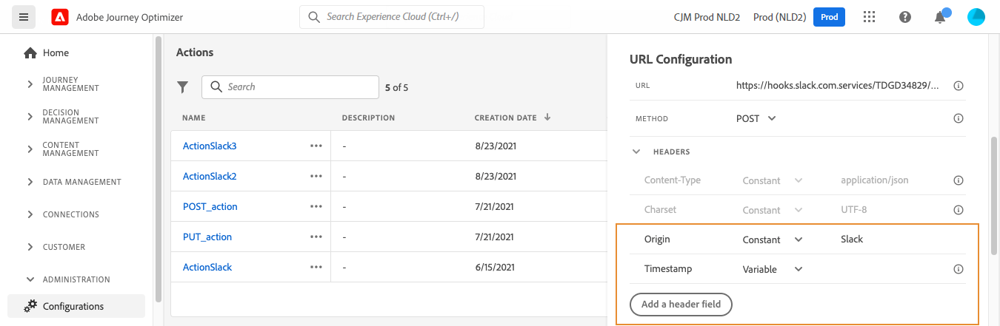

# Configuración de una acción personalizada {#configure-a-custom-action}

>[!CONTEXTUALHELP]
>id="ajo_journey_action_custom_configuration"
>title="Acciones personalizadas"
>abstract="Si utiliza un sistema de terceros para enviar mensajes o si desea que los recorridos envíen llamadas de API a un sistema de terceros, utilice acciones personalizadas para configurar la conexión a su recorrido."

Si utiliza un sistema de terceros para enviar mensajes o si desea que los recorridos envíen llamadas de API a un sistema de terceros, utilice acciones personalizadas para configurar la conexión a su recorrido. Por ejemplo, puede conectarse a los siguientes sistemas con las acciones personalizadas: Epsilon, Slack, [Adobe Developer](https://developer.adobe.com){target="_blank"}, Firebase, etc.

Las acciones personalizadas son acciones adicionales definidas por usuarios técnicos y que se ponen a disposición de los expertos en marketing. Una vez configuradas, aparecen en la paleta izquierda del recorrido, en la categoría **[!UICONTROL Acción]**. Obtenga más información en [esta página](../building-journeys/about-journey-activities.md#action-activities).


## Pasos de configuración {#configuration-steps}

Estos son los pasos principales necesarios para configurar una acción personalizada:

1. En la sección del menú ADMINISTRACIÓN, seleccione **[!UICONTROL Configuraciones]**. En la sección **[!UICONTROL Acciones]**, haga clic en **[!UICONTROL Administrar]**. Haga clic en **[!UICONTROL Crear acción]** para crear una nueva acción. El panel de configuración de acción se abre en el lado derecho de la pantalla.

   

1. Escriba un nombre para la acción.

   >[!NOTE]
   >
   >Solo se permiten caracteres alfanuméricos y guiones bajos. La longitud máxima es de 30 caracteres.

1. Añada una descripción a la acción. Este paso es opcional.
1. El número de recorridos que usa esta acción se muestra en el campo **[!UICONTROL Utilizado en]**. Puede hacer clic en el botón **[!UICONTROL Ver recorridos]** para mostrar la lista de recorridos con esta acción.
1. Defina los diferentes parámetros de **[!UICONTROL configuración de URL]**. Consulte [esta página](../action/about-custom-action-configuration.md#url-configuration).
1. Configure la sección **[!UICONTROL Autenticación]**. Esta configuración es la misma que para las fuentes de datos.  Consulte [esta sección](../datasource/external-data-sources.md#custom-authentication-mode).
1. Defina los **[!UICONTROL parámetros de acción]**. Consulte [esta página](../action/about-custom-action-configuration.md#define-the-message-parameters).
1. Haga clic en **[!UICONTROL Guardar]**.

   La acción personalizada ahora está configurada y lista para utilizarse en sus recorridos. Consulte [esta página](../building-journeys/about-journey-activities.md#action-activities).

   >[!NOTE]
   >
   >Cuando se utiliza una acción personalizada en un recorrido, la mayoría de los parámetros son de solo lectura. Solo puede modificar los campos **[!UICONTROL Name]**, **[!UICONTROL Description]**, **[!UICONTROL URL]** y la sección **[!UICONTROL Authentication]**.

## Limitaciones{#custom-actions-limitations}

Las acciones personalizadas incluyen algunas limitaciones enumeradas en [esta página](../start/guardrails.md).

En los parámetros de acción personalizados, puede pasar una colección simple, así como una colección de objetos. Más información sobre las limitaciones de colección de [esta página](../building-journeys/collections.md#limitations).

Tenga en cuenta también que los parámetros de acciones personalizadas tienen un formato esperado (por ejemplo: cadena, decimal, etc.). Debe tener cuidado de respetar estos formatos esperados. Obtenga más información en este [caso de uso](../building-journeys/collections.md).

Las acciones personalizadas solo admiten el formato JSON cuando se utilizan [solicitudes](../action/about-custom-action-configuration.md#define-the-message-parameters) o [cargas de respuesta](../action/action-response.md).

>[!NOTE]
>
>Cuando un extremo tiene un tiempo de respuesta mayor de 0,75 segundos, sus llamadas de acción personalizadas se enrutan a través de un [servicio de acción personalizada](../configuration/external-systems.md#response-time) lento y dedicado en lugar del servicio predeterminado.


## Prácticas recomendadas{#custom-action-enhancements-best-practices}

Al elegir un extremo como destino mediante una acción personalizada, asegúrese de lo siguiente:

* Este extremo puede admitir el rendimiento del recorrido mediante las configuraciones de la [API de límite](../configuration/throttling.md) o la [API de cierre](../configuration/capping.md) para limitarlo. Tenga cuidado ya que una configuración de limitación no puede estar por debajo de 200 TPS. Cualquier punto de conexión objetivo deberá admitir al menos 200 TPS. Obtenga más información sobre las tasas de procesamiento de recorridos en [esta sección](../building-journeys/entry-management.md#journey-processing-rate).
* Este extremo necesita tener un tiempo de respuesta lo más bajo posible. Según el rendimiento esperado, tener un tiempo de respuesta alto podría afectar al rendimiento real.

Se define un límite de 300 000 llamadas durante un minuto para todas las acciones personalizadas. Además, el límite predeterminado se realiza por host y por zona protegida. Por ejemplo, en una zona protegida, si tiene dos extremos con el mismo host (por ejemplo, `https://www.adobe.com/endpoint1` y `https://www.adobe.com/endpoint2`), el límite se aplicará a todos los extremos del host adobe.com. &quot;endpoint1&quot; y &quot;endpoint2&quot; compartirán la misma configuración de límite y hacer que un extremo alcance el límite tendrá un impacto en el otro extremo.

>[!NOTE]
>
>El límite de 300 000 llamadas por minuto se aplica como una **ventana deslizante** por zona protegida y por punto de conexión para puntos de conexión con tiempos de respuesta inferiores a 0,75 segundos. La ventana deslizante puede comenzar en cualquier milisegundo, lo que significa que pueden producirse errores de límite incluso si la velocidad aparece por debajo de 300 k/min cuando se alinea con los minutos del reloj. Para los puntos finales con tiempos de respuesta superiores a 0,75 segundos, se aplica un límite independiente de 150 000 llamadas cada 30 segundos (también una ventana deslizante). Obtenga más información sobre los extremos lentos en [esta página](../configuration/external-systems.md#response-time).

El límite predeterminado de 300 000 llamadas por minuto se aplica al nivel de dominio (es decir, example.com). Si necesita un límite más alto, consulte con el Soporte de Adobe con pruebas de uso y confirme el rendimiento de su punto final. Para solicitar un aumento del límite, proporcione detalles del volumen de llamadas y la capacidad del extremo esperados. Adobe puede personalizar el límite si las pruebas de capacidad demuestran que el extremo puede gestionar un mayor rendimiento. Para conocer las prácticas recomendadas, considere reestructurar los recorridos o implementar actividades de espera para escalonar las llamadas salientes y evitar errores de límite.

Este límite se ha establecido en función del uso del cliente para proteger los extremos externos dirigidos por acciones personalizadas. Si es necesario, puede anular esta configuración definiendo un límite o restricción mayor mediante nuestras API de límite/restricción. Consulte [esta página](../configuration/external-systems.md).

No debe segmentar los extremos públicos con acciones personalizadas por varios motivos:

* Sin un límite o una restricción adecuados, existe el riesgo de enviar demasiadas llamadas a un punto final público que puede no admitir ese volumen.
* Los datos de perfil se pueden enviar mediante acciones personalizadas, por lo que la segmentación de un extremo público podría llevar a compartir información personal de forma involuntaria de forma externa.
* No tiene control sobre los datos que devuelven los extremos públicos. Si un extremo cambia su API o comienza a enviar información incorrecta, esta estará disponible en las comunicaciones enviadas, con posibles impactos negativos.

## Consentimiento y control de datos {#privacy}

En Journey Optimizer, puede aplicar políticas de gobernanza de datos y consentimiento a sus acciones personalizadas para evitar que campos específicos se exporten a sistemas de terceros o excluyan a los clientes que no hayan aceptado recibir comunicaciones por correo electrónico, push o SMS. Para obtener más información, consulte las siguientes páginas:

* [Gobernanza de datos](../action/action-privacy.md).
* [Consentimiento](../action/action-privacy.md).


## Configuración de extremo {#url-configuration}

Al configurar una acción personalizada, debe definir los siguientes **[!UICONTROL parámetros de configuración de extremo]**:

{width="70%" align="left"}

1. En el campo **[!UICONTROL URL]**, especifique la URL del servicio externo:

   * Si la dirección URL es estática, introduzca la dirección URL en este campo.

   * Si la dirección URL incluye una ruta dinámica, introduzca solo la parte estática de la dirección URL, es decir, el esquema, el host, el puerto y, opcionalmente, una parte estática de la ruta.

     Ejemplo: `https://xxx.yyy.com/somethingstatic/`

     Especifique la ruta dinámica de la URL al agregar la acción personalizada a un recorrido. [Más información](../building-journeys/using-custom-actions.md).

   >[!NOTE]
   >
   >Por motivos de seguridad, le recomendamos encarecidamente que utilice el esquema HTTPS para la dirección URL. No permitimos el uso de direcciones de Adobe que no sean públicas ni de direcciones IP.
   >
   >Solo se permiten los puertos predeterminados al definir una acción personalizada: 80 para http y 443 para https.

1. Seleccione la llamada **[!UICONTROL Method]**: puede ser **[!UICONTROL POST]**, **[!UICONTROL GET]** o **[!UICONTROL PUT]**.

   >[!NOTE]
   >
   > No se admite el método **DELETE**. Si necesita actualizar un recurso existente, seleccione el método **PUT**.

1. Gestionar posibles redirecciones (respuestas 302). **Las acciones personalizadas** siguen automáticamente las redirecciones HTTP 302 por solicitud.

1. Defina los encabezados y los parámetros de consulta:

   * En la sección **[!UICONTROL Encabezados]**, haga clic en **[!UICONTROL Agregar un campo de encabezado]** para definir los encabezados HTTP del mensaje de solicitud que se enviará al servicio externo. Los campos de encabezado **[!UICONTROL Content-Type]** y **[!UICONTROL Charset]** están establecidos de forma predeterminada. Estos campos no se pueden eliminar. Solo se puede modificar el encabezado **[!UICONTROL Content-Type]**. Su valor debe respetar el formato JSON. Este es el valor predeterminado:

   

   * En la sección **[!UICONTROL Parámetros de consulta]**, haga clic en **[!UICONTROL Agregar un campo de parámetro de consulta]** para definir los parámetros que desea agregar en la dirección URL.

   

1. Introduzca la etiqueta o el nombre del campo.

1. Seleccione el tipo: **[!UICONTROL Constant]** o **[!UICONTROL Variable]**. Si ha seleccionado **[!UICONTROL Constante]**, introduzca el valor constante en el campo **[!UICONTROL Valor]**. Si ha seleccionado **[!UICONTROL Variable]**, deberá especificar esta variable al agregar la acción personalizada a un recorrido. [Más información](../building-journeys/using-custom-actions.md).

   

   >[!NOTE]
   >
   >Después de agregar la acción personalizada a un recorrido, aún puede agregarle campos de encabezado o de parámetros de consulta si el recorrido está en estado de borrador. Si no desea que los cambios de configuración afecten al recorrido, duplique la acción personalizada y agregue los campos a la nueva acción personalizada.
   >
   >Los encabezados se validan según las reglas de análisis de campos. Obtenga más información en [esta documentación](https://tools.ietf.org/html/rfc7230#section-3.2.4){_blank}.

## Capa de seguridad de transporte {#tls}

### Compatibilidad con el protocolo TLS {#tls-protocol-support}

Adobe Journey Optimizer es compatible con TLS 1.3 de forma predeterminada para acciones personalizadas. Si un cliente también admite TLS 1.3, la comunicación se realiza a través de TLS 1.3. De lo contrario, el proceso de negociación TLS puede volver a TLS 1.2.

### Compatibilidad con el protocolo mTLS {#mtls-protocol-support}

Puede utilizar Mutual Transport Layer Security (mTLS) para garantizar una seguridad mejorada en las conexiones salientes a acciones personalizadas de Adobe Journey Optimizer. mTLS es un método de seguridad de extremo a extremo para la autenticación mutua que garantiza que ambas partes que comparten información son quienes dicen ser antes de que se compartan los datos. mTLS incluye un paso adicional en comparación con TLS, en el que el servidor también solicita el certificado del cliente y lo verifica al final.

La autenticación TLS mutua (mTLS) se admite en acciones personalizadas. No se requiere ninguna configuración adicional en la acción personalizada ni en el recorrido para activar mTLS; se produce automáticamente cuando se detecta un extremo habilitado para mTLS. [Más información](https://experienceleague.adobe.com/en/docs/experience-platform/landing/governance-privacy-security/encryption#mtls-protocol-support).

## Definición de los parámetros de carga útil {#define-the-message-parameters}

Puede definir el parámetro de carga útil como se detalla a continuación:

1. En la sección **[!UICONTROL Solicitud]**, pegue un ejemplo de la carga útil JSON para enviar al servicio externo. Este campo es opcional y solo está disponible para los métodos de llamada POST y PUT.

   Habilite la opción **[!UICONTROL Permitir valores NULL]** para mantener los valores Null en la llamada externa. Tenga en cuenta que al enviar matrices de int, string, etc. con valores Null en no es totalmente compatible. Por ejemplo, la siguiente matriz de enteros `[1, null, 2, 3]` se envía como `[1, 2, 3]` aunque se marque esta opción. Además, si dicha matriz es nula, se envía como una matriz vacía.

   {width="70%" align="left"}

1. En la sección **[!UICONTROL Response]**, pegue un ejemplo de la carga útil devuelta cuando la llamada se realice correctamente. Este campo es opcional y está disponible para todos los métodos de llamada. Para obtener información detallada sobre cómo aprovechar las respuestas de llamadas de API en acciones personalizadas, consulte [esta página](../action/action-response.md).

   {width="70%" align="left"}

1. (Opcional) Seleccione **[!UICONTROL Definir una carga útil de respuesta de error]** para habilitar el campo de carga útil de respuesta de error. Cuando esté habilitada, use la sección **[!UICONTROL Respuesta al error]** para pegar un ejemplo de la carga útil devuelta cuando falle la llamada. Se aplican los mismos requisitos que para la carga útil de respuesta (tipos de campo y formato). Aprenda a aprovechar la carga de respuesta a errores en los recorridos [aquí](../action/action-response.md).

   {width="70%" align="left"}

>[!NOTE]
>
>Los nombres de campo de la carga no pueden contener un carácter de punto `.` ni comenzar con un carácter `$`.
>


En esta configuración de campo, debe:

* Seleccione el tipo de parámetro, por ejemplo: cadena, entero, etc.

* Defina una constante o un parámetro de variable:

   * **Constant** significa que el valor del parámetro lo define un técnico en el panel de configuración de la acción. El valor siempre será el mismo en todos los recorridos. No varía y el experto en marketing no puede verlo al utilizar la acción personalizada en el recorrido. Podría ser, por ejemplo, un ID que espere el sistema de terceros. En ese caso, el valor constante se establece en el campo a la derecha de la constante/variable de alternancia.

   * **Variable** significa que el valor del parámetro puede variar. Los especialistas en marketing que utilizan esta acción personalizada en un recorrido pueden transferir el valor que deseen o especificar dónde recuperar el valor de este parámetro (por ejemplo, desde el evento, desde Adobe Experience Platform, etc.). En ese caso, el campo a la derecha de la constante/variable de alternancia es el que los especialistas en marketing verán en el recorrido para asignar un nombre a este parámetro.

  Para los parámetros opcionales, habilite la opción **[!UICONTROL Is optional]** al final de la línea. Al marcar esta opción, marca el parámetro como no obligatorio y permite que los profesionales del recorrido elijan rellenarlo o no al crear esa acción personalizada en un recorrido.

>[!NOTE]
>
>Si configura parámetros opcionales y permite valores Null, los parámetros que no rellena un profesional del recorrido se envían como Null.
>

## Ejemplos JSON completos {#json-examples}

Esta sección proporciona ejemplos JSON completos que muestran todos los tipos de parámetros y configuraciones admitidos para las acciones personalizadas.

### Ejemplo 1: Tipos de parámetros básicos

Este ejemplo muestra cómo utilizar diferentes tipos de datos en la carga útil de acción personalizada:

```json
{
  "requestData": {
    "userId": "@{profile.person.name.firstName}",
    "accountId": "ABC123",
    "age": "@{profile.person.age}",
    "isActive": true,
    "loyaltyScore": "@{profile.customField.score}"
  }
}
```

En la configuración de acción:
* `userId` - Parámetro de variable (cadena) - Se asigna al perfil firstName
* `accountId` - Parámetro constante (String) - Siempre envía &quot;ABC123&quot;
* `age` - Parámetro variable (entero) - Se asigna a la edad del perfil
* `isActive` - Parámetro constante (booleano) - Siempre envía true
* `loyaltyScore` - Parámetro de variable (decimal) - Se asigna a un campo de perfil personalizado

### Ejemplo 2: Usar constantes del sistema y contexto de recorrido

Puede hacer referencia a información específica del recorrido y a valores del sistema:

```json
{
  "metadata": {
    "sandboxName": "prod",
    "executionTimestamp": "@{journey.startTime}",
    "journeyId": "@{journey.id}",
    "journeyName": "@{journey.name}",
    "journeyVersion": "@{journey.version}",
    "stepId": "@{journey.stepId}",
    "profileId": "@{profile.identityMap.ECID[0].id}"
  }
}
```

**Variables de contexto de recorrido disponibles:**

>[!NOTE]
>
>La sintaxis de las variables de contexto de recorrido se está comprobando con el equipo de productos. Los nombres de campo reales pueden ser: journeyUID, journeyVersionName, journeyVersion, currentNodeId, currentNodeName según la documentación de Propiedades de Recorrido.

* `@{journey.id}` - Identificador único del recorrido
* `@{journey.name}` - Nombre del recorrido
* `@{journey.version}` - Número de versión del recorrido
* `@{journey.startTime}` - Marca de tiempo de cuando comenzó el recorrido para este perfil (se necesita verificación)
* `@{journey.stepId}` - Identificador del paso actual
* `@{journey.stepName}` - Nombre del paso actual

### Ejemplo 3: Parámetros opcionales y requeridos

Configure los parámetros que los profesionales del recorrido pueden rellenar de forma opcional:

```json
{
  "customer": {
    "email": "@{profile.personalEmail.address}",
    "mobilePhone": "@{profile.mobilePhone.number}",
    "preferredLanguage": "@{profile.preferredLanguage}"
  }
}
```

En la interfaz de usuario de configuración de acción:
* Definir `email` como **obligatorio** (no marque &quot;Es opcional&quot;)
* Definir `mobilePhone` como **opcional** (marque &quot;Es opcional&quot;)
* Establecer `preferredLanguage` como **opcional** con valor predeterminado

>[!TIP]
>
>Cuando un parámetro se marca como opcional y el profesional del recorrido no lo rellena, se omite en la carga útil o se envía como nulo (si &quot;Permitir valores nulos&quot; está habilitado).

### Ejemplo 4: Trabajo con matrices y colecciones

Paso de colecciones de datos a las acciones personalizadas:

```json
{
  "products": [
    {
      "id": "@{product1.id}",
      "name": "@{product1.name}",
      "price": "@{product1.price}"
    },
    {
      "id": "@{product2.id}",
      "name": "@{product2.name}",
      "price": "@{product2.price}"
    }
  ],
  "tags": ["premium", "loyalty", "vip"],
  "categoryIds": ["CAT001", "CAT002"]
}
```

>[!NOTE]
>
>Obtenga más información sobre cómo pasar colecciones en acciones personalizadas en [esta página](../building-journeys/collections.md).

### Ejemplo 5: Objetos anidados y estructuras complejas

Crear estructuras de datos jerárquicas:

```json
{
  "customer": {
    "personalInfo": {
      "firstName": "@{profile.person.name.firstName}",
      "lastName": "@{profile.person.name.lastName}",
      "email": "@{profile.personalEmail.address}"
    },
    "address": {
      "street": "@{profile.homeAddress.street1}",
      "city": "@{profile.homeAddress.city}",
      "postalCode": "@{profile.homeAddress.postalCode}",
      "country": "@{profile.homeAddress.country}"
    },
    "preferences": {
      "language": "@{profile.preferredLanguage}",
      "timezone": "@{profile.timeZone}",
      "emailOptIn": "@{profile.consents.marketing.email.val}"
    }
  },
  "context": {
    "channel": "email",
    "campaignId": "CAMPAIGN_2025_Q1",
    "segment": "@{segmentMembership.status}"
  }
}
```

### Ejemplo 6: completar una acción personalizada en el mundo real

Un ejemplo completo que integra varios conceptos:

```json
{
  "event": {
    "eventType": "journey.action.triggered",
    "eventId": "@{journey.stepId}",
    "timestamp": "@{journey.stepTimestamp}",
    "eventSource": "Adobe Journey Optimizer"
  },
  "profile": {
    "id": "@{profile.identityMap.ECID[0].id}",
    "email": "@{profile.personalEmail.address}",
    "firstName": "@{profile.person.name.firstName}",
    "lastName": "@{profile.person.name.lastName}",
    "loyaltyTier": "@{profile.loyaltyTier}",
    "lifetimeValue": "@{profile.lifetimeValue}"
  },
  "journey": {
    "id": "@{journey.id}",
    "name": "@{journey.name}",
    "version": "@{journey.version}",
    "step": "@{journey.stepName}"
  },
  "customData": {
    "offerName": "@{decisioning.offerName}",
    "offerPlacement": "@{decisioning.placementName}",
    "specialPromotion": "WINTER2025"
  },
  "system": {
    "sandbox": "prod",
    "dataStreamId": "YOUR_DATASTREAM_ID",
    "imsOrgId": "@{imsOrgId}"
  }
}
```

**Sugerencias de configuración para este ejemplo:**
* Mezcla de valores constantes (`eventSource`, `specialPromotion`, `sandbox`) y parámetros de variables
* Utiliza el contexto de recorrido para el seguimiento y la depuración
* Incluye datos de perfil para la personalización en el sistema de terceros
* Añade contexto de toma de decisiones al utilizar ofertas
* Metadatos del sistema para enrutamiento y seguimiento a nivel de organización

### Sugerencias para configurar constantes

**Nombre de zona protegida:** Use un parámetro constante establecido en el nombre de su entorno (por ejemplo, &quot;prod&quot;, &quot;dev&quot;, &quot;stage&quot;)

**Marca de tiempo de ejecución:** Use `@{journey.startTime}` o cree un parámetro de variable que los profesionales del recorrido puedan asignar a la función `#{nowWithDelta()}`

**Versión de API:** Use una constante para los números de versión de API a fin de asegurar la coherencia en todos los recorridos

**tokens de autenticación:** Nunca coloque tokens de autenticación en la carga útil. En su lugar, utilice la sección Autenticación de la configuración de acción personalizada

>[!CAUTION]
>
>Los nombres de campo de la carga no pueden contener un carácter de punto `.` ni comenzar con un carácter `$`. Asegúrese de que la estructura JSON siga estas convenciones de nomenclatura.

* [Solución de problemas con acciones personalizadas](../action/troubleshoot-custom-action.md) - Aprenda a solucionar problemas de una acción personalizada


## Recursos adicionales

Examine las secciones siguientes para obtener más información sobre la configuración, el uso y la resolución de problemas de sus acciones personalizadas:

* [Empiece a usar las acciones personalizadas](../action/action.md): descubra qué es una acción personalizada y cómo le ayudan a conectarse a sistemas de terceros
* [Usar acciones personalizadas](../building-journeys/using-custom-actions.md): aprenda a usar acciones personalizadas en sus recorridos
* [Solución de problemas con acciones personalizadas](../action/troubleshoot-custom-action.md) - Aprenda a solucionar problemas de una acción personalizada
* [Pasar colecciones a parámetros de acción personalizados](../building-journeys/collections.md): aprenda a pasar una colección en parámetros de acción personalizados que se rellenan dinámicamente durante la ejecución

