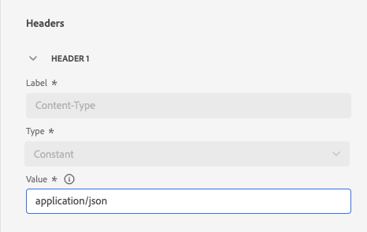

# Configuración de una acción personalizada {#configure-an-action}

>[!CONTEXTUALHELP]
>id="ajo_journey_action_custom_configuration"
>title="Acciones personalizadas"
>abstract="Si utiliza un sistema de terceros para enviar mensajes o si desea que los recorridos envíen llamadas de API a un sistema de terceros, utilice acciones personalizadas para configurar la conexión a su recorrido. Por ejemplo, puede conectarse a los siguientes sistemas con las acciones personalizadas: Epsilon, Slack, [Adobe Developer](https://developer.adobe.com), Firebase, etc."

Si utiliza un sistema de terceros para enviar mensajes o si desea que los recorridos envíen llamadas de API a un sistema de terceros, utilice acciones personalizadas para configurar la conexión a su recorrido. Por ejemplo, puede conectarse a los siguientes sistemas con acciones personalizadas: Epsilon, Slack, [Adobe Developer](https://developer.adobe.com){target="_blank"}, Firebase, etc.

Las acciones personalizadas son acciones adicionales definidas por usuarios técnicos y que se ponen a disposición de los expertos en marketing. Una vez configuradas, aparecen en la paleta izquierda del recorrido, en la **[!UICONTROL Acción]** categoría. Obtenga más información en [esta página](../building-journeys/about-journey-activities.md#action-activities).

## Limitaciones{#custom-actions-limitations}

Las acciones personalizadas incluyen algunas limitaciones enumeradas en [esta página](../start/guardrails.md).

En los parámetros de acción personalizados, puede pasar una colección simple, así como una colección de objetos. Obtenga más información acerca de las limitaciones de recopilación en [esta página](../building-journeys/collections.md#limitations).

Tenga en cuenta también que los parámetros de acciones personalizadas tienen un formato esperado (por ejemplo: cadena, decimal, etc.). Debe tener cuidado de respetar estos formatos esperados. Obtenga más información en esta [caso de uso](../building-journeys/collections.md).

Las acciones personalizadas solo admiten el formato JSON al utilizar [solicitud](../action/about-custom-action-configuration.md#define-the-message-parameters) o [cargas de respuesta](../action/action-response.md).

## Prácticas recomendadas{#custom-action-enhancements-best-practices}

Al elegir un extremo como destino mediante una acción personalizada, asegúrese de lo siguiente:

* Este extremo puede admitir el rendimiento del recorrido mediante las configuraciones de la [API de límite](../configuration/throttling.md) o la [API de cierre](../configuration/capping.md) para limitarlo. Tenga cuidado ya que una configuración de limitación no puede estar por debajo de 200 TPS. Cualquier extremo segmentado deberá admitir al menos 200 TPS.
* Este extremo necesita tener un tiempo de respuesta lo más bajo posible. Según el rendimiento esperado, tener un tiempo de respuesta alto podría afectar al rendimiento real.

Se define un límite de 300 000 llamadas durante un minuto para todas las acciones personalizadas. Además, el límite predeterminado se realiza por host y por zona protegida. Por ejemplo, en una zona protegida, si tiene dos puntos finales con el mismo host (p. ej., `https://www.adobe.com/endpoint1` y `https://www.adobe.com/endpoint2`), la restricción se aplicará a todos los extremos del host adobe.com. &quot;endpoint1&quot; y &quot;endpoint2&quot; compartirán la misma configuración de límite y hacer que un extremo alcance el límite tendrá un impacto en el otro extremo.

Este límite se ha establecido en función del uso de los clientes para proteger los extremos externos dirigidos por acciones personalizadas. Debe tener esto en cuenta en los recorridos basados en públicos definiendo una tasa de lectura adecuada (5000 perfiles/s cuando se utilizan acciones personalizadas). Si es necesario, puede anular esta configuración definiendo un límite o restricción mayor mediante nuestras API de límite/restricción. Consulte [esta página](../configuration/external-systems.md).

No debe segmentar los extremos públicos con acciones personalizadas por varios motivos:

* Sin un límite o una restricción adecuados, existe el riesgo de enviar demasiadas llamadas a un punto final público que puede no admitir ese volumen.
* Los datos de perfil se pueden enviar mediante acciones personalizadas, por lo que la segmentación de un extremo público podría llevar a compartir información personal de forma involuntaria de forma externa.
* No tiene control sobre los datos que devuelven los extremos públicos. Si un extremo cambia su API o comienza a enviar información incorrecta, esta estará disponible en las comunicaciones enviadas, con posibles impactos negativos.

## Consentimiento y control de datos {#privacy}

En Journey Optimizer, puede aplicar políticas de gobernanza de datos y consentimiento a sus acciones personalizadas para evitar que campos específicos se exporten a sistemas de terceros o excluyan a los clientes que no hayan aceptado recibir comunicaciones por correo electrónico, push o SMS. Para obtener más información, consulte las siguientes páginas:

* [Gobernanza de datos](../action/action-privacy.md).
* [Consentimiento](../action/action-privacy.md).


## Pasos de configuración {#configuration-steps}

Estos son los pasos principales necesarios para configurar una acción personalizada:

1. En la sección del menú ADMINISTRACIÓN, seleccione **[!UICONTROL Configuraciones]**. En el  **[!UICONTROL Acciones]** , haga clic en **[!UICONTROL Administrar]**. Clic **[!UICONTROL Crear acción]** para crear una acción nueva. El panel de configuración de acción se abre en el lado derecho de la pantalla.

   

1. Escriba un nombre para la acción.

   >[!NOTE]
   >
   >Solo se permiten caracteres alfanuméricos y guiones bajos. La longitud máxima es de 30 caracteres.

1. Añada una descripción a la acción. Este paso es opcional.
1. El número de recorridos que utilizan esta acción se muestra en la variable **[!UICONTROL Utilizado en]** field. Puede hacer clic en **[!UICONTROL Ver recorridos]** para mostrar la lista de recorridos con esta acción.
1. Defina los diferentes **[!UICONTROL Configuración de URL]** parámetros. Consulte [esta página](../action/about-custom-action-configuration.md#url-configuration).
1. Configure las variables **[!UICONTROL Autenticación]** sección. Esta configuración es la misma que para las fuentes de datos.  Consulte [esta sección](../datasource/external-data-sources.md#custom-authentication-mode).
1. Defina el **[!UICONTROL Parámetros de acción]**. Consulte [esta página](../action/about-custom-action-configuration.md#define-the-message-parameters).
1. Haga clic en **[!UICONTROL Guardar]**.

   La acción personalizada ahora está configurada y lista para utilizarse en sus recorridos. Consulte [esta página](../building-journeys/about-journey-activities.md#action-activities).

   >[!NOTE]
   >
   >Cuando se utiliza una acción personalizada en un recorrido, la mayoría de los parámetros son de solo lectura. Solo puede modificar la variable **[!UICONTROL Nombre]**, **[!UICONTROL Descripción]**, **[!UICONTROL URL]** y el **[!UICONTROL Autenticación]** sección.

## Configuración de extremo {#url-configuration}

Al configurar una acción personalizada, debe definir lo siguiente **[!UICONTROL Configuración de extremo]** parámetros:

{width="70%" align="left"}

1. En el **[!UICONTROL URL]** , especifique la URL del servicio externo:

   * Si la dirección URL es estática, introduzca la dirección URL en este campo.

   * Si la dirección URL incluye una ruta dinámica, introduzca solo la parte estática de la dirección URL, es decir, el esquema, el host, el puerto y, opcionalmente, una parte estática de la ruta.

     Ejemplo: `https://xxx.yyy.com/somethingstatic/`

     Especifique la ruta dinámica de la URL al agregar la acción personalizada a un recorrido. [Más información](../building-journeys/using-custom-actions.md).

   >[!NOTE]
   >
   >Por motivos de seguridad, le recomendamos encarecidamente que utilice el esquema HTTPS para la dirección URL. No permitimos el uso de direcciones de Adobe que no sean públicas ni de direcciones IP.
   >
   >Solo se permiten los puertos predeterminados al definir una acción personalizada: 80 para http y 443 para https.

1. Seleccione la llamada **[!UICONTROL Método]**: puede ser cualquiera de las siguientes **[!UICONTROL POST]**, **[!UICONTROL GET]** o **[!UICONTROL PUT]**.

   >[!NOTE]
   >
   > El **DELETE** no se admite el método. Si necesita actualizar un recurso existente, seleccione la **PUT** método.

1. Defina los encabezados y los parámetros de consulta:

   * En el **[!UICONTROL Encabezados]** , haga clic en **[!UICONTROL Añadir un campo de encabezado]** para definir los encabezados HTTP del mensaje de solicitud que se va a enviar al servicio externo. El **[!UICONTROL Content-Type]** y **[!UICONTROL Charset]** los campos de encabezado están configurados de forma predeterminada. Estos campos no se pueden eliminar. Solo el **[!UICONTROL Content-Type]** puede por modificación. Su valor debe respetar el formato JSON. Este es el valor predeterminado:

   

   * En el **[!UICONTROL Parámetros de consulta]** , haga clic en **[!UICONTROL Agregar un campo de parámetro de consulta]** para definir los parámetros que desea añadir en la dirección URL.

   

1. Introduzca la etiqueta o el nombre del campo.

1. Seleccione el tipo: **[!UICONTROL Constante]** o **[!UICONTROL Variable]**. Si ha seleccionado **[!UICONTROL Constante]**, luego introduzca el valor constante en **[!UICONTROL Valor]** field. Si ha seleccionado **[!UICONTROL Variable]**, entonces especificará esta variable al agregar la acción personalizada a un recorrido. [Más información](../building-journeys/using-custom-actions.md).

   

   >[!NOTE]
   >
   >Después de agregar la acción personalizada a un recorrido, aún puede agregarle campos de encabezado o de parámetros de consulta si el recorrido está en estado de borrador. Si no desea que los cambios de configuración afecten al recorrido, duplique la acción personalizada y agregue los campos a la nueva acción personalizada.
   >
   >Los encabezados se validan según las reglas de análisis de campos. Obtenga más información en [esta documentación](https://tools.ietf.org/html/rfc7230#section-3.2.4){_blank}.

## Definición de los parámetros de carga útil {#define-the-message-parameters}

1. En el **[!UICONTROL Solicitud]** , pegue un ejemplo de la carga útil JSON para enviar al servicio externo. Este campo es opcional y solo está disponible para los métodos de llamada de POST y PUT.

1. En el **[!UICONTROL Respuesta]** , pegue un ejemplo de la carga útil devuelta por la llamada. Este campo es opcional y está disponible para todos los métodos de llamada. Para obtener información detallada sobre cómo aprovechar las respuestas de llamadas de API en acciones personalizadas, consulte [esta página](../action/action-response.md).

>[!NOTE]
>
>La capacidad de respuesta está disponible actualmente en versión beta.

{width="70%" align="left"}

>[!NOTE]
>
>El ejemplo de carga útil no puede contener valores nulos. Los nombres de campo en la carga no pueden contener un &quot;&quot;. extra. No pueden comenzar con el carácter &quot;$&quot;.

Podrá definir el tipo de parámetro (por ejemplo, cadena, entero, etc.).

También puede elegir entre especificar si un parámetro es una constante o una variable:

* **Constante** significa que el valor del parámetro lo define una persona técnica en el panel de configuración de acciones. El valor siempre será el mismo en todos los recorridos. No variará y el experto en marketing no lo verá al utilizar la acción personalizada en el recorrido. Podría ser, por ejemplo, un ID que espere el sistema de terceros. En ese caso, el campo a la derecha de la constante/variable de alternancia es el valor pasado.
* **Variable** significa que el valor del parámetro variará. Los especialistas en marketing que utilicen esta acción personalizada en un recorrido podrán transferir el valor que deseen o especificar dónde recuperar el valor de este parámetro (por ejemplo, desde el evento, desde Adobe Experience Platform, etc.). En ese caso, el campo a la derecha de la constante/variable de alternancia es el que los especialistas en marketing verán en el recorrido para asignar un nombre a este parámetro.


## Compatibilidad con el protocolo mTLS {#mtls-protocol-support}

Ahora puede utilizar Mutual Transport Layer Security (mTLS) para garantizar una seguridad mejorada en las conexiones salientes a destinos de API HTTP y acciones personalizadas de Adobe Journey Optimizer. mTLS es un método de seguridad de extremo a extremo para la autenticación mutua que garantiza que ambas partes que comparten información son quienes dicen ser antes de que se compartan los datos. mTLS incluye un paso adicional en comparación con TLS, en el que el servidor también solicita el certificado del cliente y lo verifica al final.

En Adobe Journey Optimizer, mTLS se usa junto con acciones personalizadas. No se requiere ninguna configuración adicional para las acciones personalizadas de Adobe Journey Optimizer por su parte para habilitar mTLS. Cuando el extremo de una acción personalizada está habilitado para mTLS, el sistema recupera el certificado del repositorio de claves de Adobe Experience Platform y lo proporciona automáticamente al extremo (como se requiere para las conexiones mTLS).

Si desea utilizar mTLS con estos flujos de trabajo de destino de API HTTP de Adobe Journey Optimizer y Experience Platform, la dirección del servidor que coloque en la interfaz de usuario de acción del cliente de Adobe Journey Optimizer o en la interfaz de usuario de destinos debe tener los protocolos TLS deshabilitados y solo mTLS habilitado. Si el protocolo TLS 1.2 sigue habilitado en ese extremo, no se envía ningún certificado para la autenticación del cliente. Esto significa que, para utilizar mTLS con estos flujos de trabajo, el punto final del servidor de &quot;recepción&quot; debe ser un mTLS **solamente** extremo de conexión habilitado.

>[!IMPORTANT]
>
>No se requiere ninguna configuración adicional en la acción personalizada o el recorrido de Adobe Journey Optimizer para activar mTLS; este proceso se produce automáticamente cuando se detecta un punto de conexión habilitado para mTLS. El nombre común (CN) y los nombres alternativos del sujeto (SAN) de cada certificado están disponibles en la documentación como parte del certificado y se pueden utilizar como una capa adicional de validación de propiedad si desea hacerlo.
>
>RFC 2818, publicado en mayo de 2000, anula el uso del campo Nombre común (CN) en certificados HTTPS para la verificación del nombre del sujeto. En su lugar, recomienda utilizar la extensión &quot;Nombre alternativo del sujeto&quot; (SAN) del tipo &quot;nombre DNS&quot;.

Si desea comprobar el CN o SAN para realizar una validación adicional de terceros, puede descargar los certificados correspondientes aquí:

```
Prod:
{
    "serviceName": "AJO Journeys",
    "publicCertificate": "-----BEGIN CERTIFICATE-----
MIIG9TCCBd2gAwIBAgIQBX+pDP5hB0gqDzFKyq5wLjANBgkqhkiG9w0BAQsFADBZ
MQswCQYDVQQGEwJVUzEVMBMGA1UEChMMRGlnaUNlcnQgSW5jMTMwMQYDVQQDEypE
aWdpQ2VydCBHbG9iYWwgRzIgVExTIFJTQSBTSEEyNTYgMjAyMCBDQTEwHhcNMjQw
NTA5MDAwMDAwWhcNMjUwNjA5MjM1OTU5WjB0MQswCQYDVQQGEwJVUzETMBEGA1UE
CBMKQ2FsaWZvcm5pYTERMA8GA1UEBxMIU2FuIEpvc2UxEzARBgNVBAoTCkFkb2Jl
IEluYy4xKDAmBgNVBAMTH2Fqby1qb3VybmV5cy5hZXAtbXRscy5hZG9iZS5jb20w
ggEiMA0GCSqGSIb3DQEBAQUAA4IBDwAwggEKAoIBAQDaI8HZHzbmPEgTy9O7cYmq
ZVX5283Gw7j7v4/O810jZXItBDmsSiWotvTgAT0s2oZMZZ6tGPbQB7hL+xJJ+yu2
HxFl1WzB4UGHJ+UbrL94hI930xQs0FVgSOGgIarj5HucF2ZxwHIkVHY5whrOq9t4
UxFBG0siUPQrTzV9GfA0wREElugpTbwaM8CTWwOQ9ekroOD2C5zAcLTycXFtSMiU
B4L4u38S9hGoBByzzKv9GnUMQudvt/s5zsGykZgEEYeN6IitfVO6BOD9jT94Aytx
/O3XH5w8v4KNTn+An99bXFmyg3JRUFSYZFxha8s1f6uu0XbdToQ+ao0WkE06nMmV
AgMBAAGjggOcMIIDmDAfBgNVHSMEGDAWgBR0hYDAZsffN97PvSk3qgMdvu3NFzAd
BgNVHQ4EFgQUn8OqtzccNdrsb+fbRnTHmtTZxLMwKgYDVR0RBCMwIYIfYWpvLWpv
dXJuZXlzLmFlcC1tdGxzLmFkb2JlLmNvbTA+BgNVHSAENzA1MDMGBmeBDAECAjAp
MCcGCCsGAQUFBwIBFhtodHRwOi8vd3d3LmRpZ2ljZXJ0LmNvbS9DUFMwDgYDVR0P
AQH/BAQDAgWgMB0GA1UdJQQWMBQGCCsGAQUFBwMBBggrBgEFBQcDAjCBnwYDVR0f
BIGXMIGUMEigRqBEhkJodHRwOi8vY3JsMy5kaWdpY2VydC5jb20vRGlnaUNlcnRH
bG9iYWxHMlRMU1JTQVNIQTI1NjIwMjBDQTEtMS5jcmwwSKBGoESGQmh0dHA6Ly9j
cmw0LmRpZ2ljZXJ0LmNvbS9EaWdpQ2VydEdsb2JhbEcyVExTUlNBU0hBMjU2MjAy
MENBMS0xLmNybDCBhwYIKwYBBQUHAQEEezB5MCQGCCsGAQUFBzABhhhodHRwOi8v
b2NzcC5kaWdpY2VydC5jb20wUQYIKwYBBQUHMAKGRWh0dHA6Ly9jYWNlcnRzLmRp
Z2ljZXJ0LmNvbS9EaWdpQ2VydEdsb2JhbEcyVExTUlNBU0hBMjU2MjAyMENBMS0x
LmNydDAMBgNVHRMBAf8EAjAAMIIBfwYKKwYBBAHWeQIEAgSCAW8EggFrAWkAdwBO
daMnXJoQwzhbbNTfP1LrHfDgjhuNacCx+mSxYpo53wAAAY9ecsWsAAAEAwBIMEYC
IQDQclgq89ZVlwdYBJFEIs8q4WIcZ9Siw+jb9OgCrz+wjwIhALQLnC1WyT+dHjvY
FvZjc99WkjnEwhIevj/Rz7r0EzhmAHUAfVkeEuF4KnscYWd8Xv340IdcFKBOlZ65
Ay/ZDowuebgAAAGPXnLF5AAABAMARjBEAiBy9cNT3CnmSMOdJe+JbG8f7ha1UGgN
TdDlaR9x9fKmKQIgNmGjz5AzP1evB2G1TTvVLkHfWQw0864c4F23WSV+6TsAdwDP
EVbu1S58r/OHW9lpLpvpGnFnSrAX7KwB0lt3zsw7CAAAAY9ecsYnAAAEAwBIMEYC
IQCTcB7s1xDP8Olif3jj4X8jHgVxv5C3bTvG6wDYBByfcQIhAOt8PhR6tWSLtF1V
HB8r7dns7Oth1+QT7WMonQZsP/3WMA0GCSqGSIb3DQEBCwUAA4IBAQAjTy45fbQV
aVTZ71wcIyHnkJfq/8SSc/UNT5//6AMiV6kb3YsFW1+EaQ1wPHZS0Qfjs7aIsXi5
f2TCGps8onELNpOfFfptrOCMfcYGMvV1wPCBy+kuoGY/YRZlsdNUTTzQAGztfRev
79w+XIDzioCrY+sfyUkkw+N/F7/RIjzMKjP6onSfuD+5WjqVKq9kFE0fCyJixedV
BPoPM4Cktgvc9SsK17JmLWkg+V2yH1eDzmjF3sR0/dcmoAM0qgV/CDuhIIqX2o7m
3/aQSNsPUpgBVbkz+SjEtchmw8DXW/Kro8QVulsXdbkiLTOj4JopxdOzrbKgWMwr
pIw7KKJoktDk
-----END CERTIFICATE-----
-----BEGIN CERTIFICATE-----
MIIEyDCCA7CgAwIBAgIQDPW9BitWAvR6uFAsI8zwZjANBgkqhkiG9w0BAQsFADBh
MQswCQYDVQQGEwJVUzEVMBMGA1UEChMMRGlnaUNlcnQgSW5jMRkwFwYDVQQLExB3
d3cuZGlnaWNlcnQuY29tMSAwHgYDVQQDExdEaWdpQ2VydCBHbG9iYWwgUm9vdCBH
MjAeFw0yMTAzMzAwMDAwMDBaFw0zMTAzMjkyMzU5NTlaMFkxCzAJBgNVBAYTAlVT
MRUwEwYDVQQKEwxEaWdpQ2VydCBJbmMxMzAxBgNVBAMTKkRpZ2lDZXJ0IEdsb2Jh
bCBHMiBUTFMgUlNBIFNIQTI1NiAyMDIwIENBMTCCASIwDQYJKoZIhvcNAQEBBQAD
ggEPADCCAQoCggEBAMz3EGJPprtjb+2QUlbFbSd7ehJWivH0+dbn4Y+9lavyYEEV
cNsSAPonCrVXOFt9slGTcZUOakGUWzUb+nv6u8W+JDD+Vu/E832X4xT1FE3LpxDy
FuqrIvAxIhFhaZAmunjZlx/jfWardUSVc8is/+9dCopZQ+GssjoP80j812s3wWPc
3kbW20X+fSP9kOhRBx5Ro1/tSUZUfyyIxfQTnJcVPAPooTncaQwywa8WV0yUR0J8
osicfebUTVSvQpmowQTCd5zWSOTOEeAqgJnwQ3DPP3Zr0UxJqyRewg2C/Uaoq2yT
zGJSQnWS+Jr6Xl6ysGHlHx+5fwmY6D36g39HaaECAwEAAaOCAYIwggF+MBIGA1Ud
EwEB/wQIMAYBAf8CAQAwHQYDVR0OBBYEFHSFgMBmx9833s+9KTeqAx2+7c0XMB8G
A1UdIwQYMBaAFE4iVCAYlebjbuYP+vq5Eu0GF485MA4GA1UdDwEB/wQEAwIBhjAd
BgNVHSUEFjAUBggrBgEFBQcDAQYIKwYBBQUHAwIwdgYIKwYBBQUHAQEEajBoMCQG
CCsGAQUFBzABhhhodHRwOi8vb2NzcC5kaWdpY2VydC5jb20wQAYIKwYBBQUHMAKG
NGh0dHA6Ly9jYWNlcnRzLmRpZ2ljZXJ0LmNvbS9EaWdpQ2VydEdsb2JhbFJvb3RH
Mi5jcnQwQgYDVR0fBDswOTA3oDWgM4YxaHR0cDovL2NybDMuZGlnaWNlcnQuY29t
L0RpZ2lDZXJ0R2xvYmFsUm9vdEcyLmNybDA9BgNVHSAENjA0MAsGCWCGSAGG/WwC
ATAHBgVngQwBATAIBgZngQwBAgEwCAYGZ4EMAQICMAgGBmeBDAECAzANBgkqhkiG
9w0BAQsFAAOCAQEAkPFwyyiXaZd8dP3A+iZ7U6utzWX9upwGnIrXWkOH7U1MVl+t
wcW1BSAuWdH/SvWgKtiwla3JLko716f2b4gp/DA/JIS7w7d7kwcsr4drdjPtAFVS
slme5LnQ89/nD/7d+MS5EHKBCQRfz5eeLjJ1js+aWNJXMX43AYGyZm0pGrFmCW3R
bpD0ufovARTFXFZkAdl9h6g4U5+LXUZtXMYnhIHUfoyMo5tS58aI7Dd8KvvwVVo4
chDYABPPTHPbqjc1qCmBaZx2vN4Ye5DUys/vZwP9BFohFrH/6j/f3IL16/RZkiMN
JCqVJUzKoZHm1Lesh3Sz8W2jmdv51b2EQJ8HmA==
-----END CERTIFICATE-----
-----BEGIN CERTIFICATE-----
MIIDjjCCAnagAwIBAgIQAzrx5qcRqaC7KGSxHQn65TANBgkqhkiG9w0BAQsFADBh
MQswCQYDVQQGEwJVUzEVMBMGA1UEChMMRGlnaUNlcnQgSW5jMRkwFwYDVQQLExB3
d3cuZGlnaWNlcnQuY29tMSAwHgYDVQQDExdEaWdpQ2VydCBHbG9iYWwgUm9vdCBH
MjAeFw0xMzA4MDExMjAwMDBaFw0zODAxMTUxMjAwMDBaMGExCzAJBgNVBAYTAlVT
MRUwEwYDVQQKEwxEaWdpQ2VydCBJbmMxGTAXBgNVBAsTEHd3dy5kaWdpY2VydC5j
b20xIDAeBgNVBAMTF0RpZ2lDZXJ0IEdsb2JhbCBSb290IEcyMIIBIjANBgkqhkiG
9w0BAQEFAAOCAQ8AMIIBCgKCAQEAuzfNNNx7a8myaJCtSnX/RrohCgiN9RlUyfuI
2/Ou8jqJkTx65qsGGmvPrC3oXgkkRLpimn7Wo6h+4FR1IAWsULecYxpsMNzaHxmx
1x7e/dfgy5SDN67sH0NO3Xss0r0upS/kqbitOtSZpLYl6ZtrAGCSYP9PIUkY92eQ
q2EGnI/yuum06ZIya7XzV+hdG82MHauVBJVJ8zUtluNJbd134/tJS7SsVQepj5Wz
tCO7TG1F8PapspUwtP1MVYwnSlcUfIKdzXOS0xZKBgyMUNGPHgm+F6HmIcr9g+UQ
vIOlCsRnKPZzFBQ9RnbDhxSJITRNrw9FDKZJobq7nMWxM4MphQIDAQABo0IwQDAP
BgNVHRMBAf8EBTADAQH/MA4GA1UdDwEB/wQEAwIBhjAdBgNVHQ4EFgQUTiJUIBiV
5uNu5g/6+rkS7QYXjzkwDQYJKoZIhvcNAQELBQADggEBAGBnKJRvDkhj6zHd6mcY
1Yl9PMWLSn/pvtsrF9+wX3N3KjITOYFnQoQj8kVnNeyIv/iPsGEMNKSuIEyExtv4
NeF22d+mQrvHRAiGfzZ0JFrabA0UWTW98kndth/Jsw1HKj2ZL7tcu7XUIOGZX1NG
Fdtom/DzMNU+MeKNhJ7jitralj41E6Vf8PlwUHBHQRFXGU7Aj64GxJUTFy8bJZ91
8rGOmaFvE7FBcf6IKshPECBV1/MUReXgRPTqh5Uykw7+U0b6LJ3/iyK5S9kJRaTe
pLiaWN0bfVKfjllDiIGknibVb63dDcY3fe0Dkhvld1927jyNxF1WW6LZZm6zNTfl
MrY=
-----END CERTIFICATE-----",
    "expiryDate": "2025-06-09T23:59:59Z"
}
```

