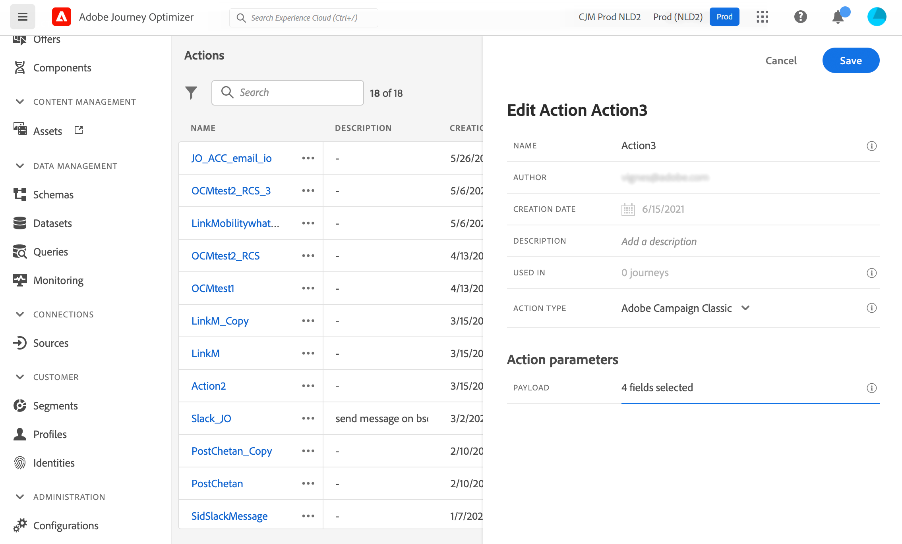

# Integración con Adobe Campaign v7/v8 {#integrating-with-adobe-campaign-classic}

Esta integración está disponible para Adobe Campaign Classic v7 a partir de la versión 21.1 y Adobe Campaign v8. Le permite enviar correos electrónicos, notificaciones push y SMS mediante las funciones de mensajería transaccional de Adobe Campaign.

La conexión entre las instancias de Journey Optimizer y Campaign se configura por Adobe en el momento del aprovisionamiento.

En este ejemplo se presenta un caso de uso completo [sección](../building-journeys/campaign-classic-use-case.md).

Para cada acción configurada, hay una actividad de acción disponible en la paleta Diseñador de recorridos. Consulte esta [sección](../building-journeys/using-adobe-campaign-classic.md).

## Notas importantes {#important-notes}

* No hay restricciones en los mensajes. El sistema limita el número de mensajes que se pueden enviar a 4000 por 5 minutos, según el SLA de Campaign actual. Por este motivo, Journey Optimizer solo debe utilizarse en casos de uso unitario (eventos individuales, no segmentos).

* Debe configurar una acción en el lienzo por plantilla que desee utilizar. Debe configurar una acción en Journey Optimizer para cada plantilla que desee utilizar desde Adobe Campaign.

* Le recomendamos que utilice una instancia del Centro de mensajes dedicada que esté alojada para esta integración para evitar afectar a otras operaciones de Campaign que pueda estar realizando. El servidor de marketing puede alojarse o alojarse de forma local. La compilación necesaria es candidata para la versión 21.1 o buena.

* No hay validación de que la carga útil o el mensaje de Campaign sean correctos.

* No puede utilizar una acción de Campaign con un evento de calificación de segmentos.

## Requisitos previos {#prerequisites}

En Campaign, debe crear y publicar un mensaje transaccional y su evento asociado. Consulte la [Documentación de Adobe Campaign](https://experienceleague.adobe.com/docs/campaign-classic/using/transactional-messaging/introduction/about-transactional-messaging.html#transactional-messaging){target=&quot;_blank&quot;}.

Puede crear la carga útil JSON correspondiente a cada mensaje siguiendo el patrón a continuación. A continuación, pegue esta carga útil al configurar la acción en el Journey Orchestration (consulte a continuación)

Vea el siguiente ejemplo:

```
{
    "channel": "email",
    "eventType": "welcome",
    "email": "Email address",
    "ctx": {
        "firstName": "First name"
    }
}
```

* **canal**: el canal definido para la plantilla transaccional de Campaign
* **eventType**: el nombre interno del evento de Campaign
* **ctx**: en función de la personalización que tenga en el mensaje.

## Configuración de la acción {#configure-action}

En Journey Optimizer, debe configurar una acción por cada mensaje transaccional. Siga estos pasos:

1. Cree una nueva acción. Consulte esta [sección](../action/action.md).
1. Introduzca un nombre y una descripción.
1. En el **Tipo de acción** campo, seleccione **Adobe Campaign Classic**.
1. Haga clic en el **Carga útil** y pegue un ejemplo de la carga útil JSON correspondiente al mensaje de Campaign. Póngase en contacto con el Adobe para obtener esta carga útil.
1. Ajuste los distintos campos para que sean estáticos o variables en función de si desea asignarlos en el lienzo de Recorrido. Ciertos campos, como los parámetros de canal para la dirección de correo electrónico y los campos de personalización (ctx), probablemente desee definirlos como variables para la asignación en el contexto del recorrido.
1. Haga clic en **Guardar**.


