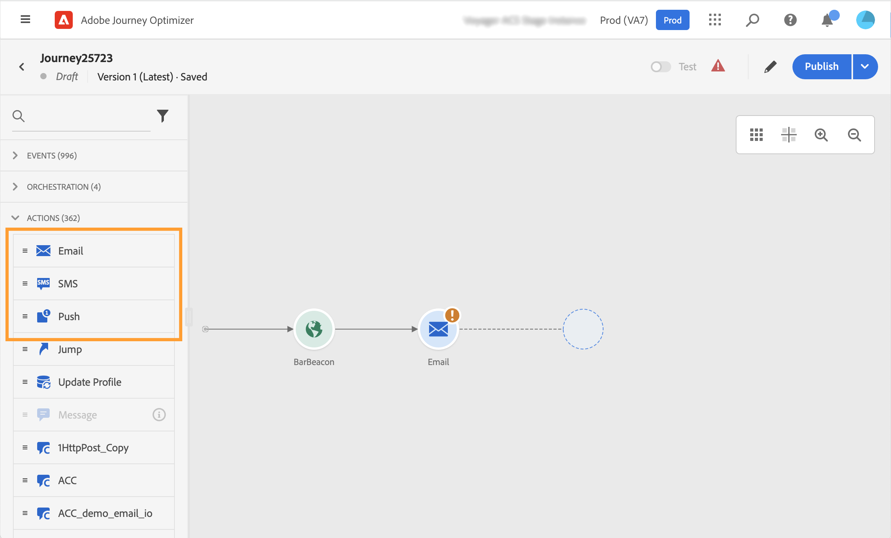

# Integrar con Adobe Campaign Standard {#using_adobe_campaign_standard}

Si tiene Adobe Campaign Standard, hay una acción integrada disponible para permitir la conexión a Adobe Campaign Standard. Puede enviar correos electrónicos, notificaciones push y SMS mediante las funciones de mensajería transaccional de Adobe Campaign Standard.

El mensaje transaccional de Campaign Standard y su evento asociado deben publicarse para poder utilizarse en Journey Optimizer. Si el evento se publica pero el mensaje no, no será visible en la interfaz de Journey Optimizer. Si el mensaje se publica pero su evento asociado no, estará visible en la interfaz de Journey Optimizer, pero no se podrá utilizar.

## Notas importantes {#important-notes}

* Se define automáticamente una regla de límite de 4000 llamadas por 5 minutos para las acciones de Adobe Campaign Standard. Esto corresponde a la escala oficial de Adobe Campaign Standard Transactional Messaging. Obtenga más información sobre los SLA de mensajería transaccional en [Descripción del producto de Adobe Campaign Standard](https://helpx.adobe.com/es/legal/product-descriptions/campaign-standard.html){target="_blank"}.

* La integración de Adobe Campaign Standard se configura mediante una acción integrada específica en la lista de acciones. Esto debe configurarse para cada zona protegida.

* No puede utilizar una acción de Campaign Standard con una actividad de calificación de audiencia o de lectura de audiencia.

* Un recorrido no puede utilizar tanto mensajes como acciones de Campaign Standard.

## Configurar la acción {#configure-action}

En Journey Optimizer, debe configurar una acción por mensaje transaccional. Siga estos pasos:

1. Seleccione **[!UICONTROL Configuraciones]** en la sección del menú ADMINISTRACIÓN.

1. En la sección **[!UICONTROL Acciones]**, haga clic en **[!UICONTROL Administrar]**. Se muestra la lista de acciones.

1. Seleccione la acción integrada **[!UICONTROL AdobeCampaignStandard]**. El panel de configuración de acción se abre en el lado derecho de la pantalla.

   

1. Copie la URL de instancia de Adobe Campaign Standard y péguela en el campo **[!UICONTROL URL]**.

1. Haga clic en **[!UICONTROL Probar la URL de instancia]** para probar la validez de la instancia.

   >[!NOTE]
   >
   >Esta prueba comprueba lo siguiente:
   >
   >* El host es &quot;.campaign.adobe.com&quot;, &quot;.campaign-sandbox.adobe.com&quot;, &quot;.campaign-demo.adobe.com&quot;, &quot;.ats.adobe.com&quot; o &quot;.adls.adobe.com&quot;
   >
   >* La dirección URL comienza con https
   >
   >* La organización asociada a la instancia de Adobe Campaign Standard es la misma que OrganizationRG de Journey Optimizer

Una vez completada esta configuración, hay tres acciones disponibles en la categoría **[!UICONTROL Acción]** al diseñar un recorrido: **[!UICONTROL Correo electrónico]**, **[!UICONTROL Push]**, **[!UICONTROL SMS]**. [Aprenda a utilizarlos](../building-journeys/using-adobe-campaign-standard.md).

Use un evento **Reactions** para reaccionar ante los datos de seguimiento relacionados con un mensaje de Campaign Standard enviado dentro del mismo recorrido:

* Para las notificaciones push, los recorridos pueden reaccionar a los mensajes en los que se hace clic, los que se envían o los que generan errores.

* En los mensajes SMS, los recorridos pueden reaccionar a los mensajes enviados o fallidos.

* En el caso de los correos electrónicos, los recorridos pueden reaccionar a los mensajes en los que se hizo clic, enviados, abiertos o fallidos. [Más información sobre las reacciones y eventos](../building-journeys/reaction-events.md).

Cuando utilice un sistema de terceros para enviar mensajes, debe agregar y configurar una acción personalizada. [Más información acerca de la configuración de acciones personalizadas](../action/about-custom-action-configuration.md).