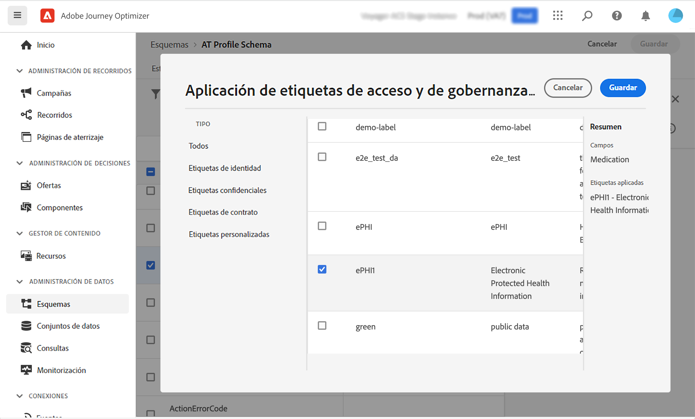
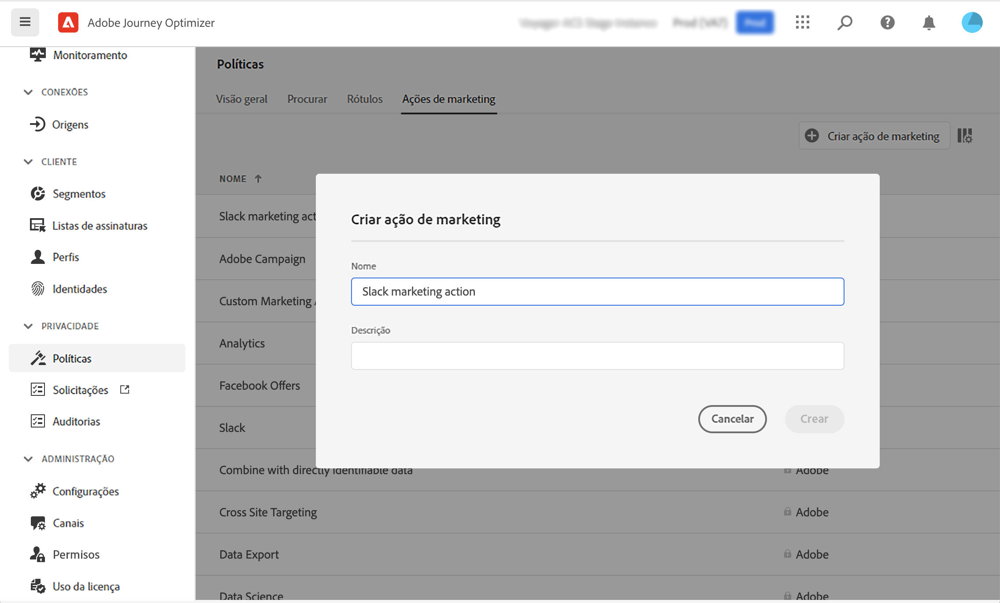
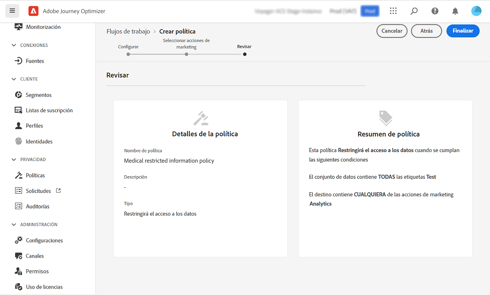
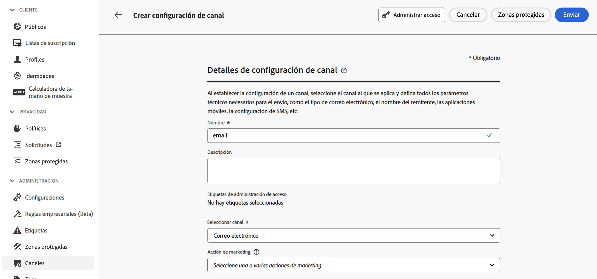
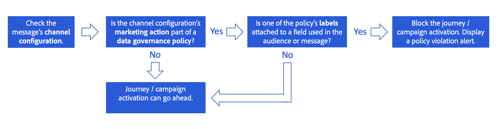
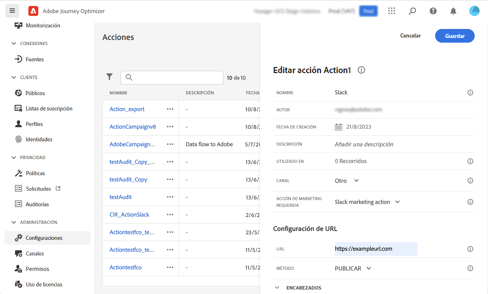
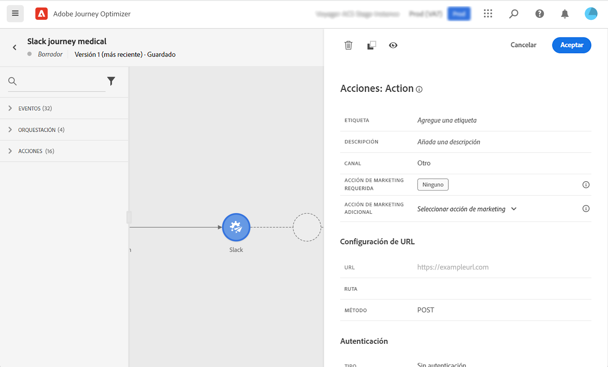
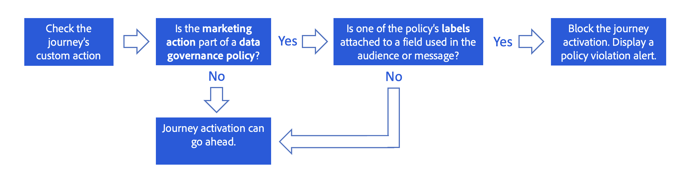
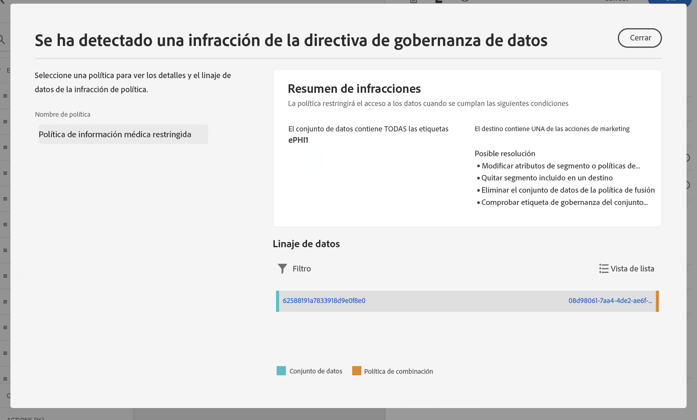

# Gobernanza de datos {#restrict-fields}

>[!CONTEXTUALHELP]
>id="ajo_data_governance_policy_violation"
>title="Infracción de directiva de gobernanza de datos"
>abstract="Si el sistema identifica un campo restringido en un recorrido/campaña o una acción personalizada, se muestra un error que impide publicarlo. Utilice el diagrama de linaje de datos de este cuadro de diálogo para comprender qué otros cambios de configuración deben realizarse antes de activar el recorrido o la campaña."

## Introducción a las políticas de gobernanza de datos {#gs}

Con su [marco de trabajo de gobernanza de etiquetado y aplicación del uso de datos (Data Usage Labeling and Enforcement, DULE)](https://experienceleague.adobe.com/docs/experience-platform/data-governance/home.html){target="_blank"}, Adobe Experience Platform le permite administrar y aplicar directivas de gobernanza de datos en todos sus canales. Para ello, **etiqueta sus campos** y crea **acciones de marketing** para cada canal.

Una vez definidas las etiquetas y las acciones de marketing, puede crear **políticas de control de datos** que vinculen estos dos elementos. Por ejemplo, puede configurar una política que asocie una etiqueta &quot;ePHI&quot; con una acción de marketing de &quot;direccionamiento de correo electrónico&quot;, asegurándose de que los campos etiquetados como &quot;ePHI&quot; no se utilicen para personalizar los mensajes de correo electrónico. [Aprenda a crear directivas de gobernanza de datos](#policy)

Después de crear las políticas de gobernanza, puede aplicar las acciones de marketing a sus recorridos/campañas y a las acciones personalizadas de recorrido.
[Aprenda a aplicar acciones de marketing en Journey Optimizer](#apply-marketing-actions)

Al crear un recorrido o una campaña, después de seleccionar una configuración de canal o agregar una acción personalizada, el sistema comprueba si la acción de marketing de la configuración del canal de mensajes o la acción personalizada forman parte de una política de gobernanza de datos. Si es así, el sistema comprueba si algún campo de la audiencia de destino o la personalización del mensaje están etiquetados y restringidos por la directiva. Si se detecta una etiqueta de este tipo, se bloquea la publicación del recorrido o la campaña. [Aprenda a detectar la infracción de la directiva de gobernanza de datos](#violation)

## Creación de etiquetas y acciones de marketing {#labels-marketing-actions}

El primer paso para aplicar la política de control de datos es crear una etiqueta y adjuntarla a los campos para los que desea restringir el uso y realizar acciones de marketing para cada uno de los canales.

1. En el menú de la izquierda, debajo de **Privacidad**, haga clic en **Políticas**.

1. Seleccione la ficha **Etiquetas** y haga clic en **Crear etiqueta**.

1. Defina un nombre y un nombre descriptivo para la etiqueta. Por ejemplo, _ePHI1_.

1. En el menú de la izquierda, debajo de **Administración de datos**, haga clic en **Esquemas** y, a continuación, haga clic en el botón **Aplicar etiquetas de acceso y control de datos**. Seleccione el esquema y el campo (por ejemplo, &quot;grupo sanguíneo&quot;) y seleccione la etiqueta creada anteriormente, _ePHI1_ en nuestro ejemplo.

   

1. Vuelva al menú **Políticas**, seleccione la ficha **Acción de marketing** y haga clic en **Crear acción de marketing**. Le recomendamos que cree una acción de marketing para cada canal y para cada acción personalizada de terceros que se utilice en sus recorridos. Por ejemplo, vamos a crear una _acción de marketing de Slack_ que se utilizará para la acción personalizada de Slack.

   

## Crear una política de gobernanza de datos {#policy}

Ahora que se han creado las etiquetas y las acciones de marketing, puede vincularlas todas en políticas de gobernanza de datos. Para ello, seleccione la pestaña **Examinar**, haga clic en **Crear directiva** y seleccione **Directiva de control de datos**. Seleccione la etiqueta (_ePHI1_) y la acción de marketing (_acción de marketing de Slack_).

Cuando vaya a usar, en un recorrido, la acción personalizada de Slack configurada con la _acción de marketing de Slack_, se aprovechará la directiva asociada.

## Aplicación de acciones de marketing en Journey Optimizer {#apply-marketing-actions}

Para que las políticas de gobernanza de datos se apliquen en Journey Optimizer, debe aplicar acciones de marketing a sus recorridos, campañas o acciones personalizadas.

### Aplicación de acciones de marketing a recorridos y campañas {#journeys-campaigns}

Después de crear directivas de gobernanza, debe aplicar las acciones de marketing relevantes a las **configuraciones de canal** de Journey Optimizer. Para ello, siga estos pasos:

1. Acceda al menú **[!UICONTROL Canales]** > **[!UICONTROL Configuración general]** > **[!UICONTROL Configuraciones de canal]**.

1. Abra una configuración de canal existente o cree una nueva.

1. En el campo **[!UICONTROL Acción de marketing]**, seleccione las acciones de marketing que desea asociar a los recorridos o campañas que usan esta configuración. Todas las políticas de consentimiento y control de datos asociadas con la acción de marketing se aprovechan para respetar las preferencias de los clientes y las restricciones configuradas para campos confidenciales. [Más información](../action/consent.md#surface-marketing-actions)

   

1. Complete la configuración del canal y guárdelo. [Aprenda a configurar el canal](../configuration/channel-surfaces.md).

1. Al crear un mensaje en el recorrido o la campaña, seleccione la configuración de canal correspondiente. Complete la configuración del recorrido o la campaña y guárdela.

Antes de activar el recorrido o la campaña, el sistema comprueba si la acción de marketing de la configuración de canal seleccionada forma parte de una política de gobernanza de datos. Si es así, el sistema comprueba si algún campo de la audiencia de destino o la personalización del mensaje están etiquetados y restringidos por la directiva.

Si el sistema identifica un campo restringido, se muestra un error que le impide publicar el recorrido o la campaña. [Obtenga información sobre cómo detectar una infracción de directiva de gobernanza](#violation)

{zoomable="yes"}

*Pasos de análisis de infracciones de directivas para recorridos y campañas*

### Aplicar acción de marketing a acciones personalizadas {#custom-actions}

>[!NOTE]
>
>No se admiten las acciones de recorridos de Campaign v7/v8 y Campaign Standard.

Veamos el ejemplo del campo de grupo sanguíneo que debe restringir para que no se exporte a un tercero mediante acciones personalizadas. Para ello, debe aplicar la acción de marketing a la acción personalizada y, a continuación, crear el recorrido y agregarle la acción personalizada.

1. En el menú de la izquierda, debajo de **Administración**, haga clic en **Configuraciones** y seleccione **Acciones**.

1. Abra la acción personalizada de Slack. Al configurar una acción personalizada, se pueden utilizar dos campos para controlar los datos.

   

   * El campo **Canal** le permite seleccionar el canal relacionado con esta acción personalizada. Prerellena el campo **Acción de marketing necesaria** con la acción de marketing predeterminada para el canal seleccionado. Si selecciona **other**, no se definirá ninguna acción de marketing de forma predeterminada. En nuestro ejemplo, seleccionamos el canal **other**.

   * **Acción de marketing necesaria** le permite definir la acción de marketing relacionada con la acción personalizada. Por ejemplo, si usa esa acción personalizada para enviar correos electrónicos con un tercero, puede seleccionar **Segmentación por correo electrónico**. En nuestro ejemplo, seleccionamos _acción de marketing de Slack_. Las políticas de gobernanza asociadas a esa acción de marketing se recuperan y aprovechan.

   Los demás pasos para configurar una acción personalizada se detallan en [esta sección](../action/about-custom-action-configuration.md#consent-management).

1. En el menú de la izquierda, debajo de **Administración de Recorrido**, haga clic en **Recorridos**.

1. Cree el recorrido y añada la acción personalizada. Al agregar la acción personalizada en un recorrido, varias opciones permiten administrar la gobernanza de datos. Haga clic en **Mostrar campos de solo lectura** para mostrar todos los parámetros.

   

   * El **canal** y **Acción de marketing necesaria**, definidos al configurar la acción personalizada, se muestran en la parte superior de la pantalla. Estos campos no se pueden modificar.

   * Puede definir una **acción de marketing adicional** para establecer el tipo de acción personalizada. Esto le permite definir el propósito de la acción personalizada en este recorrido. Además de la acción de marketing necesaria, que suele ser específica de un canal, puede definir una acción de marketing adicional que será específica de la acción personalizada en este recorrido en particular. Por ejemplo: una comunicación de entrenamiento, una newsletter, una comunicación de fitness, etc. Se aplicarán la acción de marketing necesaria y la acción de marketing adicional. En nuestro ejemplo, no utilizamos una acción de marketing adicional.

Si uno de los campos está etiquetado _ePHI1_ (el campo del tipo de sangre en nuestro ejemplo) se detecta en los parámetros de acción, se muestra un error que impide que publique el recorrido. [Obtenga información sobre cómo detectar una infracción de directiva de gobernanza](#violation)

{zoomable="yes"}

*Pasos de análisis de infracciones de directivas para acciones personalizadas de recorridos*

## Detectar infracción de directiva {#violation}

Si el sistema identifica un campo restringido en un recorrido/campaña o una acción personalizada, se muestra un error que impide publicarlo.

Los errores son visibles desde el botón **[!UICONTROL Alertas]**. Seleccione el error para mostrar información detallada sobre la infracción de directiva de gobernanza de datos que se produjo.

Este cuadro de diálogo indica que la configuración actual de recorrido/campaña infringe una directiva de gobernanza de datos existente. Utilice el diagrama de linaje de datos para comprender qué otros cambios de configuración se deben realizar antes de activar el recorrido o la campaña.

Encontrará información detallada en la [documentación de infracción de directiva de uso de datos](https://experienceleague.adobe.com/en/docs/experience-platform/data-governance/enforcement/auto-enforcement#data-usage-violation){_blank}.
