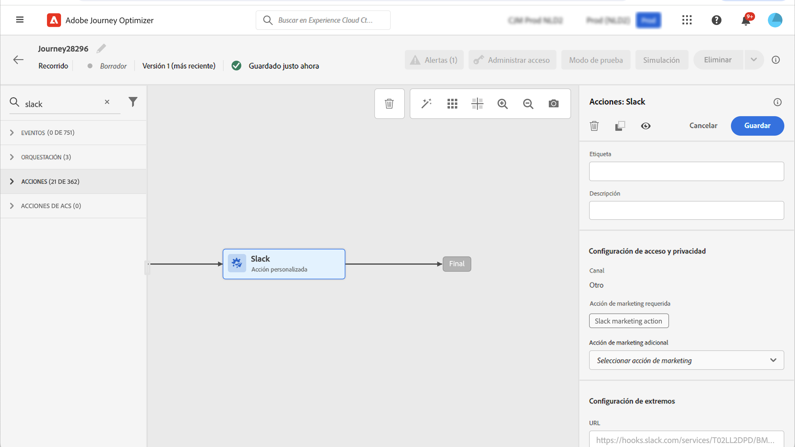

# Gobierno de datos {#restrict-fields}

>[!IMPORTANT]
>
>El uso de etiquetado y aplicación del uso de datos (Data Usage Labeling and Enforcement, DULE) está actualmente restringido a los clientes seleccionados y se implementará en todos los entornos en una versión futura.

Con su marco de trabajo de gobernanza de etiquetado y aplicación del uso de datos (Data Usage Labeling and Enforcement, DULE), Journey Optimizer ahora puede aprovechar las políticas de gobernanza de Adobe Experience Platform para evitar que los campos confidenciales se exporten a sistemas de terceros mediante acciones personalizadas. Si el sistema identifica un campo restringido en los parámetros de acción personalizados, se muestra un error que le impide publicar el recorrido.

Adobe Experience Platform le permite etiquetar los campos y crear acciones de marketing para cada canal. A continuación, defina una política de gobernanza vinculada a una etiqueta y a una acción de marketing.

En Journey Optimizer, puede aplicar estas directivas a las acciones personalizadas para evitar que campos específicos se exporten a sistemas de terceros.

Para obtener más información sobre el marco de trabajo de control de datos y cómo trabajar con etiquetas y políticas, consulte la documentación de Adobe Experience Platform:

* [Información general sobre el servicio de control de datos](https://experienceleague.adobe.com/docs/experience-platform/data-governance/home.html?lang=es)
* [Información general sobre las etiquetas de uso de datos](https://experienceleague.adobe.com/docs/experience-platform/data-governance/labels/overview.html?lang=es)
* [Políticas de uso de datos](https://experienceleague.adobe.com/docs/experience-platform/data-governance/policies/overview.html?lang=es)

## Notas importantes {#important-notes}

* El control de datos solo se aplica a acciones personalizadas en recorrido. No se admiten acciones de Campaign Classic y Campaign Standard.
* Las políticas de gobernanza solo se aplican cuando una acción de marketing (obligatoria o adicional) se establece en el nivel de acción personalizada.
* No se admiten los atributos que forman parte de un grupo de campos con el esquema de unión predeterminado. Estos atributos se ocultarán en la interfaz. Debe crear otro grupo de campos utilizando un esquema diferente.

## Definir políticas de gobierno {#governance-policies}

Puede utilizar etiquetas, acciones de marketing y políticas existentes. Estos son los pasos principales de configuración para crear otros nuevos:

* Agregue una etiqueta y aplíquela a campos específicos que no desea exportar a sistemas de terceros, como el tipo de sangre de una persona.
* Defina una acción de marketing para cada acción personalizada de terceros que se use en sus recorridos.
* Cree una directiva de gobierno y asóciela a la etiqueta y a la acción de marketing.

Para obtener más información sobre cómo administrar las políticas, consulte esta [documentación](https://experienceleague.adobe.com/docs/experience-platform/data-governance/policies/user-guide.html?lang=en#consent-policy)

Veamos el ejemplo del campo de tipo sanguíneo que debe etiquetar como sensible y restringir de exportarse a un tercero. Estos son los diferentes pasos:

1. En el menú de la izquierda, debajo de **Privacidad**, haga clic en **Políticas**.
   
1. Seleccione el **Etiquetas** y haga clic en **Crear etiqueta**.
   
1. Defina un nombre y un nombre descriptivo para esta etiqueta. Por ejemplo, _ePHI1_.
   
1. En el menú de la izquierda, debajo de **Gestión de datos**, haga clic en **Esquemas** y haga clic en el botón **Aplicar etiquetas de acceso y control de datos** botón. Seleccione el esquema y el campo (tipo de sangre) y seleccione la etiqueta creada anteriormente. _ePHI1_ en nuestro ejemplo.
   
1. Vuelva a la **Políticas** seleccione **Acción de marketing** y haga clic en **Crear una acción de marketing**. Le recomendamos que cree una acción de marketing para cada acción personalizada de terceros que se use en sus recorridos. Por ejemplo, vamos a crear un _acción de marketing del Slack_ que se utilizará para la acción personalizada del Slack.
   
1. Seleccione el **Examinar** , haga clic en **Crear directiva** y seleccione **Política de control de datos**. Seleccione la etiqueta (_ePHI1_) y acción de marketing (_acción de marketing del Slack_).
   

Cuando vaya a usar, en un recorrido, la acción personalizada del Slack configurada con la variable _acción de marketing del Slack_, se aprovechará la política asociada.

## Configurar la acción personalizada {#consent-custom-action}

En el menú de la izquierda, debajo de **Administración**, haga clic en **Configuraciones** y seleccione **Acciones**. Abra la acción personalizada del Slack. Al configurar una acción personalizada, se pueden utilizar dos campos para el control de datos.

* La variable **Canal** permite seleccionar el canal relacionado con esta acción personalizada: **Correo electrónico**, **SMS** o **Notificaciones push**. Rellenará previamente el **Acción de marketing necesaria** con la acción de marketing predeterminada para el canal seleccionado. Si selecciona **other**, no se definirá ninguna acción de marketing de forma predeterminada. En nuestro ejemplo, seleccionamos el canal **other**.

* La variable **Acción de marketing necesaria** permite definir la acción de marketing relacionada con la acción personalizada. Por ejemplo, si utiliza esa acción personalizada para enviar correos electrónicos mediante un tercero, puede seleccionar **Segmentación por correo electrónico**. En nuestro ejemplo, seleccionamos la variable _acción de marketing del Slack_. Las políticas de gobernanza asociadas a esa acción de marketing se recuperan y aprovechan.

Los demás pasos para configurar una acción personalizada se detallan en [esta sección](../action/about-custom-action-configuration.md#consent-management).

## Creación del recorrido {#consent-journey}

En el menú de la izquierda, debajo de **administración de recorridos**, haga clic en **Recorridos**. Cree el recorrido y agregue la acción personalizada.  Al agregar la acción personalizada en un recorrido, varias opciones permiten administrar el control de datos. Haga clic en el **Mostrar campos de solo lectura** para mostrar todos los parámetros.

La variable **Canal** y **Acción de marketing necesaria**, definidos al configurar la acción personalizada, se muestran en la parte superior de la pantalla. Estos campos no se pueden modificar.

Puede definir una **Acción de marketing adicional** para establecer el tipo de acción personalizada. Esto le permite definir el propósito de la acción personalizada en este recorrido. Además de la acción de marketing necesaria, que suele ser específica de un canal, puede definir una acción de marketing adicional que será específica de la acción personalizada en este recorrido en particular. Por ejemplo: una comunicación de entrenamiento, un boletín, una comunicación de fitness, etc. Se aplicarán la acción de marketing necesaria y la acción de marketing adicional.

En nuestro ejemplo, no utilizamos una acción de marketing adicional.

Si uno de los campos está etiquetado _ePHI1_ (el campo del tipo de sangre en nuestro ejemplo) se detectan en los parámetros de acción, se muestra un error que impide que publique el recorrido.

Los demás pasos para configurar una acción personalizada en un recorrido se detallan en [esta sección](../building-journeys/using-custom-actions.md).
