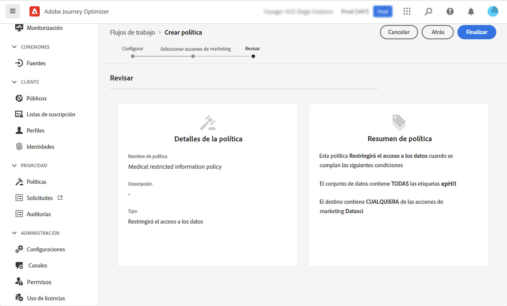
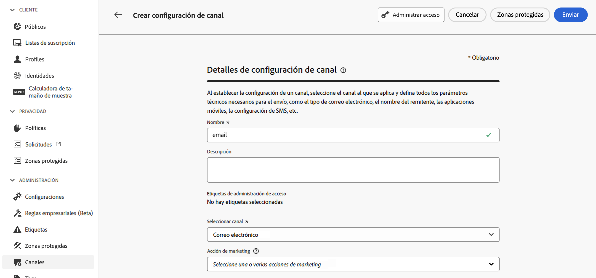

# Gobernanza de datos {#restrict-fields}

>[!CONTEXTUALHELP]
>id="ajo_data_governance_policy_violation"
>title="Infracción de la política de gobernanza de datos"
>abstract="Si el sistema identifica un campo restringido en un recorrido/campaña o una acción personalizada, se muestra un error que impide su publicación. Utilice el diagrama de linaje de datos en este cuadro de diálogo para comprender qué otros cambios de configuración deben realizarse antes de activar el recorrido o la campaña."

## Introducción a las políticas de gobernanza de datos {#gs}

Con su marco de [gobernanza de uso de etiquetado y aplicación del uso de datos (Data Usage Labeling and Enforcement, DULE)](https://experienceleague.adobe.com/docs/experience-platform/data-governance/home.html?lang=es){target="_blank"}, Adobe Experience Platform le permite administrar y aplicar políticas de gobernanza de datos en todos sus canales gracias al **etiquetado de sus campos** y la creación de **acciones de marketing** para cada canal.

Una vez definidas las etiquetas y las acciones de marketing, puede crear **políticas de gobernanza de datos** que vinculen estos dos elementos. Por ejemplo, puede configurar una política que asocie una etiqueta “ePHI” con una acción de marketing de “direccionamiento de correo electrónico”, lo que garantiza que los campos etiquetados como “ePHI” no se utilicen para personalizar los mensajes de correo electrónico. [Aprenda a crear políticas de gobernanza de datos](#policy)

Después de crear las políticas de gobernanza, puede aplicar las acciones de marketing a sus recorridos/campañas y a las acciones personalizadas de recorrido.
[Aprenda a aplicar acciones de marketing en Journey Optimizer](#apply-marketing-actions)

Al crear un recorrido o una campaña, después de seleccionar una configuración de canal o añadir una acción personalizada, el sistema comprueba si la acción de marketing de la configuración del canal de mensajes o la acción personalizada forman parte de una política de gobernanza de datos. Si es así, el sistema comprueba si algún campo del público de destino o la personalización del mensaje están etiquetados y restringidos por la política. Si se detecta una etiqueta de este tipo, se bloquea la publicación del recorrido o la campaña. [Aprenda a detectar la infracción de la política de gobernanza de datos](#violation)

## Creación de etiquetas y acciones de marketing {#labels-marketing-actions}

El primer paso para aplicar la política de gobernanza de datos es crear una etiqueta y adjuntarla a los campos para los que desea restringir el uso y realizar acciones de marketing para cada uno de los canales.

1. En el menú de la izquierda, debajo de **Privacidad**, haga clic en **Políticas**.

1. Seleccione la pestaña **Etiquetas** y haga clic en **Crear etiqueta**.

1. Determine un nombre y un nombre descriptivo para la etiqueta. Por ejemplo, _ePHI1_.

1. En el menú de la izquierda, debajo de **Gestión de datos**, haga clic en **Esquemas** y en el botón **Aplicar etiquetas de acceso y gobernanza de datos**. Seleccione el esquema y el campo (por ejemplo, “grupo sanguíneo”) y elija la etiqueta creada antes (_ePHI1_ en el ejemplo).

   

1. Vuelva al menú **Políticas**, seleccione la pestaña **Acción de marketing** y haga clic en **Crear una acción de marketing**. Le recomendamos que cree una acción de marketing para cada canal y cada acción personalizada de terceros utilizada en sus recorridos. Por ejemplo, vamos a crear una _acción de marketing del Slack_, que se utilizará para la acción personalizada de este.

   

## Creación de una política de gobernanza de datos {#policy}

Ahora que se han creado las etiquetas y las acciones de marketing, puede vincularlas todas en políticas de gobernanza de datos. Seleccione la pestaña **Examinar**, haga clic en **Crear política** y seleccione **Política de gobernanza de datos**. Seleccione la etiqueta (_ePHI1_) y la acción de marketing (_acción de marketing del Slack_).

Cuando vaya a utilizar la acción personalizada del Slack configurada con la _acción de marketing del Slack_ en un recorrido, se aprovechará la política asociada.

## Aplicación de acciones de marketing en Journey Optimizer {#apply-marketing-actions}

Para que las políticas de gobernanza de datos se apliquen en Journey Optimizer, debe aplicar acciones de marketing a sus recorridos, campañas o acciones personalizadas.

### Aplicación de acciones de marketing a recorridos y campañas {#journeys-campaigns}

Después de crear políticas de gobernanza, debe aplicar las acciones de marketing relevantes en las **configuraciones de canal** de Journey Optimizer. Para ello, siga estos pasos:

1. Acceda al menú **[!UICONTROL Canales]** > **[!UICONTROL Configuración general]** > **[!UICONTROL Configuraciones de canal]**.

1. Abra una configuración de canal existente o cree una nueva.

1. En el campo **[!UICONTROL Acción de marketing]**, seleccione las acciones de marketing que desea asociar a los recorridos o campañas que usan esta configuración. Todas las políticas de consentimiento y gobernanza de datos asociadas con la acción de marketing se aprovechan para respetar las preferencias de los clientes y las restricciones configuradas para campos confidenciales. [Más información](../action/consent.md#surface-marketing-actions)

   

1. Complete la configuración de canal y guárdela. [Aprenda a configurar canales](../configuration/channel-surfaces.md).

1. Al crear un mensaje en el recorrido o la campaña, seleccione la configuración de canal correspondiente. Complete la configuración del recorrido o la campaña y guárdela.

Antes de activar el recorrido o la campaña, el sistema comprueba si la acción de marketing de la configuración de canal seleccionada forma parte de una política de gobernanza de datos. Si es así, el sistema comprueba si algún campo del público de destino o la personalización del mensaje están etiquetados y restringidos por la política.

Si el sistema identifica un campo restringido, se muestra un error que le impide publicar el recorrido o la campaña. [Aprenda a detectar una infracción de política de gobernanza](#violation)

{zoomable="yes"}

*Pasos de análisis de infracciones de políticas para recorridos y campañas*

### Aplicación de una acción de marketing a acciones personalizadas {#custom-actions}

>[!NOTE]
>
>No se admiten acciones de recorrido de Campaign v7/v8 y Campaign Standard.

Veamos el ejemplo del campo de grupo sanguíneo que debe restringir para que no se exporte a un tercero mediante acciones personalizadas. Para ello, debe aplicar la acción de marketing a la acción personalizada y, a continuación, generar el recorrido y añadirle la acción personalizada.

1. En el menú de la izquierda, debajo de **Administración**, haga clic en **Configuraciones** y seleccione **Acciones**.

1. Abra la acción personalizada del Slack. Al configurar una acción personalizada, se pueden utilizar dos campos para la gobernanza los datos.

   

   * El campo **Canal** le permite seleccionar el canal relacionado con esta acción personalizada. Rellena automáticamente el campo **Acción de marketing necesaria** con la acción de marketing predeterminada para el canal seleccionado. Si selecciona **otros**, no se definirá ninguna acción de marketing de forma predeterminada. En el ejemplo, seleccionamos el canal **otros**.

   * La **Acción de marketing necesaria** permite definir la acción de marketing relacionada con la acción personalizada. Por ejemplo, si utiliza esa acción personalizada para enviar correos electrónicos mediante un tercero, puede seleccionar **Segmentación por correo electrónico**. En el ejemplo, seleccionamos _acción de marketing del Slack_. Las políticas de gobernanza asociadas a esa acción de marketing se recuperan y aprovechan.

   Los demás pasos para configurar una acción personalizada se detallan en [esta sección](../action/about-custom-action-configuration.md#consent-management).

1. En el menú de la izquierda, debajo de **Administración de recorrido**, haga clic en **Recorridos**.

1. Cree el recorrido y añada la acción personalizada. Al agregar la acción personalizada en un recorrido, varias opciones permiten administrar la gobernanza de datos. Haga clic en **Mostrar campos de solo lectura** para mostrar todos los parámetros.

   

   * La variable **Canal** y **Acción de marketing necesaria**, definida al configurar la acción personalizada, se muestra en la parte superior de la pantalla. Estos campos no se pueden modificar.

   * Puede definir una **Acción de marketing adicional** para establecer el tipo de acción personalizada. Esto le permite definir el propósito de la acción personalizada en este recorrido. Además de la acción de marketing necesaria, que suele ser específica de un canal, puede definir una acción de marketing adicional que será específica de la acción personalizada en este recorrido en particular. Por ejemplo: una comunicación de entrenamiento, una Newsletter, una comunicación de fitness, etc. Se aplicarán la acción de marketing necesaria y la acción de marketing adicional. En nuestro ejemplo, no utilizamos una acción de marketing adicional.

Si se detecta uno de los campos etiquetados _ePHI1_ (el campo del tipo de sangre en nuestro ejemplo) en los parámetros de acción, se muestra un error que impide que publique el recorrido. [Aprenda a detectar una infracción de política de gobernanza](#violation)

{zoomable="yes"}

*Pasos de análisis de infracciones de políticas para acciones personalizadas de recorridos*

## Detección de una infracción de política {#violation}

Si el sistema identifica un campo restringido en un recorrido/campaña o una acción personalizada, se muestra un error que impide su publicación. 

Los errores son visibles desde el botón **[!UICONTROL Alertas]**. Seleccione el error para mostrar información detallada sobre la infracción de la política de gobernanza de datos que se ha producido.

Este cuadro de diálogo indica que la configuración actual de recorrido/campaña infringe una política de gobernanza de datos existente. Utilice el diagrama de linaje de datos para comprender qué otros cambios de configuración deben realizarse antes de activar el recorrido o la campaña.

Encontrará información detallada en la [documentación sobre infracciones de la política de uso de datos](https://experienceleague.adobe.com/es/docs/experience-platform/data-governance/enforcement/auto-enforcement#data-usage-violation){_blank}.
