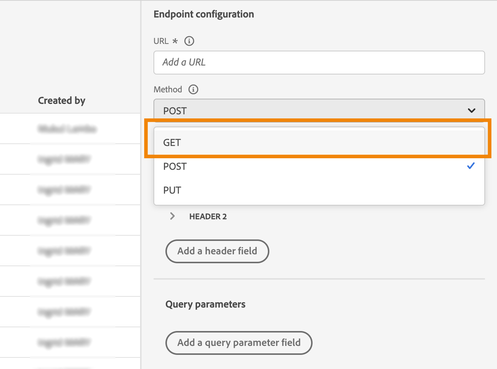
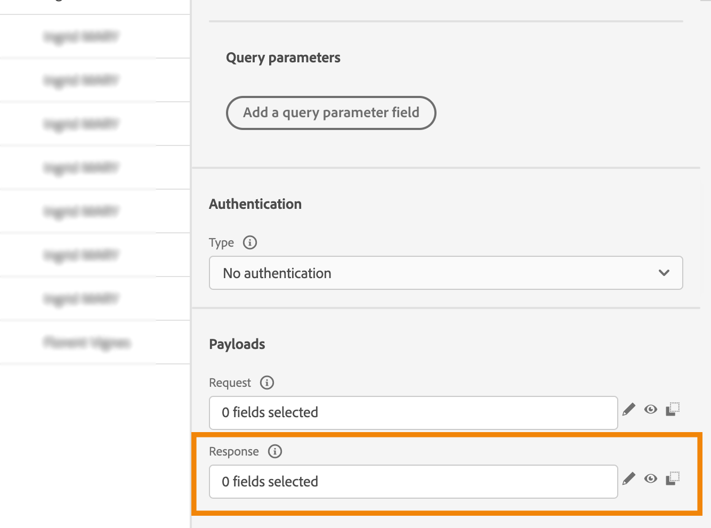

# Uso de respuestas de llamadas API en acciones personalizadas {#custom-action-enhancements}

Puede aprovechar las respuestas de llamadas de API en acciones personalizadas y organizar sus recorridos en función de estas respuestas.

<!--
You can now leverage API call responses in custom actions and orchestrate your journeys based on these responses.

This capability was previously only available when using data sources. You can now use it with custom actions. 
-->

## Notas importantes{#custom-action-enhancements-notes}

<!--
* Custom actions should only be used with private or internal endpoints, and used with an appropriate capping or throttling limit. See [this page](../configuration/external-systems.md). 
-->

* Las matrices escalares son compatibles con la carga útil de respuesta:

  ```
  "dummyScalarArray": [
  "val1",
  "val2"
  ]
  ```

* Las matrices heterogéneas no son compatibles con la carga útil de respuesta:

  ```
  "dummyRandomArray": [
  20,
  "aafw",
  false
  ]
  ```

<!--
## Best practices{#custom-action-enhancements-best-practices}

A capping limit of 5000 calls/s is defined for all custom actions. This limit has been set based on customers usage, to protect external endpoints targeted by custom actions. You need to take this into account in your audience-based journeys by defining an appropriate reading rate (5000 profiles/s when custom actions are used). If needed, you can override this setting by defining a greater capping or throttling limit through our Capping/Throttling APIs. See [this page](../configuration/external-systems.md).

You should not target public endpoints with custom actions for various reasons:

* Without proper capping or throttling, there is a risk of sending too many calls to a public endpoint that may not support such volume.
* Profile data can be sent through custom actions, so targeting a public endpoint could lead to inadvertently sharing personal information externally.
* You have no control on the data being returned by public endpoints. If an endpoint changes its API or starts sending incorrect information, those will be made available in communications sent, with potential negative impacts.
-->

<!--
## Define the custom action {#define-custom-action}

When defining the custom action, two enhancements have been made available: the addition of the GET method and the new payload response field. The other options and parameters are unchanged. See [this page](../action/about-custom-action-configuration.md).

### Endpoint configuration {#endpoint-configuration}

The **URL configuration** section has been renamed **Endpoint configuration**.

In the **Method** drop-down, you can now select **GET**.

{width="70%" align="left"}

### Payloads {#payloads-new}

The **Action parameters** section has been renamed **Payloads**. Two fields are available:

* The **Request** field: this field is only available for POST and PUT calling methods.
* The **Response** field: this is the new capability. This field as available for all calling methods.

>[!NOTE]
> 
>Both these fields are optional.

{width="70%" align="left"}
-->

## Configurar la acción personalizada {#config-response}

1. Cree la acción personalizada. Consulte [esta página](../action/about-custom-action-configuration.md).

1. Haga clic dentro del campo **Respuesta**.

   {width="80%" align="left"}

1. Pegue un ejemplo de la carga útil devuelta por la llamada. Compruebe que los tipos de campo son correctos (cadena, entero, etc.). Este es un ejemplo de carga útil de respuesta capturada durante la llamada. Nuestro extremo local envía el número de puntos de lealtad y el estado de un perfil.

   ```
   {
   "customerID" : "xY12hye",    
   "status":"gold",
   "points": 1290 }
   ```

   {width="80%" align="left"}

   Cada vez que se llama a la API, el sistema recupera todos los campos incluidos en el ejemplo de carga útil.

1. Vamos a añadir también customerID como parámetro de consulta.

   {width="80%" align="left"}

1. Haga clic en **Guardar**.

## Aprovechamiento de la respuesta en un recorrido {#response-in-journey}

Simplemente, agregue la acción personalizada a un recorrido. A continuación, puede aprovechar los campos de carga útil de respuesta en condiciones, otras acciones y la personalización de mensajes.

Por ejemplo, puede agregar una condición para comprobar la cantidad de puntos de lealtad. Cuando la persona entra en el restaurante, el punto final local envía una llamada con la información de fidelidad del perfil. Puede enviar una notificación push si el perfil es un cliente de oro. Y si se detecta un error en la llamada de, envíe una acción personalizada para notificarlo al administrador del sistema.


1. Añada el evento y la acción personalizada Fidelidad creada anteriormente.

1. En la acción personalizada Fidelidad, asigne el parámetro de consulta ID de cliente con el ID de perfil. Marque la opción **Agregar una ruta alternativa en caso de tiempo de espera o error**.

   

1. En la primera rama, agregue una condición y utilice el editor avanzado para aprovechar los campos de respuesta de acción, en el nodo **Context**.

   

1. A continuación, añada la notificación push y personalice el mensaje mediante los campos de respuesta. En nuestro ejemplo, personalizamos el contenido mediante la cantidad de puntos de fidelidad y el estado del cliente. Los campos de respuesta a la acción están disponibles en **Atributos contextuales** > **Journey Orchestration** > **Acciones**.

   

   >[!NOTE]
   >
   >Cada perfil que introduzca la acción personalizada almacenará en déclencheur una llamada. Incluso si la respuesta siempre es la misma, el Recorrido seguirá realizando una llamada por perfil.

1. En las ramas de tiempo de espera y error, agregue una condición y aproveche el campo **jo_status_code** integrado. En nuestro ejemplo, estamos utilizando el
   Tipo de error **http_400**. Consulte [esta sección](#error-status).

   ```
   @action{ActionLoyalty.jo_status_code} == "http_400"
   ```

   

1. Añada una acción personalizada que se enviará a su organización.

   

## Registros del modo de prueba {#test-mode-logs}

Puede acceder, a través del modo de prueba, a los registros de estado relacionados con las respuestas de acciones personalizadas. Si ha definido acciones personalizadas con respuestas en el recorrido, verá una sección **actionsHistory** en esos registros que muestra la carga útil devuelta por el extremo externo (como respuesta de esa acción personalizada). Esto puede resultar muy útil en términos de depuración.


## Estado de error {#error-status}

El campo **jo_status_code** siempre está disponible aunque no se haya definido una carga útil de respuesta.

Estos son los valores posibles de este campo:

* código de estado http: http_`<HTTP API call returned code>`, por ejemplo http_200 o http_400
* error de tiempo de espera: **tiempo de espera**
* error de límite: **límite**
* error interno: **internalError**

Una llamada de acción se considera errónea cuando el código http devuelto es mayor que 2xx o si se produce un error. En estos casos, el recorrido fluye a la rama de tiempo de espera o error correspondiente.

>[!WARNING]
>
>Solo las acciones personalizadas recién creadas incluyen el campo **jo_status_code** de forma predeterminada. Si desea utilizarlo con una acción personalizada existente, debe actualizar la acción. Por ejemplo, puede actualizar la descripción y guardar.

## Sintaxis de expresión {#exp-syntax}

Esta es la sintaxis:

```json
#@action{myAction.myField} 
```

A continuación se muestran algunos ejemplos:

```json
 // action response field
 @action{<action name>.<path to the field>}
 @action{ActionLoyalty.status}
```

```json
 // action response field
 @action{<action name>.<path to the field>, defaultValue: <default value expression>}
 @action{ActionLoyalty.points, defaultValue: 0}
 @action{ActionLoyalty.points, defaultValue: @event{myEvent.newPoints}}
```

Al manipular colecciones en una respuesta de acción personalizada, puede confiar en `currentActionField` para acceder al elemento actual:

```json
count(
@action{MyAction.MyCollection.all(
currentActionField.description == "abc"
)}
)
```

## Recursos adicionales

Para obtener más información, consulte estas páginas:

* [Referencias de campo](../building-journeys/expression/field-references.md).
* [Funciones de administración de colecciones](../building-journeys/expression/collection-management-functions.md)
