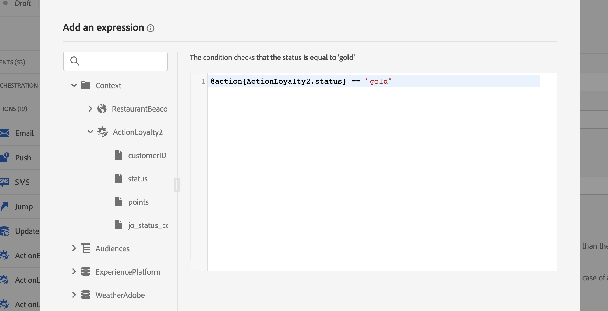
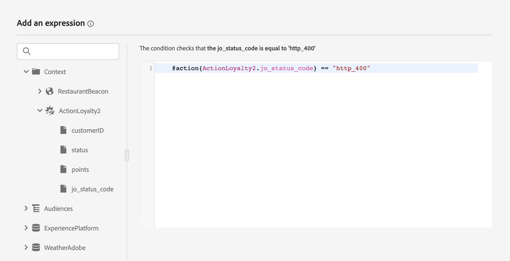

# Mejoras de acciones personalizadas

Ahora puede aprovechar las respuestas de llamadas de API en acciones personalizadas y organizar sus recorridos en función de estas respuestas.

Esta capacidad solo estaba disponible cuando se utilizaban fuentes de datos. Ahora puede utilizarlo con acciones personalizadas.

>[!AVAILABILITY]
>
>Actualmente, esta función está disponible como una versión beta privada.

>[!WARNING]
>
>Las acciones personalizadas solo deben utilizarse con extremos privados o internos y con un límite o restricción adecuado. Consulte [esta página](../configuration/external-systems.md).

## Definir la acción personalizada

Al definir la acción personalizada, se han implementado dos mejoras: la adición del método de GET y el nuevo campo de respuesta de carga útil. Las demás opciones y parámetros no cambiarán. Consulte [esta página](../action/about-custom-action-configuration.md).

### Configuración de extremo

El **Configuración de URL** se ha cambiado el nombre de la sección **Configuración de extremo**.

En el **Método** desplegable, ahora puede seleccionar **GET**.

{width="70%" align="left"}

### Cargas útiles

El **Parámetros de acción** se ha cambiado el nombre de la sección **Cargas útiles**. Hay dos campos disponibles:

* El **Solicitud** field: este campo solo está disponible para métodos de llamada de POST y PUT.
* El **Respuesta** campo: esta es la nueva capacidad. Este campo está disponible para todos los métodos de llamada.

>[!NOTE]
> 
>Ambos campos son opcionales.

{width="70%" align="left"}

1. Haga clic dentro de **Respuesta** field.

   {width="80%" align="left"}

1. Pegue un ejemplo de la carga útil devuelta por la llamada. Compruebe que los tipos de campo son correctos (cadena, entero, etc.). Este es un ejemplo de carga útil de respuesta capturada durante la llamada. Nuestro extremo local envía el número de puntos de lealtad y el estado de un perfil.

   ```
   {
   "customerID" : "xY12hye",    
   "status":"gold",
   "points": 1290 }
   ```

   {width="80%" align="left"}

   Cada vez que se llama a la API, el sistema recupera todos los campos incluidos en el ejemplo de carga útil.

1. Vamos a añadir también customerID como parámetro de consulta.

   {width="80%" align="left"}

1. Haga clic en **Guardar**.

## Aprovechamiento de la respuesta en un recorrido

Simplemente, agregue la acción personalizada a un recorrido. A continuación, puede aprovechar los campos de carga útil de respuesta en condiciones, otras acciones y la personalización de mensajes.

Por ejemplo, puede agregar una condición para comprobar la cantidad de puntos de lealtad. Cuando la persona entra en el restaurante, el punto final local envía una llamada con la información de fidelidad del perfil. Puede enviar una notificación push si el perfil es un cliente de oro. Y si se detecta un error en la llamada de, envíe una acción personalizada para notificarlo al administrador del sistema.


1. Añada el evento y la acción personalizada Fidelidad creada anteriormente.

1. En la acción personalizada Fidelidad, asigne el parámetro de consulta ID de cliente con el ID de perfil. Marque la opción **Añadir una ruta alternativa en caso de tiempo de espera o error**.

   

1. En la primera rama, añada una condición y utilice el editor avanzado para aprovechar los campos de respuesta de acción, en **Contexto** nodo.

   

1. A continuación, añada la notificación push y personalice el mensaje mediante los campos de respuesta. En nuestro ejemplo, personalizamos el contenido mediante la cantidad de puntos de fidelidad y el estado del cliente. Los campos de respuesta de acción están disponibles en **Atributos contextuales** > **Journey Orchestration** > **Acciones**.

   

   >[!NOTE]
   >
   >Cada perfil que introduzca la acción personalizada almacenará en déclencheur una llamada. Incluso si la respuesta siempre es la misma, el Recorrido seguirá realizando una llamada por perfil.

1. En las ramas de tiempo de espera y error, añada una condición y aproveche la variable integrada **jo_status_code** field. En nuestro ejemplo, estamos utilizando el
   **http_400** tipo de error. Consulte [esta sección](#error-status).

   ```
   @action{ActionLoyalty.jo_status_code} == "http_400"
   ```

   

1. Añada una acción personalizada que se enviará a su organización.

   

## Estado de error{#error-status}

El **jo_status_code** El campo siempre está disponible aunque no se haya definido ninguna carga útil de respuesta.

Estos son los valores posibles de este campo:

* código de estado http: http_`<HTTP API call returned code>`, por ejemplo http_200 o http_400
* error de tiempo de espera: **timeout**
* error de límite: **tapado**
* error interno: **internalError**

Una llamada de acción se considera errónea cuando el código http devuelto es bueno que 2xx o si se produce un error. En estos casos, el recorrido fluye a la rama de tiempo de espera o error correspondiente.

>[!WARNING]
>
>Solo las acciones personalizadas recién creadas incluyen las siguientes **jo_status_code** Campo listo para usar. Si desea utilizarlo con una acción personalizada existente, debe actualizar la acción. Por ejemplo, puede actualizar la descripción y guardar.

## Sintaxis de expresión

Esta es la sintaxis:

```json
#@action{myAction.myField} 
```

A continuación se muestran algunos ejemplos:

```json
// action response field
@action{<action name>.<path to the field>}
@action{OpenWeatherMap.main.temp}
```

```json
// action response field
@action{<action name>.<path to the field>, defaultValue: <default value expression>}
@action{OpenWeatherMap.main.temp, defaultValue: 273.15}
@action{OpenWeatherMap.main.temp, defaultValue: @{myEvent.temperature}} 
```

Para obtener más información sobre las referencias de campo, consulte [esta sección](../building-journeys/expression/field-references.md).
