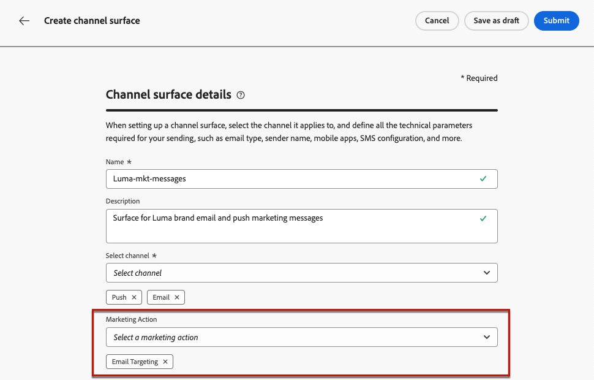
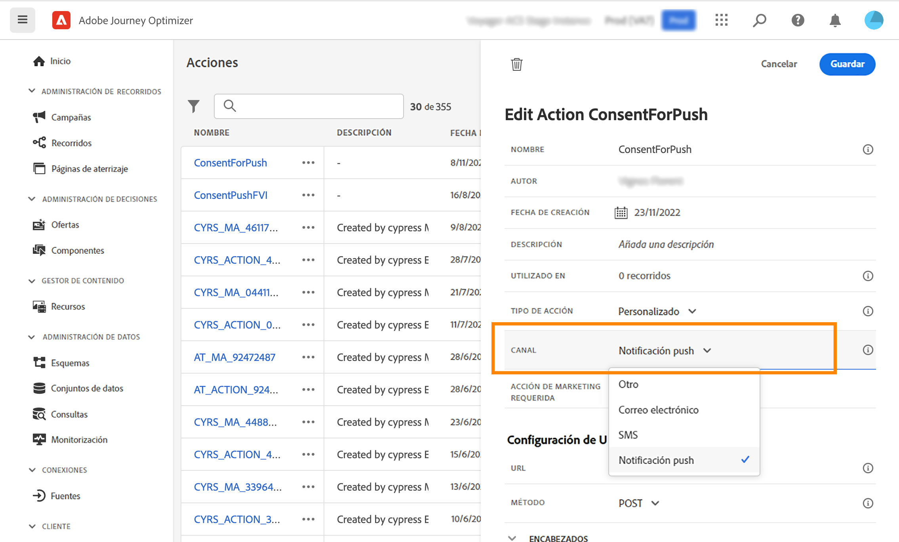
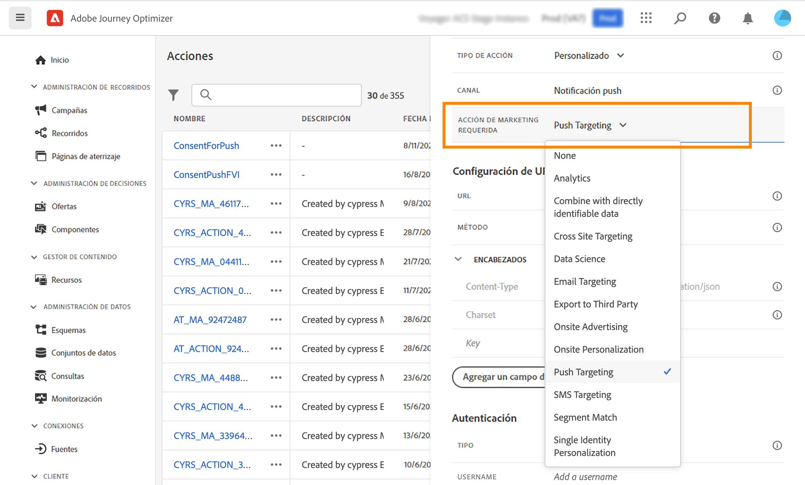
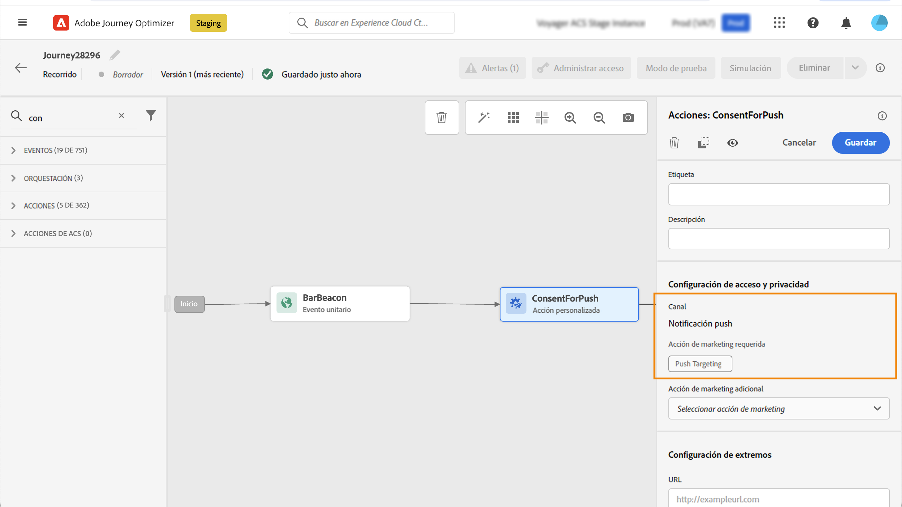
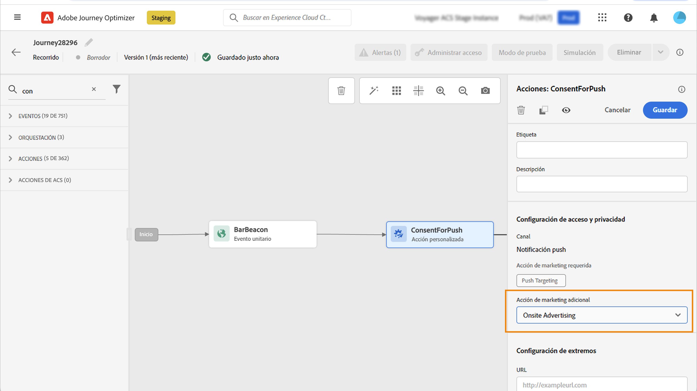
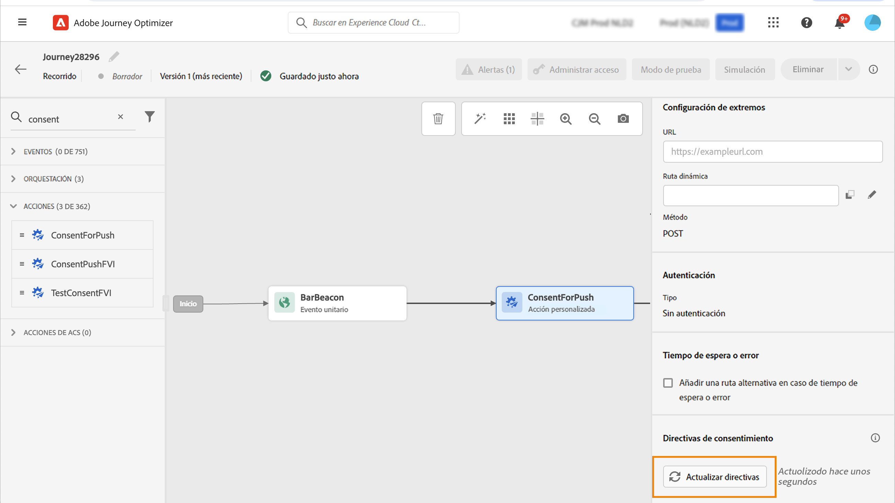

# Trabajar con directivas de consentimiento {#consent-management}

Sus datos pueden estar sujetos a restricciones de uso definidas por su organización o por regulaciones legales. Por lo tanto, es importante asegurarse de que las operaciones de datos en Journey Optimizer cumplan con [políticas de uso de datos](https://experienceleague.adobe.com/docs/experience-platform/data-governance/policies/overview.html){target="_blank"}. Estas políticas son reglas de Adobe Experience Platform que definen qué acciones de marketing se le permite realizar en los datos.

De forma predeterminada, si un perfil se ha excluido de la recepción de comunicaciones por su parte, el perfil correspondiente se excluye de las entregas posteriores. Puede crear una **directiva de consentimiento** que anule esta lógica predeterminada. Por ejemplo, puede crear una política de consentimiento en Experience Platform para excluir a los clientes que no hayan aceptado recibir comunicaciones para un canal determinado. En ausencia de una directiva personalizada, se aplica la directiva predeterminada.

>[!IMPORTANT]
>
>Actualmente, las políticas de consentimiento solo están disponibles para las organizaciones que han adquirido las ofertas adicionales de Adobe **Healthcare Shield** o **Privacy and Security Shield**.

Los pasos principales para aplicar las directivas de consentimiento son los siguientes:

1. Cree una política de consentimiento en Adobe Experience Platform con una acción de marketing asociada. [Aprenda a crear una directiva de consentimiento](https://experienceleague.adobe.com/docs/experience-platform/data-governance/policies/user-guide.html#consent-policy){target="_blank"}

2. Aplique directivas de consentimiento en Adobe Journey Optimizer mediante configuraciones de canal o acciones personalizadas de recorrido.

   * Cree una configuración de canal con una acción de marketing asociada. Al crear una comunicación mediante la configuración de canal, heredará la acción de marketing asociada y aplicará las políticas de consentimiento correspondientes definidas en Adobe Experience Platform. [Aprenda a aprovechar las directivas de consentimiento mediante configuraciones de canal](#surface-marketing-actions)

   * En el nivel de recorrido, puede:

      * Asocie un canal y una acción de marketing a una acción personalizada al configurarlo. [Aprenda a aprovechar las directivas de consentimiento al configurar una acción personalizada](#consent-custom-action)
      * Defina una acción de marketing adicional al agregar una acción personalizada en un recorrido. [Aprenda a aprovechar las directivas de consentimiento al agregar una acción personalizada en un recorrido](#consent-journey)

## Aprovechamiento de las políticas de consentimiento mediante configuraciones de canal {#surface-marketing-actions}

En [!DNL Journey Optimizer], el consentimiento se administra mediante el esquema de consentimiento [Experience Platform](https://experienceleague.adobe.com/docs/experience-platform/xdm/field-groups/profile/consents.html){target="_blank"}. De forma predeterminada, el valor del campo de consentimiento está vacío y se trata como consentimiento para recibir sus comunicaciones. Puede modificar este valor predeterminado al incorporar uno de los posibles valores enumerados [aquí](https://experienceleague.adobe.com/docs/experience-platform/xdm/data-types/consents.html#choice-values){target="_blank"}.

Para modificar el valor del campo de consentimiento, puede crear una directiva de consentimiento personalizada en la que defina una acción de marketing y las condiciones en las que se realiza dicha acción. [Más información sobre las acciones de marketing](https://experienceleague.adobe.com/docs/experience-platform/data-governance/policies/overview.html#marketing-actions){target="_blank"}

Por ejemplo, si desea crear una política de consentimiento para dirigirse solo a perfiles que hayan aceptado recibir comunicaciones por correo electrónico, siga los pasos a continuación.

1. Asegúrese de que su organización ha adquirido las ofertas adicionales de Adobe **Healthcare Shield** o **Privacy and Security Shield**. [Más información](https://experienceleague.adobe.com/docs/events/customer-data-management-voices-recordings/governance/healthcare-shield.html){target="_blank"}

1. En Adobe Experience Platform, cree una directiva personalizada (en el menú **[!UICONTROL Privacidad]** > **[!UICONTROL Políticas]**). [Más información](https://experienceleague.adobe.com/docs/experience-platform/data-governance/policies/user-guide.html#create-policy){target="_blank"}

   <!---->

1. Elija el tipo **[!UICONTROL directiva de consentimiento]** y configure una condición de la siguiente manera. [Obtenga información sobre cómo configurar directivas de consentimiento](https://experienceleague.adobe.com/docs/experience-platform/data-governance/policies/user-guide.html#consent-policy){target="_blank"}

   1. En la sección **[!UICONTROL If]**, seleccione la acción de marketing predeterminada **[!UICONTROL Segmentación por correo electrónico]**.

      <!---->

      >[!NOTE]
      >
      >Las acciones de marketing principales proporcionadas previamente por Adobe se enumeran en [esta tabla](https://experienceleague.adobe.com/docs/experience-platform/data-governance/policies/overview.html#core-actions){target="_blank"}. Los pasos para crear una acción de marketing personalizada se enumeran en [esta sección](https://experienceleague.adobe.com/docs/experience-platform/data-governance/policies/user-guide.html#create-marketing-action){target="_blank"}.

   1. Seleccione lo que sucede cuando se aplica la acción de marketing. En este ejemplo, seleccione **[!UICONTROL Consentimiento de marketing por correo electrónico]**.

   

1. Guarde y [habilite](https://experienceleague.adobe.com/docs/experience-platform/data-governance/policies/user-guide.html#enable){target="_blank"} esta directiva.

1. En Journey Optimizer, cree una configuración de canal de correo electrónico. [Más información](../configuration/channel-surfaces.md#create-channel-surface)

1. En los detalles de configuración del correo electrónico, seleccione la acción de marketing **[!UICONTROL Segmentación de correo electrónico]**.

   

Todas las políticas de consentimiento asociadas con esa acción de marketing se aprovechan automáticamente para respetar las preferencias de los clientes.

Por lo tanto, en este ejemplo, cualquier [correo electrónico](../email/create-email.md) que use esa configuración en una campaña o un recorrido solo se enviará a los perfiles que hayan aceptado recibir correos electrónicos tuyos. Se excluyen los perfiles que no hayan aceptado recibir comunicaciones por correo electrónico.

## Aprovechamiento de las políticas de consentimiento mediante acciones personalizadas {#journey-custom-actions}

### Notas importantes {#important-notes}

En Journey Optimizer, el consentimiento también se puede aprovechar en acciones personalizadas. Si desea utilizarlo con las funciones de mensajes integradas, debe utilizar una actividad de condición para filtrar a los clientes en su recorrido.

Con la gestión del consentimiento se analizan dos actividades de recorrido:

* Leer audiencia: se tiene en cuenta la audiencia recuperada.
* Acción personalizada: la administración de consentimiento tiene en cuenta los atributos utilizados ([parámetros de acción](../action/about-custom-action-configuration.md#define-the-message-parameters)) así como las acciones de marketing definidas (acción de marketing necesaria y acción de marketing adicional).
* No se admiten los atributos que forman parte de un grupo de campos que utilizan el esquema de unión predeterminado. Estos atributos se ocultarán en la interfaz. Debe crear otro grupo de campos con un esquema diferente.
* Las políticas de consentimiento solo se aplican cuando una acción de marketing (obligatoria o adicional) se establece en el nivel de acción personalizada.

No se tienen en cuenta todas las demás actividades utilizadas en un recorrido. Si inicia el recorrido con una calificación de audiencia, esta no se tiene en cuenta.

En un recorrido, si una directiva de consentimiento excluye un perfil en una acción personalizada, el mensaje no se le envía, pero continúa con el recorrido. El perfil no va a la ruta de tiempo de espera y error al utilizar una condición.

Antes de actualizar directivas en una acción personalizada colocada en un recorrido, asegúrese de que el recorrido no tenga ningún error.

<!--
There are two types of latency regarding the use of consent policies:

* **User latency**: the delay from the time a profile changes a consent settings to the moment it is applied in Experience Platform. This can take up to 48h. 
* **Consent policy latency**: the delay from the time a consent policy is created or updated to the moment it is applied. This can take up to 6 hours
-->

### Aprovechamiento de las políticas de consentimiento al configurar una acción personalizada{#consent-custom-action}

Al configurar una acción personalizada, se pueden utilizar dos campos para la administración de consentimiento.

El campo **Canal** le permite seleccionar el canal relacionado con esta acción personalizada. Prerellena el campo **Acción de marketing necesaria** con la acción de marketing predeterminada para el canal seleccionado. Si selecciona **other**, no se define ninguna acción de marketing de forma predeterminada.

**Acción de marketing necesaria** le permite definir la acción de marketing relacionada con la acción personalizada. Por ejemplo, si usa esa acción personalizada para enviar correos electrónicos, puede seleccionar **Direccionamiento de correo electrónico**. Cuando se utilizan en un recorrido de, todas las políticas de consentimiento asociadas con esa acción de marketing se recuperan y aprovechan. Se selecciona una acción de marketing predeterminada, pero puede hacer clic en la flecha hacia abajo para seleccionar cualquier acción de marketing disponible en la lista.

Para ciertos tipos de comunicaciones importantes, como un mensaje transaccional enviado para restablecer la contraseña del cliente, es posible que no desee aplicar una directiva de consentimiento. Luego seleccionará **Ninguno** en el campo **Acción de marketing necesaria**.

Los demás pasos para configurar una acción personalizada se detallan en [esta sección](../action/about-custom-action-configuration.md#consent-management).

### Aprovechamiento de las políticas de consentimiento al añadir una acción personalizada en un recorrido {#consent-journey}

Al añadir la acción personalizada en un recorrido, varias opciones permiten administrar el consentimiento. Haga clic en **Mostrar campos de solo lectura** para mostrar todos los parámetros.

El **canal** y **Acción de marketing necesaria**, definidos al configurar la acción personalizada, se muestran en la parte superior de la pantalla. Estos campos no se pueden modificar.

Puede definir una **acción de marketing adicional** para establecer el tipo de acción personalizada. Esto le permite definir el propósito de la acción personalizada en este recorrido. Además de la acción de marketing necesaria, que suele ser específica de un canal, puede definir una acción de marketing adicional que sea específica de la acción personalizada en este recorrido en particular. Por ejemplo: una comunicación de entrenamiento, una newsletter, una comunicación de fitness, etc. Se aplican la acción de marketing necesaria y la acción de marketing adicional.

Haga clic en el botón **Actualizar directivas**, en la parte inferior de la pantalla, para actualizar y comprobar la lista de directivas que se tienen en cuenta para esta acción personalizada. Esto es solo con fines informativos, mientras se crea un recorrido. Con las recorridos activas, las políticas de consentimiento se recuperan y actualizan automáticamente cada 6 horas.

<!--
The following data is taken into account for consent:

* marketing actions and additional marketing actions defined in the custom action
* action parameters defined in the custom action, see this [section](../action/about-custom-action-configuration.md#define-the-message-parameters) 
* attributes used as criteria in a segment when the journey starts with a Read segment, see this [section](../building-journeys/read-audience.md) 

>[!NOTE]
>
>Please note that there can be a latency when updating the list of policies applied, refer to this [this section](../action/consent.md#important-notes).
-->

Los demás pasos para configurar una acción personalizada en un recorrido se detallan en [esta sección](../building-journeys/using-custom-actions.md).
