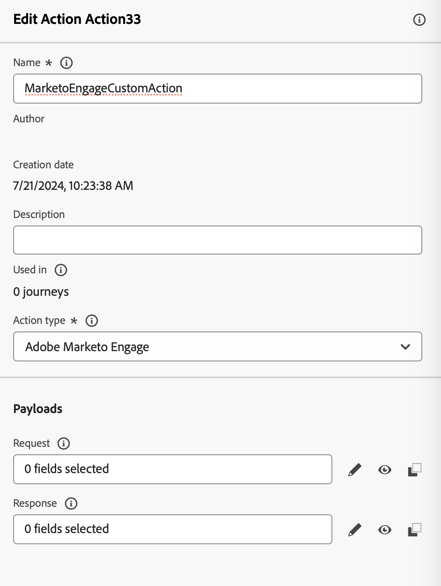

# Integración con Marketo Engage {#integrating-with-marketo-engage}

Empiece con un recorrido de integración de datos perfecta con Marketo Engage. Hay una acción personalizada específica disponible en sus recorridos para integrar Adobe Journey Optimizer y Marketo Engage. Esta acción personalizada admite la ingesta de dos tipos de datos clave:

* **Personas** (perfiles): Marketo transforma los perfiles en perspectivas procesables.
* **Objetos personalizados**: adapte sus datos con objetos personalizados, como productos, para un enfoque de marketing personalizado.

## Requisitos previos {#prerequisites}

Los siguientes requisitos previos se aplican a esta integración:

* La instancia de cliente de Marketo Engage debe estar habilitada para IMS
* La instancia de Marketo Engage y la instancia de Adobe Experience Platform/Journey Optimizer deben estar en la misma organización
* Se debe proporcionar al cliente **MktoSync: acceso al servicio de ingesta**

## Configurar la acción {#configure-marketo-action}


En Journey Optimizer, debe configurar una acción personalizada para Marketo Engage. Siga estos pasos:

1. Seleccione **[!UICONTROL Configuraciones]** en la sección del menú ADMINISTRACIÓN.
1. En la sección **[!UICONTROL Acciones]**, haga clic en **[!UICONTROL Crear acción]**. El panel de configuración de acción se abre en el lado derecho de la pantalla.
1. Escriba el nombre, la descripción y seleccione **Adobe Marketo Engage** como **tipo de acción**

{width="40%" align="left"}

1. Haga clic en el icono **Editar carga** para sus cargas **Solicitud** y **Respuesta**.
1. Para ambos, componga la carga útil y péguela en la ventana emergente dedicada.

{width="70%" align="left"}

1. Inspeccionar y configurar valores de carga útil
Nota: Para pasar valores dinámicamente, cambie **Constant** a **Variable** para cada campo.

{width="70%" align="left"}

1. Haz clic en **Guardar** en la pantalla de configuración del campo y, a continuación, **guarda** tu acción personalizada.

Ahora puede utilizar la acción personalizada en el lienzo de recorrido.

## Sintaxis de carga útil {#payload-syntax}

### Persona


### CustomObject


**Ejemplo de carga útil para la persona**

```json
{
   "munchkinID": "388-KKG-245",  
   "person": {
    "priority": "normal",
    "partitionName": "XYZ",
    "dedupeFields": {
      "field1": "email",
      "field2": "firstName"
    },
    "objects": [
      {
        "email": "Email address",
        "firstName": "First name",
        "lastName": "Last name"
      }
    ]
  }
}
```

**Ejemplo de carga útil para el objeto personalizado**

```json
{
  "munchkinID": "388-KKG-245", 
  "customObject": {
    "priority": "normal",
    "objectName": "products",
    "objects": [
      {
        "email": "Email Address",
        "productName": "Product Name",
        "productQty": "Product Quantity",
        "priceTotal": "Price Total"
      }
    ]
  }
}
```


## Uso de la acción {#engage-using}

Para cada acción configurada, hay una actividad de acción Marketo Engage disponible en la paleta del diseñador de recorridos.

Para usarlo, siga estos pasos:

1. Arrastre la acción personalizada al lienzo de recorrido.

1. Introduzca la etiqueta y la descripción de esta acción.

1. En la sección **Parámetros de solicitud**, haga clic en el icono **Editar** para cada uno de los parámetros y seleccione los valores dinámicos que ha configurado en la carga útil.

{width="70%" align="left"}
