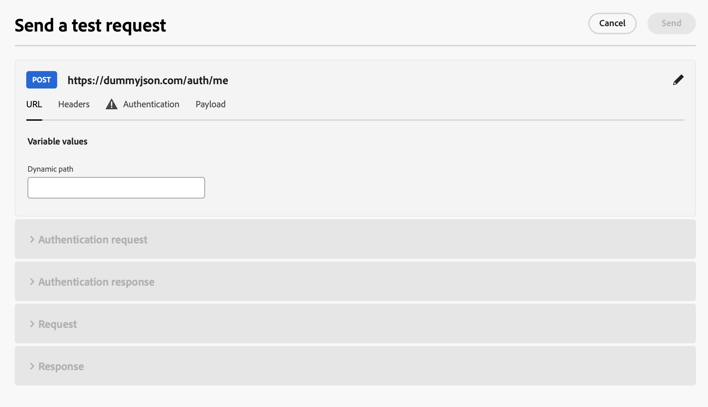
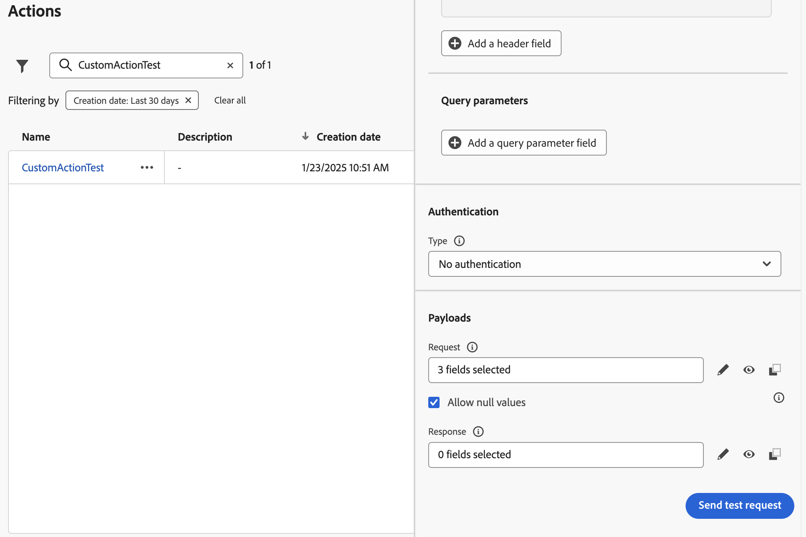

# Resolución de problemas de acciones personalizadas {#troubleshoot-a-custom-action}

Puede probar las acciones personalizadas enviando llamadas a la API desde la sección de administración de la interfaz de usuario de Journey Optimizer. Esta capacidad le ayuda a solucionar problemas de las acciones personalizadas antes o después de utilizarlas en un recorrido.

Como administrador, use la capacidad **[!UICONTROL Enviar solicitud de prueba]** para validar las configuraciones de acción personalizadas realizando llamadas de API reales directamente desde Adobe Journey Optimizer. Esta función garantiza que la estructura de solicitud, los encabezados, la autenticación y la carga útil tengan el formato correcto antes de utilizarse en un recorrido.

{width="70%" align="left"}

Utilice esta capacidad para optimizar el proceso de prueba y validación, asegurándose de que las acciones personalizadas funcionen correctamente en los recorridos activos.

>[!NOTE]
>
>Si su organización tiene habilitado el proxy IP (salida), la llamada **[!UICONTROL Enviar solicitud de prueba]** lo omite. Para confirmar el enrutamiento de proxy, ejecute una prueba o un recorrido activo. Obtenga más información acerca del proxy IP (salida) y la habilitación en [Integrar con sistemas externos](../configuration/external-systems.md#faq).

## Requisitos previos {#troubleshoot-custom-action-prereq}

Para usar la capacidad **[!UICONTROL Enviar solicitud de prueba]**, se debe preconfigurar una **acción personalizada** con una dirección URL, encabezados y configuración de autenticación.

Para que los administradores utilicen esta capacidad, se requieren los siguientes permisos:

* Los usuarios deben tener el permiso **[!DNL Manage journeys events, data sources and actions]**.
* Este permiso está incluido en el rol *Administradores de Recorrido*.
* El permiso **[!DNL View journeys events]** no es suficiente.

Obtenga más información acerca de los permisos de recorrido en [esta sección](../administration/high-low-permissions.md#journey-capability).

## Cómo utilizar la función Enviar solicitud de prueba {#troubleshoot-custom-action-use}

Para probar una acción personalizada, siga estos pasos:

1. Vaya a la pantalla de configuración de **Actions** y seleccione una acción personalizada.
1. Haga clic en el botón **[!UICONTROL Enviar solicitud de prueba]** en la parte inferior de la pantalla de configuración de la acción.
   {width="70%" align="left"}
1. En la ventana emergente, que permite especificar los parámetros de la solicitud:

   * Si el método de acción personalizada **es GET**, no se requiere carga útil.
   * Si el método de acción personalizada **es POST**, debe proporcionar una carga útil JSON.

     >[!NOTE]
     >
     >Adobe Journey Optimizer generará un error si la estructura de este JSON es incorrecta, pero no lo hará si hay una discrepancia con un tipo de datos. Por ejemplo, no habrá ningún error si se utiliza un parámetro entero para lo que debería ser una cadena.

   * Si se define la autenticación, se le pedirá que introduzca los detalles de autenticación.

1. Haga clic en **Enviar** para ejecutar la solicitud.
1. La respuesta de la API, incluidos los encabezados y los códigos de estado, se muestra en la interfaz.

## Gestión de autenticación {#troubleshoot-custom-action-auth}

Cuando una acción personalizada incluye autenticación, Adobe Journey Optimizer requiere que el usuario introduzca los detalles de autenticación para cada solicitud de prueba:

* **Autenticación básica:** El usuario debe proporcionar la *contraseña*.
* **Autenticación de clave API:** El usuario debe escribir la clave API *value*.
* **Autenticación personalizada:** El usuario debe proporcionar los parámetros de autenticación en la solicitud *bodyParam*. Se han agregado dos secciones en este caso: **Solicitud de autenticación** y **Respuesta de autenticación**.

## Ventajas principales {#troubleshoot-custom-action-benefits}

Como administrador de Journey Optimizer, también puede utilizar herramientas externas (por ejemplo, Postman) para probar las acciones personalizadas. A continuación se enumeran las ventajas clave de la capacidad de resolución de problemas en el producto en comparación con una prueba externa:

* **Recorrido de AJO** ejecuta la solicitud de prueba, lo que significa que:

   * Se utiliza la estructura exacta de la solicitud (incluidos los encabezados específicos de Adobe Journey Optimizer).
   * La IP de origen y los encabezados coinciden con los utilizados en los recorridos activos.

* La capacidad **[!UICONTROL Enviar solicitud de prueba]** se puede usar para solucionar problemas de **recorridos activos**, ya que la acción personalizada ya está implementada.

* Esta capacidad de prueba en el producto elimina la necesidad de copiar manualmente los detalles de configuración entre las herramientas, lo que reduce el riesgo de errores.

## Resolución de problemas {#troubleshoot-custom-action-check}

Si la solicitud falla, puede comprobar lo siguiente:

* Las credenciales de autenticación introducidas en la prueba.
* El método de solicitud (GET frente a POST) y la carga útil correspondiente.
* El extremo y los encabezados de la API definidos en la acción personalizada.
* Utilice los datos de respuesta para identificar posibles errores de configuración.

## Gestión de eventos de descarte y tiempos de espera inactivos {#handling-discard-events-and-idle-timeouts}

Cuando una acción personalizada en un recorrido genere un déclencheur de un evento que está destinado a iniciar un **segundo recorrido**, asegúrese de que el segundo recorrido esté en un estado válido y de que se reconozca el evento. Si el evento no cumple las condiciones de entrada del segundo recorrido, se puede **descartar** y aparecer en registros con códigos como `notSuitableInitialEvent`. Los tiempos de espera de inactividad pueden producirse si el segundo recorrido no está listo, lo que provoca la eliminación de eventos en los registros.

**Causas comunes:**

* **No se cumplió la calificación del evento** - El segundo recorrido usa un evento basado en reglas con una condición de calificación (por ejemplo, un campo obligatorio no debe estar vacío, como `isNotEmpty` en un campo específico). Si la carga útil de evento no cumple esa condición (por ejemplo, el campo está vacío o falta), el evento se **recibe pero se descarta** y no se activa el segundo recorrido. Este es el comportamiento esperado; la documentación y los registros confirman que si no se cumple la condición de calificación, el evento se descarta y el recorrido no se activa para ese perfil. Compruebe que la carga útil enviada por la acción personalizada incluye todos los campos y valores requeridos por la configuración de evento del segundo recorrido. Aprenda a [configurar eventos basados en reglas](../event/about-creating.md) y a [solucionar problemas de recepción de eventos](../building-journeys/troubleshooting-execution.md#checking-if-people-enter-the-journey) en la ejecución del recorrido.

* **El segundo recorrido no está listo**. Puede haber tiempos de espera inactivos si el segundo recorrido aún no está activo (por ejemplo, no está en modo de prueba o no está activo) o si hay un intervalo de tiempo entre la activación de la acción personalizada y el segundo recorrido que está listo para recibir. Asegúrese de que el recorrido de destinatario se publique o esté en modo de prueba antes de activar la acción personalizada.

* **Diagnóstico de eventos de descarte**: si ve eventos de descarte en los registros, compruebe los registros de recorrido y los seguimientos de Splunk para confirmar si el evento se recibió pero se descartó debido a la calificación (la carga útil no cumplía la regla) o al tiempo. Asegúrese de que la fecha de inicio y la configuración del segundo recorrido sean correctas y de que el recorrido se encuentre dentro de su ventana de fecha activa.

Para evitar descartar eventos al encadenar recorridos mediante acciones personalizadas, valide la carga útil de evento con la regla de evento del segundo recorrido y confirme que el recorrido de destino está activo o en prueba y dentro de su ventana de fecha activa.

## Recursos adicionales

Examine las secciones siguientes para obtener más información sobre la configuración y el uso de las acciones personalizadas:

* [Empiece a usar las acciones personalizadas](../action/action.md): descubra qué es una acción personalizada y cómo le ayudan a conectarse a sistemas de terceros
* [Configurar las acciones personalizadas](../action/about-custom-action-configuration.md): aprenda a crear y configurar una acción personalizada
* [Usar acciones personalizadas](../building-journeys/using-custom-actions.md): aprenda a usar acciones personalizadas en sus recorridos
* [Pasar colecciones a parámetros de acción personalizados](../building-journeys/collections.md): aprenda a pasar una colección en parámetros de acción personalizados que se rellenan dinámicamente durante la ejecución

