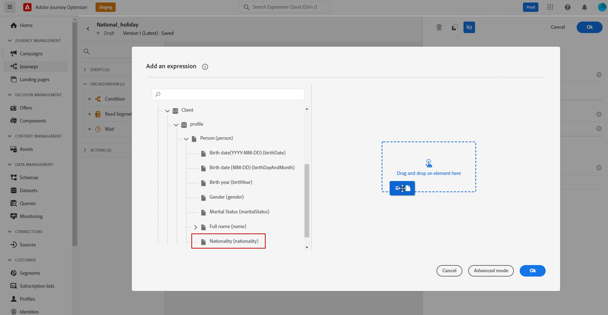

# Control de acceso basado en atributos {#attribute-based-access}

La capacidad Control de acceso basado en atributos (ABAC) permite definir autorizaciones para administrar el acceso a datos para equipos o grupos de usuarios específicos. Su objetivo es proteger los activos digitales confidenciales de usuarios no autorizados, lo que permite una mayor protección de los datos personales.

En Adobe Journey Optimizer, ABAC le permite proteger datos y conceder acceso específico a elementos de campo específicos, incluidos esquemas del Modelo de datos de experiencia (XDM), atributos de perfil y audiencias.

Para obtener una lista más detallada de la terminología utilizada con ABAC, consulte [Documentación de Adobe Experience Platform](https://experienceleague.adobe.com/docs/experience-platform/access-control/abac/overview.html?lang=es).

En este ejemplo, queremos agregar una etiqueta al campo de esquema **Nationality** para restringir el uso de usuarios no autorizados. Para que esto funcione, debe realizar los siguientes pasos:

1. Cree un nuevo **[!UICONTROL Rol]** y asígnelo con la **[!UICONTROL Etiqueta]** correspondiente para que los usuarios puedan acceder y utilizar el campo de esquema.

1. Asigne una **[!UICONTROL Etiqueta]** al campo de esquema **Nacionalidad** en Adobe Experience Platform.

1. Utilice el **[!UICONTROL campo de esquema]** en Adobe Journey Optimizer.

Tenga en cuenta que también se puede tener acceso a **[!UICONTROL Roles]**, **[!UICONTROL Políticas]** y **[!UICONTROL Productos]** con la API de control de acceso basada en atributos. Para obtener más información, consulte esta [Documentación](https://experienceleague.adobe.com/docs/experience-platform/access-control/abac/abac-api/overview.html).

## Crear una función y asignar etiquetas {#assign-role}

>[!IMPORTANT]
>
>Antes de administrar permisos para una función, primero deberá crear una directiva. Para obtener más información, consulte [Documentación de Adobe Experience Platform](https://experienceleague.adobe.com/docs/experience-platform/access-control/abac/permissions-ui/policies.html?lang=es).

**[!UICONTROL Las funciones]** son un conjunto de usuarios que comparten los mismos permisos, etiquetas y zonas protegidas dentro de su organización. Cada usuario que pertenece a un **[!UICONTROL Rol]** tiene derecho a las aplicaciones y los servicios de Adobe contenidos en el producto.
También puede crear sus propios **[!UICONTROL roles]** si desea ajustar el acceso de los usuarios a ciertas funcionalidades u objetos de la interfaz.

Ahora queremos otorgar a los usuarios seleccionados acceso al campo **Nacionalidad**, etiquetado como C2. Para ello, necesitamos crear un nuevo **[!UICONTROL Rol]** con un conjunto específico de usuarios y concederles la etiqueta C2 que les permita usar los detalles de **Nacionalidad** en un **[!UICONTROL Recorrido]**.

1. En el producto [!DNL Permissions], seleccione **[!UICONTROL Rol]** en el menú del panel izquierdo y haga clic en **[!UICONTROL Crear rol]**. Tenga en cuenta que también puede agregar **[!UICONTROL Label]** a los roles integrados.

   

1. Agregue un **[!UICONTROL Nombre]** y una **[!UICONTROL Descripción]** a su nuevo **[!UICONTROL Rol]**, aquí: Demografía de rol restringida.

1. En la lista desplegable, selecciona tu **[!UICONTROL espacio aislado]**.

   

1. En el menú **[!UICONTROL Recursos]**, haga clic en **[!UICONTROL Adobe Experience Platform]** para abrir las diferentes funcionalidades. Aquí seleccionamos **[!UICONTROL Recorridos]**.

   

1. En la lista desplegable, seleccione los **[!UICONTROL Permisos]** vinculados a la característica seleccionada, como **[!UICONTROL Ver recorridos]** o **[!UICONTROL recorridos de Publish]**.

   

1. Después de guardar la **[!UICONTROL función]** recién creada, haga clic en **[!UICONTROL Propiedades]** para seguir configurando el acceso a la función.

   

1. En la ficha **[!UICONTROL Usuarios]**, haga clic en **[!UICONTROL Agregar usuarios]**.

   

1. En la ficha **[!UICONTROL Etiquetas]**, seleccione **[!UICONTROL Agregar etiqueta]**.

   

1. Seleccione las **[!UICONTROL Etiquetas]** que desee agregar a su rol y haga clic en **[!UICONTROL Guardar]**. Para este ejemplo, concedemos la etiqueta C2 para que los usuarios tengan acceso al campo del esquema restringido anteriormente.

   

Los usuarios con el rol **demográfico de rol restringido** tienen ahora acceso a los objetos etiquetados como C2.

## Asignación de etiquetas a un objeto en Adobe Experience Platform {#assign-label}

>[!WARNING]
>
>El uso incorrecto de las etiquetas puede interrumpir el acceso a las personas y las infracciones de las directivas de déclencheur.

**[!UICONTROL Etiquetas]** se puede usar para asignar áreas de características específicas mediante el control de acceso basado en atributos.
En este ejemplo, queremos restringir el acceso al campo **Nacionalidad**. Este campo solamente será accesible para los usuarios con la **[!UICONTROL Etiqueta]** correspondiente a su **[!UICONTROL Rol]**.

Tenga en cuenta que también puede agregar **[!UICONTROL Label]** a **[!UICONTROL Schema]**, **[!UICONTROL Datasets]** y **[!UICONTROL Audiences]**.

1. Cree su **[!UICONTROL esquema]**. Para obtener más información, consulte [esta documentación](https://experienceleague.adobe.com/docs/experience-platform/xdm/schema/composition.html?lang=es).

   

1. En el **[!UICONTROL esquema]** recién creado, agregamos primero el grupo de campos **[!UICONTROL Detalles demográficos]** que contiene el campo **Nacionalidad**.

   

1. En la ficha **[!UICONTROL Etiquetas]**, compruebe el nombre del campo restringido, aquí **Nacionalidad**. A continuación, en el menú del panel derecho, seleccione **[!UICONTROL Editar etiquetas de control]**.

   

1. Seleccione la **[!UICONTROL Etiqueta]** correspondiente, en este caso, C2 - Los datos no se pueden exportar a terceros. Para obtener la lista detallada de las etiquetas disponibles, consulte [esta página](https://experienceleague.adobe.com/docs/experience-platform/data-governance/labels/reference.html#contract-labels).

   

1. Personalice aún más el esquema si es necesario y, a continuación, actívelo. Para ver los pasos detallados sobre cómo habilitar el esquema, consulte esta [página](https://experienceleague.adobe.com/docs/experience-platform/xdm/ui/resources/schemas.html#profile).

El campo del esquema ahora solo estará visible y ahora solo lo pueden utilizar los usuarios que formen parte de un conjunto de funciones con la etiqueta C2.
Al aplicar una **[!UICONTROL Etiqueta]** a su **[!UICONTROL Nombre de campo]**, tenga en cuenta que la **[!UICONTROL Etiqueta]** se aplicará automáticamente al campo **Nacionalidad** en cada esquema creado.

## Acceso a objetos etiquetados en Adobe Journey Optimizer {#attribute-access-ajo}

Después de etiquetar el nombre de campo de **Nacionalidad** en un nuevo esquema y la nueva función, ahora podemos ver el impacto de esta restricción en Adobe Journey Optimizer.
Para nuestro ejemplo, un primer usuario X con acceso a objetos etiquetados como C2 creará un Recorrido con una condición dirigida al **[!UICONTROL nombre de campo]** restringido. Un segundo usuario Y sin acceso a los objetos etiquetados como C2 tendrá que publicar el Recorrido.

1. Desde Adobe Journey Optimizer, primero debes configurar la **[!UICONTROL fuente de datos]** con tu nuevo esquema.

   

1. Agregue un nuevo **[!UICONTROL grupo de campos]** de su **[!UICONTROL esquema]** recién creado al **[!UICONTROL origen de datos]** integrado. También puede crear un nuevo **[!UICONTROL origen de datos]** externo y **[!UICONTROL grupos de campos]** asociados.

   

1. Después de seleccionar el **[!UICONTROL esquema]** creado anteriormente, haga clic en **[!UICONTROL Editar]** en la categoría **[!UICONTROL Campos]**.

   

1. Seleccione el **[!UICONTROL nombre de campo]** al que desee destinarlo. Aquí seleccionamos el campo **Nacionalidad** restringida.

   

1. A continuación, cree un Recorrido que envíe un correo electrónico a los usuarios con una nacionalidad específica. Agregue un **[!UICONTROL Evento]** y después una **[!UICONTROL Condición]**.

   

1. Seleccione el campo **Nacionalidad** restringido para empezar a crear su expresión.

   

1. Edite la **[!UICONTROL condición]** para dirigirse a una población específica con el campo **Nacionalidad** restringido.

   

1. Personalice su recorrido según sea necesario. Aquí agregamos una acción **[!UICONTROL Correo electrónico]**.

   

Si el usuario Y sin acceso a los objetos de la etiqueta C2 necesita acceder a este recorrido con este campo restringido:

* El usuario Y no podrá utilizar el nombre de campo restringido, ya que no será visible.

* El usuario Y no podrá editar la expresión con el nombre de campo restringido en modo avanzado. El siguiente error aparecerá `The expression is invalid. Field is no longer available or you don't have enough permission to see it`.

* El usuario Y puede eliminar la expresión.

* El usuario Y no podrá probar el Recorrido.

* El usuario Y no podrá publicar el Recorrido.
