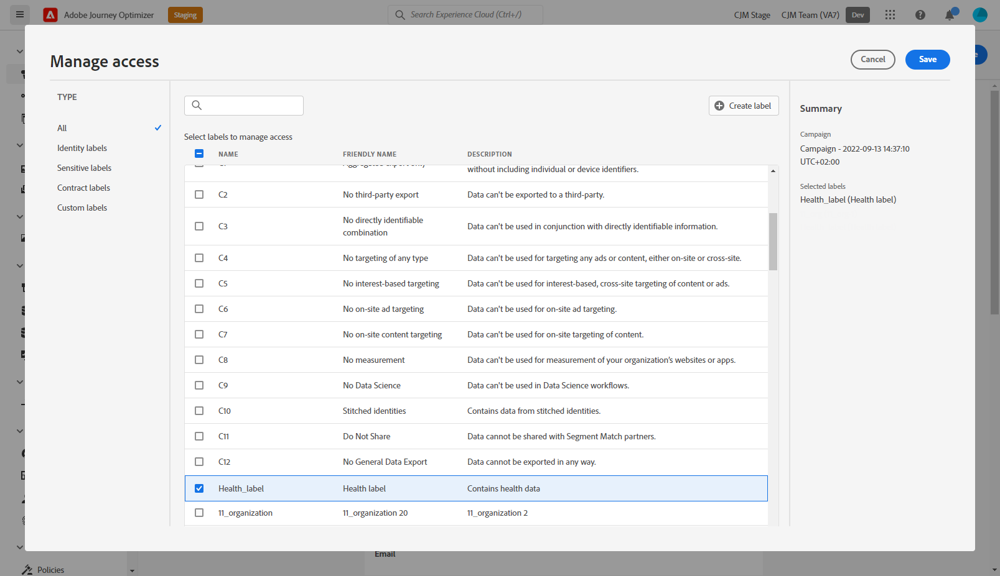

# Control de acceso de nivel de objeto {#object-level-access}

>[!CONTEXTUALHELP]
>id="ajo_olac_manage_access"
>title="Etiquetas de administración de acceso"
>abstract="Puede limitar el acceso a un objeto en función de las etiquetas de acceso. Este enfoque protege los recursos digitales confidenciales de los usuarios no autorizados y garantiza una mayor protección de los datos personales. **Asegúrese de seleccionar solo las etiquetas para las que tenga permiso.**"

Puede limitar el acceso a un objeto en función de las etiquetas de acceso. Este enfoque protege los activos digitales confidenciales de los usuarios no autorizados y garantiza una mayor protección de los datos personales.

La capacidad Control de acceso a nivel de objeto (OLAC) permite definir autorizaciones para administrar el acceso a datos para una selección de objetos:

* Recorrido 
* Campaign
* Plantilla
* Fragmento
* Landing page
* Oferta
* Colección de ofertas estáticas
* Decisión de oferta
* Configuración de canal
* plan de calentamiento de IP

## Requisitos previos {#prereq-labels}

Para poder [crear etiquetas](#create-labels), debe pertenecer a un rol con el permiso **[!UICONTROL Administrar etiquetas de uso]**.

Para poder [asignar etiquetas](#assign-labels), debe pertenecer a un rol con el permiso **Administrar**, es decir, [!DNL Manage journeys], [!DNL Manage Campaigns] o [!DNL Manage decisions]. Sin este permiso, el botón **[!UICONTROL Administrar acceso]** aparece atenuado.

Puede obtener más información sobre permisos en [esta sección](../administration/permissions.md).

## Creación de etiquetas {#create-labels}

Las **[!UICONTROL etiquetas]** le permiten categorizar conjuntos de datos y campos según las políticas de uso que se aplican a esos datos. **[!UICONTROL Las etiquetas]** se pueden aplicar en cualquier momento, lo que proporciona flexibilidad en la forma en que se gestionan los datos.

Utilice etiquetas para proporcionar acceso a los usuarios y aplicar políticas de consentimiento y gobernanza de datos. Estas etiquetas de gobernanza pueden afectar al consumo descendente.

Puede crear etiquetas en el producto [!DNL Permissions]. Para obtener más información, consulte [Documentación de Adobe Experience Platform](https://experienceleague.adobe.com/docs/experience-platform/access-control/abac/permissions-ui/labels.html){target="_blank"}.

También puede crear **[!UICONTROL Etiquetas]** directamente en Journey Optimizer. Para crear una etiqueta, siga estos pasos:

1. Desde un objeto de Adobe Journey Optimizer, como una **[!UICONTROL Campaña]** recién creada, haz clic en el botón **[!UICONTROL Administrar acceso]**.

   

1. En la ventana **[!UICONTROL Administrar acceso]**, haga clic en **[!UICONTROL Crear etiqueta]**.

   

1. Configure la etiqueta. Debe especificar:

   * **[!UICONTROL Nombre]**
   * **[!UICONTROL Nombre descriptivo]**
   * **[!UICONTROL Descripción]**

   

1. Haga clic en **[!UICONTROL Crear]** para guardar la **[!UICONTROL etiqueta]**.

La **[!UICONTROL etiqueta]** recién creada ya está disponible en la lista. Si es necesario, puede modificarlo en el producto [!DNL Permissions].

## Asignar etiquetas {#assign-labels}

Para asignar etiquetas de uso de datos personalizadas o principales a los objetos de Journey Optimizer:

1. Desde un objeto de Adobe Journey Optimizer, como una **[!UICONTROL Campaña]** recién creada, haz clic en el botón **[!UICONTROL Administrar acceso]**.

   

1. En la ventana **[!UICONTROL Administrar acceso]**, seleccione las etiquetas personalizadas o de uso de datos principales para administrar el acceso a este objeto.

   Para obtener más información sobre las etiquetas de uso de datos principales, consulte [esta página](https://experienceleague.adobe.com/docs/experience-platform/data-governance/labels/reference.html?lang=es){target="_blank"}.

   

1. Haga clic en **[!UICONTROL Guardar]** para aplicar esta restricción de etiqueta.

Para tener acceso a este objeto, los usuarios deben tener la **[!UICONTROL Etiqueta]** específica incluida en sus **[!UICONTROL Roles]**. Por ejemplo, un usuario con la etiqueta C1 solo tendrá acceso a objetos con etiquetas C1 o sin etiquetas.

Para obtener más información sobre cómo asignar una **[!UICONTROL etiqueta]** a un **[!UICONTROL rol]**, consulte [esta página](https://experienceleague.adobe.com/docs/experience-platform/access-control/abac/permissions-ui/permissions.html#manage-labels-for-a-role){target="_blank"}.
