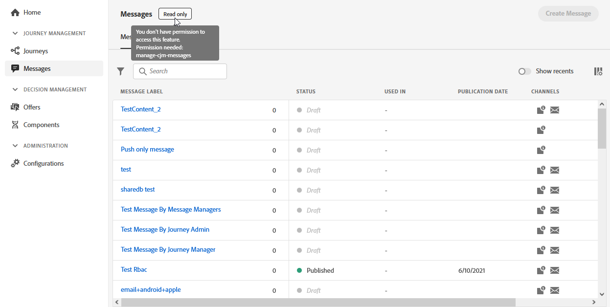
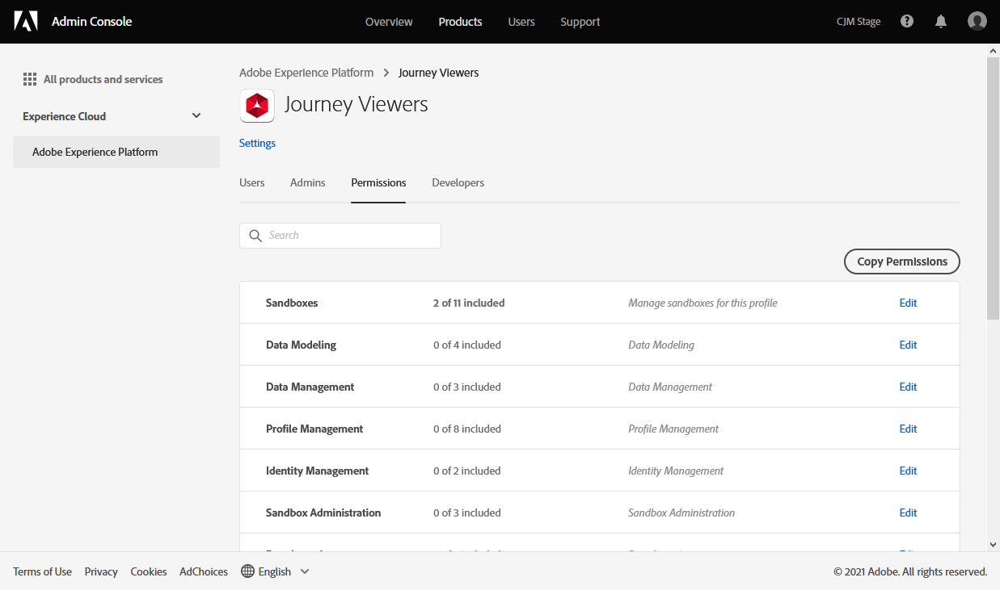
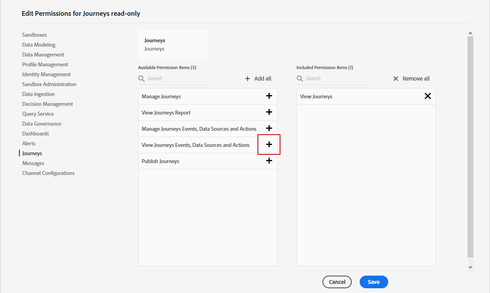

# Administrar usuarios y perfiles de producto {#manage-permissions}

>[!IMPORTANT]
>
> Cada uno de los procedimientos detallados a continuación solo puede llevarse a cabo mediante un **[!UICONTROL Product]** o **[!UICONTROL System]** administrador. Para obtener más información, consulte [Documentación de Admin Console](https://helpx.adobe.com/enterprise/admin-guide.html/enterprise/using/admin-roles.ug.html).

**[!UICONTROL Product profiles]** son conjuntos de usuarios que comparten los mismos permisos y entornos limitados dentro de su organización.

La variable [!DNL Journey Optimizer] El producto le permite seleccionar entre diferentes opciones predeterminadas **[!UICONTROL Product profiles]** con diferentes niveles de permisos para asignar a los usuarios. Para obtener más información sobre **[!UICONTROL Product profiles]**, consulte esta [página](ootb-product-profiles.md).

Cada usuario que pertenece a un **[!UICONTROL Product profiles]** tiene derecho a las aplicaciones y servicios de Adobe contenidos en el producto.

También puede crear su propio **[!UICONTROL Product profiles]** si desea ajustar el acceso de los usuarios a determinadas funcionalidades u objetos de la interfaz.

## Asignación de un perfil de producto {#assigning-product-profile}

Puede optar por asignar una variable predeterminada o personalizada **[!UICONTROL Product profile]** a sus usuarios.

La lista de todos los perfiles de producto listos para usar con permisos asignados se encuentra en la [Perfiles de producto integrados](ootb-product-profiles.md) para obtener más información.

Para asignar una **[!UICONTROL Product profile]**:

1. En el [!DNL Admin Console], en la **[!UICONTROL Products]** , seleccione **[!UICONTROL Experience Cloud - Platform powered applications]** producto.

1. Seleccione un **[!UICONTROL Product profile]**.

   

1. En la pestaña **[!UICONTROL Users]**, haga clic en **[!UICONTROL Add user]**.

   

1. Escriba el nombre o la dirección de correo electrónico del usuario y seleccione el usuario.

   Si el usuario no se ha creado anteriormente en la variable [!DNL Admin Console], consulte [Agregar documentación de usuarios](https://helpx.adobe.com/enterprise/admin-guide.html/enterprise/using/manage-users-individually.ug.html#add-users).

   

1. Siga los mismos pasos que se describen arriba para agregar otros usuarios a su **[!UICONTROL Product profile]**. A continuación, haga clic en **[!UICONTROL Save]**.

El usuario debería recibir entonces un correo electrónico que le redirija a su instancia.

Para obtener más información sobre la administración de usuarios, consulte la [documentación del Admin Console](https://helpx.adobe.com/enterprise/admin-guide.html/enterprise/using/manage-users-individually.ug.html).

Al acceder a la instancia, el usuario verá una vista específica en función de los permisos asignados en la variable **[!UICONTROL Product profile]**. Si el usuario no tiene el acceso correcto a una función, aparecerá la siguiente pantalla.

## Edición de un perfil de producto existente {#edit-product-profile}

Para predeterminados o personalizados **[!UICONTROL Product profiles]**, puede decidir en cualquier momento añadir o eliminar permisos.

En este ejemplo, queremos añadir **[!UICONTROL Permissions]** relacionados con el **[!UICONTROL Message]** capacidad para usuarios asignados al visor de Recorrido **[!UICONTROL Product profile]**. Los usuarios podrán publicar mensajes.

Tenga en cuenta que si modifica un **[!UICONTROL Product profile]**, afectará a todos los usuarios asignados a esta función **[!UICONTROL Product profile]**.

1. En el [!DNL Admin Console], en la **[!UICONTROL Products]** , seleccione **[!UICONTROL Experience Cloud - Platform powered applications]** producto.

1. Seleccione el visor del Recorrido **[!UICONTROL Product profile]**.

1. Seleccione la pestaña **[!UICONTROL Permissions]** .

   La variable **[!UICONTROL Permissions]** muestra la lista de funcionalidades que se aplican a la **[!UICONTROL Experience Cloud - Platform powered applications]** producto.

   

1. Seleccione el **[!UICONTROL Messages]** capacidad.

   

1. En el **[!UICONTROL Available Permission Items]** seleccione los permisos que desea asignar a su **[!UICONTROL Product profile]** haciendo clic en el icono de signo más (+).

   Aquí agregamos la variable **[!UICONTROL Publish messages]** permiso.

   

1. Si es necesario, en **[!UICONTROL Included Permission Items]** haga clic en el icono X para eliminar los permisos del perfil del producto.

1. Cuando termine, haga clic en **[!UICONTROL Save]**.

   

Si es necesario, también puede crear un nuevo perfil de producto con permisos específicos. Para obtener más información, consulte [Creación de un perfil de producto](#create-product-profile).

## Creación de un perfil de producto {#create-product-profile}

[!DNL Journey Optimizer] le permite crear sus propios **[!UICONTROL Product profiles]** y asigne un conjunto de permisos y entornos limitados a los usuarios. con **[!UICONTROL Product profiles]**, puede autorizar o denegar el acceso a determinadas funcionalidades u objetos de la interfaz.

Para obtener más información sobre cómo crear y administrar entornos limitados, consulte [Documentación de Adobe Experience Platform](https://experienceleague.adobe.com/docs/experience-platform/sandbox/ui/user-guide.html?lang=es){target=&quot;_blank&quot;}.

En este ejemplo, crearemos un perfil de producto denominado **Recorridos de solo lectura** donde se otorgarán derechos de solo lectura a la función de Recorrido. Los usuarios solo podrán acceder y ver recorridos y no podrán acceder a otras funciones como **[!UICONTROL Decision management]** o **[!UICONTROL Messages]** en [!DNL Journey Optimizer].

Para crear **Recorridos de solo lectura** **[!UICONTROL product profiles]**:

1. Acceda a la [!DNL Admin Console].

1. En el **[!UICONTROL Products]** , seleccione **[!UICONTROL Experience Cloud - Platform powered applications]** producto.

1. Haga clic en **[!UICONTROL New Profile]**.

   

1. Agregue un **[!UICONTROL Product Profile Name]**, **[!UICONTROL Display Name]** y **[!UICONTROL Description]** para el nuevo **[!UICONTROL product profiles]**.

   

1. En la categoría **[!UICONTROL Notifications]**, elija si se notificará por correo electrónico a los usuarios cuando se agreguen o eliminen de este perfil de productos.

1. Cuando termine, haga clic en **[!UICONTROL Save]** y seleccione el **[!UICONTROL product profiles]**.

1. Para agregar permisos para que los usuarios tengan acceso a diferentes funciones, seleccione la opción **[!UICONTROL Permissions]** pestaña .

1. Seleccione entre las distintas funciones, como **[!UICONTROL Messages]**, **[!UICONTROL Segments]** o **[!UICONTROL Decision management]** disponible en [!DNL Journey Optimizer] en el menú de la izquierda.

   Aquí seleccionamos el **[!UICONTROL Journeys]** capacidad.

   

1. En el **[!UICONTROL Available Permission Items]** seleccione los permisos que desea asignar a su **[!UICONTROL Product profile]** haciendo clic en el icono de signo más (+).

   Aquí seleccionamos **[!UICONTROL View journeys]** y **[!UICONTROL View journeys event, data sources, actions]**.

   

1. Seleccione el **[!UICONTROL Sandbox access]** capacidad para elegir qué simulador de pruebas asignar a su **[!UICONTROL Product profile]**.

   

1. En **[!UICONTROL Available Permissions Items]**, haga clic en el icono de signo más (+) para asignar entornos limitados al perfil. [Obtenga más información sobre los entornos limitados](sandboxes.md).

1. Cuando termine, haga clic en **[!UICONTROL Save]**.

Su **[!UICONTROL Product profile]** ahora se crea y configura. Ahora debe asignarlo a los usuarios.

Para obtener más información sobre la creación y administración de perfiles de producto, consulte la [documentación del Admin Console](https://helpx.adobe.com/enterprise/admin-guide.html/enterprise/using/manage-product-profiles.ug.html).
