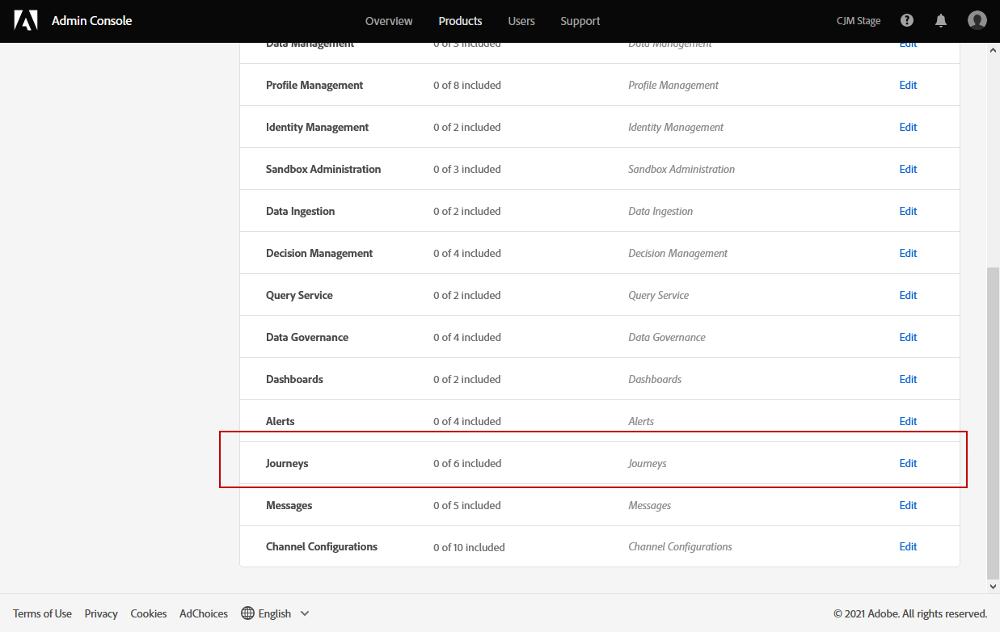

# Administración de usuarios y perfiles de producto {#manage-permissions}

>[!IMPORTANT]
>
> Cada uno de los procedimientos detallados a continuación solo puede ser llevado a cabo por un administrador **[!UICONTROL Product]** o **[!UICONTROL System]**. Para obtener más información, consulte la [Documentación de la consola de administración](https://helpx.adobe.com/enterprise/admin-guide.html/enterprise/using/admin-roles.ug.html).

**[!UICONTROL Product profiles]** son conjuntos de usuarios que comparten los mismos permisos y entornos limitados dentro de su organización.

El producto [!DNL Journey Optimizer] le permite seleccionar entre diferentes **[!UICONTROL Product profiles]** predeterminados con diferentes niveles de permisos para asignar a los usuarios. Para obtener más información sobre el **[!UICONTROL Product profiles]** disponible, consulte esta [página](ootb-product-profiles.md).

Cada usuario que pertenece a un **[!UICONTROL Product profiles]** tiene derecho a las aplicaciones y servicios de Adobe contenidos en el producto.

También puede crear su propio **[!UICONTROL Product profiles]** si desea ajustar el acceso de los usuarios a ciertas funcionalidades u objetos de la interfaz.

## Asignación de un perfil de producto {#assigning-product-profile}

Puede optar por asignar un **[!UICONTROL Product profile]** predeterminado o personalizado a los usuarios.

La lista de todos los perfiles de producto listos para usar con permisos asignados se encuentra en la sección [Perfiles de producto integrados](ootb-product-profiles.md).

Para asignar un **[!UICONTROL Product profile]**:

1. En [!DNL Admin Console], en la pestaña **[!UICONTROL Products]**, seleccione el producto **[!UICONTROL Experience Cloud - Platform powered applications]**.

1. Seleccione un **[!UICONTROL Product profile]**.

   

1. En la pestaña **[!UICONTROL Users]**, haga clic en **[!UICONTROL Add user]**.

   

1. Escriba el nombre o la dirección de correo electrónico del usuario y seleccione el usuario.

   Si el usuario no se ha creado anteriormente en [!DNL Admin Console], consulte la [documentación de Agregar usuarios](https://helpx.adobe.com/enterprise/admin-guide.html/enterprise/using/manage-users-individually.ug.html#add-users).

   

1. Siga los mismos pasos que se describen arriba para agregar otros usuarios a su **[!UICONTROL Product profile]**. A continuación, haga clic en **[!UICONTROL Save]**.

El usuario debe recibir un correo electrónico que le redirija a su instancia .

Para obtener más información sobre la administración de usuarios, consulte la [documentación del Admin Console](https://helpx.adobe.com/enterprise/admin-guide.html/enterprise/using/manage-users-individually.ug.html).

Al acceder a la instancia, el usuario verá una vista específica en función de los permisos asignados en **[!UICONTROL Product profile]**. Si el usuario no tiene el acceso correcto a una función, aparecerá la siguiente pantalla.

## Edición de un perfil de producto existente {#edit-product-profile}

Para los **[!UICONTROL Product profiles]** predeterminados o personalizados, puede decidir en cualquier momento agregar o eliminar permisos.

En este ejemplo, queremos agregar **[!UICONTROL Permissions]** relacionado con la capacidad **[!UICONTROL Message]** para los usuarios asignados al visor de Recorrido **[!UICONTROL Product profile]**. Los usuarios podrán publicar mensajes.

Tenga en cuenta que si modifica un **[!UICONTROL Product profile]** predeterminado o personalizado, tendrá un impacto en todos los usuarios asignados a este **[!UICONTROL Product profile]**.

1. En [!DNL Admin Console], en la pestaña **[!UICONTROL Products]**, seleccione el producto **[!UICONTROL Experience Cloud - Platform powered applications]**.

1. Seleccione el visor de Recorrido **[!UICONTROL Product profile]**.

1. Seleccione la pestaña **[!UICONTROL Permissions]** .

   La pestaña **[!UICONTROL Permissions]** muestra la lista de funcionalidades que se aplican al producto ***[!UICONTROL Experience Cloud - Platform powered applications]**.

   

1. Seleccione la capacidad **[!UICONTROL Messages]**.

   

1. En la lista **[!UICONTROL Available Permission Items]**, seleccione los permisos que desea asignar a su **[!UICONTROL Product profile]** haciendo clic en el icono de signo más (+).

   Aquí, agregamos el permiso **[!UICONTROL Publish messages]**.

   

1. Si es necesario, en **[!UICONTROL Included Permission Items]** haga clic en el icono X para eliminar los permisos del perfil del producto.

1. Cuando termine, haga clic en **[!UICONTROL Save]**.

   

Si es necesario, también puede crear un nuevo perfil de producto con permisos específicos. Para obtener más información, consulte [Creación de un perfil de producto](#create-product-profile).

## Creación de un perfil de producto {#create-product-profile}

[!DNL Journey Optimizer] le permite crear sus propios  **[!UICONTROL Product profiles]** y asignar un conjunto de permisos y entornos limitados a los usuarios. Con **[!UICONTROL Product profiles]**, puede autorizar o denegar el acceso a determinadas funcionalidades u objetos de la interfaz.

Para obtener más información sobre cómo crear y administrar entornos limitados, consulte la documentación de [Adobe Experience Platform](https://experienceleague.adobe.com/docs/experience-platform/sandbox/ui/user-guide.html).

En este ejemplo, crearemos un perfil de producto denominado **Recorrido de solo lectura** donde concederemos derechos de solo lectura a la función de Recorrido. Los usuarios solo podrán acceder y ver recorridos y no podrán acceder a otras funciones como **[!UICONTROL Decision management]** o **[!UICONTROL Messages]** en [!DNL Journey Optimizer].

Para crear nuestros **Recorridos de solo lectura** **[!UICONTROL product profiles]**:

1. Acceda a [!DNL Admin Console].

1. En la pestaña **[!UICONTROL Products]** , seleccione el producto **[!UICONTROL Experience Cloud - Platform powered applications]**.

1. Haga clic en **[!UICONTROL New Profile]**.

   

1. Agregue **[!UICONTROL Product Profile Name]**, **[!UICONTROL Display Name]** y **[!UICONTROL Description]** para su nuevo **[!UICONTROL product profiles]**.

   

1. En la categoría **[!UICONTROL Notifications]**, elija si se notificará por correo electrónico a los usuarios cuando se agreguen o eliminen de este perfil de productos.

1. Cuando termine, haga clic en **[!UICONTROL Save]** y seleccione el **[!UICONTROL product profiles]** recién creado.

1. Para agregar permisos para que los usuarios tengan acceso a diferentes funciones, seleccione la pestaña **[!UICONTROL Permissions]**.

1. Seleccione entre las diferentes funcionalidades, como **[!UICONTROL Messages]**, **[!UICONTROL Segments]** o **[!UICONTROL Decision management]** disponibles en [!DNL Journey Optimizer] que aparecen en el menú de la izquierda.

   Aquí seleccionamos la capacidad **[!UICONTROL Journeys]**.

   

1. En la lista **[!UICONTROL Available Permission Items]**, seleccione los permisos que desea asignar a su **[!UICONTROL Product profile]** haciendo clic en el icono de signo más (+).

   Aquí seleccionamos **[!UICONTROL View journeys]** y **[!UICONTROL View journeys event, data sources, actions]**.

   

1. Seleccione la capacidad **[!UICONTROL Sandbox access]** para elegir qué simulador de pruebas desea asignar a su **[!UICONTROL Product profile]**.

   

1. En **[!UICONTROL Available Permissions Items]**, haga clic en el icono de signo más (+) para asignar entornos limitados al perfil. [Obtenga más información sobre los entornos limitados](https://experienceleague.adobe.com/docs/experience-platform/sandbox/home.html).

1. Cuando termine, haga clic en **[!UICONTROL Save]**.

El **[!UICONTROL Product profile]** se ha creado y configurado. Ahora debe asignarlo a los usuarios.

Para obtener más información sobre la creación y administración de perfiles de producto, consulte la [documentación del Admin Console](https://helpx.adobe.com/enterprise/admin-guide.html/enterprise/using/manage-product-profiles.ug.html).
