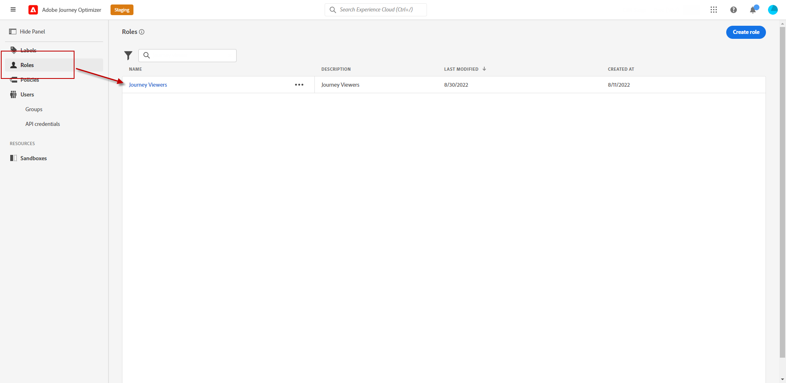

# Administrar usuarios y perfiles de producto {#manage-permissions}

>[!IMPORTANT]
>
> Cada uno de los procedimientos detallados a continuación solo puede llevarse a cabo mediante un **[!UICONTROL Product]** o **[!UICONTROL Sistema]** administrador. Para obtener más información, consulte [Documentación de Admin Console](https://helpx.adobe.com/enterprise/admin-guide.html/enterprise/using/admin-roles.ug.html).

**[!UICONTROL Perfiles de producto]** son conjuntos de usuarios que comparten los mismos permisos y entornos limitados dentro de su organización.

La variable [!DNL Journey Optimizer] El producto le permite seleccionar entre diferentes opciones predeterminadas **[!UICONTROL Perfiles de producto]** con diferentes niveles de permisos para asignar a los usuarios. Para obtener más información sobre **[!UICONTROL Perfiles de producto]**, consulte esta [página](ootb-product-profiles.md).

Cada usuario que pertenece a un **[!UICONTROL Perfiles de producto]** tiene derecho a las aplicaciones y servicios de Adobe contenidos en el producto.

También puede crear su propio **[!UICONTROL Perfiles de producto]** si desea ajustar el acceso de los usuarios a determinadas funcionalidades u objetos de la interfaz.

## Asignación de un perfil de producto {#assigning-product-profile}

Puede optar por asignar una variable predeterminada o personalizada **[!UICONTROL Perfil del producto]** a sus usuarios.

La lista de todos los perfiles de producto listos para usar con permisos asignados se encuentra en la [Perfiles de producto integrados](ootb-product-profiles.md) para obtener más información.

Para asignar una **[!UICONTROL Perfil del producto]**:

1. En el [!DNL Admin Console], en la **[!UICONTROL Productos]** , seleccione **[!UICONTROL Experience Cloud: aplicaciones con tecnología de plataforma]** producto.

1. Seleccione un **[!UICONTROL Perfil del producto]**.

   

1. En el **[!UICONTROL Usuarios]** , haga clic en **[!UICONTROL Agregar usuario]**.

   

1. Escriba el nombre o la dirección de correo electrónico del usuario y seleccione el usuario.

   Si el usuario no se ha creado anteriormente en la variable [!DNL Admin Console], consulte [Agregar documentación de usuarios](https://helpx.adobe.com/enterprise/admin-guide.html/enterprise/using/manage-users-individually.ug.html#add-users).

   

1. Siga los mismos pasos que se describen arriba para agregar otros usuarios a su **[!UICONTROL Perfil del producto]**. A continuación, haga clic en **[!UICONTROL Guardar]**.

El usuario debería recibir entonces un correo electrónico que le redirija a su instancia.

Para obtener más información sobre la administración de usuarios, consulte la [documentación del Admin Console](https://helpx.adobe.com/enterprise/admin-guide.html/enterprise/using/manage-users-individually.ug.html).

Al acceder a la instancia, el usuario verá una vista específica en función de los permisos asignados en la variable **[!UICONTROL Perfil del producto]**. Si el usuario no tiene el acceso correcto a una función, aparecerá el siguiente mensaje:

`You don't have permission to access this feature. Permission needed: XX.`

## Edición de un perfil de producto existente {#edit-product-profile}

Para predeterminados o personalizados **[!UICONTROL Perfiles de producto]**, puede decidir en cualquier momento añadir o eliminar permisos.

En este ejemplo, queremos añadir **[!UICONTROL Permisos]** relacionados con el **[!UICONTROL Recorridos]** capacidad para usuarios asignados al visor de Recorrido **[!UICONTROL Perfil del producto]**. Los usuarios podrán publicar recorridos.

Tenga en cuenta que si modifica un **[!UICONTROL Perfil del producto]**, afectará a todos los usuarios asignados a esta función **[!UICONTROL Perfil del producto]**.

1. En el [!DNL Admin Console], en la **[!UICONTROL Productos]** , seleccione **[!UICONTROL Experience Cloud: aplicaciones con tecnología de plataforma]** producto.

1. Seleccione el visor del Recorrido **[!UICONTROL Perfil del producto]**.

1. Seleccione la pestaña **[!UICONTROL Permisos.]**

   La variable **[!UICONTROL Permisos]** muestra la lista de funcionalidades que se aplican a la **[!UICONTROL Experience Cloud: aplicaciones con tecnología de plataforma]** producto.

   

1. Seleccione el **[!UICONTROL Recorridos]** capacidad.

   

1. En el **[!UICONTROL Elementos de permiso disponibles]** seleccione los permisos que desea asignar a su **[!UICONTROL Perfil del producto]** haciendo clic en el icono de signo más (+).

   Aquí agregamos la variable **[!UICONTROL Publicar Recorridos]** permiso.

1. Si es necesario, en **[!UICONTROL Elementos de permiso incluidos]**, haga clic en el icono X situado junto a para eliminar los permisos del perfil del producto.

1. Cuando termine, haga clic en **[!UICONTROL Guardar]**.

Si es necesario, también puede crear un nuevo perfil de producto con permisos específicos. Para obtener más información, consulte [Creación de un perfil de producto](#create-product-profile).

## Creación de un perfil de producto {#create-product-profile}

[!DNL Journey Optimizer] le permite crear sus propios **[!UICONTROL Perfiles de producto]** y asigne un conjunto de permisos y entornos limitados a los usuarios. con **[!UICONTROL Perfiles de producto]**, puede autorizar o denegar el acceso a determinadas funcionalidades u objetos de la interfaz.

Para obtener más información sobre cómo crear y administrar entornos limitados, consulte [Documentación de Adobe Experience Platform](https://experienceleague.adobe.com/docs/experience-platform/sandbox/ui/user-guide.html?lang=es){target=&quot;_blank&quot;}.

En este ejemplo, crearemos un perfil de producto denominado **Recorridos de solo lectura** donde se otorgarán derechos de solo lectura a la función de Recorrido. Los usuarios solo podrán acceder y ver recorridos y no podrán acceder a otras funciones como **[!DNL  Decision management]** en [!DNL Journey Optimizer].

Para crear **Recorridos de solo lectura** **[!UICONTROL perfiles de producto]**:

1. Acceda a la [!DNL Admin Console].

1. En el **[!UICONTROL Productos]** , seleccione **[!UICONTROL Experience Cloud: aplicaciones con tecnología de plataforma]** producto.

1. Haga clic en **[!UICONTROL Nuevo perfil]**.

   

1. Agregue un **[!UICONTROL Nombre del perfil de producto]**, **[!UICONTROL Nombre para mostrar]** y **[!UICONTROL Descripción]** para el nuevo **[!UICONTROL perfiles de producto]**.

   

1. En el **[!UICONTROL Notificaciones]** , elija si se notificará por correo electrónico a los usuarios cuando se agreguen o eliminen de este perfil de producto.

1. Cuando termine, haga clic en **[!UICONTROL Guardar]** y seleccione el **[!UICONTROL perfiles de producto]**.

1. Para agregar permisos para que los usuarios tengan acceso a diferentes funciones, seleccione la opción **[!UICONTROL Permisos]** pestaña .

1. Seleccione entre las distintas funciones, como **[!DNL Journeys]**, **[!DNL Segments]** o **[!DNL Decision management]** disponible en [!DNL Journey Optimizer] en el menú de la izquierda.

   Aquí seleccionamos el **[!UICONTROL Recorridos]** capacidad.

   

1. En el **[!UICONTROL Elementos de permiso disponibles]** seleccione los permisos que desea asignar a su **[!UICONTROL Perfil del producto]** haciendo clic en el icono de signo más (+).

   Aquí seleccionamos **[!DNL View journeys]** y **[!DNL View journeys event, data sources, actions]**.

   

1. Seleccione el **[!UICONTROL Acceso a Simulador para pruebas]** capacidad para elegir qué simulador de pruebas asignar a su **[!UICONTROL Perfil del producto]**.

   

1. En **[!UICONTROL Elementos de permisos disponibles]**, haga clic en el icono de signo más (+) para asignar entornos limitados al perfil. [Obtenga más información sobre los entornos limitados](sandboxes.md).

1. Cuando termine, haga clic en **[!UICONTROL Guardar]**.

Su **[!UICONTROL Perfil del producto]** ahora se crea y configura. Ahora debe asignarlo a los usuarios.

Para obtener más información sobre la creación y administración de perfiles de producto, consulte la [documentación del Admin Console](https://helpx.adobe.com/enterprise/admin-guide.html/enterprise/using/manage-product-profiles.ug.html).
