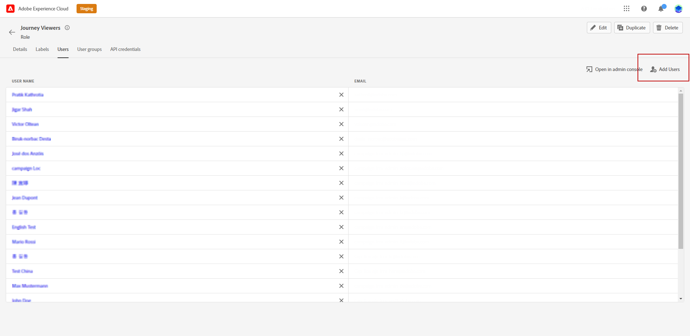

# Administración de usuarios y funciones {#manage-permissions}

**[!UICONTROL Los roles]** hacen referencia a una colección de usuarios que comparten los mismos permisos y zonas protegidas. Estas funciones le permiten administrar fácilmente el acceso y los permisos para diferentes grupos de usuarios dentro de su organización.

Con el producto [!DNL Journey Optimizer], puede elegir entre una serie de **[!UICONTROL roles]** preexistentes, cada uno con diferentes niveles de permisos, para asignarlos a los usuarios. Para obtener más información sobre los **[!UICONTROL roles]** disponibles, consulte esta [página](ootb-product-profiles.md).

Cuando un usuario pertenece a un **[!UICONTROL Rol]**, obtiene acceso a las aplicaciones y los servicios de Adobe contenidos en el producto.

Si las funciones preexistentes no satisfacen las necesidades específicas de su organización, también puede crear **[!UICONTROL funciones]** personalizadas para ajustar el acceso a ciertas funcionalidades u objetos de la interfaz. De este modo, se asegura de que cada usuario tenga acceso únicamente a los recursos y las herramientas que necesita para realizar sus tareas de forma eficaz.

>[!IMPORTANT]
>
>Los pasos y procedimientos detallados a continuación solamente los puede realizar un administrador de **[!UICONTROL Product]** o **[!UICONTROL System]**.

## Asignar un rol {#assigning-role}

Puede asignar una **[!UICONTROL función]** predeterminada o personalizada a los usuarios.

La lista de todas las funciones predeterminadas con permisos asignados está disponible en la sección [Funciones integradas](ootb-product-profiles.md).

Para asignar un **[!UICONTROL rol]**:

1. Para asignar una función a un usuario en el producto [!DNL Permissions], vaya a la pestaña **[!UICONTROL Funciones]** y seleccione la función que desee.

   

1. En la pestaña **[!UICONTROL Usuarios]**, haga clic en **[!UICONTROL Añadir usuario]**.

   

1. Escriba el nombre o la dirección de correo electrónico del usuario o selecciónelo en la lista y haga clic en **[!UICONTROL Guardar]**.

   Si el usuario no se creó anteriormente en [!DNL Admin Console], consulte la [Documentación para agregar usuarios](https://experienceleague.adobe.com/docs/experience-platform/access-control/ui/users.html?lang=es){target="_blank"}.

   

El usuario recibe un correo electrónico que lo redirige a su instancia.

Para obtener más información sobre la administración de usuarios, consulte la [documentación de control de acceso](https://experienceleague.adobe.com/docs/experience-platform/access-control/home.html?lang=es){target="_blank"}.

Al acceder a la instancia, el usuario ve una vista específica según los permisos asignados en la **[!UICONTROL función]**. Si el usuario no tiene el acceso correcto a una función, aparece el siguiente mensaje:

`You don't have permission to access this feature. Permission needed: XX.`

## Editar una función existente {#edit-product-profile}

Para los **[!UICONTROL roles]** integrados o personalizados, puede decidir en cualquier momento agregar o eliminar permisos.

En el ejemplo siguiente, queremos agregar **[!UICONTROL Permisos]** relacionados con el recurso **[!UICONTROL Recorridos]** para los usuarios asignados al visor de Recorrido **[!UICONTROL Rol]**. Los usuarios podrán entonces publicar recorridos.

>[!IMPORTANT]
>
>Los cambios realizados en una función integrada o personalizada afectarán a todos los usuarios asignados a esa función.

1. Para editar un rol en el producto [!DNL Permissions], vaya a la pestaña **[!UICONTROL Roles]** y seleccione el rol que desee, aquí el visualizador de Recorrido **[!UICONTROL Rol]**.
   

1. En el panel **[!UICONTROL Rol]**, haga clic en **[!UICONTROL Editar]**.

   

1. El menú **[!UICONTROL Recursos]** muestra la lista de recursos que se aplican al producto **[!UICONTROL Experience Cloud - Aplicaciones con plataforma]**. Arrastre y suelte los recursos para asignar permisos.

   Del menú desplegable de recursos **[!UICONTROL Recorridos]**, elegimos aquí el recorrido de publicación **[!UICONTROL Permiso]**.

   

1. Si es necesario, en **[!UICONTROL Elementos de permisos incluidos]**, haga clic en el icono X para quitar permisos o recursos de la función.

1. Cuando termine, haga clic en **[!UICONTROL Guardar]**.

Si es necesario, también puede crear una función nueva con permisos específicos.

## Crear una nueva función {#create-product-profile}

[!DNL Journey Optimizer] le permite crear sus propios **[!UICONTROL roles]** y asignar un conjunto de permisos y zonas protegidas a los usuarios. Con **[!UICONTROL Roles]**, puede autorizar o denegar el acceso a determinadas funcionalidades u objetos de la interfaz.

Para obtener más información sobre cómo crear y administrar zonas protegidas, consulte la documentación de [Adobe Experience Platform](https://experienceleague.adobe.com/docs/experience-platform/sandbox/ui/user-guide.html?lang=es){target="_blank"}.

En este ejemplo, creamos una función denominada **Recorridos de solo lectura**, donde concedemos derechos de solo lectura a la función de Recorrido. Los usuarios solamente podrán acceder y ver recorridos y no podrán acceder a otras características como **[!DNL Decision management]** en [!DNL Journey Optimizer].

Para crear nuestros **Recorridos de solo lectura** **[!UICONTROL Rol]**:

1. Para asignar una función a un usuario en el producto [!DNL Permissions], vaya a la pestaña **[!UICONTROL Funciones]** y haga clic en **[!UICONTROL Crear función]**.

   

1. Agregue un **[!UICONTROL Nombre]** y **[!UICONTROL Descripción]** para su nuevo **[!UICONTROL Rol]**. A continuación, haga clic en **[!UICONTROL Confirmar]**.

   

1. En la lista desplegable de recursos de **[!UICONTROL espacio aislado]**, elija qué espacio aislado asignar a su **[!UICONTROL rol]**. [Obtenga más información sobre las zonas protegidas](sandboxes.md).

   

1. Seleccione entre los diferentes recursos como **[!DNL Journeys]**, **[!DNL Segments]** o **[!DNL Decision management]** disponibles en [!DNL Journey Optimizer] que se muestran en el menú de la izquierda.

   Aquí seleccionamos el recurso **[!UICONTROL Recorridos]**.

   

1. En la lista desplegable **[!UICONTROL Recorridos]**, seleccione los permisos que desea asignar a su **[!UICONTROL rol]**.

   Aquí seleccionamos **[!DNL View journeys]**, **[!DNL View journeys report]** y **[!DNL View journeys event, data sources, actions]**.

   

1. Cuando termine, haga clic en **[!UICONTROL Guardar]**.

Su **[!UICONTROL función]** se ha creado y configurado. Ahora debe asignarlo a los usuarios.

Para obtener más información sobre la creación y administración de funciones, consulte la [documentación de Adobe Admin Console](https://experienceleague.adobe.com/docs/experience-platform/access-control/abac/permissions-ui/roles.html?lang=es){target="_blank"}.
