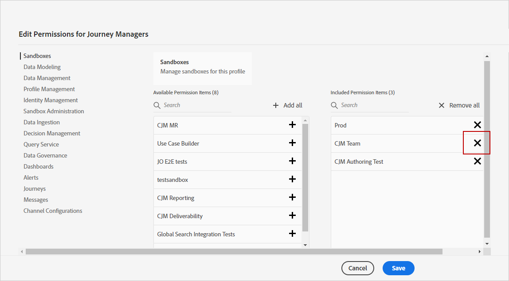

# Uso y asignación de zonas protegidas {#sandboxes}

>[!BEGINSHADEBOX]

**En esta página:** Use y asigne zonas protegidas para particionar la instancia de Adobe Journey Optimizer en entornos aislados, de modo que pueda desarrollar, probar y ejecutar en la producción sin afectar a otro trabajo.

>[!ENDSHADEBOX]

**Las zonas protegidas** son entornos virtuales que dividen la instancia de Adobe Journey Optimizer en espacios de trabajo independientes y aislados para fines de desarrollo, prueba o producción. Encontrará administración de zonas protegidas en **Administración** > **Canales** > **Conecte sus sistemas y entornos** (o a través del conmutador de zonas protegidas en la parte superior derecha de la interfaz). Las zonas protegidas le ayudan a experimentar con seguridad, asignar diferentes accesos por función y mantener el contenido organizado. Esta página explica cómo usar y asignar zonas protegidas, cómo configurar el acceso al contenido y, en el artículo [Exportar objetos a otra zona protegida](../configuration/copy-objects-to-sandbox.md), cómo copiar recorridos y plantillas entre zonas protegidas.

## Usar zonas protegidas {#using-sandbox}

[!DNL Journey Optimizer] le permite particionar su instancia en entornos virtuales independientes llamados zonas protegidas. Las zonas protegidas se asignan mediante funciones en Permisos. [Aprenda a asignar zonas protegidas](permissions.md#create-product-profile).

[!DNL Journey Optimizer] refleja los entornos limitados de Adobe Experience Platform creados para una organización determinada. Las zonas protegidas de Adobe Experience Platform se pueden crear o restablecer desde la instancia de Adobe Experience Platform. [Obtenga más información en la Guía del usuario de zonas protegidas](https://experienceleague.adobe.com/docs/experience-platform/sandbox/ui/user-guide.html?lang=es){target="_blank"}.

Puede encontrar el control del conmutador de simulador de pruebas en la parte superior derecha de la pantalla, junto al nombre de la organización. Para cambiar de una zona protegida a otra, haga clic en la zona protegida activa y seleccione otra zona protegida en la lista desplegable.

➡️ [Obtenga más información acerca de las zonas protegidas en este vídeo](#video)

## Asignar zonas protegidas {#assign-sandboxes}

>[!IMPORTANT]
>
> Solo un administrador de **[!UICONTROL Product]** o **[!UICONTROL System]** puede llevar a cabo la administración de la zona protegida.

Puede elegir asignar diferentes zonas protegidas a **[!UICONTROL roles]** predeterminados o personalizados.

Para asignar zonas protegidas:

1. En [!DNL Permissions], en la ficha **[!UICONTROL Roles]**, seleccione un **[!UICONTROL Rol]**.

   

1. Haga clic en **[!UICONTROL Edit]**.

1. En la lista desplegable de recursos **[!UICONTROL Zonas protegidas]**, seleccione la zona protegida que se asignará a su función.

   

1. Si es necesario, haga clic en el icono X que hay junto a él para quitar el acceso a la zona protegida de su **[!UICONTROL función]**.

   

1. Haga clic en **[!UICONTROL Guardar]**.

## Acceso al contenido {#content-access}

Para configurar la accesibilidad del contenido, asigne una carpeta compartida de contenido a cada uno de los entornos limitados. Puede crear y configurar carpetas compartidas en la ficha **[!UICONTROL Almacenamiento]** que se muestra en [!DNL Admin Console] para los administradores. Si tiene acceso a [!DNL Admin Console] como administrador del sistema, puede crear carpetas compartidas y agregar delegados con diferentes niveles de acceso a las carpetas compartidas.

Tenga en cuenta que para que el contenido se sincronice con la zona protegida correcta, debe seguir la misma sintaxis que esta. Por ejemplo, si la zona protegida se llama &quot;desarrollo&quot;, la carpeta compartida debe tener el mismo nombre.

[Obtenga información sobre cómo administrar carpetas](https://helpx.adobe.com/es/enterprise/admin-guide.html/enterprise/using/manage-adobe-storage.ug.html){target="_blank"} compartidas.

## Vídeo práctico{#video}

Comprenda qué son las zonas protegidas y cómo distinguir entre las zonas protegidas de desarrollo y producción. Obtenga información sobre cómo crear, restablecer y eliminar zonas protegidas.

>[!VIDEO](https://video.tv.adobe.com/v/334355?quality=12)

+++ Referencia de conocimientos de AI

Esta sección contiene conocimientos estructurados destinados a apoyar la interpretación, la recuperación y la respuesta a preguntas relacionadas con este tema.

Para una comprensión completa, esta información debe combinarse con la documentación de esta página. Ninguna de las fuentes pretende ser independiente; la página describe la función, mientras que esta sección proporciona contexto adicional que ayuda a desambiguar la terminología, la intención, la aplicabilidad y las restricciones.

- **TL;DR:** Las zonas protegidas dividen la instancia de Journey Optimizer en espacios de trabajo virtuales aislados para desarrollo, pruebas y producción; se asignan a usuarios mediante funciones en el producto Permisos y el acceso al contenido se configura mediante carpetas compartidas en Admin Console.

**Intenciones:**

- Cambiar entre zonas protegidas en la interfaz de Journey Optimizer mediante el conmutador de zonas protegidas
- Asigne una o más zonas protegidas a una función en el producto Permisos
- Eliminar el acceso a la zona protegida de una función
- Configuración del acceso al contenido (carpetas compartidas) para una zona protegida
- Comprender cómo se relacionan los entornos limitados con las funciones y los permisos

**Glosario:**

- **Espacio aislado**: Un entorno virtual que particiona la instancia de Journey Optimizer en espacios de trabajo independientes y aislados para el uso de desarrollo, pruebas o producción *(específico del producto)*
- **Conmutador de espacio aislado**: El control situado en la parte superior derecha de la interfaz de Journey Optimizer, junto al nombre de la organización, se usa para cambiar entre los espacios aislados *(específicos del producto)*
- **Carpeta compartida**: Una carpeta de almacenamiento configurada en Admin Console para una zona protegida que habilita el acceso al contenido; su nombre debe coincidir con el nombre de la zona protegida para que el contenido se sincronice correctamente *(específico del producto)*

**Protecciones:**

- La administración de la zona protegida solo la puede realizar un administrador de productos o sistemas (requisito previo difícil, como se indica en la nota importante de la página)
- Los nombres de las carpetas compartidas deben seguir la misma sintaxis que el nombre de la zona protegida para que el contenido se sincronice con la zona protegida correcta (como se indica en la página)

**Terminología:**

- No confunda: &quot;Uso de una zona protegida&quot; (cambio a ella en la interfaz de usuario mediante el conmutador de zonas protegidas) ≠ &quot;Asignación de una zona protegida&quot; (adición de una zona protegida a una función del producto Permisos) ≠ &quot;Creación de una zona protegida&quot; (realizada en Adobe Experience Platform, no en Journey Optimizer).
- Sinónimos: &quot;sandbox&quot; = &quot;entorno virtual&quot; en el contexto de esta página
- No confunda: &quot;Asignar zonas protegidas&quot; (agregar zonas protegidas a una función en Permisos) ≠ &quot;Administrar zonas protegidas&quot; (crear, restablecer o eliminar zonas protegidas, hecho en Adobe Experience Platform)

**PREGUNTAS MÁS FRECUENTES:**

- **Q: ¿Cómo puedo cambiar entre zonas protegidas en Journey Optimizer?** : utilice el conmutador de zona protegida en la parte superior derecha de la pantalla, junto al nombre de su organización; haga clic en la zona protegida activa y seleccione otra en la lista desplegable.
- **Q: ¿Quién puede asignar entornos limitados a los roles?** — Solo los administradores de productos o sistemas.
- **Q: ¿Cómo se ponen a disposición de los usuarios las zonas protegidas?** — Las zonas protegidas se asignan mediante funciones en el producto Permisos.
- **Q: ¿Qué convención de nombres deben seguir las carpetas compartidas?** : la carpeta compartida debe tener el mismo nombre que la zona protegida a la que está asociada (por ejemplo, si la zona protegida se llama &quot;desarrollo&quot;, la carpeta compartida también debe llamarse &quot;desarrollo&quot;).

+++
<!-- ai-accordion-version: 1 | source-hash: 0a5ada9b -->