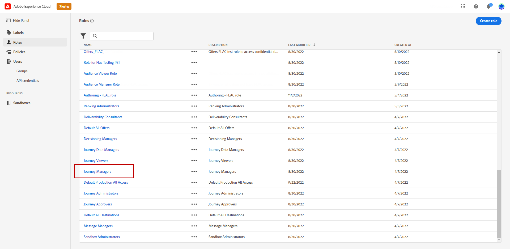

# Administración de zonas protegidas {#sandboxes}

## Usar entornos limitados {#using-sandbox}

[!DNL Journey Optimizer] le permite particionar la instancia en entornos virtuales separados, llamados entornos limitados.
Los entornos limitados para pruebas se asignan mediante perfiles de producto en la Admin Console. [Aprenda a asignar entornos limitados](permissions.md#create-product-profile).

[!DNL Journey Optimizer] refleja los entornos limitados de Adobe Experience Platform creados para una organización determinada.
Los entornos limitados de Adobe Experience Platform se pueden crear o restablecer desde la instancia de Adobe Experience Platform. [Obtenga más información en la guía del usuario de Sandbox](https://experienceleague.adobe.com/docs/experience-platform/sandbox/ui/user-guide.html?lang=es){target=&quot;_blank&quot;}.

Puede encontrar el control del conmutador de simulador de pruebas en la parte superior derecha de la pantalla junto al nombre de la organización. Para cambiar de un simulador de pruebas a otro, haga clic en el simulador de pruebas activo y seleccione otro simulador de pruebas en la lista desplegable.

➡️ [Obtenga más información sobre los entornos limitados en este vídeo](#video)

## Asignar entornos limitados {#assign-sandboxes}

>[!IMPORTANT]
>
> La administración de entornos limitados solo se puede realizar mediante una **[!UICONTROL Product]** o **[!UICONTROL Sistema]** administrador. Para obtener más información, consulte [Documentación de Admin Console](https://helpx.adobe.com/enterprise/admin-guide.html/enterprise/using/admin-roles.ug.html){target=&quot;_blank&quot;}.

Puede optar por asignar diferentes entornos limitados a la configuración predeterminada o personalizada **[!UICONTROL Perfiles de producto]**.

Para asignar entornos limitados:

1. En el [!DNL Admin Console], en la **[!UICONTROL Productos]** , seleccione **[!UICONTROL Aplicaciones de Adobe Experience Platform]** producto.

1. Seleccione un **[!UICONTROL Perfil del producto]**.

   

1. Seleccione la pestaña **[!UICONTROL Permisos.]**

1. Seleccione el **[!UICONTROL Sandboxes]** capacidad.

   

1. En **[!UICONTROL Elementos de permisos disponibles]**, haga clic en el icono de signo más (+) para asignar entornos limitados al perfil. [Más información sobre los entornos limitados](https://experienceleague.adobe.com/docs/experience-platform/sandbox/home.html?lang=es){target=&quot;_blank&quot;}.

   

1. Si es necesario, en **[!UICONTROL Elementos de permiso incluidos]**, haga clic en el icono X situado junto a para eliminar los entornos limitados de acceso a su **[!UICONTROL Perfil del producto]**.

   

1. Haga clic en **[!UICONTROL Guardar]**.

## Acceso al contenido {#content-access}

Para configurar la accesibilidad del contenido, debe asignar una carpeta compartida de contenido a cada uno de los entornos limitados. Puede crear y configurar la carpeta compartida en **[!UICONTROL Almacenamiento]** se muestra en la pestaña [!DNL Admin Console] para administradores. Si tiene acceso a [!DNL Admin Console] como administrador del sistema, puede crear carpetas compartidas y añadir delegados con un nivel de acceso diferente a las carpetas compartidas.

Tenga en cuenta que para que el contenido se sincronice con el entorno limitado correcto, debe seguir la misma sintaxis que este; por ejemplo, si el entorno limitado se llama desarrollo, la carpeta compartida debe tener el mismo nombre.

[Obtenga información sobre cómo administrar carpetas compartidas](https://helpx.adobe.com/enterprise/admin-guide.html/enterprise/using/manage-adobe-storage.ug.html){target=&quot;_blank&quot;}.

## Vídeo explicativo{#video}

Comprenda qué son los espacios aislados y cómo distinguir entre los espacios aislados de desarrollo y producción. Obtenga información sobre cómo crear, restablecer y eliminar espacios aislados.

>[!VIDEO](https://video.tv.adobe.com/v/334355?quality=12)
