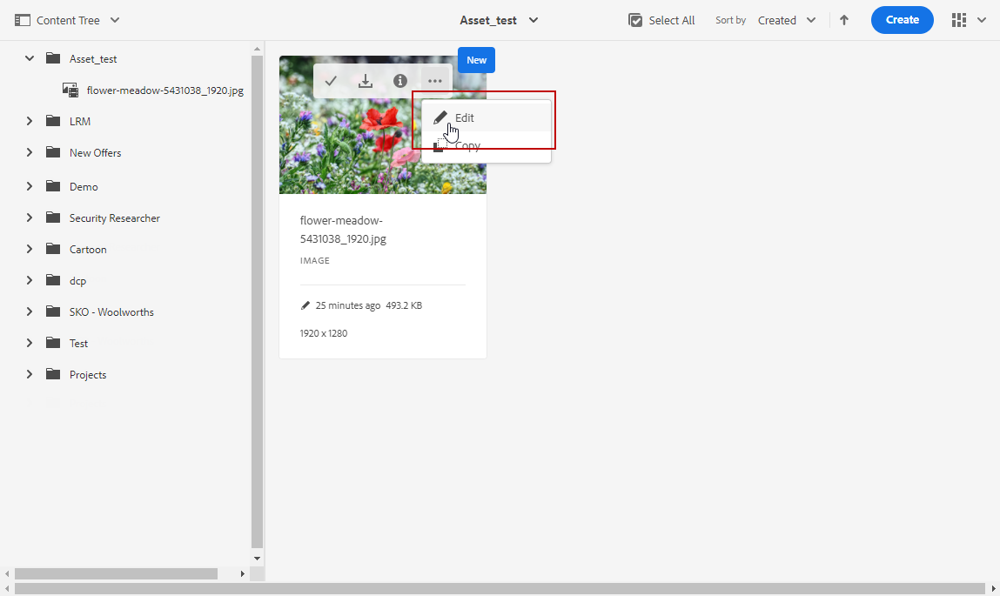

# Utilice [!DNL Adobe Experience Manager Assets Essentials]{#experience-manager-assets}

## Introducción a [!DNL Assets Essentials] {#get-started-assets-essentials}

[!DNL Adobe Experience Manager Assets Essentials] proporciona un único repositorio centralizado de recursos que puede utilizar para rellenar los mensajes. Se puede acceder directamente desde [!DNL Adobe Journey Optimizer] a través de la sección **[!UICONTROL Assets]**. También puede acceder a los recursos y las carpetas al diseñar un contenido de correo electrónico. [Obtenga más información sobre el diseño](design-emails.md) de correo electrónico.

Necesita permisos específicos para acceder a [!DNL Adobe Experience Manager Assets Essentials]. [Obtenga más información sobre los permisos para Adobe Experience Manager Assets Essentials](permissions.md#assets-permissions).

## Cargar recursos{#add-asset}

Para cargar archivos en el [!DNL Assets Essentials], primero debe buscar o crear la carpeta en la que se almacenará:

1. En la página de inicio de [!DNL Adobe Journey Optimizer], seleccione la pestaña **[!UICONTROL Assets]** para acceder a [!DNL Assets Essentials].

   

1. Haga doble clic en una carpeta de la sección central o de la vista de árbol para abrirla.

   También puede hacer clic en **[!UICONTROL Create folder]** para crear una carpeta nueva.

   

1. Una vez en la carpeta seleccionada o creada, haga clic en **[!UICONTROL Add Assets]** para cargar el nuevo recurso a la carpeta.

   

1. En **[!UICONTROL Upload files]**, haga clic en **[!UICONTROL Browse]** y elija si desea **[!UICONTROL Browse files]** o **[!UICONTROL Browse folders]**.

   

1. Seleccione el archivo que desea cargar. Cuando termine, haga clic en **[!UICONTROL Upload]**.

1. Una vez cargado el recurso, puede administrarlo mediante las diferentes opciones detalladas en esta [sección](#manage-asset). El recurso también se puede seguir editando con el modo **Edit** de [!DNL Assets Essentials]. Para obtener más información, consulte esta [página](#edit-assets).

   

## Administrar recursos{#manage-asset}

Puede administrar los recursos disponibles en [!DNL Adobe Experience Manager Assets Essentials]. Haga clic en el recurso para acceder a más opciones.

Las siguientes acciones están disponibles en la barra de herramientas:

* **[!UICONTROL Details]** para acceder a más detalles sobre los recursos.
* **[!UICONTROL Download]** para iniciar la descarga local directa.
* **[!UICONTROL Delete]** para quitar el recurso de  [!DNL Assets Essentials].
* **[!UICONTROL Copy]** para copiar/pegar el recurso en otra carpeta.
* **[!UICONTROL Move]** para mover el recurso a otras carpetas.

## Insertar recursos en mensajes {#use-assets}

Puede insertar recursos en uno de los mensajes a través del Diseñador de correo electrónico. [Obtenga más información sobre el diseño](design-emails.md) de correo electrónico.

Para insertar un recurso desde [!DNL Adobe Experience Manager Assets Essentials]:

1. En el Diseñador de correo electrónico, seleccione **[!UICONTROL Asset picker]** en el panel izquierdo.

   

1. Seleccione la carpeta de recursos. También puede buscar el recurso o la carpeta en la barra de búsqueda.

1. Arrastre y suelte el recurso en un **[!UICONTROL Structure component]**.

   

Puede personalizar aún más los recursos, como agregar un vínculo externo o un texto con **[!UICONTROL Components settings]**. [Obtenga más información sobre la configuración de componentes](content-components.md)

<!--

## Edit and modify assets {#edit-assets}

Your assets can be edited through the **[!UICONTROL Edit mode]** in [!DNL Assets Essentials]. Through this mode, you can crop, resize and rotate your asset. Click the **[!UICONTROL Edit]** button to access the editing mode of your asset.

Following actions are available in the toolbar:

* **[!UICONTROL Start crop]** to focus on only the content you want in your asset.
* **[!UICONTROL Rotate left]** to rotate your asset counter-clockwise by 90 degrees.
* **[!UICONTROL Rotate right]** to rotate your asset clockwise by 90 degrees.
* **[!UICONTROL Flip vertically]** to vertically mirror your asset.
* **[!UICONTROL Flip horizontally]** to horizontally mirror your asset.
* **[!UICONTROL Launch map]** to insert an image map. For more on this, refer to the [Add image maps](https://experienceleague.adobe.com/docs/experience-manager-65/assets/using/image-maps.html?lang=en#using) documentation.

## Share assets {#share-assets}

When using the Media library, each asset is saved in folders or sub-folders. You can choose to share your folders and which level of access to assign.

For more information on how to share access to your folders, refer to this [page](permissions.md#assets-permissions).

-->
