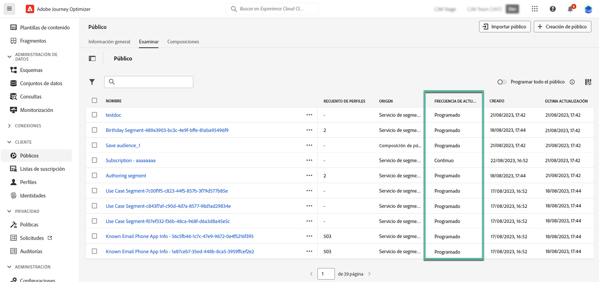

# Introducción a los públicos de Adobe Experience Platform {#about-segments}

>[!CONTEXTUALHELP]
>id="ajo_campaigns_content_experiment_segment"
>title="Público"
>abstract="Al aprovechar los datos del perfil del cliente en tiempo real, Adobe Experience Platform permite generar fácilmente definiciones de segmentos para crear públicos destinatarios que reflejen los comportamientos y preferencias únicas de sus clientes."

>[!CONTEXTUALHELP]
>id="ajo_campaigns_audience"
>title="Selección del público de la campaña"
>abstract="Esta lista muestra todos los públicos de Adobe Experience Platform disponibles. Seleccione el público al que se dirige la campaña. El mensaje configurado en la campaña se envía a todas las personas que pertenecen al público seleccionado. [Más información sobre los públicos](../audience/about-audiences.md)"

Una audiencia es un conjunto de personas que comparten comportamientos o características similares. Obtenga más información acerca de las audiencias en la [documentación del servicio de segmentación de Adobe Experience Platform](https://experienceleague.adobe.com/docs/experience-platform/segmentation/home.html?lang=es){target="_blank"}.

[!DNL Journey Optimizer] le permite generar audiencias de Adobe Experience Platform directamente desde el menú **[!UICONTROL Audiencias]**, y aprovecharlas en sus recorridos o campañas.

Las audiencias se pueden generar mediante diferentes métodos:

* **Definiciones de segmentos**: Cree una nueva definición de audiencia con el servicio de segmentación de Adobe Experience Platform. [Obtenga información sobre cómo generar definiciones de segmentos](creating-a-segment-definition.md)

* **Carga personalizada**: importe una audiencia con un archivo CSV. Obtenga información sobre cómo importar audiencias en [Documentación del servicio de segmentación de Adobe Experience Platform](https://experienceleague.adobe.com/en/docs/experience-platform/segmentation/ui/audience-portal#import-audience){target="_blank"}.

* **Composición de audiencias**: cree un flujo de trabajo de composición para combinar audiencias de Adobe Experience Platform existentes en un lienzo visual y aprovechar diversas actividades (dividir, excluir...) para crear nuevas audiencias. [Introducción a Composición de públicos](get-started-audience-orchestration.md)

* **Composición de audiencias federada**: federe conjuntos de datos directamente desde el almacén de datos existente para crear y enriquecer audiencias y atributos de Adobe Experience Platform en un solo sistema. Lea la guía de [Composición federada de audiencias](https://experienceleague.adobe.com/es/docs/federated-audience-composition/using/home).

  >[!AVAILABILITY]
  >
  >Ahora mismo, la composición de público federado solo está disponible para un conjunto de organizaciones (disponibilidad limitada). Para obtener más información, contacte con su representante de Adobe.

Para obtener más información sobre el uso de las audiencias de carga personalizada y de composición de audiencias federadas en [!DNL Journey Optimizer], consulte [esta sección](custom-upload-fac.md).

## Audiencias de destino en [!DNL Journey Optimizer] {#segments-in-journey-optimizer}

Puede seleccionar en campañas y recorridos cualquier audiencia generada mediante definiciones de segmento, carga personalizada, flujos de trabajo de composición o Composición de audiencia federada.

>[!AVAILABILITY]
>
>El uso de audiencias y atributos de la composición de audiencias no está disponible actualmente para su uso con Healthcare Shield o Privacy and Security Shield. [Aprenda a utilizar los atributos de enriquecimiento de audiencias en Journey Optimizer](../audience/about-audiences.md#enrichment)

Puede aprovechar los públicos en **[!DNL Journey Optimizer]** de maneras diferentes:

* Elija un público para una **campaña**, donde el mensaje se envía a todos los particulares que pertenecen al público seleccionado. [Obtenga información sobre cómo definir el público de una campaña](../campaigns/create-campaign.md#define-the-audience-audience).

* Use una actividad de orquestación **Leer audiencia** en un recorrido para hacer que todos los individuos de la audiencia entren al recorrido y reciban los mensajes incluidos en el recorrido. Supongamos que tiene un público de “clientes plata”. Con esta actividad, puede hacer que todos los “clientes plata” entren en un recorrido y se les envíe una serie de mensajes personalizados. [Obtenga información sobre cómo configurar la actividad Leer público](../building-journeys/read-audience.md#configuring-segment-trigger-activity).

* Utilice la actividad **Condición** en un recorrido para crear condiciones basadas en el abono del público. [Aprenda a utilizar los públicos en condiciones](../building-journeys/condition-activity.md#using-a-segment).

* Utilice la actividad de evento **Calificación de audiencias** en un recorrido para hacer que los individuos entren o avancen en el recorrido según las entradas y salidas de audiencias de Adobe Experience Platform. Por ejemplo, puede hacer que todos los “clientes plata” nuevos entren en el recorrido para enviarles mensajes. Para obtener más información sobre cómo utilizar esta actividad, consulte [Obtener información sobre cómo configurar una actividad Calificación de público](../building-journeys/audience-qualification-events.md).

  >[!NOTE]
  >
  >Debido a la naturaleza de lote de las audiencias creadas mediante flujos de trabajo de composición, carga personalizada o Composición de audiencia federada, no puede segmentar estas audiencias en una actividad &quot;Calificación de audiencias&quot;. En esta actividad solo se pueden aprovechar las audiencias creadas con definiciones de segmento.

## Uso de atributos de enriquecimiento de audiencias {#enrichment}

Al segmentar una audiencia generada mediante flujos de trabajo de composición, audiencias personalizadas (archivo CSV) o composición de audiencias federada, puede aprovechar los atributos de enriquecimiento de estas audiencias para crear su recorrido y personalizar sus mensajes.

>[!NOTE]
>
>Las audiencias creadas mediante la carga personalizada de archivos CSV antes del 1 de octubre de 2024 no pueden personalizarse. Para utilizar los atributos de estas audiencias y aprovechar al máximo esta función, vuelva a crear y a cargar cualquier audiencia CSV externa importada antes de esta fecha.
>
>Las políticas de consentimiento no admiten atributos de enriquecimiento. Por lo tanto, cualquier regla de política de consentimiento debe basarse únicamente en atributos encontrados en el perfil.

Estas son las acciones que puede realizar con los atributos de enriquecimiento de las audiencias:

* **Crear múltiples rutas de acceso en un recorrido** basado en reglas que aprovechan los atributos de enriquecimiento de la audiencia de destino. Para ello, oriente a la audiencia usando una actividad [Leer audiencia](../building-journeys/read-audience.md) y luego cree reglas en una actividad [Condición](../building-journeys/condition-activity.md) basada en los atributos de enriquecimiento de la audiencia.

  {width="70%" zoomable="yes"}

* **Personalice sus mensajes** en recorridos o campañas agregando atributos de enriquecimiento de la audiencia de destino en el editor de personalización. [Aprenda a trabajar con el editor de personalización](../personalization/personalization-build-expressions.md)

  {width="70%" zoomable="yes"}

>[!IMPORTANT]
>
>Para utilizar atributos de enriquecimiento de audiencias creadas con flujos de trabajo de maquetación, asegúrese de que se añaden a un grupo de campos en la Source de datos de Experience Platform.
>
+++ Aprenda a añadir atributos de enriquecimiento a un grupo de campos>
>
1. Vaya a &quot;Administración&quot; > &quot;Configuración&quot; > &quot;Fuentes de datos&quot;.
1. Seleccione &quot;Experience Platform&quot; y cree o edite un grupo de campos.
1. En el selector de esquemas, seleccione el esquema adecuado. El nombre del esquema tendrá el siguiente formato: &quot;Esquema para audienceId:&quot; + el ID de la audiencia. Puede encontrar el ID de la audiencia en la pantalla de detalles de audiencia del inventario de audiencias.
1. Abra el selector de campos, busque los atributos de enriquecimiento que desee añadir y active la casilla de verificación situada junto a ellos.
1. Guarde los cambios.
1. Una vez añadidos los atributos de enriquecimiento a un grupo de campos, puede aprovecharlos en Journey Optimizer en las ubicaciones enumeradas anteriormente.
>
Encontrará información detallada sobre las fuentes de datos en estas secciones:
>
* [Trabajar con el origen de datos de Adobe Experience Platform](../datasource/adobe-experience-platform-data-source.md)
* [Configurar un origen de datos](../datasource/configure-data-sources.md)
>
+++

## Métodos de evaluación de públicos {#evaluation-method-in-journey-optimizer}

En Adobe Journey Optimizer, las audiencias se generan a partir de las definiciones de segmentos mediante uno de los tres métodos de evaluación siguientes.

+++ Segmentación de streaming

La lista de perfiles de la audiencia se mantiene actualizada en tiempo real a medida que ingresan nuevos datos al sistema.

La segmentación de streaming es un proceso continuo de selección de datos que actualiza los públicos en respuesta a la actividad de los usuarios. Una vez que se ha creado una definición de segmento y se ha guardado el público resultante, la definición del segmento se aplica a los datos entrantes en Journey Optimizer. Esto significa que las personas se añaden o eliminan de la audiencia a medida que cambian los datos de perfil, lo que garantiza que la audiencia de destino siempre sea relevante. [Más información](https://experienceleague.adobe.com/docs/experience-platform/segmentation/ui/streaming-segmentation.html){target="_blank"}

>[!NOTE]
>
Asegúrese de utilizar los eventos adecuados como criterios de segmentación de flujo continuo. [Más información](#streaming-segmentation-events-guardrails)

+++

+++ Segmentación por lotes

La lista de perfiles de la audiencia se evalúa cada 24 horas.

La segmentación por lotes es una alternativa a la segmentación de streaming que procesa todos los datos de perfil a la vez mediante definiciones de segmento. Esto crea una instantánea del público que se puede guardar y exportar para su uso. Sin embargo, a diferencia de la segmentación por secuencias, la segmentación por lotes no actualiza continuamente la lista de audiencias en tiempo real, y los nuevos datos que llegan después del proceso por lotes no se reflejarán en la audiencia hasta el siguiente proceso por lotes. [Más información](https://experienceleague.adobe.com/docs/experience-platform/segmentation/home.html#batch){target="_blank"}

+++

+++ Segmentación de Edge

La segmentación de Edge es la capacidad para evaluar segmentos en Adobe Experience Platform de forma instantánea [en el perímetro](https://experienceleague.adobe.com/docs/experience-platform/edge/home.html){target="_blank"}, lo que permite casos de uso de personalización de la misma página y de la siguiente. Actualmente, solo los tipos de consulta seleccionados se pueden evaluar con la segmentación de Edge. [Más información](https://experienceleague.adobe.com/docs/experience-platform/segmentation/ui/edge-segmentation.html#query-types){target="_blank"}

+++

Si sabe qué método de evaluación desea utilizar, selecciónelo en la lista desplegable. También puede hacer clic en el icono de examinar icono de la carpeta con una lupa para ver una lista de los métodos de evaluación de definición de segmentos disponibles. [Más información](https://experienceleague.adobe.com/docs/experience-platform/segmentation/ui/segment-builder.html#segment-properties){target="_blank"}

<!--The determination between batch segmentation and streaming segmentation is made by the system for each audience, based on the complexity and the cost of evaluating the segment definition rule. You can view the evaluation method for each audience in the **[!UICONTROL Evaluation method]** column of the audience list.
    

>[!NOTE]
>
>If the **[!UICONTROL Evaluation method]** column does not display, you  need to add it using configuration button on the top right of the list.-->

Una vez que haya definido un público por primera vez, los perfiles se añaden cuando este cumple los requisitos.

Rellenar el público a partir de datos anteriores puede tardar hasta 24 horas. Una vez que se ha rellenado el público, se mantiene actualizado continuamente y siempre está listo para la segmentación.

### Uso de eventos con segmentación de streaming {#streaming-segmentation-events-guardrails}

La segmentación por streaming es útil para la personalización en tiempo real con casos de uso de alto valor. Sin embargo, es importante elegir los [eventos](https://experienceleague.adobe.com/docs/experience-platform/segmentation/ui/segment-builder.html#events){target="_blank"} adecuados para usarlos como criterios de segmentación.

Por lo tanto, para un rendimiento óptimo de la segmentación de streaming, evite utilizar los siguientes eventos:

* **Mensaje abierto** evento de tipo de interacción

  Al crear su audiencia, el uso de los eventos de interacción **Mensaje abierto** se volvió poco confiable, ya que no son indicadores reales de la actividad del usuario y pueden afectar negativamente el rendimiento de la segmentación. Aprenda por qué en esta [publicación de blog de Adobe](https://blog.adobe.com/en/publish/2021/06/24/what-apples-mail-privacy-protection-means-for-email-marketers){target="_blank"}. Por lo tanto, el Adobe recomienda no utilizar eventos de interacción **Mensaje abierto** con segmentación de flujo continuo. En su lugar, utilice señales reales de actividad del usuario como clics, compras o datos de señalizaciones.

* **Mensaje enviado** evento de estado de comentarios

  El evento de comentarios **Mensaje enviado** se usa a menudo para comprobar la frecuencia o la supresión antes de enviar un correo electrónico. El Adobe recomienda evitarlo, ya que ejerce presión sobre el rendimiento y puede causar una degradación del sistema. Por lo tanto, para la lógica de frecuencia o supresión, use reglas empresariales en lugar de **Mensaje enviado** eventos de comentarios. Tenga en cuenta que pronto estarán disponibles los límites de frecuencia diarios para perfiles individuales, lo que complementa la cadencia mensual existente para reglas comerciales.

>[!NOTE]
>
Puede usar los eventos **Mensaje abierto** y **Mensaje enviado** en la segmentación por lotes sin problemas de rendimiento.

## Preguntas frecuentes sobre composición de audiencias y carga personalizada {#faq}

En la siguiente sección se enumeran las preguntas más frecuentes sobre el uso en Journey Optimizer de audiencias creadas con flujos de trabajo de maquetación y carga personalizada (archivos CSV).

+++ ¿Dónde puedo usar las audiencias de composición de audiencias y carga personalizada en Journey Optimizer?

Las audiencias de composición de audiencias y carga personalizada se pueden segmentar desde campañas y recorridos. [Aprenda a segmentar audiencias en [!DNL Journey Optimizer]](#segments-in-journey-optimizer)

* En **Campañas**, estas audiencias aparecen en el selector de audiencias después de hacer clic en el botón &quot;Seleccionar audiencia&quot;.

* En **Recorridos**, puede usar estas audiencias en una actividad &quot;Leer audiencia&quot; durante la selección de audiencias y en una actividad &quot;Condición&quot; para las comprobaciones de pertenencia a audiencias. Sin embargo, debido a su naturaleza por lotes, estas audiencias no aparecen en la actividad &quot;Calificación de audiencias&quot;.

  >[!NOTE]
  >
  Para las audiencias de carga personalizadas, si &quot;Lectura incremental&quot; está habilitado en un recorrido recurrente, los perfiles solo se recuperan en la primera periodicidad, ya que estas audiencias son fijas.

Además, estas audiencias están disponibles para su uso en el editor de personalización para personalizar sus mensajes en recorridos y campañas. [Aprenda a trabajar con el editor de personalización](../personalization/personalization-build-expressions.md)

+++

+++ ¿Qué son los atributos de enriquecimiento?

Los atributos de enriquecimiento son atributos adicionales que son contextuales y específicos de una audiencia. No están asociadas al perfil y se utilizan normalmente con fines de personalización.

Los atributos de enriquecimiento están vinculados a una audiencia a través de una actividad [Enrich](composition-canvas.md#enrich) en la composición de la audiencia o a través del proceso de carga personalizado.

+++

+++ ¿Dónde puedo utilizar atributos de enriquecimiento en Journey Optimizer?

Los atributos de enriquecimiento de la composición de audiencias se pueden aprovechar en las siguientes áreas. [Aprenda a utilizar los atributos de enriquecimiento de audiencias](#enrichment)

* Actividad de condición (Recorridos)
* Atributos de acción personalizados (Recorridos)
* Personalización de mensajes (Recorridos y campañas)

+++

+++ ¿Cómo se habilitan los atributos de enriquecimiento en Recorrido?

Para utilizar atributos de enriquecimiento de audiencias creadas con flujos de trabajo de maquetación, asegúrese de que se añadan a un grupo de campos en la Source de datos de Experience Platform. La información sobre cómo agregar atributos de enriquecimiento a un grupo de campos está disponible en [esta sección](#enrichment)

+++

+++ ¿Qué tan pronto después de publicar una audiencia desde Composición de audiencia o Carga personalizada puedo utilizarla en Journey Optimizer?

* Las audiencias de **composición de audiencias** se ejecutan a diario, por lo que es posible que tenga que esperar hasta 24 horas para usarlas en Journey Optimizer.
* Las audiencias de **carga personalizada** estarán disponibles en Journey Optimizer aproximadamente 2 horas después de la publicación.

+++

+++ ¿Se actualizan los valores de atributo de enriquecimiento después de iniciar un recorrido?

Actualmente no. Incluso después de los nodos de espera o de evento, los valores de los atributos de enriquecimiento permanecen igual que cuando se inició el recorrido.

+++

+++ ¿Cómo se unen las audiencias de carga personalizadas con los perfiles?

Durante el proceso de carga personalizado, especifique el atributo CSV que se utilizará como identidad y la identidad del perfil a la que se asigna. Esto establece un vínculo entre los datos de audiencia y el perfil. Si el archivo CSV contiene un valor de identidad que no se encuentra en el perfil, se crea un nuevo perfil con ese valor de identidad.

Encontrará información detallada sobre el proceso de carga personalizado en [Documentación del servicio de segmentación de Adobe Experience Platform](https://experienceleague.adobe.com/docs/experience-platform/segmentation/ui/overview.html#import-audience){target="_blank"}.

+++

+++ ¿Cuán recientes son mis datos en Journey Optimizer?

El servicio de exportación de audiencias (AES) rellena los datos de las audiencias a partir de la composición de audiencias y la carga personalizada. AES lee los atributos de perfil y la pertenencia a audiencias, que pone a disposición de estas audiencias con las siguientes cronologías:

* **Composición de audiencia**: exportación diaria (~24 horas)
* **Carga personalizada**: trabajo de exportación dedicado (~2 horas)

Cualquier recorrido que utilice una audiencia de la composición de audiencias o una carga personalizada en la actividad &quot;Leer audiencia&quot; tendrá atributos de perfil tan recientes como la última evaluación por lotes. Esto incluye consentimientos/supresiones en el recorrido.

Además, los atributos enriquecidos en las audiencias de composición de audiencia son tan nuevos como la última ejecución de composición, que pueden tardar hasta 24 horas en el pasado.

+++

## Vídeo explicativo {#video}

Obtenga información sobre perfiles y públicos del cliente en Journey Optimizer.

>[!VIDEO](https://video.tv.adobe.com/v/3432671?quality=12)
