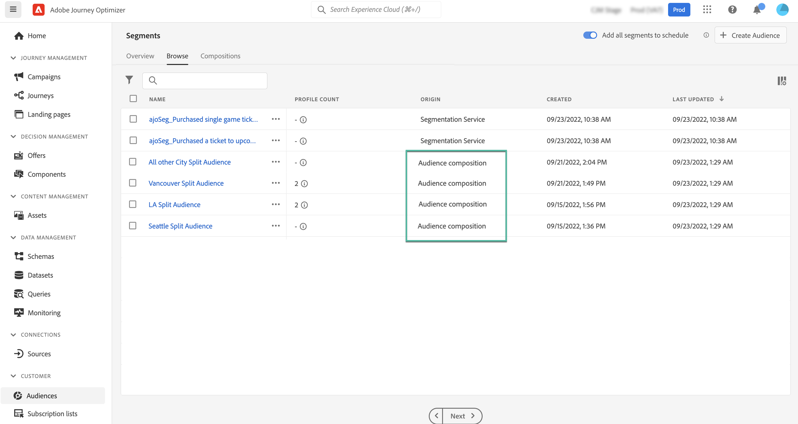

# Acceso y administración de audiencias {#access-manage-audiences}

Se puede acceder a las audiencias resultantes de la composición de audiencias desde el **[!UICONTROL Examinar]** en la pestaña **[!UICONTROL Audiencias]** menú.

Esta pestaña enumera todas las audiencias almacenadas en Adobe Experience Platform. Las audiencias creadas con composiciones de audiencia se pueden identificar mediante el **[!UICONTROL Composición de audiencia]** origen.

>[!NOTE]
>
>Para obtener más información sobre otros tipos de audiencias disponibles en Adobe Experience Platform, consulte la [Documentación del Servicio de segmentación](https://experienceleague.adobe.com/docs/experience-platform/segmentation/ui/overview.html).

El **[!UICONTROL Recuento de perfiles]** proporciona información sobre el número de perfiles incluidos en una audiencia. Haga clic en el botón &quot;i&quot; para obtener más información sobre la fecha en la que se ha calculado esta información.

Para asignar etiquetas de uso de datos personalizadas o principales a una audiencia, haga clic en el botón de puntos suspensivos y seleccione **[!UICONTROL Administrar acceso]**. [Más información sobre el Control de acceso de nivel de objeto (OLA)](../administration/object-based-access.md)

<!--
-edit an audience?
-->
