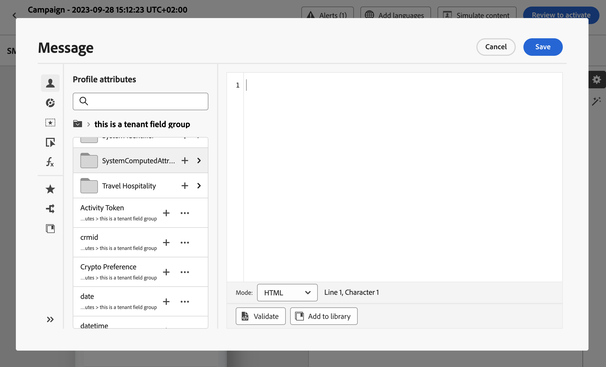

# Trabajo con atributos de varios valores {#computed-attributes}

Los atributos calculados resumen eventos de comportamiento individuales en atributos de perfil calculados disponibles en Adobe Experience Platform. Estos atributos se basan en conjuntos de datos de evento de experiencia con perfil habilitado introducidos en Adobe Experience Platform y sirven como puntos de datos agregados almacenados en perfiles de clientes.

Cada atributo calculado es un atributo de perfil que puede aprovechar para la segmentación, personalización y activación en recorridos y campañas. Esta simplificación mejora la capacidad de ofrecer experiencias personalizadas oportunas y significativas a sus clientes.

>[!NOTE]
>
>Para acceder a los atributos calculados, asegúrese de que dispone de los permisos adecuados (**Ver atributos calculados** y **Administrar atributos calculados**).

## Creación de atributos calculados {#manage}

Para crear atributos calculados, vaya a la ficha **[!UICONTROL Atributos calculados]** en el menú **[!UICONTROL Perfiles]** situado en el lado izquierdo.

Desde esta pantalla, puede construir atributos calculados generando reglas que combinen atributos de evento y funciones de agregado junto con un periodo retrospectivo especificado. Por ejemplo, puede calcular la suma de las compras realizadas en los últimos tres meses, identificar el artículo más reciente que vio un perfil que no realizó una compra en la última semana o contar el total de puntos de recompensa acumulados por cada perfil.

Una vez que la regla esté lista, publique el atributo calculado para que esté disponible en otros servicios de flujo descendente, incluido Journey Optimizer.

Encontrará información detallada sobre la creación y administración de atributos calculados en la [documentación de atributos calculados](https://experienceleague.adobe.com/docs/experience-platform/profile/computed-attributes/overview.html?lang=es)

## Añadir atributos calculados a la fuente de datos de Adobe Experience Platform {#source}

Para aprovechar los atributos calculados en Journey Optimizer, agréguelos al origen de datos de Journey Optimizer **Experience Platform**.

La fuente de datos de Adobe Experience Platform define la conexión con el Perfil del cliente en tiempo real de Adobe. Esta fuente de datos recupera datos de perfil y datos de eventos de experiencia del servicio de perfil del cliente en tiempo real.

Para agregar atributos calculados a la fuente de datos, siga estos pasos:

1. Vaya al menú izquierdo de **[!UICONTROL Configuraciones]** y, a continuación, haga clic en la tarjeta **[!UICONTROL Fuentes de datos]**.

1. Seleccione el origen de datos **[!UICONTROL Experience Platform]**.

   

1. Agregue el grupo de campos **[!UICONTROL SystemComputedAttributes]** que contiene todos los atributos calculados creados.

   

Los atributos calculados ya están disponibles para su uso en Journey Optimizer. [Aprenda a utilizar atributos calculados en Journey Optimizer](#use)

Encontrará información detallada sobre cómo agregar grupos de campos a la fuente de datos de Adobe Experience Platform en [esta sección](../datasource/adobe-experience-platform-data-source.md).

## Uso de atributos calculados en Journey Optimizer {#use}

>[!NOTE]
>
>Antes de empezar, asegúrese de haber agregado los atributos calculados a la fuente de datos de Adobe Experience Platform. [Aprenda a hacerlo en esta sección](#source).

Los atributos calculados proporcionan funciones versátiles dentro de Journey Optimizer. Utilícelos para varios fines, como personalizar el contenido del mensaje, crear nuevas audiencias o dividir recorridos en función de un atributo calculado específico. Por ejemplo, divida la ruta de un recorrido en función de las compras totales de un perfil en las últimas tres semanas agregando un solo atributo calculado en una actividad de condición. También puede personalizar un correo electrónico mostrando el elemento visualizado más recientemente para cada perfil.

Dado que los atributos calculados son campos de atributos de perfil creados en su esquema de unión de perfiles, acceda a ellos desde el editor de personalización dentro del grupo de campos **SystemComputedAttributes**. A partir de ahí, añada atributos calculados a las expresiones, tratándolos como cualquier otro atributo de perfil para realizar las operaciones deseadas.

