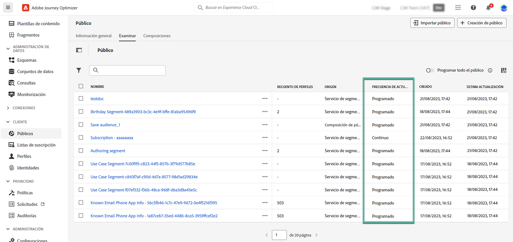

# Generar definiciones de segmentos {#build-segments}

>[!CONTEXTUALHELP]
>id="ajo_ao_create_rule"
>title="Crear una regla"
>abstract="El método de creación Generar regla le permite crear una nueva definición de público mediante el servicio de segmentación de Adobe Experience Platform."

## Creación de una definición de segmento {#create}

En este ejemplo, se crea una audiencia para dirigirse a todos los clientes que viven en Atlanta, San Francisco o Seattle y que nacieron después de 1980. Todos estos clientes deben haber realizado una compra en los últimos 7 días.

➡️ [Aprenda a crear audiencias en este vídeo](#video-segment)

1. En el menú **[!UICONTROL Audiencias]**, haga clic en el botón **[!UICONTROL Crear audiencia]** y seleccione **[!UICONTROL Generar regla]**.

   

   La pantalla de definición del segmento le permite configurar todos los campos obligatorios para definir la audiencia. Aprenda a configurar audiencias en la [documentación del servicio de segmentación](https://experienceleague.adobe.com/es/docs/experience-platform/segmentation/methods/overview){target="_blank"}.

   

1. En el panel **[!UICONTROL Propiedades de audiencia]**, proporcione un nombre y una descripción (opcional) para la audiencia.

   

1. Arrastre y suelte los campos deseados del panel izquierdo al espacio de trabajo central y, a continuación, configúrelos según sus necesidades.

   Los componentes básicos de las definiciones de segmentos son **atributos** y **eventos**. Además, los atributos y eventos contenidos en las audiencias existentes pueden utilizarse como componentes para nuevas definiciones. [Obtenga más información en la documentación del servicio de segmentación](https://experienceleague.adobe.com/es/docs/experience-platform/segmentation/ui/segment-builder#building-blocks){target="_blank"}

   >[!NOTE]
   >
   >Tenga en cuenta que los campos disponibles en el panel izquierdo varían según cómo se hayan configurado los esquemas **XDM Individual Profile** y **XDM ExperienceEvent** para su organización.  Obtenga más información en la [documentación del Modelo de datos de experiencia (XDM)](https://experienceleague.adobe.com/docs/experience-platform/xdm/home.html?lang=es){target="_blank"}.

   

   En este ejemplo, necesitamos basarnos en los campos **Atributos** y **Eventos** para generar la audiencia:

   * **Atributos**: perfiles que viven en Atlanta, San Francisco o Seattle nacidos después de 1980.

     

   * **Eventos**: perfiles que realizaron una compra en los últimos 7 días.

     

1. A medida que agrega y configura nuevos campos en el área de trabajo, el panel **[!UICONTROL Propiedades de la audiencia]** se actualiza automáticamente con información sobre los perfiles estimados que pertenecen a la audiencia.

   

1. Una vez que la audiencia esté lista, haga clic en **[!UICONTROL Guardar]**. Se muestra en la lista de audiencias de Adobe Experience Platform. Tenga en cuenta que hay una barra de búsqueda disponible para ayudarle a buscar en una audiencia específica de la lista.

La audiencia ya está lista para usarla en sus recorridos. Para obtener más información, consulte [esta sección](../audience/about-audiences.md).

## Métodos de evaluación de públicos {#evaluation-method-in-journey-optimizer}

En Adobe Journey Optimizer, las audiencias se generan a partir de las definiciones de segmentos mediante uno de los tres métodos de evaluación siguientes.

+++ Segmentación de streaming

La lista de perfiles de la audiencia se mantiene actualizada en tiempo real a medida que ingresan nuevos datos al sistema.

La segmentación de streaming es un proceso continuo de selección de datos que actualiza los públicos en respuesta a la actividad de los usuarios. Una vez que se ha creado una definición de segmento y se ha guardado el público resultante, la definición del segmento se aplica a los datos entrantes en Journey Optimizer. Esto significa que las personas se añaden o eliminan de la audiencia a medida que cambian los datos de perfil, lo que garantiza que la audiencia de destino siempre sea relevante. [Obtenga más información en Adobe Expe](https://experienceleague.adobe.com/docs/experience-platform/segmentation/ui/streaming-segmentation.html?lang=es){target="_blank"}.

>[!IMPORTANT]
>
>A partir del 1 de noviembre de 2024, la segmentación de streaming ya no admitirá el uso de eventos **send** y **open** de los conjuntos de datos de comentarios y seguimiento de Journey Optimizer.
>
>* Este cambio se aplica a todas las zonas protegidas y organizaciones de clientes.
>* Solo se ven afectados los eventos de envío y apertura: Los clics y otros eventos de seguimiento permanecen disponibles para la segmentación de flujo continuo.
>* Este cambio solo se aplica a la segmentación por streaming. Los eventos de envío y apertura se pueden seguir utilizando en segmentos por lotes, pero si se incluyen en un segmento de flujo continuo, se evalúan por lotes. Además, los eventos de exclusión y los eventos de devolución/retraso resultantes de los eventos de envío también se ven afectados por este cambio.
>* La recopilación de datos de seguimiento no se ve afectada. Los eventos de envío y apertura se seguirán recopilando de la forma habitual.
>* Los eventos de reacción en los recorridos no se ven afectados por este cambio.

+++

+++ Segmentación por lotes

La lista de perfiles de la audiencia se evalúa cada 24 horas.

La segmentación por lotes procesa todos los datos de perfil a la vez mediante definiciones de segmentos, lo que crea una instantánea de la audiencia que se puede guardar y exportar para su uso. A diferencia de la segmentación por secuencias, la segmentación por lotes no actualiza continuamente la lista de audiencias en tiempo real. Los nuevos datos que se incluyen después del proceso por lotes no se reflejan en la audiencia hasta el siguiente proceso por lotes. Los intentos de forzar una actualización inmediata no anulan el ciclo diario. Para obtener actualizaciones incrementales inmediatas, considere la posibilidad de utilizar opciones de segmentación por transmisión o bajo demanda.

Para obtener más información, consulte la [Documentación del servicio de segmentación de Adobe Experience Platform](https://experienceleague.adobe.com/docs/experience-platform/segmentation/home.html?lang=es#batch){target="_blank"}

+++

+++ Segmentación de Edge

La segmentación de Edge es la capacidad para evaluar segmentos en Adobe Experience Platform de forma instantánea [en el perímetro](https://experienceleague.adobe.com/docs/experience-platform/edge/home.html?lang=es){target="_blank"}, lo que permite casos de uso de personalización de la misma página y de la siguiente. Actualmente, solo los tipos de consulta seleccionados se pueden evaluar con la segmentación de Edge. Para obtener más información, consulte la [Documentación del servicio de segmentación de Adobe Experience Platform](https://experienceleague.adobe.com/docs/experience-platform/segmentation/ui/edge-segmentation.html?lang=es#query-types){target="_blank"}

+++

Si conoce el método de evaluación que desea utilizar, selecciónelo en la lista desplegable. También puede hacer clic en el icono de examinar icono de la carpeta con una lupa para ver una lista de los métodos de evaluación de definición de segmentos disponibles. Para obtener más información, consulte la [Documentación del servicio de segmentación de Adobe Experience Platform](https://experienceleague.adobe.com/docs/experience-platform/segmentation/ui/segment-builder.html?lang=es#segment-properties){target="_blank"}.

<!--The determination between batch segmentation and streaming segmentation is made by the system for each audience, based on the complexity and the cost of evaluating the segment definition rule. You can view the evaluation method for each audience in the **[!UICONTROL Evaluation method]** column of the audience list.
    

>[!NOTE]
>
>If the **[!UICONTROL Evaluation method]** column does not display, you  need to add it using configuration button on the top right of the list.-->

Una vez que haya definido una audiencia por primera vez, los perfiles se añaden a la audiencia cuando cumplen los requisitos. Rellenar el público a partir de datos anteriores puede tardar hasta 24 horas. Una vez que se ha rellenado el público, se mantiene actualizado continuamente y siempre está listo para la segmentación.

## Evaluación flexible de audiencias {#flexible}

Adobe Experience Platform Audience Portal le permite ejecutar un trabajo de segmentación bajo demanda para audiencias seleccionadas, lo que garantiza que siempre tenga los datos de audiencia más actualizados antes de segmentarlos en recorridos y campañas de Journey Optimizer.

Con la evaluación flexible de audiencias, puede:

1. Cree un nuevo segmento basado en los datos más recientes.
1. Evalúe la audiencia en tiempo real para garantizar su precisión. Para ello, elija las audiencias que desea evaluar y seleccione &quot;Evaluar audiencias&quot;, siempre que cumplan criterios específicos (por ejemplo, basados en personas, origen del servicio de segmentación).
1. Utilice la audiencia evaluada en campañas o recorridos de Adobe Journey Optimizer para un direccionamiento preciso.

Puede evaluar hasta 20 audiencias a la vez y las audiencias que no cumplan los requisitos se excluirán automáticamente. Para obtener más información, consulte la [Documentación del servicio de segmentación de Adobe Experience Platform](https://experienceleague.adobe.com/es/docs/experience-platform/segmentation/ui/audience-portal#flexible-audience-evaluation).

## Vídeo práctico{#video-segment}

Descubra cómo Journey Optimizer utiliza reglas para generar audiencias y aprenda a utilizar atributos, eventos y audiencias existentes para crear una audiencia.

>[!VIDEO](https://video.tv.adobe.com/v/3425020?quality=12)
