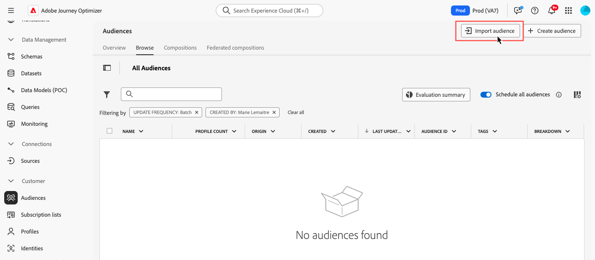

# Carga personalizada {#custom-upload}

Adobe Experience Platform Audience Portal le permite importar una audiencia utilizando un archivo CSV.

Durante el proceso de carga personalizado, especifique el atributo CSV que se utilizará como identidad y la identidad del perfil a la que se asigna. Esto establece un vínculo entre los datos de audiencia y el perfil. Si el archivo CSV contiene un valor de identidad que no se encuentra en el perfil, se crea un nuevo perfil con ese valor de identidad.

>[!NOTE]
>
>Para las audiencias de carga personalizadas, si &quot;Lectura incremental&quot; está habilitado en un recorrido recurrente, los perfiles solo se recuperan en la primera periodicidad, ya que estas audiencias son fijas.

Encontrará información detallada sobre cómo importar audiencias en [Documentación del servicio de segmentación de Adobe Experience Platform](https://experienceleague.adobe.com/es/docs/experience-platform/segmentation/ui/audience-portal#import-audience){target="_blank"}.

Obtenga información sobre cómo cargar audiencias en formato CSV en vídeo:

>[!VIDEO](https://video.tv.adobe.com/v/3423362?captions=spa&quality=12)
