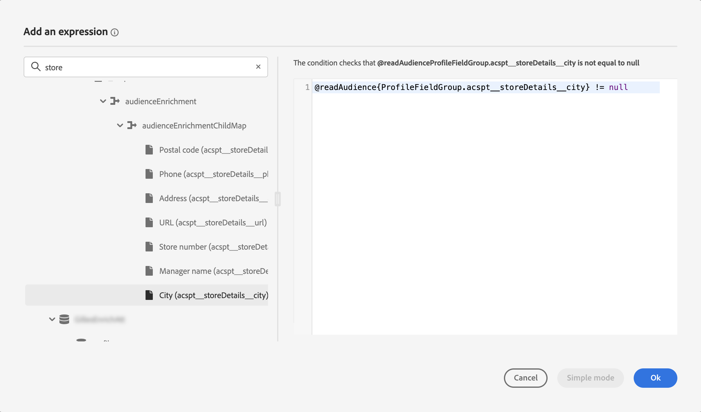
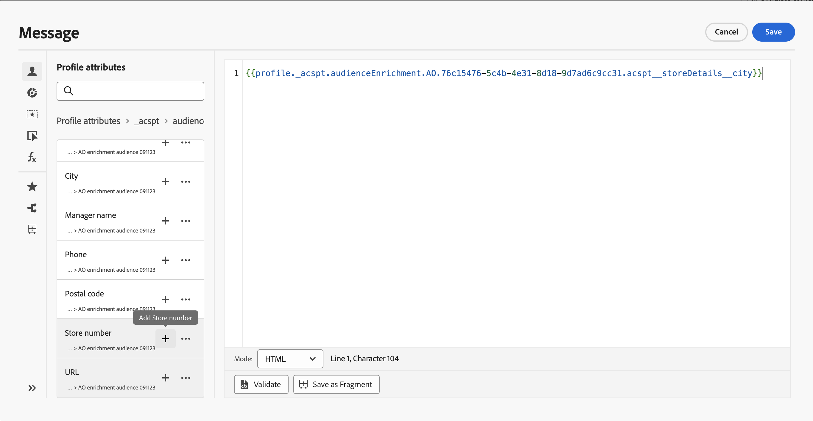

# Uso de atributos de enriquecimiento de audiencias {#enrichment}

>[!BEGINSHADEBOX]

**En esta página:** Aprenda a utilizar atributos de enriquecimiento de audiencia de flujos de trabajo de composición, cargas personalizadas y composición de audiencia federada para crear rutas de recorrido y personalizar mensajes en Adobe Journey Optimizer.

>[!ENDSHADEBOX]

Al segmentar una audiencia generada mediante flujos de trabajo de composición, audiencias personalizadas (archivo CSV) o composición de audiencias federada, puede utilizar atributos de enriquecimiento de estas audiencias para crear el recorrido y personalizar los mensajes.

>[!NOTE]
>
>Las audiencias creadas mediante la carga personalizada de archivos CSV antes del 1 de octubre de 2024 no pueden personalizarse. Para utilizar los atributos de estas audiencias y utilizar completamente esta función, vuelva a crear y a cargar cualquier audiencia CSV externa importada antes de esta fecha.
>
>Las políticas de consentimiento no admiten atributos de enriquecimiento. Por lo tanto, cualquier regla de política de consentimiento debe basarse únicamente en atributos encontrados en el perfil.

Estas son las acciones que puede realizar con los atributos de enriquecimiento de las audiencias:

* **Cree múltiples rutas en un recorrido** basado en reglas que aprovechen los atributos de enriquecimiento de la audiencia de destino. Para ello, oriente a la audiencia usando una actividad [Leer audiencia](../building-journeys/read-audience.md) y luego cree reglas en una actividad [Optimizar](../building-journeys/optimize.md) basada en los atributos de enriquecimiento de la audiencia.

  {width="70%" zoomable="yes"}

* **Personalice sus mensajes** en recorridos o campañas agregando atributos de enriquecimiento de la audiencia de destino en el editor de personalización. [Aprenda a trabajar con el editor de personalización](../personalization/personalization-build-expressions.md)

  {width="70%" zoomable="yes"}

>[!IMPORTANT]
>
>Para utilizar atributos de enriquecimiento de audiencias creadas con flujos de trabajo de maquetación, asegúrese de que se añaden a un grupo de campos en la Source de datos de Experience Platform.
>
>+++ Aprenda a añadir atributos de enriquecimiento a un grupo de campos
>
>1. Vaya a &quot;Administración&quot; > &quot;Configuración&quot; > &quot;Fuentes de datos&quot;.
>1. Seleccione &quot;Experience Platform&quot; y cree o edite un grupo de campos.
>1. En el selector de esquemas, seleccione el esquema adecuado. El nombre del esquema seguirá este formato: &quot;Esquema para audienceId:&quot; + el ID de la audiencia. Puede encontrar el ID de la audiencia en la pantalla de detalles de audiencia del inventario de audiencias.
>1. Abra el selector de campos, busque los atributos de enriquecimiento que desee añadir y active la casilla de verificación situada junto a ellos.
>1. Guarde los cambios.
>1. Una vez añadidos los atributos de enriquecimiento a un grupo de campos, se pueden utilizar en Journey Optimizer en las ubicaciones enumeradas anteriormente.
>
>Encontrará información detallada sobre las fuentes de datos en estas secciones:
>
>* [Trabajar con el origen de datos de Adobe Experience Platform](../datasource/adobe-experience-platform-data-source.md)
>* [Configurar un origen de datos](../datasource/configure-data-sources.md)
>
>+++

## Preguntas frecuentes {#faq-enrichment}

A continuación, encontrará las preguntas más frecuentes sobre los atributos de enriquecimiento.

¿Necesita más información? Use las opciones de comentarios situados en la parte inferior de esta página para plantear su pregunta o conecte con la [comunidad de Adobe Journey Optimizer](https://experienceleaguecommunities.adobe.com/t5/adobe-journey-optimizer/ct-p/journey-optimizer?profile.language=es){target="_blank"}.

+++ ¿Qué son los atributos de enriquecimiento?

Los atributos de enriquecimiento son atributos adicionales que son contextuales y específicos de una audiencia. No están asociadas al perfil y se utilizan normalmente con fines de personalización.

Los atributos de enriquecimiento están vinculados a una audiencia a través de una actividad de enriquecimiento en la composición de audiencias o el proceso de carga personalizado.

+++

+++ ¿Dónde puedo utilizar atributos de enriquecimiento en Journey Optimizer?

Los atributos de enriquecimiento de la composición de audiencias se pueden aprovechar en las siguientes áreas. [Aprenda a utilizar los atributos de enriquecimiento de audiencias](#enrichment)

* Actividad de condición (Recorridos)
* Atributos de acción personalizados (Recorridos)
* Personalización de mensajes (Recorridos y campañas)

+++

+++ ¿Cómo se habilitan los atributos de enriquecimiento en Recorrido?

Para utilizar atributos de enriquecimiento de audiencias creadas con flujos de trabajo de maquetación, asegúrese de que se añadan a un grupo de campos en la Source de datos de Experience Platform. La información sobre cómo agregar atributos de enriquecimiento a un grupo de campos está disponible en [esta sección](#enrichment)

+++

+++ ¿Se actualizan los valores de atributo de enriquecimiento después de iniciar un recorrido?

Actualmente, no. Incluso después de los nodos de espera o de evento, los valores de los atributos de enriquecimiento permanecen igual que cuando se inició el recorrido.

+++
