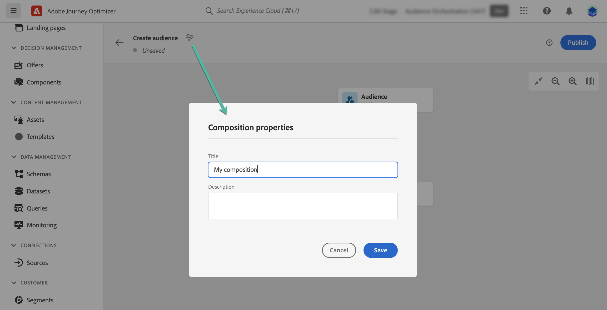

# Introducción a Composición de públicos {#get-start-audience-composition}

>[!CONTEXTUALHELP]
>id="ajo_ao_create_composition"
>title="Crear una composición"
>abstract="Cree un flujo de trabajo de composición para combinar los públicos de Adobe Experience Platform existentes en un lienzo visual y aproveche varias actividades (división, exclusión…) para crear nuevos públicos."

>[!BEGINSHADEBOX]

Esta documentación proporciona información detallada sobre cómo trabajar con la composición de públicos en Adobe Journey Optimizer. Si solo es cliente del Perfil del cliente en tiempo real y no utiliza Adobe Journey Optimizer, [haga clic aquí](https://experienceleague.adobe.com/docs/experience-platform/segmentation/ui/audience-composition.html?lang=es){target="_blank"}.

>[!ENDSHADEBOX]

La composición de audiencias le permite crear **flujos de trabajo de composición**, donde puede combinar audiencias de Adobe Experience Platform existentes en un lienzo visual y aprovechar diversas actividades (dividir, excluir...) para crear nuevas audiencias.

Una vez finalizado, las **audiencias resultantes** se guardan y se copian en Adobe Experience Platform junto con las audiencias existentes, y se pueden aprovechar en campañas y recorridos de Journey Optimizer para segmentar clientes. Obtenga información sobre cómo segmentar audiencias en Journey Optimizer

>[!IMPORTANT]
>
>El uso de audiencias y atributos de la composición de audiencias no está disponible actualmente para su uso con Healthcare Shield o Privacy and Security Shield.
>
>Los atributos de enriquecimiento aún no están integrados con el servicio de aplicación de políticas. Por lo tanto, las etiquetas de uso de datos que aplique a los atributos de enriquecimiento no se aplicarán a las campañas o recorridos de Journey Optimizer.

Se puede acceder a la composición de públicos desde el menú **[!UICONTROL Públicos]** de Adobe Journey Optimizer:

* La pestaña **[!UICONTROL Información general]** proporciona un tablero específico con métricas clave relacionadas con los datos del público de su organización. Para obtener más información, consulte [Guía de tableros de Adobe Experience Platform](https://experienceleague.adobe.com/docs/experience-platform/dashboards/guides/segments.html?lang=es).

* La pestaña **[!UICONTROL Examinar]** lista todos los públicos existentes almacenados en Adobe Experience Platform.

* La pestaña **[!UICONTROL Composiciones]** le permite crear flujos de trabajo de composición en los que puede combinar y organizar públicos para crear otros nuevos.

## Crear un flujo de trabajo de composición {#create}

Para crear un flujo de trabajo de maquetación, siga estos pasos:

1. Acceda al menú **[!UICONTROL Audiencias]** y seleccione **[!UICONTROL Crear audiencia]**.

1. Seleccione **[!UICONTROL Componer audiencia]**.

   

1. El lienzo de composición se muestra con dos actividades predeterminadas:

   * **[!UICONTROL Audiencia]**: el punto de partida de la composición. Esta actividad le permite seleccionar una o varias audiencias como base para el flujo de trabajo,

   * **[!UICONTROL Guardar]**: el último paso de la composición. Esta actividad le permite guardar el resultado del flujo de trabajo en una nueva audiencia.

1. Abra las propiedades de la composición para especificar un título y una descripción.

   Si no se define ningún título en las propiedades, la etiqueta de la composición se define en &quot;Composición&quot; seguida de su fecha y hora de creación.

   

1. Configure su composición agregando tantas actividades como sea necesario entre las actividades **[!UICONTROL Audience]** y **[!UICONTROL Save]**. Para obtener más información sobre cómo crear una composición, consulte la [documentación de composición de audiencias](https://experienceleague.adobe.com/en/docs/experience-platform/segmentation/ui/audience-composition).

   

1. Una vez que la composición esté lista, haga clic en el botón **[!UICONTROL Publish]** para publicar la composición y guardar las audiencias resultantes en Adobe Experience Platform.

   >[!IMPORTANT]
   >
   >Puede publicar hasta 10 composiciones en una zona protegida determinada. Si ha alcanzado este umbral, debe eliminar una composición para liberar espacio y publicar una nueva.

   Si se produce algún error durante la publicación, las alertas se mostrarán con información sobre cómo resolver el problema.

   

1. La composición se publica. Las audiencias resultantes se guardan en Adobe Experience Platform y están listas para segmentarse en Journey Optimizer. [Aprenda a segmentar audiencias en Journey Optimizer](../audience/about-audiences.md#segments-in-journey-optimizer)

>[!NOTE]
>
>Las audiencias de **composición de audiencias** se ejecutan a diario, por lo que es posible que tenga que esperar hasta 24 horas para usarlas en Journey Optimizer. Los atributos enriquecidos en las audiencias de composición de audiencia son tan recientes como la última ejecución de composición, que pueden tardar hasta 24 horas en el pasado.

## Acceso a composiciones {#access}

>[!CONTEXTUALHELP]
>id="ajo_ao_publish"
>title="Publicar la audiencia"
>abstract="Publique la composición para guardar las audiencias resultantes en Adobe Experience Platform."

Se puede acceder a todas las composiciones creadas desde la pestaña **[!UICONTROL Composiciones]**. Puede duplicar o eliminar una composición existente en cualquier momento mediante el botón de puntos suspensivos de la lista.

Las composiciones pueden tener varios estados:

* **[!UICONTROL Borrador]**: la composición está en curso y no se ha publicado.
* **[!UICONTROL Publicado]**: la composición se ha publicado, las audiencias resultantes se han guardado y están disponibles para su uso.

>[!NOTE]
>
>La composición de audiencia no está integrada actualmente con la capacidad de restablecimiento de la zona protegida. Antes de iniciar el restablecimiento de una zona protegida, debe eliminar las composiciones manualmente para asegurarse de que los datos de audiencia asociados se limpien correctamente. Encontrará información detallada en [Documentación de espacio aislado](https://experienceleague.adobe.com/docs/experience-platform/sandbox/ui/user-guide.html#delete-audience-compositions) de Adobe Experience Platform
