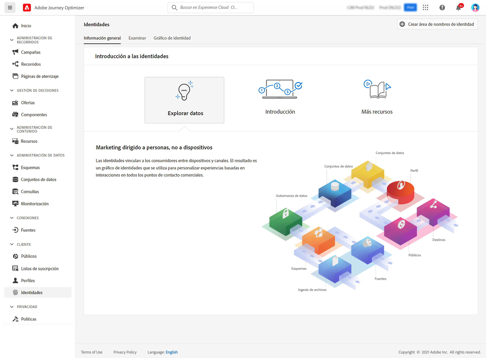

# Introducción a las identidades {#identities-gs}

Una identidad son datos que son únicos para una entidad, normalmente un objeto del mundo real, como una persona individual, un dispositivo de hardware o un explorador web. Una identidad completa consta de dos elementos:

* El área de nombres de identidad **identity** sirve como indicador del contexto al que se relaciona una identidad.
* El **valor de identidad** es una cadena que representa una entidad.

Por ejemplo, considere el número de teléfono 555-555-1234. En este caso, la cadena &quot;555-555-1234&quot; es un **valor de identidad**, que podría clasificarse en un **área de nombres de identidad** del &quot;teléfono&quot;.

El menú **Identidades** de [!DNL Adobe Journey Optimizer] permite a los usuarios examinar de forma eficaz los distintos identificadores que componen los clientes de su base de datos.

Proporciona un **gráfico de identidad**, que es un mapa de relaciones entre identidades diferentes para un cliente en particular. Este gráfico ofrece una representación visual de cómo un cliente interactúa con una marca en diferentes canales. Adobe Experience Platform Identity Service administra y actualiza colectivamente todos los gráficos de identidad de los clientes en respuesta a la actividad de los clientes.

Encontrará información detallada sobre cómo trabajar con identidades en la [documentación del servicio de identidad](https://experienceleague.adobe.com/docs/experience-platform/identity/home.html?lang=es){target="_blank"}.