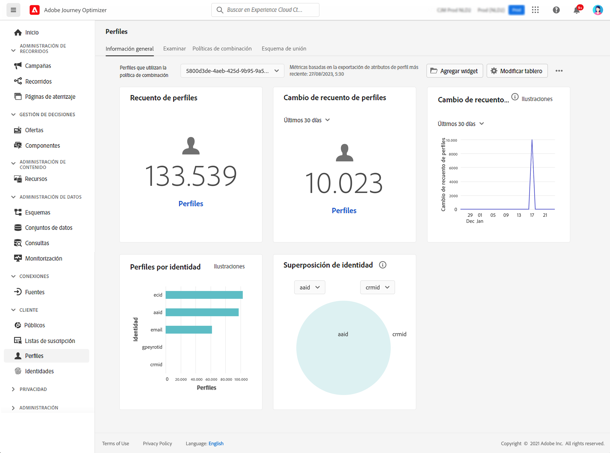

# Introducción a los perfiles {#profiles-gs}

## Acerca de los perfiles

Aproveche el Perfil del cliente en tiempo real en [!DNL Adobe Journey Optimizer] para ver una vista holística de cada cliente individual combinando datos de varios canales, incluidos los canales en línea, sin conexión, CRM y de terceros. **Perfiles** le permite consolidar los datos de sus clientes en una vista unificada que ofrece una cuenta procesable con marca de tiempo de cada interacción del cliente.

➡️ [Descubra esta funcionalidad en vídeo](#video)

**Perfil del cliente en tiempo real&#x200B;**: integre atributos y eventos del cliente desde fuentes en línea, sin conexión y con seudónimo en un único perfil unificado. palo de golfUtilice el perfil para atraer clientes con experiencias personalizadas en tiempo real en varios puntos de contacto. palo de golf

**Ingesta de datos**: conéctese a varias fuentes de datos para ingerir datos de comportamiento, transaccionales, financieros y operativos. Introduzca datos en tiempo real o mediante cargas por lotes para mantener los perfiles actualizados constantemente.

>[!NOTE]
>
>Al ingerir datos, los correos electrónicos distinguen entre mayúsculas y minúsculas, lo que significa que se pueden crear perfiles duplicados (por ejemplo, un perfil para John.Greene@luma.com y otro para john.green@luma.com) y utilizarse al segmentar estos perfiles en los recorridos y campañas de [!DNL Journey Optimizer].

**Gráfico de identidad**: Combine datos de diferentes fuentes usando identidades de clientes, como ID de fidelidad o ID del sistema CRM. palo de golfCree una vista completa del cliente asignando relaciones entre distintas identidades dentro de los conjuntos de datos de una marca. palo de golf

**Participación del cliente**: utilice el perfil del cliente en tiempo real para ofrecer experiencias contextuales y personalizadas, como ofertas y mensajes segmentados. palo de golfCapte a los clientes en varios canales, incluidas las campañas de marketing, la asistencia al cliente y las actualizaciones transaccionales. palo de golf

**Uso compartido de datos**: comparte perfiles de clientes con los principales proveedores de almacenamiento en la nube, como Amazon Web Service, Microsoft Azure y Google Cloud. Utilice perfiles compartidos para la creación de informes, el archivado de datos o un análisis más profundo con herramientas de inteligencia empresarial.

>[!MORELIKETHIS]
>
>* [Documentación del perfil del cliente en tiempo real](https://experienceleague.adobe.com/docs/experience-platform/query/home.html?lang=es){target="_blank"}
>* [Protecciones predeterminadas para la segmentación y los datos del perfil del cliente en tiempo real](https://experienceleague.adobe.com/es/docs/experience-platform/profile/guardrails){target="_blank"}
>* [Documentación de ingesta de datos](https://experienceleague.adobe.com/es/docs/experience-platform/ingestion/home){target="_blank"}

## Panel de perfiles

Para acceder a los perfiles, vaya al menú **[!UICONTROL Cliente]** / **[!UICONTROL Perfiles]** en el panel de navegación izquierdo.

>[!NOTE]
>
>Si su organización es nueva en [!DNL Adobe Journey Optimizer] y aún no tiene conjuntos de datos de perfil activos o políticas de combinación creadas, el panel de control **Perfiles** no está visible. En su lugar, la pestaña **Información general** muestra vínculos a documentación de Adobe Experience Platform para ayudarle a empezar con el Perfil del cliente en tiempo real. Para aprender a trabajar con el **tablero de perfiles** y obtener información detallada sobre las métricas mostradas en el tablero, consulte [esta sección](https://experienceleague.adobe.com/docs/experience-platform/profile/ui/user-guide.html?lang=es){target="_blank"}.

Puede unir fragmentos de datos de varias fuentes y combinarlos para ver una vista completa de cada uno de sus clientes individuales. Al unir estos datos, las políticas de combinación son las reglas utilizadas para determinar cómo se priorizan los datos y qué datos se combinan para crear la vista unificada. Obtenga más información acerca de **políticas de combinación** en esta [documentación](https://experienceleague.adobe.com/docs/experience-platform/profile/merge-policies/ui-guide.html?lang=es){target="_blank"}.

## Vídeo práctico {#video}

Descubra cómo Adobe Experience Platform organiza y actualiza los perfiles de clientes en tiempo real, y cómo puede acceder a ellos y utilizarlos.

>[!VIDEO](https://video.tv.adobe.com/v/31833?captions=spa&quality=12)
