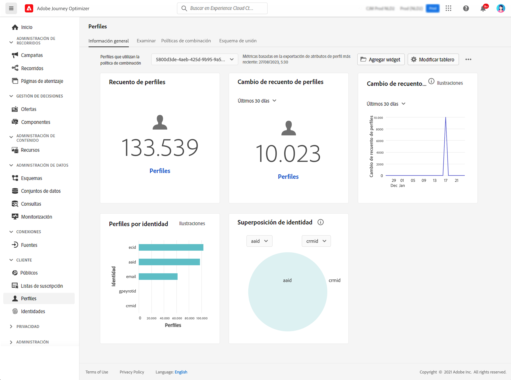

# Introducción a los perfiles {#profiles-gs}

>[!BEGINSHADEBOX]

**En esta página:** Descubra cómo el Perfil del cliente en tiempo real de Adobe Journey Optimizer unifica los datos de clientes de fuentes en línea, sin conexión y de terceros en una sola vista, y cómo acceder al panel de perfiles.

>[!ENDSHADEBOX]

## Acerca de los perfiles

Aproveche el Perfil del cliente en tiempo real en [!DNL Adobe Journey Optimizer] para ver una vista holística de cada cliente individual combinando datos de varios canales, incluidos los canales en línea, sin conexión, CRM y de terceros. **Perfiles** le permite consolidar los datos de sus clientes en una vista unificada que ofrece una cuenta procesable con marca de tiempo de cada interacción del cliente.

➡️ [Descubra esta funcionalidad en vídeo](#video)

**Perfil del cliente en tiempo real&#x200B;**: integre atributos y eventos del cliente desde fuentes en línea, sin conexión y con seudónimo en un único perfil unificado. &#x200B;Utilice el perfil para atraer clientes con experiencias personalizadas en tiempo real en varios puntos de contacto. palo de golf

**Ingesta de datos**: conéctese a varias fuentes de datos para ingerir datos de comportamiento, transaccionales, financieros y operativos. Introduzca datos en tiempo real o mediante cargas por lotes para mantener los perfiles actualizados constantemente. Los perfiles no se crean directamente en la interfaz de [!DNL Journey Optimizer], sino que se crean o actualizan automáticamente en Adobe Experience Platform cuando se incorporan los datos.

>[!NOTE]
>
>Al introducir datos, los correos electrónicos distinguen entre mayúsculas y minúsculas. Significa que se pueden crear perfiles duplicados (por ejemplo, un perfil para Juan.Greene@luma.com y otro perfil para juan.greene@luma.com) y utilizarse al segmentar el destinatario correspondiente en sus recorridos y campañas de [!DNL Journey Optimizer].

**Gráfico de identidad**: Combine datos de diferentes fuentes usando identidades de clientes, como ID de fidelidad o ID del sistema CRM. &#x200B;Cree una vista completa del cliente asignando relaciones entre distintas identidades dentro de los conjuntos de datos de una marca. palo de golf

**Participación del cliente**: utilice el perfil del cliente en tiempo real para ofrecer experiencias contextuales y personalizadas, como ofertas y mensajes segmentados. &#x200B;Capte a los clientes en varios canales, incluidas las campañas de marketing, la asistencia al cliente y las actualizaciones transaccionales. palo de golf

**Uso compartido de datos**: comparte perfiles de clientes con los principales proveedores de almacenamiento en la nube, como Amazon Web Service, Microsoft Azure y Google Cloud. Utilice perfiles compartidos para la creación de informes, el archivado de datos o un análisis más profundo con herramientas de inteligencia empresarial.

## Perfiles atractivos y uso de licencias {#engageable-profiles}

Un **perfil atractivo** es un registro de información que representa a un individuo que está almacenado en el servicio de perfil y que ha sido contratado por recorridos o campañas. Es la métrica de licencia de claves para [!DNL Adobe Journey Optimizer].

Características principales:

* **Período móvil de 12 meses**: El recuento refleja perfiles únicos que ha intentado vincular en los últimos 12 meses mediante las capacidades de creación, toma de decisiones, envío, experimentación u orquestación de Journey Optimizer.
* **Contado una vez por zona protegida**: Un perfil que introduce varios recorridos o campañas en una zona protegida cuenta como un único perfil atractivo para esa zona protegida.
* **Según su audiencia a la que se puede dirigir**: los perfiles atractivos se calculan a partir de su audiencia a la que se puede dirigir. El recuento representa la audiencia comprometida en los últimos 12 meses que utiliza cualquiera de las capacidades de Journey Optimizer, de su audiencia total a la que se puede dirigir.
* **Comportamiento de la métrica**: El recuento de perfiles atractivos:
   * Pueden aumentar cuando se comprometen nuevos perfiles a través de recorridos o campañas
   * No puede disminuir a menos que no haya participación con determinados perfiles durante más de 12 meses
   * Puede disminuir cuando los perfiles seudónimos se vinculan a perfiles conocidos

>[!TIP]
>
>Al segmentar perfiles seudónimos (visitantes no autenticados) con canales entrantes como web, aplicación o experiencias basadas en código, considere la posibilidad de establecer un tiempo de vida (TTL) para la eliminación automática de perfiles a fin de administrar el recuento de perfiles atractivos y los costes asociados. [Más información sobre las protecciones de canal entrante](../start/guardrails.md#profile-management-inbound)

Supervise el recuento de perfiles atractivos de su organización en cualquier momento desde **[!UICONTROL Administración]** > **[!UICONTROL Uso de licencias]**. Si observa un pico repentino en el recuento, consulte la [sección Resolución de problemas](license-usage.md#troubleshooting-engageable-profiles) para obtener instrucciones detalladas. [Más información sobre el tablero de uso de licencias](license-usage.md)

>[!MORELIKETHIS]
>
>* [Introducción a la gestión de datos en Journey Optimizer](../data/gs-data.md)
>* [Documentación del perfil del cliente en tiempo real](https://experienceleague.adobe.com/docs/experience-platform/query/home.html?lang=es){target="_blank"}
>* [Protecciones predeterminadas para la segmentación y los datos del perfil del cliente en tiempo real](https://experienceleague.adobe.com/es/docs/experience-platform/profile/guardrails){target="_blank"}
>* [Documentación de ingesta de datos](https://experienceleague.adobe.com/en/docs/experience-platform/ingestion/home){target="_blank"}

## Panel de perfiles

Para acceder a los perfiles, vaya al menú **[!UICONTROL Cliente]** / **[!UICONTROL Perfiles]** en el panel de navegación izquierdo.

>[!NOTE]
>
>Si su organización es nueva en [!DNL Adobe Journey Optimizer] y aún no tiene conjuntos de datos de perfil activos o políticas de combinación creadas, el panel de control **Perfiles** no está visible. En su lugar, la pestaña **Información general** muestra vínculos a documentación de Adobe Experience Platform para ayudarle a empezar con el Perfil del cliente en tiempo real. Para aprender a trabajar con el **tablero de perfiles** y obtener información detallada sobre las métricas mostradas en el tablero, consulte [esta sección](https://experienceleague.adobe.com/docs/experience-platform/profile/ui/user-guide.html?lang=es){target="_blank"}.

Puede unir fragmentos de datos de varias fuentes y combinarlos para ver una vista completa de cada uno de sus clientes individuales. Al unir estos datos, las políticas de combinación son las reglas utilizadas para determinar cómo se priorizan los datos y qué datos se combinan para crear la vista unificada. Obtenga más información acerca de **políticas de combinación** en esta [documentación](https://experienceleague.adobe.com/docs/experience-platform/profile/merge-policies/ui-guide.html?lang=es){target="_blank"}.

## Vídeo práctico {#video}

Descubra cómo Adobe Experience Platform organiza y actualiza los perfiles de clientes en tiempo real, y cómo puede acceder a ellos y utilizarlos.

>[!VIDEO](https://video.tv.adobe.com/v/27251?quality=12)
