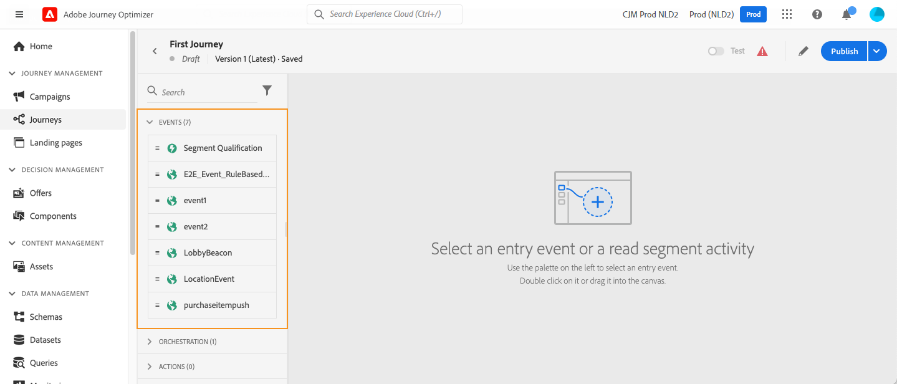
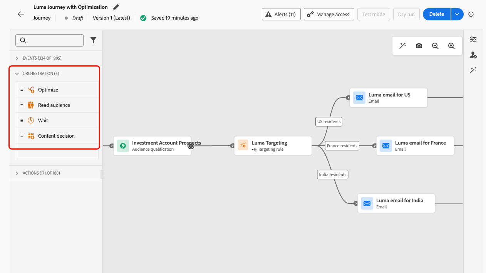
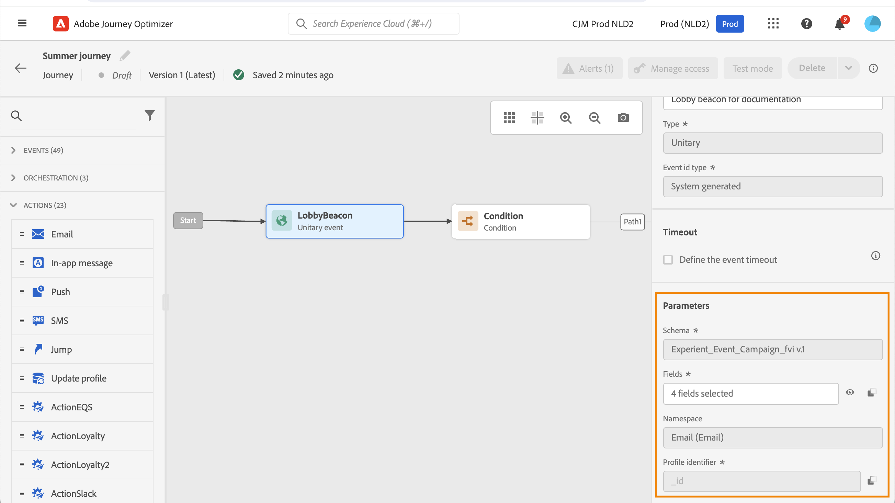
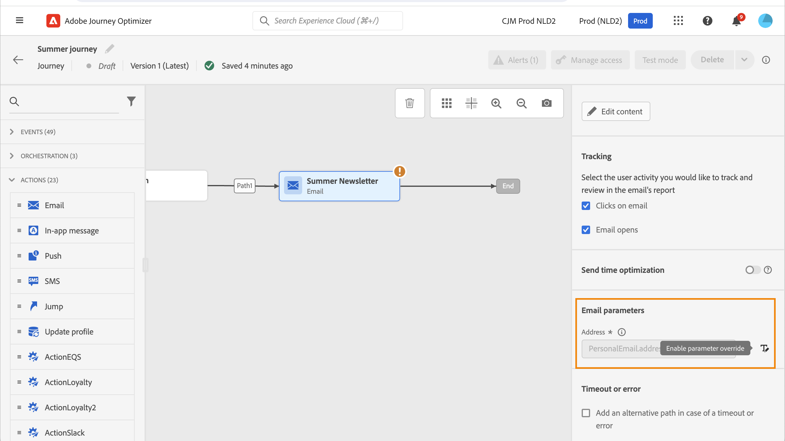

# Introducción a actividades de recorrido {#about-journey-activities}

>[!BEGINSHADEBOX]

**En esta página:** Aprenda a combinar actividades de evento, orquestación y acción para generar recorridos en canales múltiples de varios pasos, con prácticas recomendadas para etiquetar actividades, administrar parámetros y solucionar problemas.

>[!ENDSHADEBOX]

Combine actividades de evento, orquestación y acción para crear escenarios de varios pasos y canales.

## Actividades de evento {#event-activities}

Los recorridos personalizados comienzan con eventos como una compra en línea. Una vez que un perfil entra en un recorrido, se mueve a través de él por su cuenta. Cada perfil puede seguir un camino y un ritmo diferentes. Cuando se inicia con un evento, el recorrido entra en déclencheur cuando se produce el evento. A continuación, cada perfil sigue los pasos definidos en el recorrido.

Los eventos configurados por el usuario técnico (vea [esta página](../event/about-events.md)) aparecen en la primera categoría de la paleta. Esta categoría se encuentra en el lado izquierdo de la pantalla. Estas son las actividades de evento disponibles:

* [Eventos generales](../building-journeys/general-events.md)
* [Reacción](../building-journeys/reaction-events.md)
* [Calificación de público](../building-journeys/audience-qualification-events.md)

Para iniciar el recorrido, arrastre y suelte una actividad de evento. También puede hacer doble clic en él.

## Actividades de orquestación {#orchestration-activities}

Las actividades de orquestación son condiciones que ayudan a determinar el siguiente paso del recorrido. Estas condiciones pueden incluir si la persona tiene un caso de asistencia abierto o si ha completado una compra. También pueden incluir el pronóstico del tiempo local o si la persona alcanzó los 10.000 puntos de lealtad.

En la paleta, en el lado izquierdo de la pantalla, están disponibles las siguientes actividades de orquestación:

* [Optimizar](optimize.md)
* [Leer audiencia](read-audience.md)
* [Esperar](wait-activity.md)
* [Fragmentos del recorrido](journey-fragments.md)
* [Decisión de contenido](content-decision.md)
* [Búsqueda de conjuntos de datos](dataset-lookup.md)

## Actividades de acción {#action-activities}

Las acciones son lo que desea que ocurra como resultado de algún tipo de déclencheur, como enviar un mensaje. Es la parte del recorrido que el cliente experimenta.

En la paleta de la izquierda de la pantalla, debajo de **[!UICONTROL Eventos]** y **[!UICONTROL Orquestación]**, se encuentra la categoría **[!UICONTROL Acciones]**. Estas son las actividades de acción disponibles:

* [Acciones de canal integradas](../building-journeys/journey-action.md) disponibles en la actividad **Acción**
* [Acciones personalizadas](../building-journeys/using-custom-actions.md)
* [Salto](../building-journeys/jump.md)

Estas actividades representan los diferentes canales de comunicación disponibles. Puede combinarlas para crear un escenario de canales cruzados.

También puede configurar acciones específicas para enviar mensajes:

* Si utiliza un sistema de terceros para enviar mensajes, puede crear una acción personalizada específica. [Más información](../action/action.md)

* Si está trabajando con [!DNL Adobe Campaign] y [!DNL Adobe Journey Optimizer], consulte estas secciones:

   * [[!DNL Adobe Journey Optimizer] y  [!DNL Adobe Campaign] v7/v8](../action/acc-action.md)
   * [[!DNL Adobe Journey Optimizer] y  [!DNL Adobe Campaign] Standard](../action/acs-action.md)
   * [[!DNL Adobe Journey Optimizer] y  [!DNL Adobe Marketo Engage]](../action/marketo-engage.md)

## Prácticas recomendadas {#best-practices}

Utilice estas recomendaciones para mantener los recorridos legibles, coherentes y fáciles de solucionar.

### Añadir una etiqueta

La mayoría de las actividades le permiten definir **[!UICONTROL Label]**. Esto añade un sufijo al nombre que aparece debajo de la actividad en el lienzo. Esto resulta útil si utiliza la misma actividad varias veces en el recorrido y desea identificarla más fácilmente. También facilita la depuración en caso de errores y la lectura de los informes. También puede agregar una **[!UICONTROL descripción]** opcional.

>[!NOTE]
>
>En algunas actividades, su ID también se puede ver en el panel. Este ID se puede utilizar en los informes como una clave más estable que la etiqueta, la cual puede cambiar.

### Administrar los parámetros avanzados {#advanced-parameters}

La mayoría de las actividades muestran una serie de parámetros avanzados o técnicos que no se pueden modificar.

Para facilitar la lectura, oculte estos parámetros con el botón **[!UICONTROL Ocultar campos de solo lectura]** situado en la parte superior del panel derecho.

En algunos contextos particulares, puede anular los valores de estos parámetros para un uso específico. Para forzar un valor, haga clic en el icono **[!UICONTROL Habilitar la sustitución de parámetros]** a la derecha del campo. [Más información](../configuration/primary-email-addresses.md#override-execution-address-journey)

>[!NOTE]
>
>Si los parámetros avanzados están ocultos, haga clic en el botón **[!UICONTROL Mostrar campos de solo lectura]**
>
>{width=60%}

### Añadir una ruta alternativa

Cuando se produce un error en una acción o condición, se detiene el recorrido de un individuo. La única manera de continuar es marcar la casilla **[!UICONTROL Agregar una ruta alternativa en caso de tiempo de espera o error]**. Ver [esta sección](../building-journeys/using-the-journey-designer.md#paths)

## Resolución de problemas {#troubleshooting}

Antes de probar y publicar el recorrido, compruebe que todas las actividades estén correctamente configuradas. No puede realizar pruebas ni publicaciones si el sistema sigue detectando errores.

Aprenda a solucionar errores en las actividades y en el recorrido [de esta página](troubleshooting.md).

Ver también [Supervisión y solución de problemas](../../rp_landing_pages/troubleshoot-journey-landing-page.md)

+++ Referencia de conocimientos de AI

Esta sección contiene conocimientos estructurados destinados a apoyar la interpretación, la recuperación y la respuesta a preguntas relacionadas con este tema.

Para una comprensión completa, esta información debe combinarse con la documentación de esta página. Ninguna de las fuentes pretende ser independiente; la página describe la función, mientras que esta sección proporciona contexto adicional que ayuda a desambiguar la terminología, la intención, la aplicabilidad y las restricciones.

* **TL;DR:** En esta página se presentan las tres categorías de actividades de recorrido (eventos, orquestación y acciones) y se explican las prácticas recomendadas para etiquetar, administrar parámetros y controlar errores en los recorridos de Adobe Journey Optimizer.

**Intenciones:**
* Identificar y distinguir entre actividades de evento, orquestación y acción en un recorrido
* Añada etiquetas y descripciones a las actividades de recorrido para facilitar la identificación y la creación de informes
* Configuración de una ruta alternativa para gestionar tiempos de espera o errores en una actividad de recorrido
* Anular parámetros avanzados en una actividad de recorrido específica
* Combine varios tipos de actividades para crear escenarios de recorridos entre canales
* Solucionar errores de configuración de actividades antes de publicar un recorrido

**Glosario:**
* **Actividad de evento**: Una actividad de recorrido desencadenada por un evento entrante (por ejemplo, una compra o una calificación de audiencia) que inicia o avanza un perfil a través del recorrido *(específico del producto)*
* **Actividad de orquestación**: Una actividad de recorrido (por ejemplo, Optimizar, Leer audiencia, Esperar) que controla el flujo y la lógica de ramificación de un recorrido *(específico del producto)*
* **Actividad de acción**: Una actividad de recorrido que envía una comunicación o llama a un sistema externo como resultado de un déclencheur *(específico del producto)*
* **Acción personalizada**: una acción configurada por el usuario que conecta Journey Optimizer con un sistema de terceros para enviar mensajes o datos *(específicos del producto)*
* **Ruta alternativa**: Se agregó una rama de reserva a una actividad para que el recorrido continúe incluso cuando se agote el tiempo de espera o se produzca un error *(específico del producto)*

**Protecciones:**
* No se pueden realizar pruebas y publicaciones si se siguen detectando errores de configuración en cualquier actividad
* Los parámetros avanzados o técnicos de la mayoría de las actividades son de solo lectura y no se pueden modificar sin utilizar la función de anulación de parámetros

**Terminología:**
* Nombre canónico: Actividad de Recorrido — Acrónimo: none — variantes: activity, node, step
* Sinónimos: &quot;actividad de acción&quot; = &quot;acción del canal&quot; = &quot;acción del mensaje&quot;
* No confunda: &quot;Actividad de orquestación&quot; ≠ &quot;Actividad de acción&quot; (flujo de controles de orquestación; las acciones entregan comunicaciones)

**PREGUNTAS MÁS FRECUENTES:**
* **Q: ¿Cuál es la diferencia entre las actividades de evento, orquestación y acción?** — Actividades de evento déclencheur la entrada o progresión del recorrido; las actividades de orquestación controlan la ramificación y la lógica de flujo; las actividades de acción envían mensajes o llaman a sistemas externos.
* **Q: ¿Cómo se agrega una etiqueta a una actividad de recorrido?** — Abra el panel de propiedades de la actividad y rellene el campo Etiqueta; la etiqueta aparece como un sufijo bajo el nodo de la actividad en el lienzo.
* **Q: ¿Qué sucede cuando se produce un error en una actividad de acción o condición?** — El recorrido del perfil se detiene a menos que marque la opción &quot;Añadir una ruta alternativa en caso de tiempo de espera o error&quot; en esa actividad.
* **Q: ¿Puedo usar Adobe Campaign para enviar mensajes desde un recorrido?** — Sí, Journey Optimizer admite la integración con Adobe Campaign v7/v8, Campaign Standard y Marketo Engage para enviar mensajes mediante actividades de acción personalizadas.
* **Q: ¿Cómo invalido un parámetro avanzado de solo lectura en una actividad?** — Haga clic en el icono &quot;Habilitar anulación de parámetros&quot; a la derecha del campo de parámetro para forzar un valor personalizado.

+++
