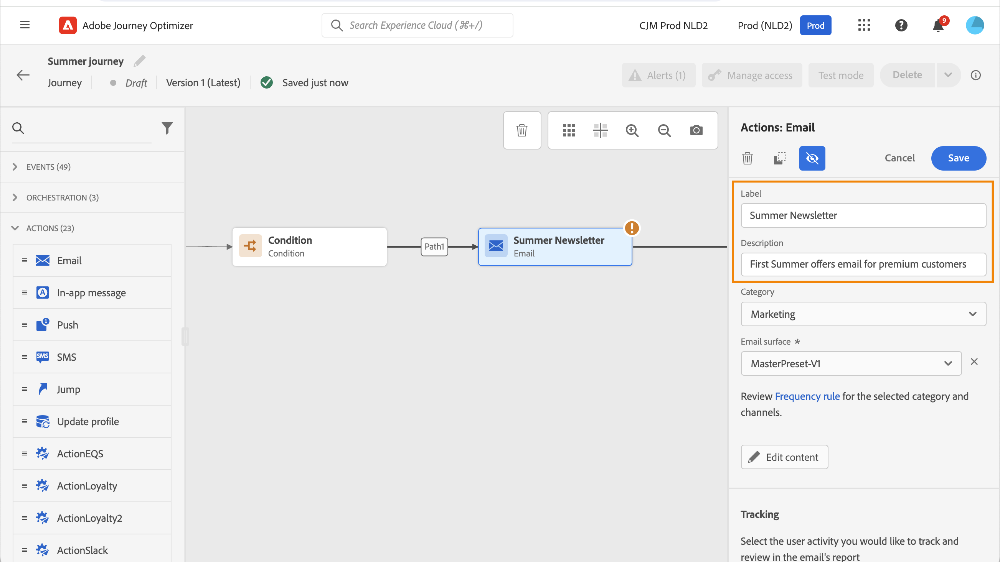

# Introducción a actividades de recorrido {#about-journey-activities}

Combine las distintas actividades de evento, orquestación y acción para crear sus escenarios de canales cruzados de varios pasos.

## Actividades de evento {#event-activities}

Los recorridos personalizados se activan mediante eventos, como una compra en línea. Una vez que un perfil entra en un recorrido, se mueve como individuo y no hay dos individuos que se muevan a la misma velocidad o por el mismo camino. Cuando se inicia el recorrido con un evento, el recorrido entra en déclencheur cuando se recibe el evento. Cada persona del recorrido sigue, individualmente, los siguientes pasos definidos en el recorrido.

Los eventos configurados por el usuario técnico (vea [esta página](../event/about-events.md)) se muestran todos en la primera categoría de la paleta, a la izquierda de la pantalla. Estas son las actividades de evento disponibles:

* [Eventos generales](../building-journeys/general-events.md)
* [Reacción](../building-journeys/reaction-events.md)
* [Calificación de público](../building-journeys/audience-qualification-events.md)

Para iniciar el recorrido, arrastre y suelte una actividad de evento. También puede hacer doble clic en él.

## Actividades de orquestación {#orchestration-activities}

Las actividades de orquestación son condiciones diferentes que ayudan a determinar el siguiente paso del recorrido. Estas condiciones pueden incluir si la persona tiene un caso de soporte abierto, el pronóstico del tiempo en su ubicación actual, si completó una compra o si alcanzó los 10 000 puntos de lealtad.

En la paleta, en el lado izquierdo de la pantalla, están disponibles las siguientes actividades de orquestación:

* [Condición](../building-journeys/condition-activity.md)
* [Espere](../building-journeys/wait-activity.md)
* [Leer audiencia](../building-journeys/read-audience.md)

## Actividades de acción {#action-activities}

Las acciones son lo que desea que ocurra como resultado de algún tipo de déclencheur, como enviar un mensaje. Es la parte del recorrido que el cliente experimenta.

En la paleta, en la parte izquierda de la pantalla, debajo de **[!UICONTROL Eventos]** y **[!UICONTROL Orquestación]**, se encuentra la categoría **[!UICONTROL Acciones]**. Estas son las actividades de acción disponibles:

* [Acciones de canal integradas](../building-journeys/journeys-message.md)
* [Acciones personalizadas](../building-journeys/using-custom-actions.md)
* [Salto](../building-journeys/jump.md)

Estas actividades representan los diferentes canales de comunicación disponibles. Puede combinarlas para crear un escenario de canales cruzados.

También puede configurar acciones específicas para enviar mensajes:

* Si utiliza un sistema de terceros para enviar mensajes, puede crear una acción personalizada específica. [Más información](../action/action.md)

* Si está trabajando con Campaign y Journey Optimizer, consulte estas secciones:

   * [[!DNL Journey Optimizer] y Campaign v7/v8](../action/acc-action.md)
   * [[!DNL Journey Optimizer] y Campaign Standard](../action/acs-action.md)
   * [[!DNL Journey Optimizer] y Marketo Engage](../action/marketo-engage.md)

## Prácticas recomendadas {#best-practices}

### Añadir una etiqueta

La mayoría de las actividades le permiten definir **[!UICONTROL Label]**. Esto añade un sufijo al nombre que aparece debajo de la actividad en el lienzo. Esto resulta útil si utiliza la misma actividad varias veces en el recorrido y desea identificarla más fácilmente. También facilita la depuración en caso de errores y la lectura de los informes. También puede agregar una **[!UICONTROL descripción]** opcional.

>[!NOTE]
>
>En algunas actividades, su ID también se puede ver en el panel. Este ID se puede utilizar en los informes como una clave más estable que la etiqueta, la cual puede cambiar.

### Administrar los parámetros avanzados {#advanced-parameters}

La mayoría de las actividades muestran una serie de parámetros avanzados o técnicos que no se pueden modificar.

Para mejorar la legibilidad, oculte estos parámetros con el botón **[!UICONTROL Ocultar campos de solo lectura]**.

En algunos contextos particulares, puede anular los valores de estos parámetros para un uso específico. Para forzar un valor, haga clic en el icono **[!UICONTROL Habilitar la sustitución de parámetros]** a la derecha del campo. [Más información](../configuration/primary-email-addresses.md#journey-parameters)

### Añadir una ruta alternativa

Cuando se produce un error en una acción o condición, se detiene el recorrido de un individuo. La única manera de continuar es marcar la casilla **[!UICONTROL Agregar una ruta alternativa en caso de tiempo de espera o error]**. Consulte [esta sección](../building-journeys/using-the-journey-designer.md#paths).

## Resolución de problemas {#troubleshooting}

Antes de probar y publicar el recorrido, compruebe que todas las actividades estén correctamente configuradas. No puede realizar pruebas ni publicaciones si el sistema sigue detectando errores.

Aprenda a solucionar errores en las actividades y en el recorrido [de esta página](troubleshooting.md).
