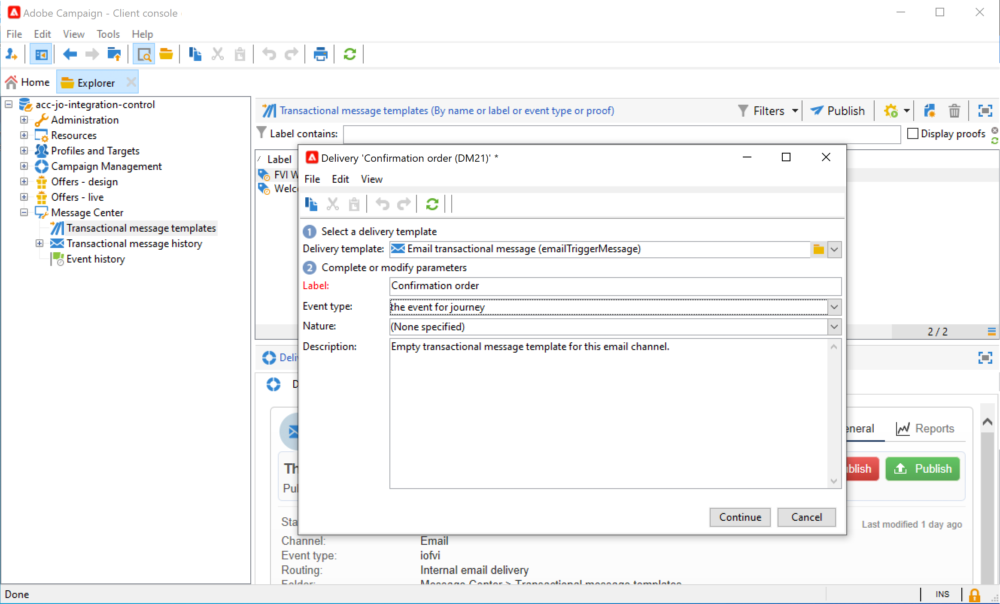

# Envío de un mensaje con Campaign v7/v8 {#campaign-v7-v8-use-case}

>[!BEGINSHADEBOX]

**En esta página:** Aprenda a enviar un correo electrónico desde un recorrido mediante la integración con Adobe Campaign v7 y v8, incluida la creación de la plantilla transaccional, el evento y la acción.

>[!ENDSHADEBOX]

Este caso de uso explica todos los pasos necesarios para enviar un correo electrónico mediante la integración con [!DNL Adobe Campaign] v7 y [!DNL Adobe Campaign] v8.

>[!NOTE]
>
>Para utilizar esta integración, debe tener Campaign v7/v8 compilación 9125 o superior.

En primer lugar, cree una plantilla de correo electrónico transaccional en Campaign. A continuación, en Journey Optimizer, cree el evento, la acción y diseñe el recorrido.

Para obtener más información sobre la integración de Campaign, consulte estas páginas:

* [Creación de una acción de campaña](../action/acc-action.md)
* [Usando la acción en un recorrido](../building-journeys/using-adobe-campaign-v7-v8.md).

**[!DNL Adobe Campaign]**

La instancia de Campaign debe estar aprovisionada para esta integración. Se debe configurar la función Mensajería transaccional.

1. Inicie sesión en la instancia de control de Campaign.

1. En **Administración** > **Plataforma** > **Enumeraciones**, seleccione la enumeración **Tipo de evento** (eventType). Cree un nuevo tipo de evento (&quot;evento de recorrido&quot;, en nuestro ejemplo). Utilice el nombre interno del tipo de evento al escribir el archivo JSON más adelante.

   ![Configurar un evento en [!DNL Adobe Journey Optimizer] con selección de esquema y campo](assets/accintegration-uc-1.png)

1. Desconecte y vuelva a conectarse a la instancia para que la creación surta efecto.

1. En **Centro de mensajes** > **Plantillas de mensajes transaccionales**, cree una nueva plantilla de correo electrónico basada en el tipo de evento creado anteriormente.

   

1. Diseñe la plantilla. En este ejemplo, la personalización se aplica al nombre del perfil y al número de pedido. El nombre se encuentra en el origen de datos [!DNL Adobe Experience Platform] y el número de pedido es un campo del evento Journey Optimizer. Asegúrese de utilizar los nombres de campo correctos en Campaign.

   

1. Publique la plantilla transaccional.

   

1. Escriba la carga útil JSON correspondiente a la plantilla.

```
{
     "channel": "email",
     "eventType": "journey-event",
     "email": "Email address",
     "ctx": {
          "firstName": "First name", "purchaseOrderNumber": "Purchase order number"
     }
}
```

* Para el canal, debe escribir &quot;correo electrónico&quot;.
* Para eventType, utilice el nombre interno del tipo de evento creado anteriormente.
* La dirección de correo electrónico es una variable, por lo que puede escribir cualquier etiqueta.
* En ctx, los campos de personalización también son variables.

**Journey Optimizer**

1. Cree un evento. Incluya el campo purchaseOrderNumber.

   ![Pantalla de configuración de acción personalizada para [!DNL Adobe Campaign] integración clásica](assets/accintegration-uc-5.png)

1. Cree una acción en Journey Optimizer correspondiente a la plantilla de Campaign. En la lista desplegable **Tipo de acción**, seleccione **[!DNL Adobe Campaign]Classic**.

   ![Selección de tipo de acción que muestra [!DNL Adobe Campaign] opción clásica](assets/accintegration-uc-6.png)

1. Haga clic en **Campo de carga útil** y pegue el JSON creado anteriormente.

   

1. Para la dirección de correo electrónico y los dos campos personalizados, cambie **Constant** a **Variable**.

   

1. Ahora cree un nuevo recorrido e inicie con el evento creado anteriormente.

   

1. Añada la acción y asigne cada campo al campo correcto en Journey Optimizer.

   

1. Pruebe el recorrido.

   

1. Ahora puede publicar el recorrido.

+++ Referencia de conocimientos de AI

Esta sección contiene conocimientos estructurados destinados a apoyar la interpretación, la recuperación y la respuesta a preguntas relacionadas con este tema.

Para una comprensión completa, esta información debe combinarse con la documentación de esta página. Ninguna de las fuentes pretende ser independiente; la página describe la función, mientras que esta sección proporciona contexto adicional que ayuda a desambiguar la terminología, la intención, la aplicabilidad y las restricciones.

* **TL;DR:** Esta página proporciona un caso de uso paso a paso para enviar un correo electrónico transaccional desde Adobe Journey Optimizer mediante la integración con Adobe Campaign v7/v8, que abarca la creación de plantillas de campaña, la configuración de eventos y acciones y el diseño de recorridos.

**Intenciones:**
* Configuración de una plantilla de correo electrónico transaccional en las versiones 7 y 8 de Adobe Campaign para su uso con Journey Optimizer
* Cree un evento en Journey Optimizer que incluya campos personalizados, como un número de pedido de compra
* Crear y configurar una acción de Campaign Classic en Journey Optimizer con una carga útil JSON
* Asigne campos de evento de recorrido a las variables de personalización de Campaign en la configuración de acción
* Creación y publicación de un recorrido que almacene en déclencheur un correo electrónico transaccional de Campaign

**Glosario:**
* **Mensajería transaccional**: característica de Campaign que envía correos electrónicos activados en tiempo real en función de eventos; debe configurarse antes de poder usar esta integración *(específico del producto)*
* **Tipo de evento (eventType)**: Valor de enumeración definido en Campaign que identifica el tipo de evento transaccional; se hace referencia a su nombre interno en la carga JSON *(específica del producto)*
* **Acción de Campaign Classic**: tipo de acción de Journey Optimizer que se conecta a Adobe Campaign v7/v8 para enviar mensajes transaccionales *(específicos del producto)*
* **Campo de carga útil**: La estructura JSON pegada en una acción de Journey Optimizer que define los campos de datos enviados a Campaign *(específico del producto)*

**Protecciones:**
* Esta integración requiere la versión 9125 o superior de Campaign v7/v8
* La función Mensajería transaccional debe configurarse en la instancia de Campaign antes de su uso
* Después de crear un nuevo tipo de evento en Campaign, debe desconectarse y volver a conectarse a la instancia para que surta efecto
* Los valores de los campos de Personalization establecidos como &quot;Constante&quot; en la acción deben cambiarse a &quot;Variable&quot; para permitir la población dinámica durante la ejecución

**Terminología:**
* Nombre canónico: Adobe Campaign v7/v8 — Acrónimo: ACC — variantes: Campaign Classic, Campaign v7, Campaign v8
* Sinónimos: &quot;eventType&quot; = &quot;event type internal name&quot;
* No confunda: &quot;acción Campaign Classic&quot; ≠ &quot;acción personalizada&quot; (la acción Campaign Classic es un tipo de acción integrada específica para la integración ACC)

**PREGUNTAS MÁS FRECUENTES:**
* **Q: ¿Qué versión de Campaign se requiere para esta integración?** — Se requiere la versión 9125 o superior de Campaign v7/v8.
* **Q: ¿Qué se debe configurar en Campaign antes de comenzar?** — Se debe configurar la función Mensajería transaccional y se debe crear una plantilla de correo electrónico transaccional basada en el tipo de evento.
* **Q: ¿Cómo puedo hacer que los campos de personalización sean dinámicos en la acción de Journey Optimizer?** — En la configuración de carga útil de acción, cambie la configuración del campo de &quot;Constante&quot; a &quot;Variable&quot; para los campos que se rellenarán durante la ejecución.
* **Q: ¿De dónde provienen los datos de personalización de nombre en este caso de uso?** — El nombre proviene de la fuente de datos de Adobe Experience Platform, mientras que el número de pedido procede de la carga útil de evento de Journey Optimizer.
* **Q: ¿Cómo puedo conectar la acción de Journey Optimizer a la plantilla de campaña?** — Seleccione &quot;Adobe Campaign Classic&quot; como tipo de acción y pegue la carga útil JSON que coincida con la estructura de la plantilla de mensaje transaccional.

+++
