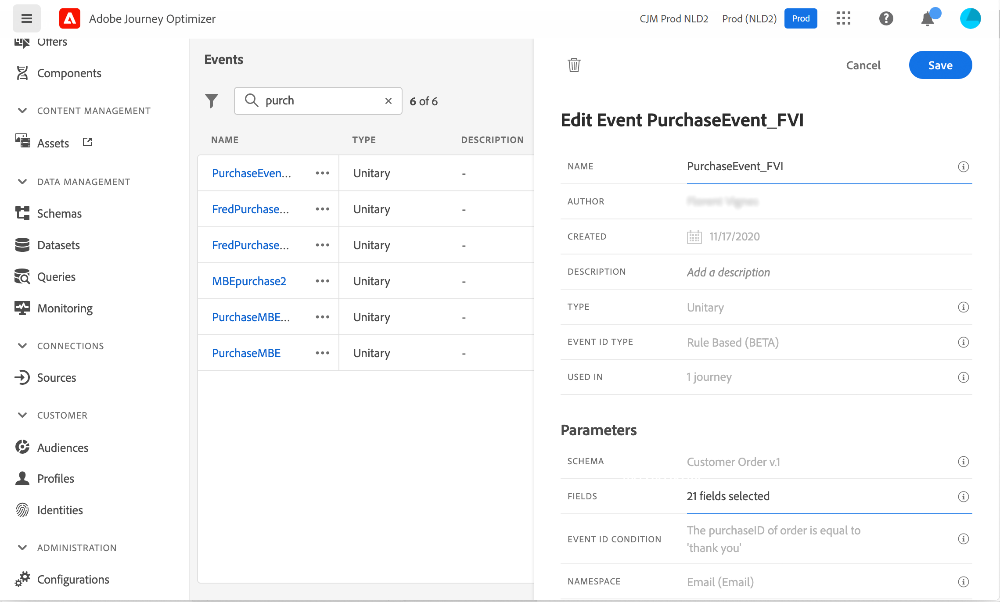

# Envío de un mensaje con Campaign v7/v8 {#campaign-v7-v8-use-case}

Este caso de uso explica todos los pasos necesarios para enviar un correo electrónico mediante la integración con Adobe Campaign v7 y Adobe Campaign v8.

>[!NOTE]
>
>Para utilizar esta integración, debe tener Campaign v7/v8 compilación 9125 o superior.

En primer lugar, cree una plantilla de correo electrónico transaccional en Campaign. A continuación, en Journey Optimizer, cree el evento, la acción y diseñe el recorrido.

Para obtener más información sobre la integración de Campaign, consulte estas páginas:

* [Creación de una acción de campaña](../action/acc-action.md)
* [Usando la acción en un recorrido](../building-journeys/using-adobe-campaign-v7-v8.md).

**Adobe Campaign**

La instancia de Campaign debe estar aprovisionada para esta integración. Se debe configurar la función Mensajería transaccional.

1. Inicie sesión en la instancia de control de Campaign.

1. En **Administración** > **Plataforma** > **Enumeraciones**, seleccione la enumeración **Tipo de evento** (eventType). Cree un nuevo tipo de evento (&quot;evento de recorrido&quot;, en nuestro ejemplo). Utilice el nombre interno del tipo de evento al escribir el archivo JSON más adelante.

   

1. Desconecte y vuelva a conectarse a la instancia para que la creación surta efecto.

1. En **Centro de mensajes** > **Plantillas de mensajes transaccionales**, cree una nueva plantilla de correo electrónico basada en el tipo de evento creado anteriormente.

   

1. Diseñe la plantilla. En este ejemplo, la personalización se aplica al nombre del perfil y al número de pedido. El nombre se encuentra en la fuente de datos de Adobe Experience Platform y el número de pedido es un campo del evento de Journey Optimizer. Asegúrese de utilizar los nombres de campo correctos en Campaign.

   

1. Publique la plantilla transaccional.

   

1. Escriba la carga útil JSON correspondiente a la plantilla.

```
{
     "channel": "email",
     "eventType": "journey-event",
     "email": "Email address",
     "ctx": {
          "firstName": "First name", "purchaseOrderNumber": "Purchase order number"
     }
}
```

* Para el canal, debe escribir &quot;correo electrónico&quot;.
* Para eventType, utilice el nombre interno del tipo de evento creado anteriormente.
* La dirección de correo electrónico es una variable, por lo que puede escribir cualquier etiqueta.
* En ctx, los campos de personalización también son variables.

**Journey Optimizer**

1. Cree un evento. Incluya el campo purchaseOrderNumber.

   

1. Cree una acción en Journey Optimizer correspondiente a la plantilla de Campaign. En la lista desplegable **Tipo de acción**, seleccione **Adobe Campaign Classic**.

   

1. Haga clic en **Campo de carga útil** y pegue el JSON creado anteriormente.

   

1. Para la dirección de correo electrónico y los dos campos personalizados, cambie **Constant** a **Variable**.

   

1. Ahora cree un nuevo recorrido e inicie con el evento creado anteriormente.

   

1. Añada la acción y asigne cada campo al campo correcto en Journey Optimizer.

   

1. Pruebe el recorrido.

   

1. Ahora puede publicar el recorrido.
