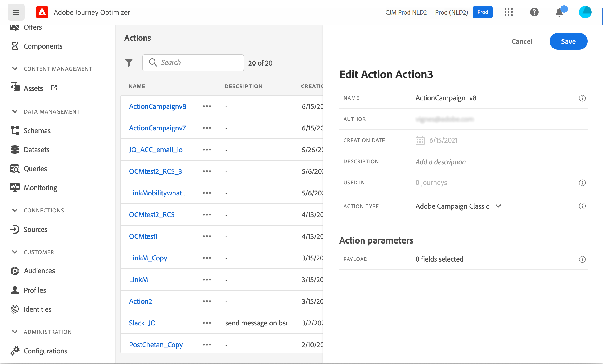

# Caso de uso: Envío de un mensaje mediante Campaign v7/v8 {#campaign-v7-v8-use-case}

Este caso de uso presenta todos los pasos necesarios para enviar un correo electrónico mediante la integración con Adobe Campaign v7 y Adobe Campaign v8.

>[!NOTE]
>
>Para utilizar esta integración, debe tener Campaign v7/v8 compilación 9125 o superior.

Primero crearemos una plantilla de correo electrónico transaccional en Campaign. A continuación, en Journey Optimizer, crearemos el evento, la acción y diseñaremos el recorrido.

Para obtener más información sobre la integración de Campaign, consulte estas páginas:

* [Creación de una acción de campaña](../action/acc-action.md)
* [Usando la acción en un recorrido](../building-journeys/using-adobe-campaign-v7-v8.md).

**Adobe Campaign**

La instancia de Campaign debe estar aprovisionada para esta integración. Es necesario configurar la función Mensajería transaccional.

1. Inicie sesión en la instancia de control de Campaign.

1. En **Administración** > **Plataforma** > **Enumeraciones**, seleccione la enumeración **Tipo de evento** (eventType). Cree un nuevo tipo de evento (&quot;evento de recorrido&quot;, en nuestro ejemplo). Tendrá que utilizar el nombre interno del tipo de evento al escribir el archivo JSON más adelante.

   

1. Desconecte y vuelva a conectarse a la instancia para que la creación sea eficaz.

1. En **Centro de mensajes** > **Plantillas de mensajes transaccionales**, cree una nueva plantilla de correo electrónico basada en el tipo de evento creado anteriormente.

   

1. Diseñe la plantilla. En este ejemplo, utilizamos la personalización del nombre del perfil y el número de pedido. El nombre está en la fuente de datos de Adobe Experience Platform y el número de pedido es un campo de nuestro evento de Journey Optimizer. Asegúrese de utilizar los nombres de campo correctos en Campaign.

   

1. Publish su plantilla transaccional.

   

1. Ahora debe escribir la carga útil JSON correspondiente a la plantilla.

```
{
     "channel": "email",
     "eventType": "journey-event",
     "email": "Email address",
     "ctx": {
          "firstName": "First name", "purchaseOrderNumber": "Purchase order number"
     }
}
```

* Para el canal, debe escribir &quot;correo electrónico&quot;.
* Para eventType, utilice el nombre interno del tipo de evento creado anteriormente.
* La dirección de correo electrónico es una variable, por lo que puede escribir cualquier etiqueta.
* En ctx, los campos de personalización también son variables.

**Journey Optimizer**

1. En primer lugar, debe crear un evento. Asegúrese de incluir el campo purchaseOrderNumber.

   

1. A continuación, debe crear en Journey Optimizer una acción que corresponda a la plantilla de Campaign. En la lista desplegable **Tipo de acción**, seleccione **Adobe Campaign Classic**.

   

1. Haga clic en **Campo de carga útil** y pegue el JSON creado anteriormente.

   

1. Para la dirección de correo electrónico y los dos campos personalizados, cambie **Constant** a **Variable**.

   

1. Ahora cree un nuevo recorrido e inicie con el evento creado anteriormente.

   

1. Añada la acción y asigne cada campo al campo correcto en Journey Optimizer.

   

1. Pruebe el recorrido.

   

1. Ahora puede publicar el recorrido.
