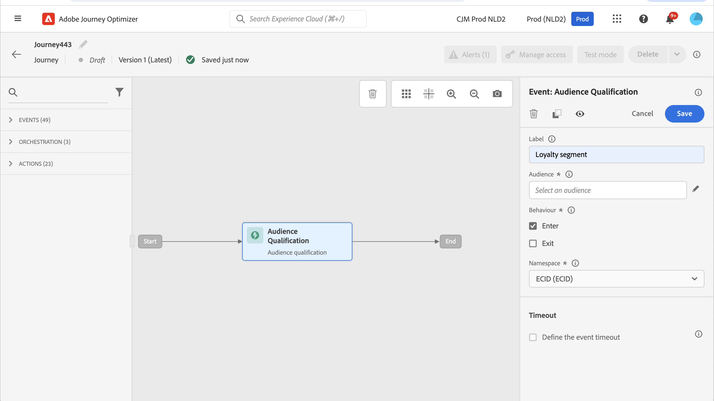

# Eventos de calificación de público {#segment-qualification}

>[!CONTEXTUALHELP]
>id="ajo_journey_event_segment_qualification"
>title="Eventos de calificación de público"
>abstract="Esta actividad escucha las entradas y salidas de perfiles en [!DNL Adobe Experience Platform] audiencias para mover a los individuos a través de un recorrido."

## Acerca de los eventos de calificación de público{#about-segment-qualification}

Esta actividad escucha las entradas y salidas de perfiles en [!DNL Adobe Experience Platform] audiencias. Puede hacer que las personas entren en un recorrido o avancen. Para obtener más información sobre la creación de audiencias, consulte esta [sección](../audience/about-audiences.md).

Supongamos que tiene un público de “clientes plata”. Con esta actividad, puede hacer que todos los clientes nuevos de Silver Ingresen a un recorrido y les envíen una serie de mensajes personalizados.

Este tipo de evento se puede colocar como primer paso o más tarde en el recorrido.

➡️ [Descubra esta funcionalidad en vídeo](#video)

>[!CAUTION]
>
>Antes de comenzar a configurar una calificación de audiencia, [lea las protecciones y limitaciones](#audience-qualification-guardrails).

## Configuración de la actividad {#configure-segment-qualification}

Para configurar la actividad **[!UICONTROL Calificación de audiencias]**, siga estos pasos:

1. Despliegue la categoría **[!UICONTROL Events]** y suelte una actividad **[!UICONTROL Audience Qualification]** en el lienzo.

   

1. Agregue una **[!UICONTROL Etiqueta]** a la actividad. Este paso es opcional.

1. Haga clic en el campo **[!UICONTROL Audiencia]** y seleccione las audiencias que desee aprovechar.

   >[!NOTE]
   >
   >Puede personalizar las columnas mostradas en la lista y ordenarlas.

   

   Una vez agregada la audiencia, el botón **[!UICONTROL Copiar]** le permite copiar su nombre e ID:

   `{"name":"Loyalty membership","id":"8597c5dc-70e3-4b05-8fb9-7e938f5c07a3"}`

   

1. En el campo **[!UICONTROL Comportamiento]**, elija si desea escuchar las entradas de la audiencia, las salidas o ambos.

   >[!NOTE]
   >
   >**[!UICONTROL Entrar]** y **[!UICONTROL Salir]** corresponden a los estados de participación de audiencia **Realizado** y **Salido** de [!DNL Adobe Experience Platform].
   >Consulte la [documentación del servicio de segmentación](https://experienceleague.adobe.com/docs/experience-platform/segmentation/tutorials/evaluate-a-segment.html#interpret-segment-results){target="_blank"}.

1. Seleccione un área de nombres. Esto solo es necesario si el evento se coloca como el primer paso del recorrido. De forma predeterminada, el campo está rellenado previamente con el último área de nombres utilizado.

   >[!NOTE]
   >
   >Solo puede seleccionar un área de nombres de identidad basada en personas.
   >Las áreas de nombres de tabla de búsqueda (por ejemplo, IdProducto para una búsqueda de producto) no están disponibles en la lista desplegable **Espacio de nombres**.

   

La carga útil contiene la siguiente información de contexto, que puede utilizar en condiciones y acciones:

* el comportamiento (entrada, salida)
* la marca de tiempo de la calificación
* el id de audiencia

Cuando utilice el editor de expresiones en una condición o acción que siga a una actividad **[!UICONTROL Calificación de audiencias]**, tendrá acceso al nodo **[!UICONTROL AudienceQualification]**. Puede elegir entre **[!UICONTROL Última hora de calificación]** y **[!UICONTROL estado]** (entrada o salida).

Consulte [Actividad de condición](../building-journeys/condition-activity.md#about_condition).

Un nuevo recorrido que incluye un evento de **Calificación de audiencias** entrará en funcionamiento diez minutos después de su publicación. Este intervalo coincide con el intervalo de actualización de caché del servicio dedicado. Espere diez minutos antes de usar este recorrido.

## Prácticas recomendadas {#best-practices-segments}

La actividad **[!UICONTROL Calificación de audiencias]** permite la entrada inmediata a recorridos para personas que califiquen o descalifiquen de una audiencia [!DNL Adobe Experience Platform].

La velocidad de recepción de esta información es alta. Las mediciones muestran 10 000 eventos recibidos por segundo. Planifique los picos de entrada, evitarlos cuando sea posible y prepare su recorrido para manejarlos. Obtenga más información acerca de las tasas de procesamiento de recorrido y los límites de rendimiento en [esta sección](entry-management.md#journey-processing-rate).

### Audiencias por lotes {#batch-speed-segment-qualification}

Cuando utilice la calificación de audiencia para una audiencia por lotes, tenga en cuenta que se produce un pico de entrada en el momento del cálculo diario. El tamaño del pico depende de cuántos individuos entren o salgan de la audiencia cada día.

Además, si la audiencia por lotes se crea recientemente y se utiliza inmediatamente en un recorrido, el primer lote de cálculo puede generar muchas entradas. Planifique este pico.

### Intervalos de las actualizaciones de miembros de segmentos {#timing-segment-membership}

Cuando se utilizan instantáneas por lotes en un recorrido, cualquier pertenencia a un segmento nuevo solo puede reflejarse en instantáneas posteriores. Si es esencial agregar segmentos inmediatamente o en el mismo día, considere la posibilidad de segmentar mediante streaming o verificar que la siguiente captura las actualizaciones de los segmentos.

### Audiencias transmitidas {#streamed-speed-segment-qualification}

Cuando se utiliza la calificación de audiencia para audiencias transmitidas, hay menos riesgo de picos de entrada y salida grandes porque la evaluación es continua. Si la definición de audiencia cualifica a muchos clientes a la vez, aún puede producirse un pico.

Evite utilizar la apertura y el envío de eventos con la segmentación de flujo continuo. En su lugar, utilice señales reales de actividad del usuario como clics, compras o datos de señalizaciones. Para la frecuencia o la lógica de supresión, utilice reglas empresariales en lugar de enviar eventos. [Más información](../audience/about-audiences.md)

Consulte la [[!DNL Adobe Experience Platform] documentación de segmentación de transmisión](https://experienceleague.adobe.com/en/docs/experience-platform/segmentation/methods/streaming-segmentation){target="_blank"}.

>[!NOTE]
>
>Para la segmentación de transmisión, los datos recién ingeridos pueden tardar hasta **2 horas** en propagarse completamente dentro de [!DNL Adobe Experience Platform] para su uso en tiempo real. Las audiencias que dependen de condiciones basadas en el día o en la hora (por ejemplo, &quot;eventos que se produjeron hoy&quot;) pueden experimentar una complejidad adicional en el tiempo de calificación. Si su recorrido depende de la calificación inmediata de la audiencia, considere la posibilidad de agregar una breve [actividad de espera](wait-activity.md) al principio. También puede permitir que el tiempo de búfer garantice una calificación precisa.

#### ¿Por qué no todos los perfiles cualificados pueden entrar en el recorrido? {#streaming-entry-caveats}

Al usar audiencias de streaming con la actividad **Calificación de audiencias**, no todos los perfiles aptos para la audiencia entrarán necesariamente en el recorrido. Este comportamiento puede producirse por las siguientes razones:

* **Perfiles que ya están en la audiencia**: Solo los perfiles que cumplan los requisitos para la audiencia después de que se publique el recorrido entrarán en la déclencheur. Los perfiles que ya están en la audiencia antes de la publicación no entrarán.

* **Tiempo de activación del Recorrido**: cuando publica un recorrido, la actividad de **Calificación de audiencias** tarda hasta **10 minutos** en activarse y comenzar a escuchar las entradas y salidas del perfil. [Más información acerca de la activación del recorrido](#configure-segment-qualification).

* **Salidas rápidas de la audiencia**: Si un perfil cumple los requisitos para la audiencia pero sale antes de activar la entrada de recorrido, es posible que ese perfil no entre en la recorrido.

* **Tiempo entre la calificación y el procesamiento del recorrido**: Debido a la naturaleza distribuida de [!DNL Adobe Experience Platform], puede haber espacios de tiempo. Un perfil puede cumplir los requisitos antes de que el recorrido procese el evento de calificación.

**Recomendaciones:**

* Después de publicar un recorrido, espere al menos 10 minutos antes de enviar eventos o datos que almacenarán en déclencheur la calificación de perfiles. Esto garantiza que la recorrido esté completamente activada y lista para procesar las entradas.

* En los casos de uso esenciales en los que deba asegurarse de que ingresen todos los perfiles calificados, considere la posibilidad de usar una actividad [Leer audiencia](read-audience.md) en su lugar. Procesa todos los perfiles de una audiencia en un momento específico.

* Monitorice la [tasa de entrada y el rendimiento](entry-management.md#profile-entrance-rate) de su recorrido para comprender los patrones de flujo de perfil.

* Si los perfiles no se introducen según lo esperado, consulte la [guía de solución de problemas](troubleshooting-execution.md#checking-if-people-enter-the-journey) para ver los pasos de diagnóstico adicionales.

### Cómo evitar sobrecargas {#overloads-speed-segment-qualification}

Estas son algunas prácticas recomendadas para evitar sobrecargar sistemas aprovechados en recorridos (fuentes de datos, acciones personalizadas, actividades de acción del canal):

* No utilice una audiencia por lotes inmediatamente después de crearla en una actividad **[!UICONTROL Calificación de audiencias]**. Esto evita el primer pico de cálculo. Si está a punto de usar una audiencia que nunca se ha calculado, aparecerá una advertencia amarilla en el lienzo de recorrido.

  ![Mensaje de error cuando no se encuentra la audiencia en [!DNL Adobe Experience Platform]](assets/segment-error.png)

* Establezca una regla de límite para las fuentes de datos y las acciones utilizadas en los recorridos para evitar sobrecargarlos. Obtenga más información en [Documentación de Journey Orchestration](https://experienceleague.adobe.com/docs/journeys/using/working-with-apis/capping.html){target="_blank"}. Tenga en cuenta que la regla de límite no tiene reintento. Si necesita volver a intentarlo, use una ruta alternativa en el recorrido marcando la casilla **[!UICONTROL Agregar una ruta alternativa en caso de tiempo de espera o error]** en condiciones o acciones.

* Antes de usar la audiencia en un recorrido de producción, evalúe el volumen de personas que cumplen los requisitos para esta audiencia diariamente. Para ello, compruebe el menú **[!UICONTROL Audiencia]**, abra la audiencia y observe el gráfico de **[!UICONTROL Perfiles a lo largo del tiempo]**.

  

Obtenga más información acerca de los límites de tasa de entrada y el rendimiento en [esta sección](entry-management.md#profile-entrance-rate).

## Mecanismos de protección y limitaciones {#audience-qualification-guardrails}

Siga las protecciones y recomendaciones que se indican a continuación para crear recorridos de calificación de audiencias. Consulte también [Prácticas recomendadas de calificación de audiencias](#best-practices-segments).

* Los recorridos de cualificación de audiencias están diseñados principalmente para trabajar con audiencias de streaming. Esta combinación garantiza una mejor experiencia en tiempo real. Se recomienda encarecidamente usar **audiencias de streaming** en la actividad de calificación de audiencias.

  Sin embargo, si desea utilizar atributos basados en la ingesta por lotes en la audiencia de flujo continuo o en una audiencia por lotes para un recorrido de calificación de audiencias, considere el lapso de tiempo para la evaluación/activación de audiencias. Una audiencia por lotes o una audiencia de streaming que use atributos ingeridos por lotes estará lista para usar en la actividad **Calificación de audiencias** aproximadamente **2 horas** después de que finalice el trabajo de segmentación. Este trabajo se ejecuta una vez al día a la hora definida por el administrador de la organización de Adobe.

* Las audiencias de [!DNL Adobe Experience Platform] se calculan una vez al día (**audiencias por lotes**) o en tiempo real (para audiencias de **transmisión por secuencias**, con la opción Audiencias de alta frecuencia de [!DNL Adobe Experience Platform]).

   * Si la audiencia seleccionada se transmite por secuencias, las personas que pertenecen a esta audiencia pueden entrar en el recorrido en tiempo real.
   * Si la audiencia es por lotes, las personas recién calificadas para esta audiencia potencialmente ingresarán al recorrido cuando el cálculo de audiencia se ejecute el [!DNL Adobe Experience Platform].

  Se recomienda usar audiencias de streaming en una actividad **Calificación de audiencias**. Para los casos de uso por lotes, utilice una actividad **[Leer audiencia](read-audience.md)**.

  >[!NOTE]
  >
  >Debido a la naturaleza de lote de las audiencias creadas mediante flujos de trabajo de composición y cargas personalizadas, estas audiencias no pueden segmentarse en una actividad &quot;Calificación de audiencias&quot;. En esta actividad solo se pueden aprovechar las audiencias creadas con definiciones de segmento.

* Los grupos de campos de evento de experiencia no se pueden usar en recorridos que comiencen por una actividad **Leer audiencia**, una **Calificación de audiencia** o un **Evento empresarial**.

* Cuando se usa una actividad **Calificación de audiencias** en un recorrido, esa actividad puede tardar hasta 10 minutos en estar activa y en escuchar los perfiles que entran o salen de la audiencia.

>[!CAUTION]
>
>[Las protecciones para los datos y la segmentación del perfil del cliente en tiempo real](https://experienceleague.adobe.com/docs/experience-platform/profile/guardrails.html?lang=es){target="_blank"} también se aplican a [!DNL Adobe Journey Optimizer].

## Vídeo práctico {#video}

Comprenda los casos de uso aplicables para los recorridos de calificación de audiencias en este vídeo. Obtenga información sobre cómo crear un recorrido con la calificación de audiencias y las prácticas recomendadas que se deben aplicar.

>[!VIDEO](https://video.tv.adobe.com/v/3425028?quality=12)
