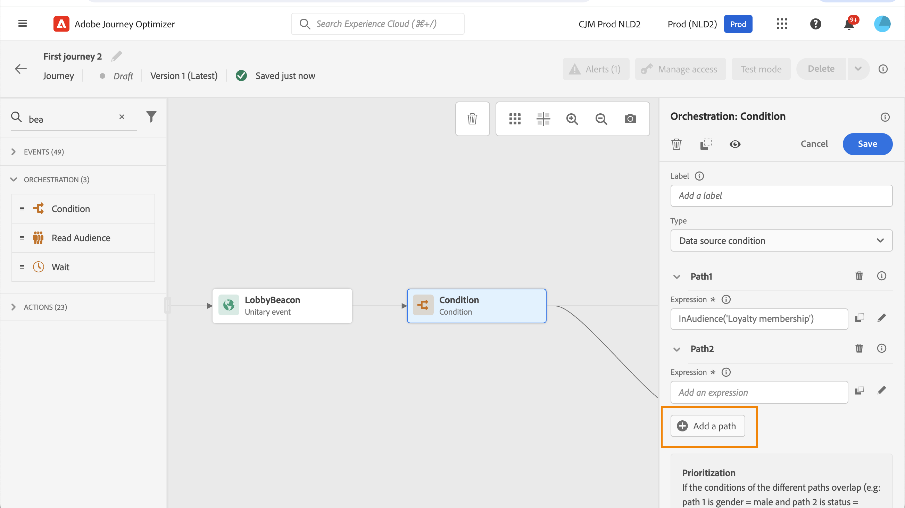

# Actividad de condición {#condition-activity}

## Añadir una actividad de condición {#add-condition-activity}

>[!CONTEXTUALHELP]
>id="ajo_journey_condition"
>title="Actividad de condición"
>abstract="La actividad **Condición** le permite definir cómo progresan los individuos a través de su recorrido creando múltiples rutas basadas en criterios específicos. También puede configurar una ruta alternativa para gestionar tiempos de espera o errores, lo que garantiza una experiencia sin problemas."

La actividad **Condición** le permite definir cómo progresan los individuos a través de su recorrido creando múltiples rutas basadas en criterios específicos. También puede configurar una ruta alternativa para gestionar tiempos de espera o errores, lo que garantiza una experiencia sin problemas.

Los siguientes tipos de condiciones están disponibles:

* [Condición de Source de datos](#data_source_condition)
* [Condición de tiempo](#time_condition)
* [División porcentual](#percentage_split)
* [Condición de fecha](#date_condition)
* [Límite de perfil](#profile_cap)

También puede utilizar una audiencia en una condición de recorrido. [Más información](#using-a-segment). Para obtener más información sobre cómo generar y segmentar audiencias, consulte [esta sección](../audience/about-audiences.md)

>[!NOTE]
>
>La evaluación de condición fallará para los perfiles que incluyan más de dos identidades entre dispositivos en el [Almacén de perfiles](https://experienceleague.adobe.com/docs/experience-platform/profile/home.html#profile-data-store){target="_blank"}.

## Adición y administración de rutas de condición {#about_condition}

>[!CONTEXTUALHELP]
>id="ajo_journey_expression_simple"
>title="Acerca del editor de expresiones simple"
>abstract="El modo de editor de expresiones simple permite realizar consultas simples basadas en una combinación de campos. Todos los campos disponibles se muestran en la parte izquierda de la pantalla. Arrastre y suelte los campos en la zona principal. Para combinar los diferentes elementos, conéctelos entre sí para crear diferentes grupos o niveles de grupo. A continuación, puede seleccionar un operador lógico para combinar elementos en el mismo nivel."

Al utilizar varias condiciones en un recorrido, puede definir etiquetas para cada una de ellas para identificarlas más fácilmente.

Haga clic en **[!UICONTROL Agregar una ruta]** si desea definir varias condiciones. Para cada condición, se agrega una nueva ruta en el lienzo después de la actividad.

Tenga en cuenta que el diseño de los recorridos tiene impactos funcionales. Cuando se definen varias rutas después de una condición, solo se ejecuta la primera ruta elegible. Esto significa que puede variar la priorización de las rutas colocándolas una encima o debajo de la otra.

Veamos el ejemplo de la condición de una primera ruta &quot;La persona es un VIP&quot; y de una segunda ruta &quot;La persona es un hombre&quot;. Si una persona que cumple ambas condiciones (un hombre que es un VIP) pasa este paso, se elige la primera ruta aunque esta persona también sea elegible para la segunda, ya que la primera ruta es &quot;arriba&quot;. Para cambiar esta prioridad, mueva las actividades en otro orden vertical.

Puede crear otra ruta para las audiencias que no cumplan los requisitos para las condiciones definidas marcando **[!UICONTROL Mostrar ruta para otros casos que no sean los anteriores]**. Tenga en cuenta que esta opción no está disponible en condiciones de división. Consulte [División porcentual](#percentage_split).

El modo simple permite realizar consultas simples basadas en una combinación de campos. Todos los campos disponibles se muestran en la parte izquierda de la pantalla. Arrastre y suelte los campos en la zona principal. Para combinar los diferentes elementos, conéctelos entre sí para crear diferentes grupos o niveles de grupo. A continuación, puede seleccionar un operador lógico para combinar elementos en el mismo nivel:

* Y: una intersección de dos criterios. Solo se tienen en cuenta los elementos que coinciden con todos los criterios.
* OR: una unión de dos criterios. Se tienen en cuenta los elementos que coinciden con al menos uno de los dos criterios.

Si está usando el [servicio de segmentación de Adobe Experience Platform](https://experienceleague.adobe.com/docs/experience-platform/segmentation/home.html?lang=es){target="_blank"} para crear sus audiencias, puede aprovecharlas en sus condiciones de recorrido. Consulte [Uso de la audiencia en condiciones](../building-journeys/condition-activity.md#using-a-segment). Para obtener más información sobre cómo generar y segmentar audiencias en Journey Optimizer, consulte [esta sección](../audience/about-audiences.md).

>[!NOTE]
>
>No puede realizar consultas en series temporales (por ejemplo, una lista de compras, clics pasados en mensajes) con el editor simple. Para ello, deberá utilizar el editor avanzado. Consulte [esta página](expression/expressionadvanced.md).

Cuando se produce un error en una acción o condición, se detiene el recorrido de un individuo. La única manera de continuar es marcar la casilla **[!UICONTROL Agregar una ruta alternativa en caso de tiempo de espera o error]**. Consulte [esta sección](../building-journeys/using-the-journey-designer.md#paths).

En el editor simple, también encontrará la categoría Propiedades del Recorrido, debajo de las categorías de evento y fuente de datos. Esta categoría contiene campos técnicos relacionados con el recorrido de un perfil determinado. Esta es la información recuperada por el sistema de los recorridos activos, como el ID de recorrido o los errores específicos encontrados. [Más información](expression/journey-properties.md)

## Condición de Data Source {#data_source_condition}

Use una **[!UICONTROL condición de Data Source]** para definir una condición basada en los campos de las fuentes de datos o en los eventos previamente colocados en el recorrido. Este tipo de condición se define con el editor de expresiones. Aprenda a utilizar el editor de expresiones en [esta sección](expression/expressionadvanced.md).

Por ejemplo, si va a segmentar una audiencia con atributos de enriquecimiento generados mediante un flujo de trabajo de composición o una carga personalizada (archivo CSV), puede aprovechar estos atributos de enriquecimiento para crear la condición.

>[!IMPORTANT]
>
>**Administrar atributos que faltan o no se han ingerido**
>
>Si un campo de esquema está definido en el esquema de Perfil pero no se han introducido datos para ese campo, Journey Optimizer y el Perfil del cliente en tiempo real subyacente interpretan el campo como `null`. Como resultado, las condiciones que comprueban `isEmpty()`, `isNull()` o funciones similares se evaluarán como `true` aunque el atributo nunca se haya ingerido. Esto puede provocar un comportamiento de recorrido inesperado si no sabe que el campo no tiene datos.
>
>Para evitar confusiones, asegúrese de que los atributos que utiliza en expresiones de condición se hayan introducido con datos reales antes de que el perfil entre en el recorrido. Puede comprobar los valores de atributo en el [Perfil del cliente en tiempo real](https://experienceleague.adobe.com/docs/experience-platform/profile/home.html?lang=es){target="_blank"} para confirmar si existen datos para los campos utilizados en sus condiciones.

Con el editor de expresiones avanzadas, puede configurar condiciones más avanzadas manipulando colecciones o utilizando fuentes de datos que requieran el paso de parámetros. [Más información](../datasource/external-data-sources.md).

## Condición de tiempo {#time_condition}

Use una **[!UICONTROL condición horaria]** para realizar diferentes acciones según la hora del día o el día de la semana. Por ejemplo, puede decidir enviar notificaciones push durante el día y correos electrónicos por la noche durante los días laborables.

>[!NOTE]
>
>* La zona horaria no es específica de una condición y se define en el nivel de recorrido en las propiedades del recorrido. Obtenga más información en [esta página](../building-journeys/timezone-management.md).
>
>* De manera predeterminada, la **[!UICONTROL condición de tiempo]** se establece por hora, de 00:00 a 12:00.

Hay tres opciones de filtrado disponibles:

* Hora: permite configurar una condición en función de la hora del día. A continuación, defina las horas de inicio y finalización. Las personas introducirán la ruta solo durante el intervalo de horas definido.
* Día de la semana: permite configurar una condición basada en el día de la semana. A continuación, seleccione los días en los que desea que los individuos introduzcan la ruta.
* Día de la semana y la hora: esta opción combina las dos primeras opciones.

## División porcentual {#percentage_split}

Esta opción le permite dividir aleatoriamente la audiencia para definir una acción diferente para cada grupo. Defina el número de divisiones y la repartición para cada ruta. El cálculo de la división es estadístico, ya que el sistema no puede anticipar cuántas personas fluirán en esta actividad del recorrido. Como resultado, la división tiene un margen de error muy bajo. Esta función se basa en un mecanismo aleatorio de Java (consulte esta [página](https://docs.oracle.com/javase/7/docs/api/java/util/Random.html){target="_blank"}).

En el modo de prueba, al alcanzar una división, siempre se elige la rama superior. Puede reorganizar la posición de las ramas divididas si desea que la prueba elija una ruta diferente. Consulte [esta página](../building-journeys/testing-the-journey.md)

>[!NOTE]
>
>Tenga en cuenta que no hay ningún botón para añadir una ruta en la condición de división de porcentaje. El número de rutas dependerá del número de divisiones. En condiciones de división, no se puede añadir una ruta para otros casos, ya que no puede ocurrir. La gente siempre irá en uno de los caminos divididos.

## Condición de fecha {#date_condition}

Esto le permite definir un flujo diferente en función de la fecha. Por ejemplo, si la persona introduce el paso durante el periodo de &quot;ventas&quot;, se le envía un mensaje específico. El resto del año, enviarás otro mensaje.

>[!NOTE]
>
>La zona horaria ya no es específica de una condición y ahora se define en el nivel de recorrido en las propiedades del recorrido. Consulte [esta página](../building-journeys/timezone-management.md).

## Límite de perfil {#profile_cap}

Utilice este tipo de condición para establecer un número máximo de perfiles para una ruta de recorrido. Cuando se alcanza este límite, los perfiles que se introducen toman una ruta alternativa. Esto garantiza que los recorridos nunca superen el límite definido.

>[!NOTE]
>
>Le recomendamos que defina un límite de perfil de alto valor. La precisión y la probabilidad de que una población alcance el número máximo exacto solo aumentan a medida que aumenta el límite. En el caso de los números pequeños (por ejemplo, un máximo de 50), los números no siempre coinciden, ya que es posible que no se alcance el límite antes de que los perfiles sigan una ruta alternativa.

<!--You can use this condition type to ramp up the volume of your deliveries. See this [use case](ramp-up-deliveries-uc.md).-->

El límite predeterminado es 1000.

El contador sólo se aplica a la versión de recorrido seleccionada. El contador se restablece en cero cuando se duplica el recorrido o cuando se crea una nueva versión. Después de un restablecimiento, los perfiles que se introducen vuelven a tomar la ruta nominal hasta que se alcanza el límite del contador.

Cuando el límite del perfil se define en un recorrido recurrente, el contador no se restablece después de cada repetición.

La trayectoria nominal siempre tiene prioridad sobre la trayectoria alternativa, incluso si se mueve la trayectoria alternativa por encima de la trayectoria nominal en el lienzo de recorrido.

Para los recorridos activos, estos son los umbrales que se deben tener en cuenta para garantizar que se alcance el límite:

* Para un capuchón superior a 10 000, el número de perfiles distintos a inyectar debe ser al menos 1,3 veces el capuchón.
* Para un límite inferior a 10 000, el número de perfiles distintos a inyectar debe ser de 1000 más el límite.

En el modo de prueba no se tiene en cuenta el límite de perfil.

## Uso de audiencias en condiciones {#using-a-segment}

En esta sección se explica cómo utilizar una audiencia en una condición de recorrido. Para obtener más información sobre las audiencias y cómo crearlas, consulte [esta sección](../audience/about-audiences.md).

Para utilizar una audiencia en una condición de recorrido, siga estos pasos:

1. Abra un recorrido, suelte una actividad **[!UICONTROL Condición]** y elija la **Condición de Source de datos**.

   

1. Haga clic en **[!UICONTROL Agregar una ruta]** para cada ruta adicional necesaria. Para cada ruta, haga clic en el campo **[!UICONTROL Expression]**.

1. En el lado izquierdo, despliegue el nodo **[!UICONTROL Audiences]**. Arrastre y suelte la audiencia que desee utilizar para la condición. De forma predeterminada, la condición de la audiencia es verdadera.

   

   >[!NOTE]
   >
   >Tenga en cuenta que solamente las personas con el estado de participación de audiencia **Realized** se considerarán miembros de la audiencia. Para obtener más información sobre cómo evaluar una audiencia, consulte la [documentación del servicio de segmentación](https://experienceleague.adobe.com/docs/experience-platform/segmentation/tutorials/evaluate-a-segment.html#interpret-segment-results){target="_blank"}.
