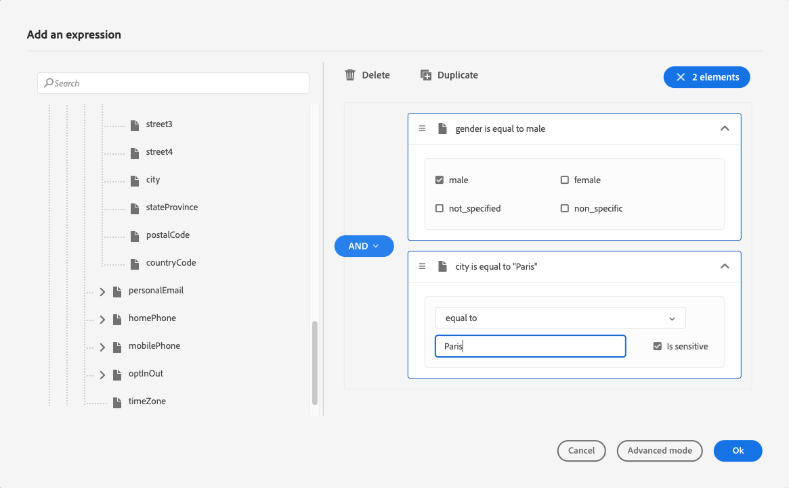
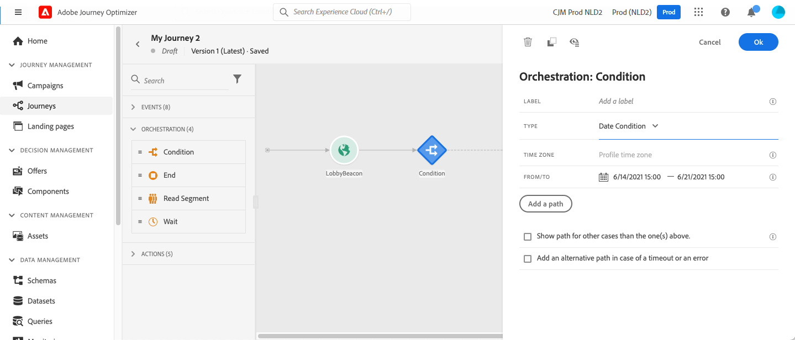

# Condiciones {#conditions}

>[!BEGINSHADEBOX]

**En esta página:** Aprenda a utilizar las condiciones en la actividad de optimización para crear varias rutas de recorrido basadas en fuentes de datos, tiempo, fechas, divisiones porcentuales, límites de perfil o pertenencia a audiencias.

>[!ENDSHADEBOX]

>[!CONTEXTUALHELP]
>id="ajo_journey_conditions"
>title="Condiciones"
>abstract="Las condiciones le permiten definir cómo progresan los individuos a través de su recorrido creando múltiples rutas basadas en criterios específicos. También puede configurar una ruta alternativa para gestionar tiempos de espera o errores, lo que garantiza una experiencia sin problemas. Tenga en cuenta que las condiciones ahora se configuran en la actividad Optimizar, que reemplaza a la actividad Condición anterior."

Con **condiciones** puede definir el progreso de los individuos en su recorrido creando múltiples rutas basadas en criterios específicos. También puede configurar una ruta alternativa para gestionar tiempos de espera o errores, lo que garantiza una experiencia sin problemas.

>[!NOTE]
>
>El nuevo vehículo para crear rutas condicionales en recorrido es la actividad [Optimizar](optimize.md). Reemplaza la actividad **Condición** anterior, que se ha eliminado de la interfaz de usuario. Toda la lógica condicional ahora se gestiona mediante las condiciones de la actividad Optimizar presentadas en esta página.
>
>Si tiene recorridos existentes que usaron actividades **[!UICONTROL Condition]**, puede seguir usándolos como antes. Ahora aparecen con un nuevo icono como actividades **[!UICONTROL Optimize]** mediante el método **[!UICONTROL Condition]**, pero el comportamiento no ha cambiado. Se conservará cualquier etiqueta personalizada que haya establecido en el nodo.

## Añada una condición {#add-condition-activity}

Para añadir una condición al recorrido, siga los pasos a continuación.

1. Suelte la actividad **[!UICONTROL Optimize]** en el lienzo de recorrido. [Más información](optimize.md)

1. Añada una etiqueta opcional para identificar la actividad en los registros de los modos de prueba y creación de informes.

1. Seleccione una condición de la lista desplegable **[!UICONTROL Método]**.

   {width=80%}

   Los siguientes tipos de condiciones están disponibles:

   * [Condición de origen de datos](#data_source_condition)
   * [Condición de tiempo](#time_condition)
   * [División porcentual](#percentage_split)
   * [Condición de fecha](#date_condition)
   * [Límite de perfil](#profile_cap)
   * También puede utilizar una audiencia en una condición de recorrido. [Más información](#using-a-segment)

>[!NOTE]
>
>La evaluación de condición fallará para los perfiles que incluyan más de dos identidades entre dispositivos en el [Almacén de perfiles](https://experienceleague.adobe.com/docs/experience-platform/profile/home.html?lang=es#profile-data-store){target="_blank"}.

## Administrar rutas de condición {#condition_paths}

>[!CONTEXTUALHELP]
>id="ajo_journey_expression_simple2"
>title="Acerca del editor de expresiones simple"
>abstract="El modo de editor de expresiones simple permite realizar consultas simples basadas en una combinación de campos. Todos los campos disponibles se muestran en la parte izquierda de la pantalla. Los campos se arrastran y sueltan en la zona principal. Para combinar los diferentes elementos, se conectan entre sí para crear diferentes grupos o niveles de grupo. A continuación, un operador lógico combina elementos en el mismo nivel."

Al utilizar varias condiciones en un recorrido, puede definir etiquetas para cada una de ellas para identificarlas más fácilmente.

Haga clic en **[!UICONTROL Agregar una ruta]** si desea definir varias condiciones. Para cada condición, se agrega una nueva ruta en el lienzo después de la actividad.

{width=80%}

Tenga en cuenta que el diseño de los recorridos tiene impactos funcionales. Cuando se definen varias rutas después de una condición, solo se ejecuta la primera ruta elegible. Esto significa que puede variar la priorización de las rutas colocándolas una encima o debajo de la otra.

Tomemos dos condiciones de ruta: &quot;La persona es un VIP&quot; y &quot;La persona es un hombre&quot;. Si una persona cumple ambas condiciones, se elige la primera ruta porque está por encima de la segunda. Para cambiar esta prioridad, mueva las actividades a un orden vertical diferente.

Puede crear otra ruta para las audiencias que no cumplan los requisitos para las condiciones definidas marcando **[!UICONTROL Mostrar ruta para otros casos que no sean los anteriores]**.

>[!NOTE]
>
>Esta opción no está disponible en condiciones de división. [Más información](#percentage_split)

El modo simple permite realizar consultas simples basadas en una combinación de campos. Todos los campos disponibles se muestran en la parte izquierda de la pantalla. Arrastre y suelte los campos en la zona principal. Para combinar los diferentes elementos, conéctelos entre sí para crear diferentes grupos o niveles de grupo. A continuación, puede seleccionar un operador lógico para combinar elementos en el mismo nivel:

* **AND**: una intersección de dos criterios. Solo se tienen en cuenta los elementos que coinciden con todos los criterios.
* **OR**: una unión de dos criterios. Se tienen en cuenta los elementos que coinciden con al menos uno de los dos criterios.

{width=80%}

Si está usando el [servicio de segmentación de Adobe Experience Platform](https://experienceleague.adobe.com/docs/experience-platform/segmentation/home.html?lang=es){target="_blank"} para crear sus audiencias, puede aprovecharlas en sus condiciones de recorrido. Consulte [Usar audiencia en condiciones](#using-a-segment).

>[!NOTE]
>
>No puede realizar consultas en series temporales (por ejemplo, una lista de compras, clics pasados en mensajes) con el editor simple. Para ello, deberá utilizar el editor avanzado. Consulte [esta página](expression/expressionadvanced.md).

Cuando se produce un error en una acción o condición, se detiene el recorrido de un individuo. La única manera de continuar es marcar la casilla **[!UICONTROL Agregar una ruta alternativa en caso de tiempo de espera o error]**. [Más información](../building-journeys/using-the-journey-designer.md#paths)

En el editor simple, también encontrará la categoría Propiedades del Recorrido, debajo de las categorías de evento y fuente de datos. Esta categoría contiene campos técnicos relacionados con el recorrido de un perfil determinado. Esta es la información recuperada por el sistema de los recorridos activos, como el ID de recorrido o los errores específicos encontrados. [Más información](expression/journey-properties.md)

## Condición de fuente de datos {#data_source_condition}

Use una **[!UICONTROL condición de origen de datos]** para definir una condición basada en los campos de los orígenes de datos o en los eventos colocados previamente en el recorrido. Este tipo de condición se define con el editor de expresiones. [Aprenda a utilizar el editor de expresiones](expression/expressionadvanced.md)

Por ejemplo, si va a segmentar una audiencia con atributos de enriquecimiento generados mediante un flujo de trabajo de composición o una carga personalizada (archivo CSV), puede aprovechar estos atributos de enriquecimiento para crear la condición.

>[!IMPORTANT]
>
>**Administrar atributos que faltan o no se han ingerido**
>
>Si un campo de esquema está definido en el esquema de Perfil pero no se han introducido datos para ese campo, Journey Optimizer y el Perfil del cliente en tiempo real subyacente interpretan el campo como `null`. Como resultado, las condiciones que comprueban `isEmpty()`, `isNull()` o funciones similares se evaluarán como `true` aunque el atributo nunca se haya ingerido. Esto puede provocar un comportamiento de recorrido inesperado si no sabe que el campo no tiene datos.
>
>Para evitar confusiones, asegúrese de que los atributos que utiliza en expresiones de condición se hayan introducido con datos reales antes de que el perfil entre en el recorrido. Puede comprobar los valores de atributo en el [Perfil del cliente en tiempo real](https://experienceleague.adobe.com/docs/experience-platform/profile/home.html?lang=es){target="_blank"} para confirmar si existen datos para los campos utilizados en sus condiciones.

Con el editor de expresiones avanzadas, puede configurar condiciones más avanzadas manipulando colecciones o utilizando fuentes de datos que requieran el paso de parámetros. [Más información](../datasource/external-data-sources.md)

{width=80%}

## Condición de fecha {#date_condition}

Esto le permite definir un flujo diferente en función de la fecha. Por ejemplo, si la persona introduce el paso durante el periodo de &quot;ventas&quot;, se le envía un mensaje específico. El resto del año, enviarás otro mensaje.

>[!NOTE]
>
>La zona horaria ya no es específica de una condición y ahora se define en el nivel de recorrido en las propiedades del recorrido. [Más información](../building-journeys/timezone-management.md)

## División porcentual {#percentage_split}

Esta opción le permite dividir aleatoriamente la audiencia para definir una acción diferente para cada grupo. Defina el número de divisiones y la repartición para cada ruta. El cálculo de la división es estadístico, ya que el sistema no puede anticipar cuántas personas fluirán en esta actividad del recorrido. Como resultado, la división tiene un margen de error muy bajo. Esta función se basa en un [mecanismo aleatorio de Java](https://docs.oracle.com/javase/7/docs/api/java/util/Random.html){target="_blank"}.

En el modo de prueba, al alcanzar una división, siempre se elige la rama superior. Puede reorganizar la posición de las ramas divididas si desea que la prueba elija una ruta diferente. [Más información](../building-journeys/testing-the-journey.md)

>[!NOTE]
>
>Tenga en cuenta que no hay ningún botón para añadir una ruta en la condición de división de porcentaje. El número de rutas dependerá del número de divisiones. En condiciones de división, no se puede añadir una ruta para otros casos, ya que no puede ocurrir. La gente siempre irá en uno de los caminos divididos.

## Condición de tiempo {#time_condition}

Use una **[!UICONTROL condición horaria]** para realizar diferentes acciones según la hora del día o el día de la semana. Por ejemplo, puede decidir enviar notificaciones push durante el día y correos electrónicos por la noche durante los días laborables.

>[!NOTE]
>
>* La zona horaria no es específica de una condición y se define en el nivel de recorrido en las propiedades del recorrido. [Más información](../building-journeys/timezone-management.md)
>
>* De manera predeterminada, la **[!UICONTROL condición de tiempo]** se establece por hora, de 00:00 a 12:00.

Hay tres opciones de filtrado disponibles:

* **Hora**: permite configurar una condición en función de la hora del día. A continuación, defina las horas de inicio y finalización. Las personas introducirán la ruta solo durante el intervalo de horas definido.
* **Día de la semana**: le permite configurar una condición basada en el día de la semana. A continuación, seleccione los días en los que desea que los individuos introduzcan la ruta.
* **Día de la semana y la hora**: esta opción combina las dos primeras opciones.

## Límite de perfil {#profile_cap}

Utilice este tipo de condición para establecer un número máximo de perfiles para una ruta de recorrido. Cuando se alcanza este límite, los perfiles que se introducen toman una ruta alternativa. Esto garantiza que los recorridos nunca superen el límite definido.

>[!NOTE]
>
>Le recomendamos que defina un límite de perfil de alto valor. La precisión y la probabilidad de que una población alcance el número máximo exacto solo aumentan a medida que aumenta el límite. En el caso de los números pequeños (por ejemplo, un máximo de 50), los números no siempre coinciden, ya que es posible que no se alcance el límite antes de que los perfiles sigan una ruta alternativa.

<!--You can use this condition type to ramp up the volume of your deliveries. See this [use case](ramp-up-deliveries-uc.md).-->

El límite predeterminado es 1000.

El contador sólo se aplica a la versión de recorrido seleccionada. El contador se restablece en cero cuando se duplica el recorrido o cuando se crea una nueva versión. Después de un restablecimiento, los perfiles que se introducen vuelven a tomar la ruta nominal hasta que se alcanza el límite del contador.

Cuando el límite del perfil se define en un recorrido recurrente, el contador no se restablece después de cada repetición.

La trayectoria nominal siempre tiene prioridad sobre la trayectoria alternativa, incluso si se mueve la trayectoria alternativa por encima de la trayectoria nominal en el lienzo de recorrido.

Para los recorridos activos, estos son los umbrales que se deben tener en cuenta para garantizar que se alcance el límite:

* Para un capuchón superior a 10 000, el número de perfiles distintos a inyectar debe ser al menos 1,3 veces el capuchón.
* Para un límite inferior a 10 000, el número de perfiles distintos a inyectar debe ser de 1000 más el límite.

En el modo de prueba no se tiene en cuenta el límite de perfil.

## Uso de audiencias en condiciones {#using-a-segment}

En esta sección se explica cómo utilizar una audiencia en una condición de recorrido. Para obtener más información sobre las audiencias y cómo crearlas, consulte [esta sección](../audience/about-audiences.md).

Para utilizar una audiencia en una condición de recorrido, siga estos pasos:

1. Abra un recorrido, suelte una actividad **[!UICONTROL Optimizar]** y elija la **[!UICONTROL condición de origen de datos]**.

   

1. Haga clic en **[!UICONTROL Agregar una ruta]** para cada ruta adicional necesaria. Para cada ruta, haga clic en el campo **[!UICONTROL Expression]**.

1. En el lado izquierdo, despliegue el nodo **[!UICONTROL Audiences]**. Arrastre y suelte la audiencia que desee utilizar para la condición. De forma predeterminada, la condición de la audiencia es verdadera.

   ![Nodo de audiencias en el editor de expresiones para seleccionar [!DNL Adobe Experience Platform] audiencias](assets/segment4.png){width=80%}

   >[!NOTE]
   >
   >Tenga en cuenta que solamente las personas con el estado de participación de audiencia **Realized** se considerarán miembros de la audiencia. Para obtener más información sobre cómo evaluar una audiencia, consulte la [documentación del servicio de segmentación](https://experienceleague.adobe.com/docs/experience-platform/segmentation/tutorials/evaluate-a-segment.html?lang=es#interpret-segment-results){target="_blank"}.

➡️ **Véalo en la práctica:** Aprenda a utilizar las condiciones de tiempo y día de la semana para [enviar correos electrónicos solo entre semana](weekday-email-uc.md).

+++ Referencia de conocimientos de AI

Esta sección contiene conocimientos estructurados destinados a apoyar la interpretación, la recuperación y la respuesta a preguntas relacionadas con este tema.

Para una comprensión completa, esta información debe combinarse con la documentación de esta página. Ninguna de las fuentes pretende ser independiente; la página describe la función, mientras que esta sección proporciona contexto adicional que ayuda a desambiguar la terminología, la intención, la aplicabilidad y las restricciones.

* **TL;DR:** En esta página se explica cómo configurar condiciones dentro de la actividad Optimizar en Journey Optimizer, que abarca cinco tipos de condición (Data Source, Hora, Porcentaje dividido, Fecha y Límite de perfil) que enrutan perfiles a diferentes rutas de recorrido en función de reglas, tiempo o pertenencia a audiencias.

**Intenciones:**
* Añada una condición a un recorrido mediante la actividad Optimizar y seleccione un método de condición
* Cree varias rutas de ramificación y administre su orden de prioridad en el lienzo de recorrido
* Configuración de una condición de Data Source mediante el editor de expresiones para evaluar atributos de perfil o evento
* Configure una condición Hora para enrutar perfiles en función de la hora del día o del día de la semana
* Aplique un límite de perfil para limitar el número de perfiles distribuidos en una ruta específica
* Usar una comprobación de pertenencia a audiencia como condición en una ruta de recorrido

**Glosario:**
* **Optimizar actividad**: la actividad de recorrido actual que reemplaza a la actividad anterior de Condición; toda la lógica de ramificación condicional se ha configurado ahora mediante su lista desplegable de Métodos *(específico del producto)*
* **Condición de origen de datos**: método de condición que evalúa campos de orígenes de datos o eventos de recorrido mediante el editor de expresiones *(específico del producto)*
* **División porcentual**: método de condición que distribuye aleatoriamente perfiles entre rutas mediante un mecanismo aleatorio estadístico de Java *(específico del producto)*
* **Límite de perfil**: Método de condición que enruta los perfiles a una ruta alternativa una vez que se alcanza un recuento máximo definido en la ruta nominal *(específica del producto)*
* **Ruta de acceso nominal**: La ruta de acceso de recorrido principal asociada con una condición Límite de perfil; siempre tiene prioridad sobre la ruta de acceso alternativa *(específica del producto)*

**Protecciones:**
* La evaluación de condiciones falla para perfiles con más de dos identidades entre dispositivos en el almacén de perfiles
* Los campos de esquema sin datos ingeridos se interpretan como nulos; isEmpty() y isNull() se evalúan como true para dichos campos
* La zona horaria se define en el nivel de recorrido, no en el nivel de condición individual
* La opción &quot;Mostrar ruta para otros casos&quot; no está disponible en las condiciones de división de porcentaje
* El límite predeterminado del perfil es 1000; el contador se restablece en la duplicación de recorridos o en la creación de una nueva versión, pero no entre recurrencias
* En los capuchones de más de 10.000, inyecte al menos 1,3x el capuchón; en los de menos de 10.000, inyecte al menos 1.000 cápsulas más el capuchón
* El límite de perfil no se aplica en el modo de prueba; en el modo de prueba, la rama superior siempre se elige para División porcentual

**Terminología:**
* Nombre canónico: Conditions — Acrónimo: none — variants: actividad de condición, método de condición, ramificación condicional
* Sinónimos: &quot;Optimizar actividad (método de condición)&quot; = &quot;actividad de condición anterior&quot;
* No confunda: &quot;División porcentual&quot; ≠ &quot;Límite de perfil&quot; (la división porcentual distribuye todos los perfiles estadísticamente; el límite de perfil detiene el enrutamiento a la ruta nominal después de un umbral de recuento)

**PREGUNTAS MÁS FRECUENTES:**
* **Q: la actividad Condición ha desaparecido de mi interfaz de usuario. ¿Qué la reemplazó?** — la actividad Condición se ha sustituido por la actividad Optimizar. Seleccione &quot;Condición&quot; en la lista desplegable Método para obtener el mismo comportamiento. Los recorridos existentes con actividades de Condición siguen funcionando y ahora se muestran con el icono Optimizar.
* **Q: cuando varias rutas de acceso cumplen los requisitos para un perfil, ¿qué ruta se toma?** — Solo se ejecuta la primera ruta elegible (la más alta del lienzo); puede volver a priorizar reordenando las rutas verticalmente.
* **Q: ¿Por qué mi condición isEmpty() se evalúa inesperadamente como true?** — Si el campo de esquema existe pero no se han introducido datos para él, Journey Optimizer lo interpreta como nulo, lo que provoca que isEmpty() y isNull() devuelvan el valor verdadero.
* **Q: ¿Se restablece el contador de límite de perfil en un recorrido recurrente?** — No, el contador no se restablece entre repeticiones; sólo se restablece cuando se duplica el recorrido o se crea una nueva versión.
* **Q: ¿Puedo usar una audiencia de Adobe Experience Platform como condición?** — Sí, suelte una actividad de optimización, seleccione &quot;Condición de fuente de datos&quot;, añada una ruta y arrastre la audiencia desde el nodo Audiencias en el editor de expresiones.

+++
