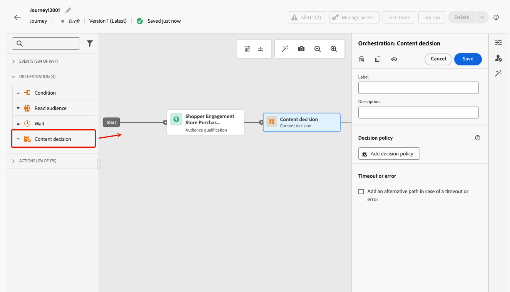

# Actividad de decisión de contenido {#content-decision}

[!DNL Journey Optimizer] le permite incluir ofertas en sus recorridos a través de la actividad **Decisión de contenido** específica en el lienzo de recorrido. A continuación, puede agregar otras actividades (como [acciones personalizadas](../action/about-custom-action-configuration.md)) a sus recorridos para dirigirse a sus audiencias con estas ofertas personalizadas.

>[!NOTE]
>
>La salida de una actividad de decisión de contenido no se puede utilizar en actividades de canal nativas.

Para aprovechar esta capacidad, cree un recorrido donde agregue una [actividad de decisión de contenido](#add-content-decision-activity) para definir las ofertas que desea presentar a los perfiles aptos.

A continuación, puede utilizar la salida de la actividad de decisión de contenido en:

* una [actividad de condición](#add-condition-activity), para mover perfiles a rutas específicas en función de las ofertas recuperadas;

* una [acción personalizada](#add-custom-action), donde puede enviar esas ofertas a sistemas externos.

## Configuración de una actividad de decisión de contenido {#add-content-decision-activity}

Con la actividad de decisión de contenido, puede definir una política de decisión que le permita elegir los mejores elementos de [!DNL Journey Optimizer] decisiones y enviarlos a la audiencia correcta.

<!--Their goal is to select the best offers for each profile, while the campaign/journey authoring allows you to indicate how the selected decision items should be presented, including which item attributes to be included in the message.-->

Para configurar la actividad **[!UICONTROL Decisión de contenido]**, siga los pasos a continuación.

1. Despliegue la categoría **[!UICONTROL Orchestration]** y suelte una actividad **[!UICONTROL Content decision]** en el lienzo.

   {width=100%}

1. De forma opcional, añada una etiqueta y una descripción a la actividad.

1. Haga clic en **[!UICONTROL Agregar directiva de decisión]**. [Más información sobre las políticas de decisión](../experience-decisioning/create-decision.md)

   >[!NOTE]
   >
   >Los permisos de toma de decisiones son necesarios para crear una directiva de decisión. [Más información](../experience-decisioning/gs-experience-decisioning.md#steps)

1. Seleccione el número de elementos que desea que se devuelvan. Por ejemplo, si selecciona 2, se presentarán las 2 mejores ofertas aptas. Haga clic en **[!UICONTROL Next]**.

1. En la sección **[!UICONTROL Secuencia de estrategia]**, seleccione los elementos de decisión y/o las estrategias de selección que desea presentar con la directiva de decisión. [Más información](../experience-decisioning/create-decision.md#create-decision)

1. Organice el orden de evaluación según sea necesario.

   Al agregar varios elementos de decisión y/o estrategias, se evalúan en orden secuencial, indicados con números a la izquierda de cada objeto o grupo de objetos. Para cambiar la secuencia predeterminada, puede arrastrar y soltar los objetos o los grupos para reordenarlos como desee. [Más información](../experience-decisioning/create-decision.md#create-decision)

1. (opcional) Añada una oferta de reserva. [Más información](../experience-decisioning/create-decision.md#create-decision)

1. Revise y guarde la directiva de decisión.

   {width=70%}<!--reshoot or change screen-->

Ya está listo para aprovechar el resultado de esta actividad de decisión de contenido en su recorrido.

## Protecciones y limitaciones {#guardrails}

**Políticas de consentimiento**

* Las actualizaciones de las directivas de consentimiento tardan hasta 48 horas en surtir efecto. Si una directiva de decisión hace referencia a un atributo vinculado a una directiva de consentimiento actualizada recientemente, los cambios no se aplican inmediatamente.

* Del mismo modo, si se añaden nuevos atributos de perfil sujetos a una directiva de consentimiento a una directiva de decisión, se pueden utilizar, pero la directiva de consentimiento asociada a ellos no se aplicará hasta que haya pasado el retraso.

* Las políticas de consentimiento solo están disponibles para las organizaciones con el complemento Adobe Healthcare Shield o Privacy and Security Shield.

## Usar la salida de la actividad de decisión de contenido {#use-content-decision-output}

El resultado de una decisión de contenido se puede utilizar en varias actividades de recorrido. Por ejemplo, puede usar una [actividad de condición](#add-condition-activity) para mover perfiles a ramas específicas del recorrido, según el número de ofertas recuperadas para ellas.

También puede agregar una [acción personalizada](#add-custom-action) al recorrido para compartir las ofertas de la actividad de decisión de contenido con un sistema externo.

### En una actividad de condición {#add-condition-activity}

Para aprovechar el resultado de una actividad de decisión de contenido, puede agregar una condición al recorrido, donde define expresiones para mover perfiles a rutas específicas, utilizando datos de esas ofertas. Siga los pasos a continuación.

1. Desde la categoría **[!UICONTROL Orchestration]**, suelte una actividad **[!UICONTROL Condition]** en el lienzo. [Más información](condition-activity.md#add-condition-activity)

1. (opcional) Cambie el nombre de **[!UICONTROL Path1]**, que corresponde a la primera expresión que defina, por una etiqueta más relevante.

1. Para esta primera ruta, haga clic dentro del campo **[!UICONTROL Expression]** o use el icono Editar para agregar una expresión.

   {width=80%}

1. En la ventana emergente que se abre, cambie a **[!UICONTROL Modo avanzado]** para usar el [editor de expresiones avanzadas](expression/expressionadvanced.md).

   >[!CAUTION]
   >
   >El resultado de un nodo de decisión de contenido solo está disponible en **[!UICONTROL modo avanzado]**.

1. Despliegue el nodo **[!UICONTROL Context]** y vaya a la directiva de decisiones para mostrar todos los atributos disponibles en el esquema de [catálogo de ofertas](../experience-decisioning/catalogs.md#access-catalog-schema).

   

   >[!NOTE]
   >
   >Cualquier etiqueta restringida definida en un atributo puede provocar una infracción de directiva para DULE o consentimiento. Esto se aplica a los eventos de experiencia de recorrido utilizados en una regla de decisión y al esquema de [ofertas](../experience-decisioning/catalogs.md#access-catalog-schema). Obtenga más información acerca de las directivas de gobernanza de datos en [esta sección](../action/action-privacy.md).

1. Para comprobar si se ha devuelto alguna oferta para los perfiles que entran en el recorrido, use la función [listSize](functions/list-functions.md#listSize) con la siguiente sintaxis: `listSize(@decision{ContentdecisionName.items})>0`

   >[!NOTE]
   >
   >En este ejemplo, `Name` es la etiqueta de la decisión de contenido que agregó a su recorrido.

   

1. Haga clic en **[!UICONTROL Ok]**.

1. Añada más rutas para definir otras condiciones según sea necesario.

   También puede crear otra ruta de acceso para perfiles que no cumplan la primera condición marcando **[!UICONTROL Mostrar ruta de acceso para otros casos que no sean los anteriores]**. <!--These profiles will then exit the journey if no other activity is added in that path.-->

1. Guarde la actividad de condición.

### En una acción personalizada {#add-custom-action}

Para aprovechar el resultado de una actividad de decisión de contenido, puede agregar una acción personalizada al recorrido, en la que compartirá las ofertas definidas en un sistema externo. Siga los pasos a continuación.

1. Añada una acción personalizada al recorrido. [Más información](../action/about-custom-action-configuration.md)

1. Introduzca una etiqueta para la acción.

1. En la sección **[!UICONTROL Parámetros de solicitud]**, seleccione el parámetro que desee asignar a atributos de las ofertas que se han recuperado.

   Haga clic dentro del campo de texto editable y seleccione cualquier parámetro que desee asignar a atributos de las ofertas recuperadas.

   

1. Cambie a **[!UICONTROL Modo avanzado]** en la ventana emergente que se abre. En el [editor de expresiones avanzadas](expression/expressionadvanced.md), despliegue el nodo **[!UICONTROL Contexto]** para mostrar todos los elementos de la directiva de decisión.

   >[!CAUTION]
   >
   >El resultado de un nodo de decisión de contenido solo está disponible en **[!UICONTROL modo avanzado]**.

1. Examine el esquema [offer catalog](../experience-decisioning/catalogs.md#access-catalog-schema) mediante la matriz `items`. Por ejemplo, use `itemName` de la primera oferta recuperada y `itemName` de la segunda oferta recuperada.

   

1. Haga clic en **[!UICONTROL Aceptar]** para guardar la expresión.

1. **[!UICONTROL Guarde]** su configuración de acción personalizada.

### Ejemplo de extremo a extremo {#use-case}

A continuación se muestra el ejemplo completo de un recorrido que utiliza una actividad de decisión de contenido combinada con una actividad de condición y una acción personalizada, como se ha descrito anteriormente.


<!--When all activities are properly configured and saved, [publish](publish-journey.md) your journey.-->

Una vez que el recorrido esté [activado](publish-journey.md):

<!--* Profiles who enter the journey and are eligible for at least one offer are targeted by the custom action.

* If no offer is returned for a profile, they are excluded from the custom action.-->

1. Cada vez que un perfil se califica para esa audiencia, entra en el recorrido.

1. A través de la actividad de decisión de contenido, [!DNL Journey Optimizer] recupera las ofertas relevantes para cada perfil.

1. Solo los perfiles para los que se ha recuperado al menos una oferta continúan la recorrido (a través de la ruta Perfiles aptos ).

1. Si se cumple la condición, las ofertas correspondientes se envían a un sistema externo a través de la acción personalizada.

## Toma de decisiones de datos en eventos de paso {#decisioning-step-events}

Cuando se ejecuta una actividad de decisión de contenido en un recorrido, los datos de toma de decisiones están disponibles en los eventos del paso de recorrido. Estos datos proporcionan información detallada sobre los elementos recuperados y cómo se tomaron las decisiones.

Para cada actividad de decisión de contenido, el evento de paso incluye datos de toma de decisiones en el nivel superior (como **exdRequestID** y **propositionEventType**), y una matriz de **propositions**. Cada propuesta tiene un **id**, **scopeDetails** (que incluye el proveedor de decisiones, el ID de correlación y la directiva de decisión) y una matriz de **elementos**. Cada elemento contiene:

* **id**: el identificador único del elemento
* **nombre**: el nombre del elemento
* **score**: la puntuación asignada al elemento
* **itemSelection**: datos relacionados con cómo se tomó la decisión y cómo se recuperó el elemento, incluidos:
   * **selectionDetail**: información acerca de la estrategia de selección usada
   * **rankingDetail**: información sobre el proceso de clasificación (estrategia, algoritmo, paso, tipo de tráfico)

**Ejemplo de datos de toma de decisiones en un evento de paso:**

```json
"decisioning": {
  "exdRequestID": "8079d2bb-a8b2-4ecf-b9e7-32923dd6ad4e",
  "propositions": [
    {
      "id": "f475cb21-0842-44da-b0eb-70766ba53464",
      "scopeDetails": {
        "decisionProvider": "EXD",
        "correlationID": "6940d1c46208f3c00dae2ab94f3cd31c601461b47bf6d29ff8af0d0806a9c204",
        "decisionPolicy": {
          "id": "b913f724-3747-447b-a51e-8a2f9178f0db"
        }
      },
      "items": [
        {
          "id": "dps:14c7468e7f6271ff8023748a1146d11f05f77b7fc1368081:1bebbf0b7e0f1374",
          "name": "My item name",
          "score": 0.93,
          "itemSelection": {
            "selectionDetail": {
              "strategyID": "dps:selection-strategy:1bebbfc9245cb35e",
              "strategyName": "My selection strategy",
              "selectionType": "selectionStrategy",
              "version": "latest"
            },
            "rankingDetail": {
              "strategyID": "4FyRZTmpjrbzuL7rX7gvmu",
              "algorithmID": "RANDOM",
              "step": "aiModel",
              "trafficType": "random"
            }
          }
        }
      ]
    }
  ],
  "propositionEventType": {
    "decision": 1
  }
}
```
