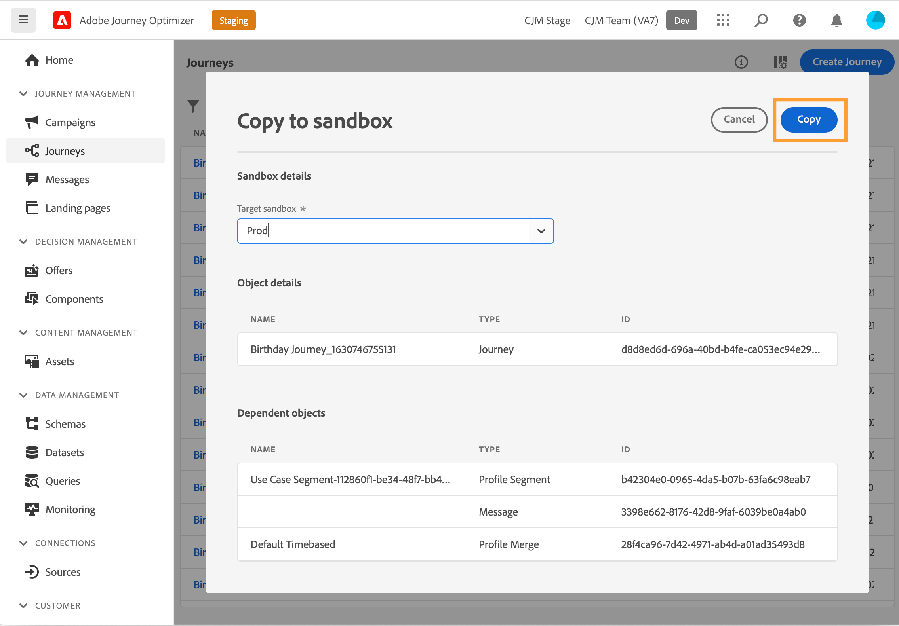
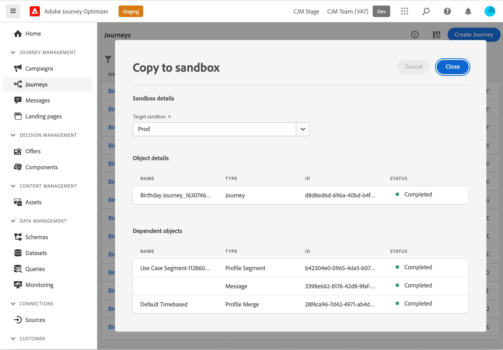

# Copia de un recorrido en otra zona protegida {#copy-to-sandbox}

>[!CONTEXTUALHELP]
>id="ajo_journey_copy_main"
>title="Copia de un recorrido en otra zona protegida"
>abstract="Journey Optimizer permite copiar un recorrido completo de una zona protegida a otra. Por ejemplo, puede copiar un recorrido del entorno de zona protegida de fase en la zona protegida de producción. Además del propio recorrido, Journey Optimizer también copia la mayoría de los objetos de los que depende el recorrido."

>[!CONTEXTUALHELP]
>id="ajo_journey_copy_sandbox_details"
>title="Detalles de la zona protegida"
>abstract="Seleccione la zona protegida de destino en la que desea copiar el recorrido. Solo están disponibles las zonas protegidas de su organización."

>[!CONTEXTUALHELP]
>id="ajo_journey_copy_object_details"
>title="Detalles del objeto"
>abstract="Este es el recorrido que va a copiar."

>[!CONTEXTUALHELP]
>id="ajo_journey_copy_dependent_objects"
>title="Objetos dependientes"
>abstract="Esta es la lista de objetos asociados que se utilizan en el recorrido. Esta lista muestra el nombre, el tipo de objeto y el ID interno de Journey Optimizer."

Journey Optimizer permite copiar un recorrido completo de una zona protegida a otra. Por ejemplo, puede copiar un recorrido del entorno de zona protegida de ensayo en la zona protegida de producción. Además del propio recorrido, Journey Optimizer también copia la mayoría de los objetos de los que depende el recorrido: audiencias, superficies (es decir, ajustes preestablecidos), esquemas, eventos y acciones. Para obtener más información sobre los objetos copiados, consulte [sección](#limitations).

>[!CAUTION]
>
>No garantizamos que todos los elementos vinculados se copien en la zona protegida de destino. Le recomendamos encarecidamente que realice una comprobación exhaustiva antes de publicar el recorrido. Esto le permitirá identificar cualquier posible objeto que falte.

Los objetos copiados en la zona protegida de destino son únicos y no hay riesgo de sobrescribir elementos existentes. Tanto el recorrido como los mensajes dentro del recorrido se transfieren en modo de borrador. Esto le permite realizar una validación completa antes de la publicación en la zona protegida de destino. El proceso de copia solo copia los metadatos sobre el recorrido y los objetos de ese Recorrido. No se están copiando datos de perfil o conjunto de datos como parte de este proceso.

Para copiar un recorrido en otra zona protegida, siga estos pasos:

1. En la sección del menú ADMINISTRACIÓN DE RECORRIDO, haga clic en **[!UICONTROL Recorridos]**. Se muestra la lista de recorridos.

2. Busque el recorrido que desea copiar y haga clic en el icono **Más acciones** (los tres puntos junto al nombre del recorrido) y haga clic en **Copiar a zona protegida**.

   

   El **Copiar a zona protegida** se muestra la pantalla.

   

3. Seleccione el **Zona protegida de Target** en el campo desplegable. Solo están disponibles las zonas protegidas de su organización.

4. Revise la **Objetos dependientes** sección. Esta es la lista de objetos asociados que se utilizan en el recorrido. Esta lista muestra el nombre, el tipo de objeto y el ID interno de Journey Optimizer.

5. Haga clic en **Copiar** , en la esquina superior derecha, para comenzar a copiar el recorrido en la zona protegida de destino.

   

   Se inicia el proceso de copia y se muestra el progreso de cada objeto individual. El proceso de copia varía en función de la complejidad del recorrido y de la cantidad de objetos que deban copiarse. Si se produce un error, se muestra un mensaje para el objeto relacionado.

   

6. Una vez finalizada la copia, haga clic en **Cerrar**.

7. Acceda a la zona protegida de destino y realice una comprobación exhaustiva de todos los objetos copiados.

## Proceso de copia y limitaciones {#limitations}

Es posible que todos los elementos vinculados no se copien en la zona protegida de destino. El Adobe recomienda encarecidamente que realice una comprobación exhaustiva. Identifique cualquier posible objeto que falte y créelo manualmente antes de publicar el recorrido.

Se copian los siguientes objetos:

* Audiencia 

  Una audiencia solo se puede copiar una vez de una zona protegida a otra. Una vez copiada una audiencia, no se puede editar en la zona protegida de destino.

* Esquema

  Se copian los esquemas utilizados en este recorrido.

* Mensaje

  Las actividades de acción de canal utilizadas en el recorrido. No se comprueba la integridad de los campos utilizados para la personalización en el mensaje. Los bloques de contenido no se copian.

* Recorrido - detalles del lienzo

  Representación del recorrido en el lienzo incluidos los objetos del recorrido, como condiciones, acciones, eventos, audiencias de lectura, etc. La actividad de salto se excluye de la copia.

* Evento

  Se copian los eventos y los detalles del evento utilizados en el recorrido.

* Acción

  Se copian las acciones y los detalles de acción utilizados en el recorrido.

Las superficies (es decir, los ajustes preestablecidos) no se copian. El sistema selecciona automáticamente la coincidencia más cercana posible en la zona protegida de destino, según el tipo de mensaje y el nombre de la superficie. Si no se encuentran superficies en la zona protegida de destino, la copia de superficie fallará. Esto significa que la copia del mensaje también fallará porque un mensaje requiere que haya una superficie disponible para la configuración. En este caso, es necesario crear al menos una superficie, para el canal derecho del mensaje, para que funcione la copia.

En el caso de los esquemas, las políticas de combinación y las audiencias, la segunda vez que se intente copiar estos objetos, solo se hará referencia a ellos. Se tratarán como objetos que ya existen y se copiarán de nuevo. Esto significa que estos objetos solo se pueden copiar una vez.

Hay un retraso de cinco minutos antes de que Adobe Journey Optimizer pueda hacer referencia a esquemas, políticas de combinación y audiencias sin ver un error en el lienzo. Espere cinco minutos y las referencias estarán disponibles.
