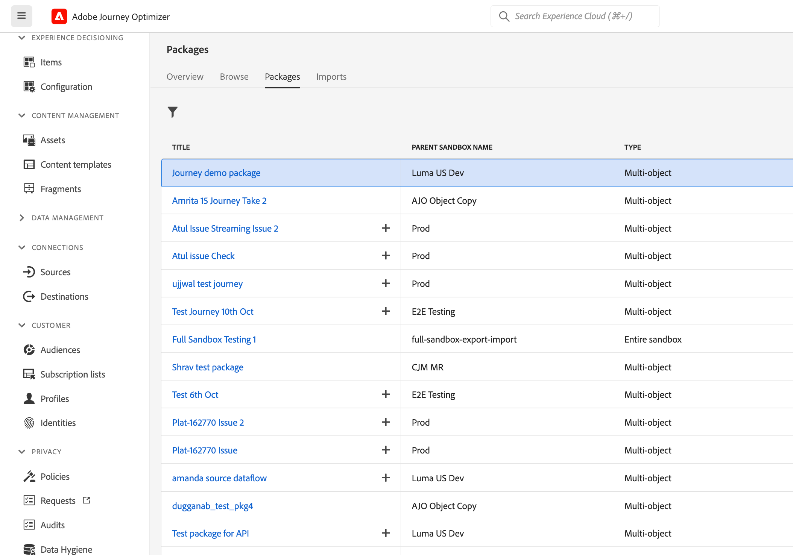
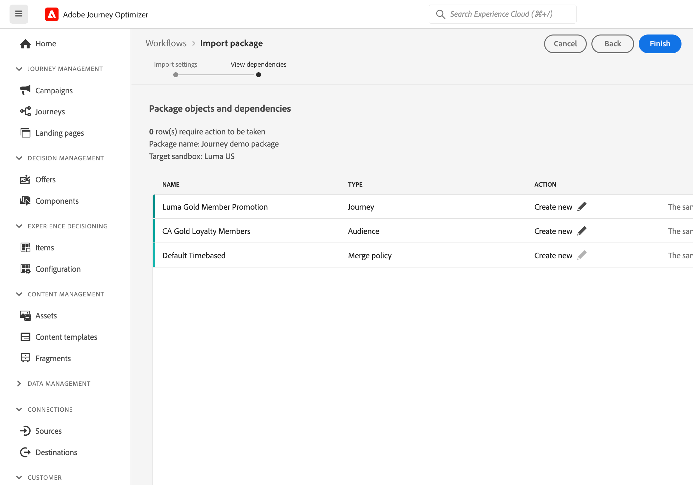

# Copia de un recorrido en otra zona protegida {#copy-to-sandbox}

<!--
>[!CONTEXTUALHELP]
>id="ajo_journey_copy_main"
>title="Copy a journey to another sandbox"
>abstract="Journey Optimizer allows you to copy an entire journey from one sandbox to another. For example, you can copy a journey from the Stage sandbox environment to your Production sandbox. In addition to the Journey itself, Journey Optimizer also copies most of the objects the journey depends on."

>[!CONTEXTUALHELP]
>id="ajo_journey_copy_sandbox_details"
>title="Sandbox details"
>abstract="Select the destination sandbox you want to copy the journey to. Only sandboxes within your organization are available."

>[!CONTEXTUALHELP]
>id="ajo_journey_copy_object_details"
>title="Object details"
>abstract="This is the journey you are going to copy."

>[!CONTEXTUALHELP]
>id="ajo_journey_copy_dependent_objects"
>title="Dependent objects"
>abstract="This is the list of associated objects used in the journey. This list displays the name, the object type, as well as the internal Journey Optimizer ID."
-->

La herramienta de zona protegida permite copiar objetos en varias zonas protegidas aprovechando la exportación e importación de paquetes. Un paquete puede constar de un único objeto o de varios objetos. Los objetos incluidos en un paquete deben pertenecer a la misma zona protegida.

En esta página se describe el caso de uso de las herramientas de entorno limitado en el contexto de Journey Optimizer. Para obtener más información sobre la propia función, consulte la [Documentación del Experience Platform](https://experienceleague.corp.adobe.com/docs/experience-platform/sandbox/ui/sandbox-tooling.html).

>[!NOTE]
>
>Esta función requiere los siguientes permisos: manage-sandbox (o view-sandbox) y manage-package.

## Introducción a las herramientas para espacios aislados{#sandbox-gs}

Journey Optimizer permite copiar un recorrido completo de una zona protegida a otra. Por ejemplo, puede copiar un recorrido del entorno de zona protegida de ensayo en la zona protegida de producción. Además del propio recorrido, Journey Optimizer también copia la mayoría de los objetos de los que depende el recorrido: audiencias, esquemas, eventos y acciones. Para obtener más información sobre los objetos copiados, consulte [sección](https://experienceleague.adobe.com/docs/experience-platform/sandbox/ui/sandbox-tooling.html#abobe-journey-optimizer-objects).

>[!CAUTION]
>
>No garantizamos que todos los elementos vinculados se copien en la zona protegida de destino. Le recomendamos encarecidamente que realice una comprobación exhaustiva antes de publicar el recorrido. Esto le permitirá identificar cualquier posible objeto que falte.

Los objetos copiados en la zona protegida de destino son únicos y no hay riesgo de sobrescribir elementos existentes. Tanto el recorrido como los mensajes dentro del recorrido se transfieren en modo de borrador. Esto le permite realizar una validación completa antes de la publicación en la zona protegida de destino. El proceso de copia solo copia los metadatos sobre el recorrido y los objetos de ese Recorrido. No se están copiando datos de perfil o conjunto de datos como parte de este proceso.

El proceso de copia se lleva a cabo mediante una exportación de paquetes y una importación entre las zonas protegidas de origen y destino. Estos son los pasos generales para copiar un recorrido de una zona protegida a otra:

1. Añada el recorrido como paquete en la zona protegida de origen.
1. Exporte el paquete a la zona protegida de destino.

## Añadir el recorrido como paquete{#export}

Para copiar un recorrido en otra zona protegida, primero debe agregar el recorrido como paquete en la zona protegida de origen. Siga estos pasos:

1. En la sección del menú ADMINISTRACIÓN DE RECORRIDO, haga clic en **[!UICONTROL Recorridos]**. Se muestra la lista de recorridos.

1. Busque el recorrido que desea copiar y haga clic en el icono **Más acciones** (los tres puntos junto al nombre del recorrido) y haga clic en **Añadir a paquete**.

   

   El **Añadir a paquete** se muestra la ventana.

   

1. Seleccione si desea añadir el recorrido a un paquete existente o crear un nuevo paquete:

   * **Paquete existente**: seleccione el paquete en el menú desplegable.
   * **Creación de un nuevo paquete**: escriba el nombre del paquete. También puede añadir una descripción.

1. En la sección del menú ADMINISTRACIÓN, haga clic en **[!UICONTROL Zonas protegidas]**, seleccione la **Paquetes** y haga clic en el paquete que desea exportar.

   

1. Seleccione los objetos que desea exportar y haga clic en **Publish**

   

   Si la publicación falla, puede comprobar los registros para identificar el motivo del error. Abra el paquete y haga clic en **Ver trabajos con errores**, seleccione el trabajo de importación y haga clic en **Ver detalles de importación**.

   

## Exportación del paquete a la zona protegida de destino {#import}

Una vez publicado el paquete, debe exportarlo a la zona protegida de destino.

1. En la zona protegida de origen, haga clic en **[!UICONTROL Zonas protegidas]** , seleccione la opción **Paquetes** y haga clic en el icono + situado junto al paquete que desea exportar.

   

1. Seleccione el **Zona protegida de Target** en el campo desplegable y haga clic en **Siguiente**. Solo están disponibles las zonas protegidas de su organización.

   

1. Revise los objetos de paquete y las dependencias. Esta es la lista de objetos asociados que se utilizan en el recorrido. Esta lista muestra el nombre y el tipo de objeto. Para cada objeto, puede elegir crear uno nuevo o utilizar uno existente en la zona protegida de destino.

   

1. Haga clic en **Finalizar** , en la esquina superior derecha, para comenzar a copiar el paquete en la zona protegida de destino. El proceso de copia varía en función de la complejidad del recorrido y de la cantidad de objetos que deban copiarse.

1. Haga clic en el trabajo de importación para revisar el resultado de la copia:

   * Clic **Ver objetos importados** para mostrar cada objeto individual copiado.
   * Clic **Ver detalles de importación** para comprobar los resultados de importación de cada objeto.

   

1. Acceda a la zona protegida de destino y realice una comprobación exhaustiva de todos los objetos copiados.
