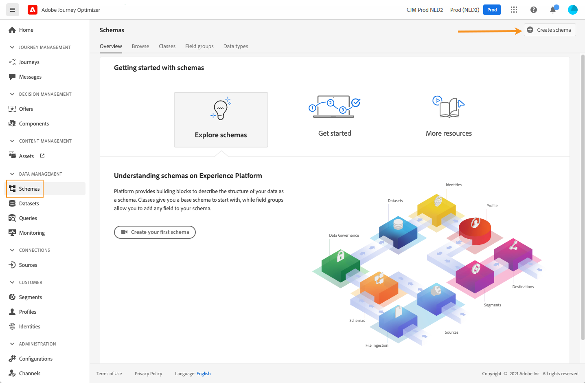
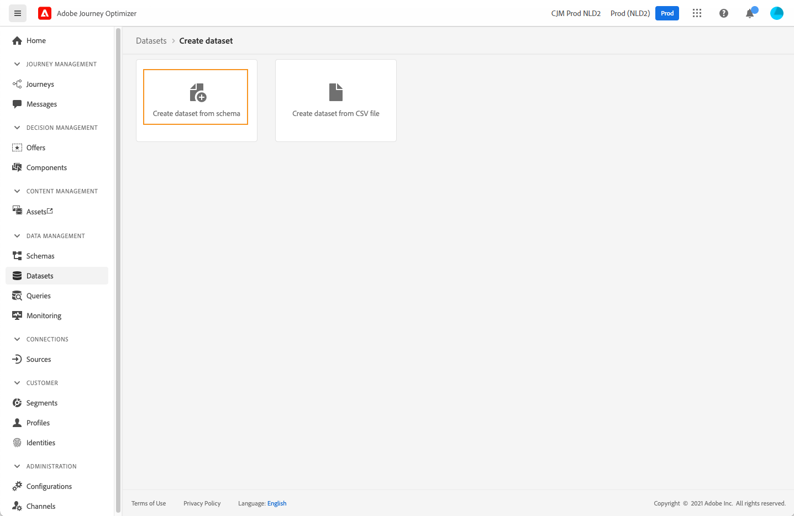
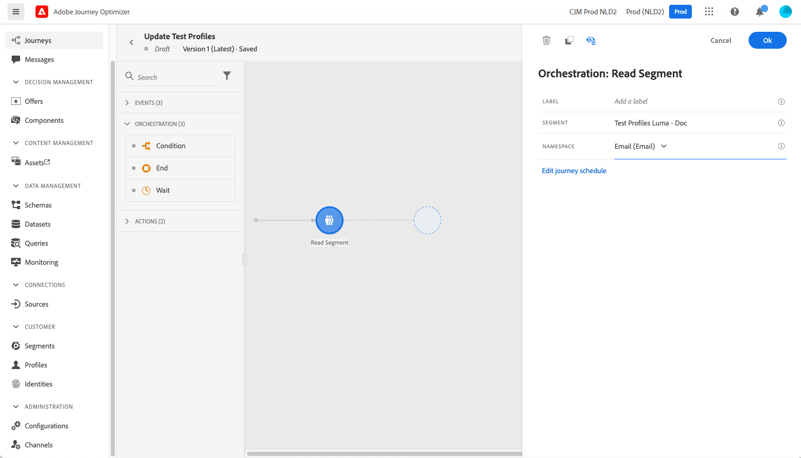

# Creación de perfiles de prueba {#create-test-profiles}

Los perfiles de prueba son obligatorios al utilizar [modo de prueba](../building-journeys/testing-the-journey.md) en un recorrido y a [previsualización y prueba del contenido](../email/preview.md).

Existen varias formas de crear perfiles de prueba. Puede encontrar en esta página los detalles para:

* Convierta un [perfil existente](#turning-profile-into-test) en un perfil de prueba

* Creación de perfiles de prueba cargando un [archivo csv](#create-test-profiles-csv) o usando [Llamadas de API](#create-test-profiles-api).

  Además de estos dos métodos, Adobe Journey Optimizer incluye un [caso de uso dentro del producto](#use-case-1) para facilitar la creación del perfil de prueba.

También puede cargar un archivo json en un conjunto de datos existente. Para obtener más información, consulte [Documentación de ingesta de datos](https://experienceleague.adobe.com/docs/experience-platform/ingestion/tutorials/ingest-batch-data.html#add-data-to-dataset){target="_blank"}.

Tenga en cuenta que la creación de un perfil de prueba es similar a la creación de perfiles normales en Adobe Experience Platform. Para obtener más información, consulte la [Documentación del perfil del cliente en tiempo real](https://experienceleague.adobe.com/docs/experience-platform/profile/home.html?lang=es){target="_blank"}.

➡️ [Aprenda a crear perfiles de prueba en este vídeo](#video)

## Requisitos previos {#test-profile-prerequisites}

Para poder crear perfiles, primero debe crear un esquema y un conjunto de datos en Adobe [!DNL Journey Optimizer].

Hasta **creación de un esquema**, siga estos pasos:

1. En la sección del menú DATA MANAGEMENT, haga clic en **[!UICONTROL Esquemas]**.
   
1. Clic **[!UICONTROL Crear esquema]**, en la parte superior derecha, seleccione un tipo de esquema, por ejemplo **Perfil individual** y haga clic en **Siguiente**.
   
1. Introduzca un nombre para el esquema y haga clic en **Finalizar**.
   
1. En el **Grupos de campos** , a la izquierda, haga clic en **Add$$ y seleccione los grupos de campos adecuados. Asegúrese de añadir la variable **Detalles de prueba de perfil** grupo de campos.
   
Una vez finalizado, haga clic en **[!UICONTROL Adición de grupos de campos]**: la lista de grupos de campos se muestra en la pantalla de información general del esquema.
   

   >[!NOTE]
   >
   >Haga clic en el nombre del esquema para actualizar sus propiedades.

1. En la lista de campos, haga clic en el campo que desee definir como identidad principal.
   
1. En el **[!UICONTROL Propiedades del campo]** en el panel derecho, marque **[!UICONTROL Identidad]** y **[!UICONTROL Identidad principal]** y seleccione un área de nombres. Si desea que la identidad principal sea una dirección de correo electrónico, elija la **[!UICONTROL Correo electrónico]** namespace. Haga clic en **[!UICONTROL Aplicar]**.
   
1. Seleccione el esquema y habilite la variable **[!UICONTROL Perfil]** en la opción **[!UICONTROL Propiedades del esquema]** panel.
   
1. Haga clic en **Guardar**.

>[!NOTE]
>
>Para obtener más información sobre la creación de esquemas, consulte la [Documentación de XDM](https://experienceleague.adobe.com/docs/experience-platform/xdm/ui/resources/schemas.html#prerequisites){target="_blank"}.

Entonces tienes que **crear el conjunto de datos** en el que se importarán los perfiles. Siga estos pasos:

1. Navegar a **[!UICONTROL Conjuntos de datos]**, luego haga clic en **[!UICONTROL Crear conjunto de datos]**.
   
1. Elegir **[!UICONTROL Crear conjunto de datos a partir de esquema]**.
   
1. Seleccione el esquema creado anteriormente y haga clic en **[!UICONTROL Siguiente]**.
   
1. Elija un nombre y haga clic en **[!UICONTROL Finalizar]**.
   
1. Habilite la **[!UICONTROL Perfil]** opción.
   

>[!NOTE]
>
> Para obtener más información sobre la creación de conjuntos de datos, consulte la [Documentación del servicio de catálogo](https://experienceleague.adobe.com/docs/experience-platform/catalog/datasets/user-guide.html#getting-started){target="_blank"}.

## Caso de uso dentro del producto{#use-case-1}

Desde la página de inicio de Adobe Journey Optimizer, puede aprovechar los perfiles de prueba en el caso de uso del producto. Este caso de uso facilita la creación de perfiles de prueba utilizados para probar recorridos antes de publicar.


Haga clic en el botón **[!UICONTROL Comenzar]** para iniciar el caso de uso.

Se requiere la siguiente información:

1. **Área de nombres de identidad**: La [área de nombres de identidad](../audience/get-started-identity.md) se utiliza para identificar los perfiles de prueba de forma exclusiva. Por ejemplo, si se utiliza el correo electrónico para identificar los perfiles de prueba, el área de nombres de identidad **Correo electrónico** debe estar seleccionado. Si el identificador único es el número de teléfono, el área de nombres de identidad **Teléfono** debe estar seleccionado.

2. **Archivo CSV**: Un archivo separado por comas que contiene la lista de perfiles de prueba que se van a crear. El caso de uso espera un formato predefinido para el archivo CSV que contiene la lista de perfiles de prueba que se van a crear. Cada fila del archivo debe incluir los siguientes campos en el orden correcto como se indica a continuación:

   1. **ID de persona**: Identificador único del perfil de prueba. Los valores de este campo deben reflejar el área de nombres de identidad seleccionada. (Por ejemplo, si **Teléfono** se selecciona para el área de nombres de identidad, los valores de este campo deben ser números de teléfono. Del mismo modo si **Correo electrónico** se selecciona, los valores de este campo deben ser correos electrónicos)
   1. **Correo electrónico**: dirección de correo electrónico del perfil de prueba. (La **ID de persona** y el **Correo electrónico** podría contener los mismos valores si **Correo electrónico** está seleccionado como el área de nombres de identidad)
   1. **Nombre**: Nombre del perfil de prueba.
   1. **Apellidos**: Apellidos del perfil de prueba.
   1. **Ciudad**: Ciudad de residencia del perfil de prueba
   1. **País**: País de residencia del perfil de prueba
   1. **Sexo**: Género del perfil de prueba. Los valores disponibles son **masculino**, **femenino** y **non_specified**

Después de seleccionar el área de nombres de identidad y proporcionar el archivo CSV en función del formato anterior, haga clic en **[!UICONTROL Ejecutar]** en la parte superior derecha. El caso de uso puede tardar unos minutos en completarse. Una vez que el caso de uso termina de procesar y crear los perfiles de prueba, se envía una notificación al usuario.

>[!NOTE]
>
>Los perfiles de prueba pueden anular los perfiles existentes. Antes de ejecutar el caso de uso, asegúrese de que el CSV solo contiene perfiles de prueba y de que se ejecuta en la zona protegida correcta.

## Conversión de un perfil en un perfil de prueba{#turning-profile-into-test}

Puede convertir un perfil existente en un perfil de prueba: puede actualizar los atributos de perfiles del mismo modo que cuando crea un perfil.

Una forma sencilla de hacerlo es mediante una **[!UICONTROL Actualizar perfil]** actividad de acción en un recorrido y cambie el **testProfile** campo booleano de false a true.

Su recorrido estará compuesto por un **[!UICONTROL Leer audiencia]** y un **[!UICONTROL Actualizar perfil]** actividad. Primero debe crear una audiencia dirigida a los perfiles que desea convertir en perfiles de prueba.

>[!NOTE]
>
> Dado que va a actualizar el **testProfile** , los perfiles elegidos deben incluir este campo. El esquema relacionado debe tener **Detalles de prueba de perfil** grupo de campos. Consulte [esta sección](../audience/creating-test-profiles.md#test-profiles-prerequisites).

1. Navegar a **Audiencias**, entonces **Crear audiencia**, en la parte superior derecha.
   
1. Defina un nombre para la audiencia y genere la audiencia: elija los campos y los valores para segmentar los perfiles que desee.
   
1. Clic **Guardar** y compruebe que la audiencia se dirige correctamente a los perfiles.
   

   >[!NOTE]
   >
   > El cálculo de audiencias puede tardar un poco. Más información sobre las audiencias en [esta sección](../audience/about-audiences.md).

1. Ahora cree un nuevo recorrido y comience con una **[!UICONTROL Leer audiencia]** actividad de orquestación.
1. Elija la audiencia creada anteriormente y el área de nombres que utilizan los perfiles.
   
1. Añadir un **[!UICONTROL Actualizar perfil]** actividad de acción.
1. Seleccione el esquema y la variable **testProfiles** , el conjunto de datos y establezca el valor en **Verdadero**. Para ello, en la **[!UICONTROL VALOR]** , haga clic en el **Pluma** en la parte derecha, seleccione **[!UICONTROL Modo avanzado]** y escriba **true**.
   
1. Haga clic en **[!UICONTROL Publicar]**.
1. En el **[!UICONTROL Audiencias]** , compruebe que los perfiles se hayan actualizado correctamente.
   

   >[!NOTE]
   >
   > Para obtener más información sobre **[!UICONTROL Actualizar perfil]** actividad, consulte [esta sección](../building-journeys/update-profiles.md).

## Creación de un perfil de prueba con un archivo csv{#create-test-profiles-csv}

En Adobe Experience Platform, puede crear perfiles cargando un archivo csv que contenga los diferentes campos de perfil en el conjunto de datos. Este es el método más sencillo.

1. Cree un archivo csv simple con un software de hoja de cálculo.
1. Agregue una columna para cada campo necesario. Asegúrese de agregar el campo de identidad principal (&quot;personID&quot; en el ejemplo anterior) y el campo &quot;testProfile&quot; establecido en &quot;true&quot;.
   
1. Añada una línea por perfil y rellene los valores de cada campo.
   
1. Guarde la hoja de cálculo como archivo csv. Asegúrese de que se utilizan comas como separadores.
1. Navegar a Adobe Experience Platform **Flujos de trabajo**.
   
1. Elegir **Asignar CSV a esquema XDM**, luego haga clic en **Launch**.
   
1. Seleccione el conjunto de datos en el que desea importar los perfiles. Haga clic en **Siguiente**.
   
1. Clic **Elegir archivos** y seleccione el archivo csv. Cuando cargue el archivo, haga clic en **Siguiente**.
   
1. Asigne los campos csv de origen a los campos de esquema y haga clic en **Finalizar**.
   
1. Comienza la importación de datos. El estado pasará de **Procesando** hasta **Correcto**. Clic **Previsualizar conjunto de datos**, en la parte superior derecha.
   
1. Compruebe que los perfiles de prueba se hayan agregado correctamente.
   

Los perfiles de prueba se han añadido y ahora se pueden utilizar para probar un recorrido. Consulte [esta sección](../building-journeys/testing-the-journey.md).
>[!NOTE]
>
> Para obtener más información sobre las importaciones de csv, consulte la [Documentación de ingesta de datos](https://experienceleague.adobe.com/docs/experience-platform/ingestion/tutorials/map-a-csv-file.html#tutorials){target="_blank"}.

## Creación de perfiles de prueba mediante llamadas a API{#create-test-profiles-api}

También puede crear perfiles de prueba mediante llamadas a la API. Más información en la [documentación de Adobe Experience Platform](https://experienceleague.adobe.com/docs/experience-platform/profile/home.html?lang=es){target="_blank"}.

Debe utilizar un esquema de perfil que contenga el grupo de campos Detalles de la prueba de perfil. El indicador testProfile forma parte de este grupo de campos.
Al crear un perfil, asegúrese de pasar el valor: testProfile = true.

Tenga en cuenta que también puede actualizar un perfil existente para cambiar su indicador testProfile a &quot;true&quot;.

Este es un ejemplo de llamada de API para crear un perfil de prueba:

```
curl -X POST \
'https://dcs.adobedc.net/collection/xxxxxxxxxxxxxx' \
-H 'Cache-Control: no-cache' \
-H 'Content-Type: application/json' \
-H 'Postman-Token: xxxxx' \
-H 'cache-control: no-cache' \
-H 'x-api-key: xxxxx' \
-H 'x-gw-ims-org-id: xxxxx' \
-d '{
"header": {
"msgType": "xdmEntityCreate",
"msgId": "xxxxx",
"msgVersion": "xxxxx",
"xactionid":"xxxxx",
"datasetId": "xxxxx",
"imsOrgId": "xxxxx",
"source": {
"name": "Postman"
},
"schemaRef": {
"id": "https://example.adobe.com/mobile/schemas/xxxxx",
"contentType": "application/vnd.adobe.xed-full+json;version=1"
}
},
"body": {
"xdmMeta": {
"schemaRef": {
"contentType": "application/vnd.adobe.xed-full+json;version=1"
}
},
"xdmEntity": {
"_id": "xxxxx",
"_mobile":{
"ECID": "xxxxx"
},
"testProfile":true
}
}
}'
```

## Vídeo explicativo {#video}

Obtenga información sobre cómo crear perfiles de prueba.

>[!VIDEO](https://video.tv.adobe.com/v/334236?quality=12)
