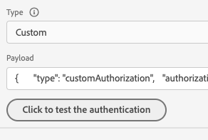
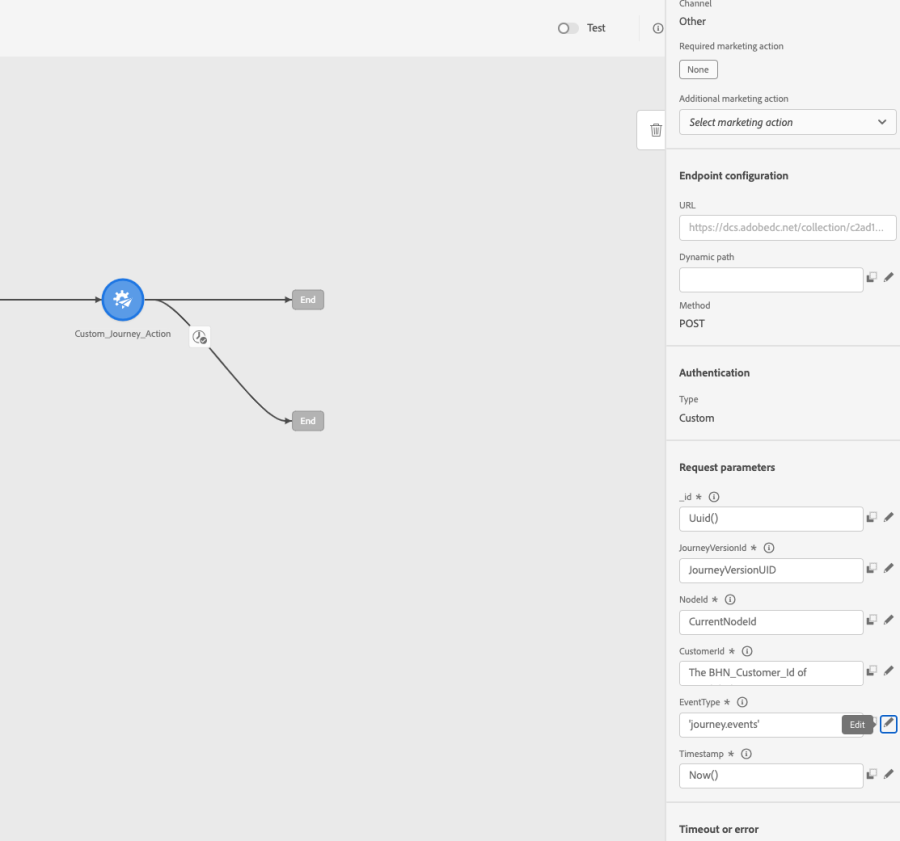

# Utilice acciones personalizadas para escribir los eventos de recorrido en Experience Platform {#custom-action-aep}

>[!BEGINSHADEBOX]

**En esta página:** Aprenda a escribir eventos de recorrido personalizados en Adobe Experience Platform desde sus recorridos mediante acciones personalizadas y llamadas de API autenticadas.

>[!ENDSHADEBOX]

Este caso de uso explica cómo escribir eventos personalizados en [!DNL Adobe Experience Platform] desde Recorridos mediante acciones personalizadas y llamadas autenticadas.

## Configuración de un proyecto de desarrollador {#custom-action-aep-IO}

1. En Adobe Developer Console, haga clic en **Proyecto** y abra su proyecto de E/S.

1. En la sección **Credenciales**, haga clic en **Servidor a servidor de OAuth**.

   

1. Haga clic en **Ver comando cURL**.

   ![[!DNL Adobe Experience Platform] selección de tipo de acción](assets/custom-action-aep-2.png)

1. Copie el comando cURL y almacene client_id, client_secret, grant_type y el ámbito.

```
curl -X POST 'https://ims-na1.adobelogin.com/ims/token/v3' -H 'Content-Type: application/x-www-form-urlencoded' -d 'grant_type=client_credentials&client_id=1234&client_secret=5678&scope=openid,AdobeID,read_organizations,additional_info.projectedProductContext,session'
```

>[!CAUTION]
>
>Después de crear el proyecto en Adobe Developer Console, asegúrese de otorgar al desarrollador y al control de acceso de la API los permisos adecuados. Obtenga más información en la [[!DNL Adobe Experience Platform] documentación](https://experienceleague.adobe.com/en/docs/experience-platform/landing/platform-apis/api-authentication#grant-developer-and-api-access-control){target="_blank"}

## Configurar el origen mediante la entrada de la API HTTP

1. Cree un extremo en [!DNL Adobe Experience Platform] para escribir los datos de los recorridos.

1. En [!DNL Adobe Experience Platform], haga clic en **Fuentes**, en **Conexiones** en el menú de la izquierda. En la **API HTTP**, haga clic en **Agregar datos**.

   ![Menú desplegable de selección de zona protegida para [!DNL Adobe Experience Platform]](assets/custom-action-aep-3.png)

1. Seleccione **Nueva cuenta** y habilite la autenticación. Seleccione **Conectarse a Source**.

   

1. Seleccione **Siguiente** y el conjunto de datos donde desee escribir los datos. Haga clic en **Siguiente** y **Finalizar**.

   

1. Abra el flujo de datos recién creado. Copie la carga útil del esquema y guárdela en el bloc de notas.

```
{
"header": {
"schemaRef": {
"id": "https://ns.adobe.com/<your_org>/schemas/<schema_id>",
"contentType": "application/vnd.adobe.xed-full+json;version=1.0"
},
"imsOrgId": "<org_id>",
"datasetId": "<dataset_id>",
"source": {
"name": "Custom Journey Events"
}
},
"body": {
"xdmMeta": {
"schemaRef": {
"id": "https://ns.adobe.com/<your_org>/schemas/<schema_id>",
"contentType": "application/vnd.adobe.xed-full+json;version=1.0"
}
},
"xdmEntity": {
"_id": "test1",
"<your_org>": {
"journeyVersionId": "",
"nodeId": "", "customer_Id":""
},
"eventMergeId": "",
"eventType": "",
"producedBy": "self",
"timestamp": "2018-11-12T20:20:39+00:00"
}
}
}
```

## Configurar la acción personalizada {#custom-action-config}

La configuración de acciones personalizadas se detalla en [esta página](../action/about-custom-action-configuration.md).

Para este ejemplo, siga estos pasos:

1. Abra [!DNL Adobe Journey Optimizer] y haga clic en **Configuraciones**, en **Administración** en el menú de la izquierda. En **Acciones**, haga clic en **Administrar** y luego en **Crear acción**.

1. Establezca la dirección URL y seleccione el método Post.

   `https://dcs.adobedc.net/collection/<collection_id>?syncValidation=false`

1. Asegúrese de que los encabezados (Content-Type, Charset, sandbox-name) estén configurados.

   

### Configuración de la autenticación {#custom-action-aep-authentication}

1. Seleccione **Type** como **Custom** con la siguiente carga útil.

1. Pegue client_secret, client_id, scope y grant_type (desde la carga útil del proyecto de IO utilizada anteriormente).

   ```
   {
   "type": "customAuthorization",
   "authorizationType": "Bearer",
   "endpoint": "https://ims-na1.adobelogin.com/ims/token/v3",
   "method": "POST",
   "headers": {},
   "body": {
   "bodyType": "form",
   "bodyParams": {
   "grant_type": "client_credentials",
   "client_secret": "********",
   "client_id": "<client_id>",
   "scope": "openid,AdobeID,read_organizations,additional_info.projectedProductContext,session"
   }
   },
   "tokenInResponse": "json://access_token",
   "cacheDuration": {
   "duration": 28000,
   "timeUnit": "seconds"
   }
   }
   ```

1. Use **Haga clic para probar el botón de autenticación** y probar la conexión.

   

### Configuración de la carga útil {#custom-action-aep-payload}

1. En los campos **Solicitud** y **Respuesta**, pegue la carga útil de la conexión de origen utilizada anteriormente.

   ```
   {
   "xdmMeta": {
   "schemaRef": {
   "id": "https://ns.adobe.com/<your_org>/schemas/<schema_id>",
   "contentType": "application/vnd.adobe.xed-full+json;version=1.0"
   }
   },
   "xdmEntity": {
   "_id": "/uri-reference",
   "<your_org>": {
   "journeyVersionId": "Sample value",
   "nodeId": "Sample value",
   "customer_Id":""
   },
   "eventMergeId": "Sample value",
   "eventType": "advertising.completes,
   "producedBy": "self",
   "timestamp": "2018-11-12T20:20:39+00:00"
   }
   }
   ```

1. Cambie la configuración del campo de **Constant** a **Variable** para los campos que se rellenarán dinámicamente.

1. Guarde la acción personalizada.

## Recorrido

1. Finalmente, utilice esta acción personalizada en un recorrido para escribir los eventos de recorrido personalizados.

1. Rellene los atributos ID de versión de Recorrido, ID de nodo, Nombre de nodo y otros según su caso de uso.

   

+++ Referencia de conocimientos de AI

Esta sección contiene conocimientos estructurados destinados a apoyar la interpretación, la recuperación y la respuesta a preguntas relacionadas con este tema.

Para una comprensión completa, esta información debe combinarse con la documentación de esta página. Ninguna de las fuentes pretende ser independiente; la página describe la función, mientras que esta sección proporciona contexto adicional que ayuda a desambiguar la terminología, la intención, la aplicabilidad y las restricciones.

- **TL;DR:** En este caso de uso se explica cómo configurar una acción personalizada en Journey Optimizer que escriba datos de evento de recorrido en Adobe Experience Platform mediante una entrada de API HTTP y llamadas autenticadas de servidor a servidor OAuth.

**Intenciones:**
- Configurar un proyecto de Adobe Developer Console IO con credenciales de servidor a servidor OAuth para la autenticación de la API de AEP
- Cree una fuente de entrada de API HTTP en Adobe Experience Platform para recibir datos de evento de recorrido de flujo continuo
- Configure una acción personalizada en Journey Optimizer con la dirección URL, los encabezados y la autenticación de token de portador personalizados correctos
- Asignar campos de recorrido (ID de versión de recorrido, ID de nodo, ID de cliente) dinámicamente como variables en la carga útil de acción personalizada
- Utilice la acción personalizada en un recorrido para escribir eventos personalizados en un conjunto de datos de AEP

**Glosario:**
- **Entrada de API HTTP**: conector de origen de Adobe Experience Platform que crea un extremo de flujo continuo para la ingesta de datos a través de solicitudes HTTP POST *(específicas del producto)*
- **OAuth Server-to-Server**: tipo de credencial de autenticación en Adobe Developer Console que genera tokens de portador para llamadas de API de servidor a servidor sin la interacción del usuario *(específico del producto)*
- **Autorización personalizada**: un tipo de autenticación de acción personalizada de Journey Optimizer que obtiene un token de portador de un extremo especificado y lo almacena en caché durante un tiempo configurado *(específico del producto)*
- **Entidad XDM**: La estructura de carga útil de datos que se ajusta al esquema del modelo de datos de Experience, se usa como cuerpo al escribir eventos en AEP a través de la entrada de la API HTTP *(específica del producto)*
- **cacheDuration**: La configuración de caché de tokens en la configuración de autorización personalizada que controla cuánto tiempo se reutiliza el token de portador recuperado antes de que se solicite uno nuevo *(específico del producto)*

**Protecciones:**
- Después de crear el proyecto de Adobe Developer Console, los permisos de control de acceso de desarrollador y API deben otorgarse explícitamente antes de que se puedan utilizar las credenciales
- El origen de entrada de la API HTTP debe crearse con la autenticación habilitada; la dirección URL del extremo de conexión y la carga útil de esquema deben copiarse y almacenarse para su uso en la configuración de acción personalizada
- Los encabezados de acción personalizados deben incluir Content-Type, Charset y sandbox-name
- Los campos que se pretenden rellenar dinámicamente en tiempo de ejecución deben cambiarse de Constante a Variable en la configuración de carga útil de acción personalizada

**Terminología:**
- Nombre canónico: Custom action — Acrónimo: none — variantes: custom action configuration, Journey Optimizer custom action
- Nombre canónico: Adobe Experience Platform — Acrónimo: AEP — variantes: Experience Platform, Platform
- Sinónimos: &quot;Entrada de la API HTTP&quot; = &quot;extremo de flujo continuo&quot; = &quot;extremo de recopilación DCS&quot;
- No confunda: &quot;Servidor a servidor OAuth&quot; ≠ &quot;Autenticación de usuario OAuth&quot; (Servidor a servidor no requiere un inicio de sesión de usuario, sino credenciales de cliente)

**PREGUNTAS MÁS FRECUENTES:**
- **Q: ¿Qué tipo de autenticación se usa para llamar a la entrada de la API HTTP de AEP desde una acción personalizada de Journey Optimizer?** — Autenticación de token de portador personalizada mediante credenciales de cliente de servidor a servidor OAuth recuperadas del extremo de token de IMS de Adobe.
- **Q: ¿Dónde encuentro los valores client_id, client_secret, grant_type y scope?** — En la sección Credenciales de servidor a servidor de OAuth del proyecto de Adobe Developer Console IO, haga clic en &quot;Ver comando cURL&quot;.
- **Q: ¿Cómo hago que los campos específicos de recorrido (por ejemplo, journeyVersionId, nodeId) sean dinámicos en la carga útil?** — Cambie la configuración de campo de Constante a Variable en la configuración de carga útil de acción personalizada para que se rellenen del contexto de recorrido durante la ejecución.
- **Q: ¿Qué permisos se requieren en el proyecto de Adobe Developer Console?** — El desarrollador y el control de acceso a la API deben tener los permisos adecuados después de crear el proyecto, tal como se describe en la documentación de autenticación de la API de AEP.
- **Q: ¿Cuál es el propósito de la configuración cacheDuration en la carga útil de autenticación?** — Controla cuánto tiempo se almacena en caché y se vuelve a utilizar el token de portador recuperado (28 000 segundos en el ejemplo) antes de que la acción personalizada solicite un nuevo token.

+++
