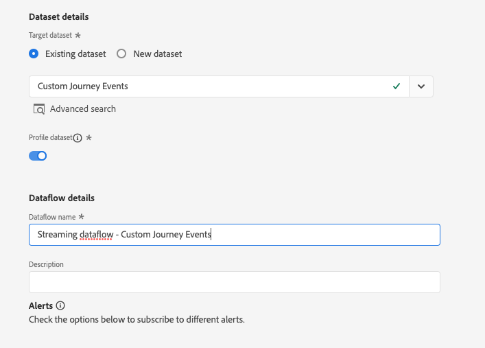

# Utilice acciones personalizadas para escribir los eventos de recorrido en Experience Platform {#custom-action-aep}

En este caso de uso se explica cómo escribir eventos personalizados en Adobe Experience Platform desde Recorridos mediante acciones personalizadas y llamadas autenticadas.

## Configuración de un proyecto de desarrollador {#custom-action-aep-IO}

1. En Adobe Developer Console, haga clic en **Proyecto** y abra su proyecto de E/S.

1. En la sección **Credenciales**, haga clic en **Servidor a servidor de OAuth**.

   

1. Haga clic en **Ver comando cURL**.

   

1. Copie el comando cURL y almacene client_id, client_secret, grant_type y el ámbito.

```
curl -X POST 'https://ims-na1.adobelogin.com/ims/token/v3' -H 'Content-Type: application/x-www-form-urlencoded' -d 'grant_type=client_credentials&client_id=1234&client_secret=5678&scope=openid,AdobeID,read_organizations,additional_info.projectedProductContext,session'
```

>[!CAUTION]
>
>Después de crear el proyecto en Adobe Developer Console, asegúrese de otorgar al desarrollador y al control de acceso de la API los permisos adecuados. Obtenga más información en la [documentación de Adobe Experience Platform](https://experienceleague.adobe.com/es/docs/experience-platform/landing/platform-apis/api-authentication#grant-developer-and-api-access-control){target="_blank"}

## Configurar el origen mediante la entrada de la API HTTP

1. Cree un extremo en Adobe Experience Platform para escribir los datos de los recorridos.

1. En Adobe Experience Platform, haga clic en **Fuentes**, en **Conexiones** en el menú de la izquierda. En la **API HTTP**, haga clic en **Agregar datos**.

   

1. Seleccione **Nueva cuenta** y habilite la autenticación. Seleccione **Conectarse a Source**.

   

1. Seleccione **Siguiente** y el conjunto de datos donde desee escribir los datos. Haga clic en **Siguiente** y **Finalizar**.

   

1. Abra el flujo de datos recién creado. Copie la carga útil del esquema y guárdela en el bloc de notas.

```
{
"header": {
"schemaRef": {
"id": "https://ns.adobe.com/<your_org>/schemas/<schema_id>",
"contentType": "application/vnd.adobe.xed-full+json;version=1.0"
},
"imsOrgId": "<org_id>",
"datasetId": "<dataset_id>",
"source": {
"name": "Custom Journey Events"
}
},
"body": {
"xdmMeta": {
"schemaRef": {
"id": "https://ns.adobe.com/<your_org>/schemas/<schema_id>",
"contentType": "application/vnd.adobe.xed-full+json;version=1.0"
}
},
"xdmEntity": {
"_id": "test1",
"<your_org>": {
"journeyVersionId": "",
"nodeId": "", "customer_Id":""
},
"eventMergeId": "",
"eventType": "",
"producedBy": "self",
"timestamp": "2018-11-12T20:20:39+00:00"
}
}
}
```

## Configurar la acción personalizada {#custom-action-config}

La configuración de acciones personalizadas se detalla en [esta página](../action/about-custom-action-configuration.md).

Para este ejemplo, siga estos pasos:

1. Abra Adobe Journey Optimizer y haga clic en **Configuraciones**, en **Administración** en el menú de la izquierda. En **Acciones**, haga clic en **Administrar** y luego en **Crear acción**.

1. Establezca la dirección URL y seleccione el método Post.

   `https://dcs.adobedc.net/collection/<collection_id>?syncValidation=false`

1. Asegúrese de que los encabezados (Content-Type, Charset, sandbox-name) estén configurados.

   

### Configuración de la autenticación {#custom-action-aep-authentication}

1. Seleccione **Type** como **Custom** con la siguiente carga útil.

1. Pegue client_secret, client_id, scope y grant_type (desde la carga útil del proyecto de IO utilizada anteriormente).

   ```
   {
   "type": "customAuthorization",
   "authorizationType": "Bearer",
   "endpoint": "https://ims-na1.adobelogin.com/ims/token/v3",
   "method": "POST",
   "headers": {},
   "body": {
   "bodyType": "form",
   "bodyParams": {
   "grant_type": "client_credentials",
   "client_secret": "********",
   "client_id": "<client_id>",
   "scope": "openid,AdobeID,read_organizations,additional_info.projectedProductContext,session"
   }
   },
   "tokenInResponse": "json://access_token",
   "cacheDuration": {
   "duration": 28000,
   "timeUnit": "seconds"
   }
   }
   ```

1. Use **Haga clic para probar el botón de autenticación** y probar la conexión.

   

### Configuración de la carga útil {#custom-action-aep-payload}

1. En los campos **Solicitud** y **Respuesta**, pegue la carga útil de la conexión de origen utilizada anteriormente.

   ```
   {
   "xdmMeta": {
   "schemaRef": {
   "id": "https://ns.adobe.com/<your_org>/schemas/<schema_id>",
   "contentType": "application/vnd.adobe.xed-full+json;version=1.0"
   }
   },
   "xdmEntity": {
   "_id": "/uri-reference",
   "<your_org>": {
   "journeyVersionId": "Sample value",
   "nodeId": "Sample value",
   "customer_Id":""
   },
   "eventMergeId": "Sample value",
   "eventType": "advertising.completes,
   "producedBy": "self",
   "timestamp": "2018-11-12T20:20:39+00:00"
   }
   }
   ```

1. Cambie la configuración del campo de **Constant** a **Variable** para los campos que se rellenarán dinámicamente.

1. Guarde la acción personalizada.

## Recorrido 

1. Finalmente, utilice esta acción personalizada en un recorrido para escribir los eventos de recorrido personalizados.

1. Rellene los atributos ID de versión de Recorrido, ID de nodo, Nombre de nodo y otros según su caso de uso.

   
