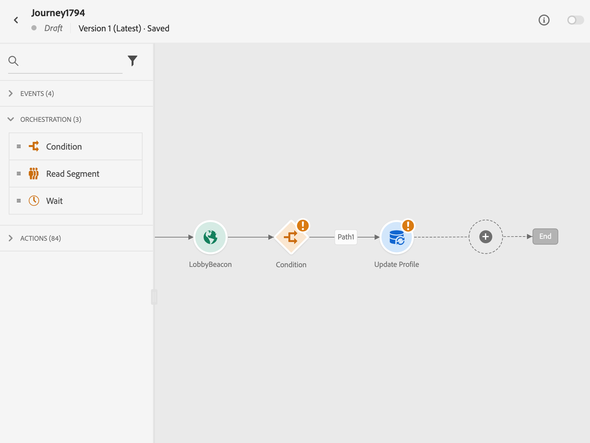

# Finalizar un recorrido {#journey-ending}

## Cómo termina un recorrido en directo

Los recorridos se cierran cuando se alcanza el tiempo de espera de la recorrido global o después de la última aparición de un recorrido recurrente basado en audiencias. [Descubra cómo se cierran los recorridos](#close-journey).

Si necesita finalizar un recorrido activo, le recomendamos que [lo cierre](#close-to-new-entrances) manualmente. La llegada de nuevos clientes al recorrido queda entonces bloqueada. Los perfiles que ya han introducido en el recorrido pueden experimentarlo hasta el final.

También puede [detener un recorrido](#stop-journey), solo en caso de que se produzca una emergencia y si todo el procesamiento del recorrido debe finalizar de inmediato. Las personas que ya han entrado en un recorrido se detienen en su progreso.

>[!IMPORTANT]
>
>* No puede reiniciar ni eliminar un recorrido [cerrado](#close-journey) o [detenido](#stop-journey). Puede [crear una nueva versión](publishing-the-journey.md#journey-versions-journey-versions) o [duplicarla](journey-ui.md#duplicate-a-journey-duplicate-a-journey).
>
>* Solo se pueden eliminar los recorridos finalizados.

## Cómo finalizan los perfiles un recorrido

Un recorrido termina para un individuo en dos contextos específicos:

* El individuo alcanza la última actividad de una ruta y luego se mueve a la [etiqueta final](#end-tag).
* El individuo alcanza una actividad **Condition** (o una actividad **Wait** con una condición) y no coincide con ninguna de las condiciones.

El usuario puede volver a entrar en el recorrido si se le permite volver a entrar. [Más información sobre la administración de la entrada y la reentrada](../building-journeys/journey-properties.md#entrance)

## Etiqueta de fin de recorrido {#end-tag}

Durante la creación de un recorrido, se muestra una etiqueta Fin al final de cada ruta. Este nodo no lo puede añadir un usuario, no se puede eliminar y solo se puede cambiar su etiqueta. Marca el final de cada trayectoria del recorrido.

Si el recorrido tiene varias rutas, le recomendamos que agregue una etiqueta a cada extremo para facilitar la lectura de los informes. Más información sobre [informes de recorrido](../reports/live-report.md).

## Cerrar un recorrido {#close-journey}

Un recorrido se puede cerrar por los siguientes motivos:

* Un recorrido basado en segmentos de una sola toma que ha terminado de ejecutarse y ha alcanzado el tiempo de espera global de 91 días.
* Después de la última incidencia de un recorrido recurrente basado en audiencias.
* El recorrido se cierra manualmente mediante el botón [**[!UICONTROL Cerrar a nuevas entradas]**](#close-to-new-entrances).

Después del tiempo de espera global de recorrido de **91 días**, un recorrido de audiencia de lectura cambia al estado **Finalizado**. Este comportamiento se establece para 91 días, ya que toda la información sobre los perfiles que ingresaron al recorrido se elimina 91 días después de haber ingresado. Las personas que siguen en el recorrido se ven afectadas automáticamente. Salen del recorrido después del tiempo de espera de 91 días.  Más información sobre [el tiempo de espera global de recorrido](../building-journeys/journey-properties.md#global_timeout).

>[!TIP]
>
>Un recorrido basado en segmentos de una sola toma mantiene el estado **Activo** incluso después de ejecutarse una vez. Los perfiles no pueden volver a entrar una vez completados, pero el recorrido permanece en el estado **Activo** hasta que caduque el tiempo de espera global predeterminado. Puede cerrarlo antes manualmente con la opción **Cerrar a nuevas entradas**.

### Cerca de nuevas entradas {#close-to-new-entrances}

Cerrar un recorrido manualmente garantiza que los clientes que ya han introducido el recorrido puedan finalizar su ruta, pero que los nuevos usuarios no puedan entrar en el recorrido. Cuando un recorrido está cerrado (por cualquiera de las razones anteriores), tendrá el estado **[!UICONTROL Cerrado]**. El recorrido deja de permitir que nuevas personas entren en el recorrido. Los perfiles que ya están en el recorrido pueden finalizar el recorrido normalmente. Después del tiempo de espera global predeterminado de 91 días, el recorrido cambiará al estado **Finalizado**.

Para cerrar un recorrido de la lista de recorridos, haga clic en el botón **[!UICONTROL Puntos suspensivos]** que se encuentra a la derecha del nombre del recorrido y seleccione **[!UICONTROL Cerca de nuevas entradas]**.

También puede:

1. En la lista **[!UICONTROL Recorridos]**, haga clic en el recorrido que desee cerrar.
1. En la parte superior derecha, haga clic en la flecha hacia abajo.

   {width="50%" align="left" zoomable="yes"}

1. Haga clic en **[!UICONTROL Cerrar a nuevas entradas]** y confirme en el cuadro de diálogo.

## Detener un recorrido {#stop-journey}

En caso de que necesite detener el progreso de todos los individuos en el recorrido, puede detenerlo. Deteniendo el tiempo de espera de recorrido de todos los individuos del recorrido. Sin embargo, detener un recorrido implica que todas las personas que ya han entrado en un recorrido se detengan en su progreso. El recorrido está básicamente apagado. Si desea finalizar un recorrido, se recomienda [cerrarlo](#close-journey).

Puede detener un recorrido, por ejemplo, si un experto en marketing se da cuenta de que el recorrido se dirige a la audiencia incorrecta o si una acción personalizada que se supone que debe enviar mensajes no funciona correctamente. Para detener un recorrido de la lista de recorridos, haga clic en el botón **[!UICONTROL Puntos suspensivos]** que se encuentra a la derecha del nombre del recorrido y seleccione **[!UICONTROL Detener]**.

También puede:

1. En la lista **[!UICONTROL Recorridos]**, haga clic en el recorrido que desee detener.
1. En la parte superior derecha, haga clic en la flecha hacia abajo.

   {width="50%" align="left" zoomable="yes"}

1. Haga clic en **[!UICONTROL Detener]** y confirme en el cuadro de diálogo.

Cuando está detenido, el estado del recorrido se establece en **[!UICONTROL Detenido]**.
