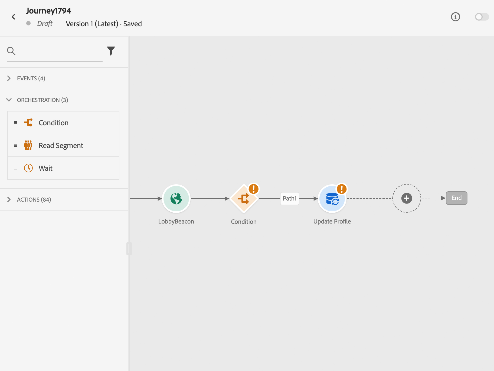
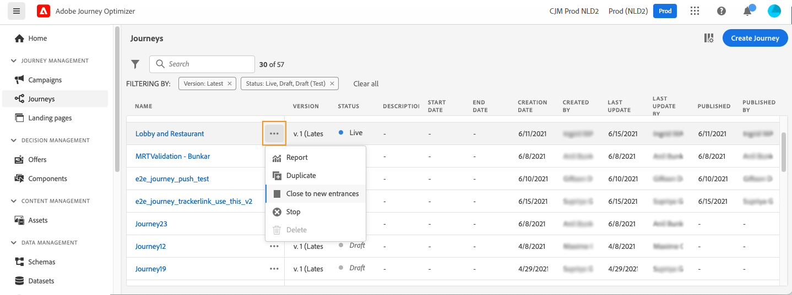

# Finalizar un recorrido {#journey-ending}

>[!BEGINSHADEBOX]

**En esta página:** Aprenda cómo finalizan los recorridos tanto para perfiles individuales como para general, y cómo cerrar o detener un recorrido activo cuando necesite detener las nuevas entradas o todo el procesamiento.

>[!ENDSHADEBOX]

>[!TIP]
>
>¿Busca instrucciones prácticas sobre cuándo y cómo deben salir los perfiles de los recorridos? Consulte nuestra [guía completa de criterios de entrada y salida de recorrido](entry-exit-criteria-guide.md), que incluye escenarios de salida reales, prácticas recomendadas y directrices de configuración.

## Cómo termina un recorrido en directo

Los recorridos se cierran cuando se alcanza el tiempo de espera de la recorrido global o después de la última aparición de un recorrido recurrente basado en audiencias. [Descubra cómo se cierran los recorridos](#close-journey).

Si necesita finalizar un recorrido activo, le recomendamos que [lo cierre](#close-to-new-entrances) manualmente. La llegada de nuevos clientes al recorrido queda entonces bloqueada. Los perfiles que ya han introducido en el recorrido pueden experimentarlo hasta el final.

También puede [detener un recorrido](#stop-journey), solo en caso de que se produzca una emergencia y si todo el procesamiento del recorrido debe finalizar de inmediato. Las personas que ya han entrado en un recorrido se detienen en su progreso.

>[!IMPORTANT]
>
>* No puede reiniciar ni eliminar un recorrido [cerrado](#close-journey) o [detenido](#stop-journey). Puede [crear una nueva versión](publish-journey.md#journey-versions) o [duplicarla](journey-ui.md#duplicate-a-journey).
>
>* Solo se pueden eliminar los recorridos finalizados.

## Cómo finalizan los perfiles un recorrido

Un recorrido termina para un individuo en dos contextos específicos:

* El individuo alcanza la última actividad de una ruta y luego se mueve a la [etiqueta final](#end-tag).
* El individuo alcanza una actividad **Condition** (o una actividad **Wait** con una condición) y no coincide con ninguna de las condiciones.

El usuario puede volver a entrar en el recorrido si se le permite volver a entrar. [Más información sobre la administración de la entrada y la reentrada](../building-journeys/journey-properties.md#entrance)

## Etiqueta de fin de recorrido {#end-tag}

Durante la creación de un recorrido, se muestra una etiqueta Fin al final de cada ruta. Este nodo no lo puede añadir un usuario, no se puede eliminar y solo se puede cambiar su etiqueta. Marca el final de cada trayectoria del recorrido.

Si el recorrido tiene varias rutas, le recomendamos que agregue una etiqueta a cada extremo para facilitar la lectura de los informes. Más información sobre [informes de recorrido](../reports/live-report.md).

## Cerrar un recorrido {#close-journey}

Un recorrido se puede cerrar por los siguientes motivos:

* Un recorrido de audiencia de lectura no recurrente **se detiene automáticamente** después de que un búfer de seguridad siga a su ejecución programada. [Más información](#auto-stop-non-recurring)
* Después de la última incidencia de un recorrido recurrente basado en audiencias.
* El recorrido se cierra manualmente mediante el botón [**[!UICONTROL Cerrar a nuevas entradas]**](#close-to-new-entrances).
* Se alcanza el tiempo de espera de recorrido global de 91 días.

Después del tiempo de espera global de recorrido de **91 días**, un recorrido de audiencia de lectura cambia al estado **Finalizado**. Este comportamiento se establece para 91 días, ya que toda la información sobre los perfiles que ingresaron al recorrido se elimina 91 días después de haber ingresado. Las personas que siguen en el recorrido se ven afectadas automáticamente. Salen del recorrido después del tiempo de espera de 91 días.  Más información sobre [el tiempo de espera global de recorrido](../building-journeys/journey-properties.md#global_timeout).

### Parada automática de recorrido para audiencias no recurrentes {#auto-stop-non-recurring}

Un **recorrido de audiencia de lectura no recurrente** pasa automáticamente al estado **[!UICONTROL Detenido]** después de que un búfer de seguridad siga su ejecución programada. Esto elimina el comportamiento anterior, en el cual los recorridos de audiencia de lectura no recurrentes permanecían en estado **Activo** hasta que expiró el tiempo de espera global de 91 días, aunque no hubiera perfiles que fluyeran activamente por ellos.

**Cómo funciona:**

1. El recorrido se ejecuta y se procesan todos los perfiles de la audiencia.
1. A medida que cada perfil llega al final del recorrido, sale normalmente.
1. Cuando el **último perfil activo sale**, la recorrido entra en un período de búfer de seguridad y permanece en estado **[!UICONTROL Activo]**.
1. Una vez que transcurre el búfer de seguridad (~96 horas después del tiempo de ejecución programado del recorrido), el recorrido pasa automáticamente al estado **[!UICONTROL Detenido]** en el siguiente pase de escáner.

Este comportamiento se aplica solamente a **recorridos de audiencia de lectura no recurrentes**. Los recorridos recurrentes no se ven afectados.

* **Tiempo de parada automática:** El búfer de seguridad cuenta para dos ventanas: un período de inactividad de **24 horas** para permitir que se completen los envíos en vuelo, y una asignación de horas silenciosas de **72 horas** (las horas silenciosas pueden retrasar los envíos hasta 72 horas y no son visibles para el escáner). El búfer total es de aproximadamente **96 horas (~4 días)** después del tiempo de ejecución programado del recorrido. El recorrido permanece en estado **[!UICONTROL Activo]** durante este período. Este es un comportamiento esperado y no indica un problema.

* **Se excluyen los recorridos basados en ondas:** Este comportamiento de detención automática no se aplica a los recorridos basados en ondas, incluidos los recorridos que utilizan la optimización del tiempo de envío. Estos recorridos permanecen activos en todas las olas programadas y se detienen solamente en el tiempo de espera global estándar de [91 días](../building-journeys/journey-properties.md#global_timeout), a menos que se cierren o se detengan manualmente.

* Este comportamiento de detención automática **no** se aplica a recorridos no recurrentes que incluyen nodos que causan períodos de espera, como nodos de **Espera** (basados en temporizador), nodos de **Reacción** (esperando eventos como correos electrónicos abiertos o clics) o transiciones activadas por eventos. Estos recorridos permanecen sujetos al tiempo de espera global estándar de [91 días](../building-journeys/journey-properties.md#global_timeout).

* Puede cerrar manualmente un recorrido de audiencia de lectura no recurrente en cualquier momento mediante la opción [**[!UICONTROL Cerrar a nuevas entradas]**](#close-to-new-entrances). El comportamiento de parada automática simplemente garantiza que el recorrido se detenga automáticamente cuando ya no sea necesario, sin necesidad de intervención manual.

### ¿Cuándo se considera que un recorrido ha &quot;finalizado&quot;? {#journey-finished-definition}

La definición de &quot;terminado&quot; varía según el tipo de recorrido:

| Tipo de recorrido | ¿Recurrente? | ¿Tiene fecha de finalización? | Definición de &quot;finished&quot; |
|--------------|------------|---------------|--------------------------|
| Leer público | No | n/a | ~96h después de la última salida del perfil (búfer de parada automática) |
| Leer público | Sí | No | 91 días después del último inicio de la incidencia |
| Leer público | Sí | Sí | Cuando se llega a la fecha de finalización |
| Recorrido activado por evento | n/a | Sí | Cuando se llega a la fecha de finalización |
| Recorrido activado por evento | n/a | No | Cuando se cierra en la interfaz de usuario o mediante API |

### Cerca de nuevas entradas {#close-to-new-entrances}

Cerrar un recorrido manualmente garantiza que los clientes que ya han introducido el recorrido puedan finalizar su ruta, pero que los nuevos usuarios no puedan entrar en el recorrido. Cuando un recorrido está cerrado (por cualquiera de las razones anteriores), tendrá el estado **[!UICONTROL Cerrado]**. El recorrido deja de permitir que nuevas personas entren en el recorrido. Los perfiles que ya están en el recorrido pueden finalizar el recorrido normalmente. Después del tiempo de espera global predeterminado de 91 días, el recorrido cambiará al estado **Finalizado**.

Puede detener un recorrido desde el estado **Activo** o **En pausa**. Cuando el recorrido está **En pausa**, no es necesario que lo reanude a **Activo** primero. [Más información acerca de cómo detener un recorrido en pausa](journey-pause.md#stop-close-paused).

Para cerrar un recorrido de la lista de recorridos, haga clic en el botón **[!UICONTROL Puntos suspensivos]** que se encuentra a la derecha del nombre del recorrido y seleccione **[!UICONTROL Cerca de nuevas entradas]**.

También puede:

1. En la lista **[!UICONTROL Recorridos]**, haga clic en el recorrido que desee cerrar.
1. En la parte superior derecha, haga clic en la flecha hacia abajo.

   {width="50%" zoomable="yes"}

1. Haga clic en **[!UICONTROL Cerrar a nuevas entradas]** y confirme en el cuadro de diálogo.

## Detener un recorrido {#stop-journey}

En caso de que necesite detener el progreso de todos los individuos en el recorrido, puede detenerlo. Deteniendo el tiempo de espera de recorrido de todos los individuos del recorrido. Sin embargo, detener un recorrido implica que todas las personas que ya han entrado en un recorrido se detengan en su progreso. El recorrido está básicamente apagado. Si desea finalizar un recorrido, se recomienda [cerrarlo](#close-journey).

También puede detener un recorrido de **Paused** directamente, sin reanudarlo primero a **Live**. [Más información](journey-pause.md#stop-close-paused).

Puede detener un recorrido, por ejemplo, si un experto en marketing se da cuenta de que el recorrido se dirige a la audiencia incorrecta o si una acción personalizada que se supone que debe enviar mensajes no funciona correctamente. Para detener un recorrido de la lista de recorridos, haga clic en el botón **[!UICONTROL Puntos suspensivos]** que se encuentra a la derecha del nombre del recorrido y seleccione **[!UICONTROL Detener]**.

También puede:

1. En la lista **[!UICONTROL Recorridos]**, haga clic en el recorrido que desee detener.
1. En la parte superior derecha, haga clic en la flecha hacia abajo.

   {width="50%" zoomable="yes"}

1. Haga clic en **[!UICONTROL Detener]** y confirme en el cuadro de diálogo.

Cuando está detenido, el estado del recorrido se establece en **[!UICONTROL Detenido]**.

>[!CAUTION]
>
>Detener un recorrido requiere el permiso **[!DNL Manage journeys]**. Si el recorrido incluye campañas en línea o nodos de mensajería, los usuarios también necesitan permisos de **Campañas > Publicar campañas**. Si el recorrido utiliza recursos (por ejemplo, en correos electrónicos), los usuarios deben tener acceso a ellos. Obtenga más información acerca de la administración de los derechos de acceso de los usuarios de [!DNL Journey Optimizer] en [esta sección](../administration/permissions-overview.md).

## Temas relacionados

* [Guía de criterios de entrada y salida de Recorrido](entry-exit-criteria-guide.md): guía completa con ejemplos reales y prácticas recomendadas
* [Administración de entrada de perfiles](entry-management.md): configure el modo en que los perfiles escriben recorridos
* [Configurar criterios de salida](journey-properties.md#exit-criteria) - Configurar la eliminación automática de perfiles de las recorridos
* [Pausar un recorrido](journey-pause.md): detener temporalmente la ejecución del recorrido

+++ Referencia de conocimientos de AI

Esta sección contiene conocimientos estructurados destinados a apoyar la interpretación, la recuperación y la respuesta a preguntas relacionadas con este tema.

Para una comprensión completa, esta información debe combinarse con la documentación de esta página. Ninguna de las fuentes pretende ser independiente; la página describe la función, mientras que esta sección proporciona contexto adicional que ayuda a desambiguar la terminología, la intención, la aplicabilidad y las restricciones.

* **TL;DR:** En esta página se explican las distintas formas en que puede finalizar un recorrido activo, incluido el tiempo de espera global de 91 días, el cierre manual de las nuevas entradas y la detención de emergencia, así como sus efectos en los perfiles en curso.

**Intenciones:**

* Cerrar un recorrido en directo a nuevas entradas y permitir que los perfiles actuales lo completen
* Detener un recorrido inmediatamente para detener todos los perfiles en curso
* Comprender la diferencia entre los estados recorrido cerrado, detenido y finalizado
* Determine cuándo se considera que un recorrido ha &quot;finalizado&quot; en función de su tipo y configuración
* Eliminar un recorrido una vez que haya alcanzado el estado Finished

**Glosario:**

* **Etiqueta final**: Un nodo no extraíble generado automáticamente que se muestra al final de cada ruta de acceso de recorrido durante la creación; su etiqueta se puede cambiar *(específica del producto)*
* **Cerca de nuevas entradas**: una acción manual que impide que los nuevos perfiles entren en un recorrido mientras permiten que los perfiles existentes completen su ruta de acceso *(específica del producto)*
* **Tiempo de espera de recorrido global**: Período máximo de 91 días tras el cual un recorrido cambia automáticamente al estado Finalizado y se eliminan todos los datos de perfil *(específico del producto)*
* **Estado detenido**: un estado de recorrido en el que todos los perfiles en curso se detienen inmediatamente; se usa solo para emergencias *(específicas del producto)*

**Protecciones:**

* Los recorridos cerrados y detenidos no se pueden reiniciar ni eliminar; solo se puede crear una nueva versión o un duplicado.
* Solo se pueden eliminar los recorridos con el estado Finalizado.
* La detención de un recorrido requiere el permiso Administrar recorridos; los recorridos con campañas en línea o nodos de mensajería también requieren el permiso Campañas > Publicar campañas.
* Después del tiempo de espera global de 91 días, se eliminan todos los datos de recorrido de perfiles y los perfiles restantes se cierran automáticamente.
* Un recorrido de audiencia de lectura no recurrente sin nodos de espera, reacción o activados por eventos de larga ejecución pasa automáticamente a Detenido aproximadamente 96 horas (~4 días) después de que salga el último perfil. El recorrido permanece en estado Activo durante este búfer. Los recorridos basados en olas, incluidos los casos de uso de optimización del tiempo de envío, se excluyen de esta detención automática y permanecen sujetos al tiempo de espera global de 91 días a menos que se cierren o detengan manualmente.

**Terminología:**

* Nombre canónico: Cerca de nuevas entradas — Acrónimo: n/a — variantes: cerrar recorrido, cerrar manualmente
* Sinónimos: recorrido &quot;Detenido&quot; ≠ recorrido &quot;Cerrado&quot;: detenido detiene todos los perfiles inmediatamente; cerrado solo bloquea las nuevas entradas
* No confunda: &quot;End tag&quot; ≠ &quot;End activity&quot;: la etiqueta End se genera automáticamente y no se puede eliminar; la actividad End es un nodo de lienzo colocable

**PREGUNTAS MÁS FRECUENTES:**

* **Q: ¿Cuál es la diferencia entre cerrar y detener un recorrido?** — El cierre bloquea las nuevas entradas, pero permite que los perfiles existentes finalicen; la detención detiene inmediatamente todos los perfiles en seguimiento.
* **Q: ¿Por qué un recorrido no recurrente permanece en estado Activo durante varios días después de su ejecución?** — Esto es lo esperado. Después de la última salida del perfil, AJO aplica un búfer de seguridad de ~96 horas (~4 días): 24 horas para permitir que se completen los envíos en vuelo, más 72 horas para aplazamientos de horas tranquilas. El recorrido pasa a Detenido en la siguiente pasada del escáner después de que transcurra el búfer.
* **Q: ¿Los recorridos basados en olas se detienen automáticamente después de ~96 horas?** — No. Los recorridos basados en olas, incluidos los recorridos que utilizan la optimización del tiempo de envío, se excluyen de esta parada automática para que puedan permanecer activos en todas las olas programadas. Siguen el tiempo de espera de recorrido estándar de 91 días a menos que se cierren o se detengan manualmente.
* **Q: ¿Cuándo alcanza el estado Finalizado un recorrido de lectura de audiencia?** — Para un recorrido de audiencia de lectura no recurrente: se detiene automáticamente hasta Detenido aproximadamente 96 horas (~4 días) después de que salga el último perfil (búfer de seguridad: ventana de inactividad de 24 horas + asignación de horas silenciosas de 72 horas). El recorrido permanece en estado Activo durante este búfer. Si los nodos de Espera, Reacción o Evento mantienen los perfiles activos, se aplica el tiempo de espera global estándar de 91 días. Finished se alcanza cuando un recorrido Closed alcanza el tiempo de espera global de 91 días o por reglas de recorrido recurrentes en la tabla de definición finalizada.
* **Q: ¿Puedo eliminar un recorrido cerrado?** — No, sólo se pueden eliminar los recorridos finalizados.
* **Q: ¿Qué les sucede a los perfiles que aún están en un recorrido cuando se alcanza el tiempo de espera de 91 días?** — Se salen automáticamente del recorrido en ese punto.
* **Q: ¿Necesito permisos especiales para detener un recorrido?** — Sí, se requiere el permiso Administrar recorridos, además de Campañas > Publicar campañas si el recorrido contiene campañas en línea o nodos de mensajería.

+++
