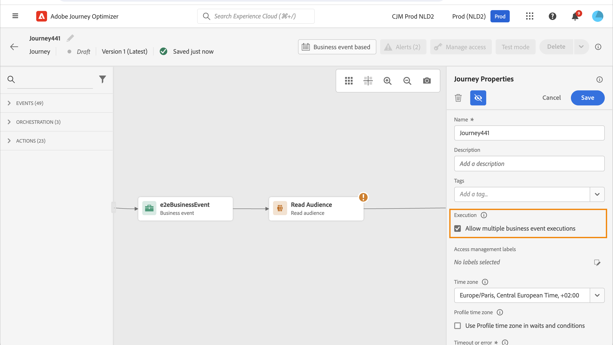

# Administración de la entrada del perfil {#entry-management}

>[!BEGINSHADEBOX]

**En esta página:** Aprenda cómo funcionan la entrada y la reentrada de perfiles para cada tipo de recorrido, de modo que pueda controlar cuándo y con qué frecuencia entran los perfiles en sus recorridos.

>[!ENDSHADEBOX]

La administración de la entrada del perfil depende del tipo de recorrido.

>[!TIP]
>
>¿Busca orientación práctica con ejemplos reales? Consulte nuestra [guía completa de criterios de entrada y salida de recorrido](entry-exit-criteria-guide.md), que incluye casos de uso como campañas de bienvenida, recuperación del carro de compras abandonado y programas de fidelidad con ejemplos completos de configuración de entrada y salida.

## Tipos de recorridos {#types-of-journeys}

Con [!DNL Adobe Journey Optimizer], puede crear los siguientes tipos de recorridos:

* **recorridos de evento unitario**: estos recorridos comienzan con un evento unitario. Cuando se recibe el evento, el perfil asociado entra en el recorrido. [Más información](#entry-unitary)

* recorridos de **evento empresarial**: estos recorridos comienzan con un evento empresarial seguido inmediatamente de una actividad de **lectura de audiencia**. Cuando se recibe el evento, los perfiles pertenecientes a la audiencia de destino entran en el recorrido. Se crea una instancia de este recorrido para cada perfil. [Más información](#entry-business)

* **Leer audiencia** recorridos: estos recorridos comienzan con una actividad de **Leer audiencia**. Cuando se ejecuta el recorrido, los perfiles pertenecientes a la audiencia de destino entran en el recorrido. Se crea una instancia de este recorrido para cada perfil. Estos recorridos pueden ser recurrentes o &quot;únicos&quot;. [Más información](#entry-read-audience)

* **recorridos de calificación de audiencias**: estos recorridos comienzan con un evento de calificación de audiencias. Estos recorridos escuchan las entradas y salidas de perfiles en las audiencias. Cuando esto sucede, el perfil asociado entra en el recorrido. [Más información](#entry-unitary)

[Comparar todos los tipos de recorrido con casos de uso →](journey.md#journey-types)

En todos los tipos de recorrido, un perfil no puede estar presente varias veces en el mismo recorrido y al mismo tiempo para todas las [versiones activas del recorrido](publish-journey.md#journey-versions). Para comprobar que una persona está en un recorrido, la identidad del perfil se utiliza como clave. El sistema no permite que la misma clave, por ejemplo la clave `CRMID=3224`, esté en diferentes lugares del mismo recorrido.

## tasa de procesamiento de recorridos {#journey-processing-rate}

La tasa de procesamiento de recorridos se ve afectada por varios factores que determinan el flujo de perfiles a través de un recorrido:

### Tasa de entrada de perfil {#profile-entrance-rate}

La forma en que los perfiles introducen los recorridos y su tasa esperada dependen de la primera actividad que se utilice:

* **Leer audiencia** recorridos (escenario por lotes, donde se dirige una audiencia de perfiles y se déclencheur un recorrido para esa audiencia completa): el máximo es 20 000 TPS (transacciones por segundo). Esta es la cuota disponible en **nivel de espacio aislado**. Si se ejecutan varios recorridos al mismo tiempo en esa zona protegida, es posible que no se puedan conseguir 20 000 TPS. Considere este máximo como un escenario ideal.

* **Calificación de audiencias** recorridos (escenario unitario, en el que desea almacenar en déclencheur un recorrido cuando un perfil califica o descalifica para una audiencia de flujo continuo): el máximo es de 5000 TPS. Tenga en cuenta que este es un límite compartido con los recorridos que comienzan con eventos y también se comparte entre recorridos a **nivel de organización**.

* **Evento unitario** recorridos (escenario unitario, en el que desea almacenar en déclencheur un recorrido cuando se emite un evento desde un perfil): igual que arriba, ambos comparten el mismo límite de 5000 TPS. Encontrará más información sobre el rendimiento de eventos de recorrido en [esta sección](../event/about-events.md#event-thoughput).

* **Evento empresarial** recorridos (un escenario unitario a lote porque un evento empresarial siempre va seguido de una audiencia de lectura): los eventos empresariales se contabilizan en la cuota de 5000 TPS. La actividad de audiencia de lectura que sigue tiene el mismo límite que los recorridos que comienzan con una audiencia de lectura (20 000 TPS).

### Eventos y cualificaciones de audiencia dentro de los recorridos {#events-inside-journeys}

Después de la entrada, puedes usar las actividades **Evento unitario** o **Calificación de audiencia** dentro del recorrido. Un perfil puede introducir cualquiera de los 4 tipos de recorridos descritos anteriormente y esperar a que se emita un evento o a que este perfil cumpla los requisitos de una audiencia. Estos eventos unitarios y cualificaciones de audiencia se contarán en la cuota descrita anteriormente. Por ejemplo: si inicia un recorrido con una audiencia de lectura (con un máximo de 20.000 TPS) y tiene un evento justo después, este evento será de un máximo de 5.000 TPS.

### Impacto de actividades de espera {#wait-activities-impact}

Las actividades **Wait** en recorridos también pueden afectar la cantidad de perfiles que están fluyendo a través de un recorrido en un momento específico. Normalmente, una actividad de Espera se basa en un tiempo relativo (por ejemplo: salir 2 horas después de entrar en la espera, por lo que todos los perfiles no se cerrarán al mismo tiempo). Sin embargo, si se define una hora fija en esa actividad de Espera, es posible que varios perfiles salgan de ese recorrido al mismo tiempo. Esta no es una práctica recomendada. Luego se pudieron ver volúmenes masivos y el TPS a partir de este punto puede superar los 20.000 TPS.

### Actividades de acción {#action-activities-impact}

Por último, las actividades **action** pueden verse afectadas por la carga del perfil proveniente de los recorridos y también pueden afectar la tasa de procesamiento. Estos incluyen canales nativos como correo electrónico, SMS y push, además de acciones personalizadas, saltos a otros recorridos y actividades de actualización de perfil. Por ejemplo, una acción personalizada que apunta a un extremo externo con un tiempo de respuesta alto ralentiza la velocidad de procesamiento del recorrido.

Para las acciones personalizadas, el límite predeterminado es de 300 000 llamadas por minuto, que se pueden cambiar con una directiva de límite personalizada. Obtenga más información acerca del límite de acciones personalizadas en [esta sección](../configuration/external-systems.md#capping).

## Recorridos de calificación de eventos unitarios y audiencias{#entry-unitary}

En los recorridos **Evento unitario** y **Calificación de audiencias**, puede habilitar o deshabilitar la reentrada:

* Si la reentrada está activada, un perfil puede introducir un recorrido varias veces, pero no puede hacerlo hasta que salga completamente de la instancia anterior del recorrido.

* Si la reentrada está desactivada, un perfil no puede introducir varias veces el mismo recorrido, dentro del periodo de tiempo de espera de recorrido global. Consulte esta [sección](../building-journeys/journey-properties.md#global_timeout).

De forma predeterminada, los recorridos permiten la reentrada. Cuando se activa la opción **Permitir la reentrada**, se muestra el campo **Período de espera de reentrada**. Permite definir el tiempo de espera antes de permitir que un perfil vuelva a entrar en el recorrido. Esto evita que los recorridos se activen varias veces por error para el mismo evento. De forma predeterminada, el campo se establece en 5 minutos. La duración máxima es de 91 días ([tiempo de espera global](journey-properties.md#global_timeout)).

<!--
When a journey ends, its status is **[!UICONTROL Closed]**. New individuals can no longer enter the journey. Persons already in the journey automatically exit the journey. 
-->

Después del periodo de reentrada, los perfiles pueden volver a entrar en el recorrido. Para evitarlo y deshabilitar completamente la reentrada para esos perfiles, puede agregar una condición para comprobar si el perfil introducido ya está o no, utilizando datos de perfil o audiencia.

<!--
Due to the 30-day journey timeout, when journey reentrance is not allowed, we cannot make sure the reentrance blocking will work more than 91 days. Indeed, as we remove all information about persons who entered the journey 91 days after they enter, we cannot know the person entered previously, more than 91 days ago. 
-->

## Recorridos empresariales {#entry-business}

<!--
Business events follow reentrance rules in the same way as for unitary events. If a journey allows reentrance, the next business event will be processed.
-->

En **recorridos empresariales**, para permitir varias ejecuciones de eventos empresariales, active la opción correspondiente en la sección **[!UICONTROL Ejecución]** de las propiedades del recorrido.

En el caso de los eventos empresariales, para un recorrido determinado, los datos de audiencia recuperados en la primera ejecución se reutilizan durante un intervalo de tiempo de 1 hora.

Un perfil puede estar presente varias veces en el mismo recorrido, al mismo tiempo, pero en el contexto de diferentes eventos empresariales.

Para obtener más información, consulte esta [sección](../event/about-creating-business.md)

## Leer recorridos de audiencia {#entry-read-audience}

**Los recorridos de la audiencia de lectura** pueden ser recurrentes o no recurrentes:

* Para recorridos no recurrentes: el perfil introduce una vez y solo una vez en la recorrido.

* Para recorridos recurrentes: de forma predeterminada, todos los perfiles pertenecientes a la audiencia introducen el recorrido en cada periodicidad. Deben finalizar el recorrido antes de poder volver a entrar en otra ocurrencia.

Hay varias opciones disponibles para los recorridos de lectura de audiencia recurrentes. Para obtener más información, consulte la sección [Usar una audiencia en un recorrido](../building-journeys/read-audience.md).

<!--
After 91 days, a Read audience journey switches to the **Finished** status. This behavior is set for 91 days only (i.e. journey timeout default value) as all information about profiles who entered the journey is removed 91 days after they entered. Persons still in the journey automatically are impacted. They exit the journey after the 30 day timeout. 
-->

## Temas relacionados

* [Guía de criterios de entrada y salida de Recorrido](entry-exit-criteria-guide.md): guía completa con ejemplos reales y prácticas recomendadas
* [Configurar criterios de salida](journey-properties.md#exit-criteria): defina cuándo deben salir los perfiles del recorrido
* [Finalizar un recorrido](end-journey.md): comprenda cómo se cierran y finalizan los recorridos
* [Casos de uso de Recorrido](jo-use-cases.md): vea ejemplos completos con configuraciones de entrada y salida

+++ Referencia de conocimientos de AI

Esta sección contiene conocimientos estructurados destinados a apoyar la interpretación, la recuperación y la respuesta a preguntas relacionadas con este tema.

Para una comprensión completa, esta información debe combinarse con la documentación de esta página. Ninguna de las fuentes pretende ser independiente; la página describe la función, mientras que esta sección proporciona contexto adicional que ayuda a desambiguar la terminología, la intención, la aplicabilidad y las restricciones.

* **TL;DR:** En esta página se explica cómo funciona la administración de entradas de perfil en los cuatro tipos de recorrido de Adobe Journey Optimizer, incluidos los límites de rendimiento, la configuración de reentrada y el comportamiento de las actividades de espera y acción en la tasa de procesamiento.

**Intenciones:**

* Comprenda el comportamiento de entrada y los límites de rendimiento para cada tipo de recorrido (evento unitario, evento empresarial, audiencia de lectura, calificación de audiencia)
* Habilite o deshabilite la reentrada de perfiles y configure el período de espera de reentrada
* Permitir varias ejecuciones de eventos empresariales en un recorrido empresarial
* Identificar cómo las actividades de espera y las actividades de acción afectan a la tasa de procesamiento de recorridos
* Asegúrese de que un perfil no esté presente en el mismo recorrido al mismo tiempo

**Glosario:**

* **Reentrada**: la capacidad de un perfil para volver a entrar en el mismo recorrido después de salir de él anteriormente; configurable con un período de espera *(específico del producto)*
* **Período de espera de reentrada**: tiempo mínimo que debe transcurrir antes de que un perfil pueda volver a entrar en un recorrido. El valor predeterminado es 5 minutos, el máximo es 90 días en las propiedades de recorrido *(específicas del producto)*
* **TPS (transacciones por segundo)**: La tasa de rendimiento a la que los perfiles pueden entrar o ser procesados en un recorrido *(específico del producto)*
* **recorrido de evento unitario**: un recorrido desencadenado por un solo evento asociado a un perfil *(específico del producto)*
* **recorrido de lectura de audiencia**: recorrido que procesa un lote de perfiles que pertenecen a una audiencia definida, una vez o en una programación recurrente *(específica del producto)*
* **recorrido de evento empresarial**: recorrido desencadenado por un evento empresarial dirigido a una audiencia, que crea una instancia de recorrido por perfil *(específico del producto)*
* **recorrido de calificación de audiencias**: Se desencadenó un recorrido cuando un perfil entra o sale de una audiencia de flujo continuo en tiempo real *(específico del producto)*

**Protecciones:**

* Un perfil no puede estar presente varias veces en el mismo recorrido al mismo tiempo en todas las versiones activas.
* Leer recorridos de audiencia: máximo de 20 000 TPS (cuota de nivel de zona protegida; compartida en todos los recorridos de audiencia de lectura simultáneos en la misma zona protegida)
* Recorridos de cualificación de audiencias y eventos unitarios: máximo de 5000 TPS (cuota de nivel de organización; compartidos entre sí en todos los entornos limitados de la organización)
* Los eventos empresariales se contabilizan en la cuota de nivel de organización de 5000 TPS; la actividad de audiencia de lectura posterior comparte la cuota de nivel de zona protegida de 20 000 TPS
* El período de espera de reentrada predeterminado es de 5 minutos; el valor máximo configurable es de 90 días en las propiedades de recorrido
* Las actividades de espera de tiempo fijo pueden causar picos en el perfil que superen los 20.000 TPS y no se recomiendan.
* El límite predeterminado de acciones personalizadas es de 300 000 llamadas por minuto.
* En el caso de los recorridos empresariales, los datos de audiencia de la primera ejecución se reutilizan durante 1 hora.

**Terminología:**

* Nombre canónico: Profile entry management — Acrónimo: n/a — variants: profile entry management, recorrido entry
* Sinónimos: &quot;reentrada&quot; = &quot;reentrada&quot;
* No confunda: &quot;recorrido de evento unitario&quot; ≠ &quot;recorrido de calificación de audiencia&quot;: ambos son escenarios unitarios pero se activan de forma diferente (emisión de evento frente a cambio de pertenencia a audiencia).

**PREGUNTAS MÁS FRECUENTES:**

* **Q: ¿Puede un perfil entrar en el mismo recorrido dos veces simultáneamente?** — No, el sistema utiliza la identidad del perfil como clave y evita que el mismo perfil se encuentre en diferentes lugares del mismo recorrido al mismo tiempo.
* **Q: ¿Cuál es el período de espera de reentrada predeterminado?** — 5 minutos, configurables hasta un máximo de 90 días en propiedades de recorrido.
* **Q: ¿Cuántos perfiles por segundo puede procesar un recorrido de lectura de audiencia?** — Hasta 20 000 TPS en el nivel de la zona protegida, aunque este máximo puede no ser alcanzable si varios recorridos se ejecutan simultáneamente en la misma zona protegida.
* **Q: ¿Qué sucede con el rendimiento después de una actividad de espera con un tiempo fijo?** — Múltiples perfiles pueden salir de la espera simultáneamente, excediendo potencialmente los 20,000 TPS; se recomiendan actividades de Espera en tiempo relativo para evitar esto.
* **Q: ¿Puede un perfil aparecer en un recorrido empresarial varias veces al mismo tiempo?** — Sí, pero solo en el contexto de distintos eventos empresariales.

+++
