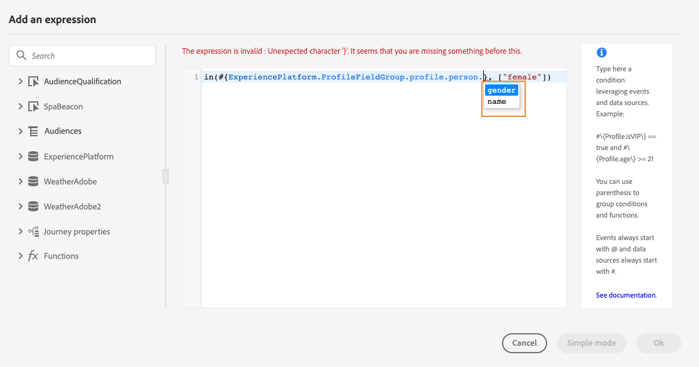

# Trabajo con el editor de expresiones avanzado {#about-the-advanced-expression-editor}

>[!CONTEXTUALHELP]
>id="ajo_journey_expression_advanced"
>title="Acerca del editor de expresiones avanzadas"
>abstract="Utilice el editor de expresiones avanzadas para crear expresiones avanzadas en varias pantallas de la interfaz. Por ejemplo, se pueden generar expresiones al configurar y utilizar recorridos y al definir una condición de fuente de datos."

Utilice el editor de expresiones avanzadas de Recorrido para crear expresiones avanzadas en varias pantallas de la interfaz. Por ejemplo, se pueden generar expresiones al configurar y utilizar recorridos y al definir una condición de fuente de datos.

También está disponible cada vez que necesite definir parámetros de acción que requieran manipulaciones de datos específicas. Puede aprovechar los datos procedentes de los eventos o la información adicional recuperada del origen de datos. En un viaje, la lista mostrada de los campos de evento es contextual y varía según los eventos agregados en el recorrido.

El editor de expresiones avanzadas oferta un conjunto de funciones y operadores integrados que le permiten manipular valores, y definir una expresión que se ajuste específicamente a sus necesidades. El editor de expresiones avanzadas también permite definir los valores del parámetro de fuente de datos externo, y manipular los campos y colecciones de mapas.

>[!NOTE]
>
>Las funciones y capacidades disponibles en el editor de expresiones avanzadas de Recorrido difieren de las disponibles en el [editor de personalización](../../personalization/functions/functions.md).

## Acceso al editor de expresiones avanzadas {#accessing-the-advanced-expression-editor}

El editor de expresiones avanzadas se puede utilizar para lo siguiente:

* crear [condiciones avanzadas ](../condition-activity.md#about_condition) en fuentes de datos e información de evento
* definir [actividades de espera personalizadas](../wait-activity.md#custom)
* definir asignación de parámetros de acción

Si es posible, puede cambiar entre los dos modos con el botón **[!UICONTROL Modo avanzado]** / **[!UICONTROL Modo simple]**. El modo simple se describe [aquí](../condition-activity.md#about_condition).

>[!NOTE]
>
>* Las condiciones se pueden definir en el editor de expresiones simples o avanzadas. Siempre devuelven un tipo booleano.
>
>* Los parámetros de acción se pueden definir seleccionando campos o mediante el editor de expresiones avanzadas. Devuelven un tipo de datos específico según su expresión.

Puede acceder al editor de expresiones avanzadas de diferentes maneras:

* Al crear una condición de fuente de datos, puede acceder al editor avanzado haciendo clic en **[!UICONTROL Modo avanzado]**.

  

* Al crear un temporizador personalizado, se mostrará directamente el editor avanzado.
* Cuando asigne un parámetro de acción, haga clic en **[!UICONTROL Modo avanzado]**.

## Descubra la interfaz {#discovering-the-interface}

Esta pantalla le permite escribir manualmente su expresión.

En la parte izquierda de la pantalla se muestran los campos y las funciones disponibles:

* **[!UICONTROL Eventos]**: elija uno de los campos recibidos del evento entrante. La lista mostrada de los campos de evento es contextual y varía según los eventos agregados en el recorrido. [Más información](../../event/about-events.md)

  >[!CAUTION]
  >
  >No se admite la creación de expresiones mediante eventos de experiencia. Se hace referencia a enfoques alternativos y prácticas recomendadas para crear expresiones/lógica con eventos de experiencia [aquí](../../building-journeys/exp-event-lookup.md)

* **[!UICONTROL Audiencias]**: si ha eliminado un evento de **[!UICONTROL calificación de audiencias]**, elija la audiencia que desee utilizar en la expresión. [Más información](../condition-activity.md#using-a-segment)
* **[!UICONTROL Fuentes de datos]**: elija entre la lista de campos disponibles en los grupos de campos de las fuentes de datos. [Más información](../../datasource/about-data-sources.md)
* **[!UICONTROL propiedades de Recorrido]**: esta sección reagrupa los campos técnicos relacionados con el recorrido de un perfil determinado. [Más información](journey-properties.md)
* **[!UICONTROL Funciones]**: elija entre una lista de funciones integradas que permitan realizar filtros complejos. Las funciones están organizadas por categorías. [Más información](functions.md)

Un mecanismo de finalización automática muestra sugerencias contextuales.

Un mecanismo de validación de sintaxis comprueba la integridad del código. Los errores se muestran en la parte superior del editor.

>[!TIP]
>
>Al crear condiciones en el editor de expresiones avanzadas, asegúrese de que las expresiones no contengan caracteres ocultos o no imprimibles. Además, utilice expresiones de una sola línea para evitar errores de análisis.

**Necesidad de parámetros al crear condiciones con el editor de expresiones avanzadas**

Si selecciona un campo de un origen de datos externo que requiere que se llame a un parámetro (consulte [esta página](../../datasource/external-data-sources.md)), aparecerá una nueva pestaña a la derecha que le permitirá especificar este parámetro. El valor del parámetro puede proceder de los eventos colocados en el recorrido o en la fuente de datos de Experience Platform (y no de otras fuentes de datos externas). Por ejemplo, en una fuente de datos relacionada con el tiempo, un parámetro utilizado frecuentemente será &quot;city&quot; (ciudad). Como resultado, debe seleccionar dónde desea obtener este parámetro de ciudad. Las funciones también se pueden aplicar a parámetros para realizar cambios de formato o concatenaciones.

Para casos de uso más complejos, si desea incluir los parámetros del origen de datos en la expresión principal, puede definir sus valores con la palabra clave &quot;params&quot;. Consulte [esta página](../expression/field-references.md).
