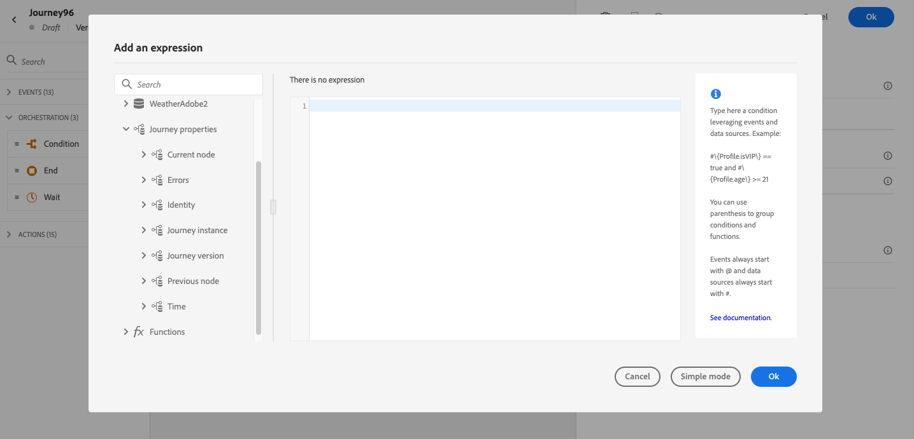

# atributos de propiedades de recorrido {#journey-properties}

En el [editor de expresiones simple](../condition-activity.md#about_condition) y en el [editor de expresiones avanzadas](../expression/expressionadvanced.md), debajo de las categorías **Evento** y **Fuente de datos**, puede tener acceso a la categoría **Propiedades del Recorrido**. Esta categoría contiene campos técnicos relacionados con el recorrido de un perfil determinado. Esta es la información recuperada por el sistema de las recorridos activas, como el ID de recorrido, o los errores específicos encontrados.

Contiene información, por ejemplo, sobre:

* versión de recorrido: uid de recorrido, uid de versión de recorrido, uid de instancia, etc.
* errores: captura de datos, ejecución de acciones, etc.
* paso actual, último paso actual, etc.
* perfiles descartados

  La lista de campos está disponible [en esta sección](#journey-properties-fields).

Puede utilizar estos campos para crear expresiones. Durante la ejecución del recorrido, los valores se recuperan directamente del recorrido.

A continuación se muestran algunos ejemplos de casos de uso:

* **Registrar perfiles descartados**: puede enviar todos los perfiles excluidos de un mensaje mediante una regla de límite a un sistema de terceros para realizar el registro. Para ello, se configura una ruta en caso de tiempo de espera y error y se añade una condición para filtrar por un tipo de error específico, por ejemplo: &quot;descartar personas por regla de límite&quot;. A continuación, puede insertar los perfiles descartados en un sistema de terceros mediante una acción personalizada.

* **Enviar alertas en caso de errores**: puede enviar una notificación a un sistema de terceros cada vez que se produzca un error en un mensaje. Para ello, se configura una ruta en caso de error, se añade una condición y una acción personalizada. Puede enviar una notificación en un canal de Slack, por ejemplo, con la descripción del error encontrado.

* **Refinar errores en los informes** : en lugar de tener una sola ruta para los mensajes erróneos, puede definir una condición por tipo de error. Esto le permitirá refinar los informes y ver todos los datos de tipos de errores.

## Lista de campos {#journey-properties-fields}

| Categoría | Nombre del campo | Etiqueta | Descripción |
|---|---|---|------------|
| Versión de recorrido | journeyUID | Identificador de recorrido | |
| | journeyVersionUID | Identificador de versión de recorrido | |
| | journeyVersionName | Nombre de versión de recorrido | |
| | journeyVersionDescription | Descripción de versión de recorrido | |
| | journeyVersion | Versión de recorrido | |
| Instancia de recorrido | instanceUID | Identificador de instancia de recorrido | ID de la instancia |
| | externalKey | Clave externa | Identificador individual que activa el recorrido |
| | organizationId | Identificador de organización | Organización de la marca |
| | sandboxName | Nombre de zona protegida | Nombre de la zona protegida |
| Identidad | profileId | Identificador de identidad del perfil | Identificador del perfil en el recorrido |
| | namespace | Área de nombres de identidad de perfil | Área de nombres del perfil en la recorrido (ejemplo: ECID) |
| Nodo actual | currentNodeId | Identificador del nodo actual | Identificador de la actividad actual (nodo) |
| | currentNodeName | Nombre del nodo actual | Nombre de la actividad actual (nodo) |
| Nodo anterior | previousNodeId | Identificador de nodo anterior | Identificador de la actividad anterior (nodo) |
| | previousNodeName | Nombre de nodo anterior | Nombre de la actividad anterior (nodo) |
| Errores | lastNodeUIDInError | Último identificador de nodo con error | Identificador de la actividad (nodo) más reciente con error |
| | lastNodeNameInError | Último nombre de nodo con error | Nombre de la última actividad (nodo) con error |
| | lastNodeTypeInError | Último tipo de nodo con error | Tipo de error de la actividad (nodo) más reciente. Tipos posibles:<ul><li>Eventos: Eventos, Reacciones, SQ (ejemplo: Calificación de audiencias)</li><li>Control de flujo: Fin, condición, espera</li><li>Acciones: Acciones de ACS, Salto, Acción personalizada</li></ul> |
| | lastErrorCode | Último código de error | Código de error de la última actividad (nodo). Posibles errores: <ul><li>Códigos de error HTTP</li><li>tapado</li><li>timeout</li><li>error (ejemplo: predeterminado en caso de error inesperado. (No debería suceder/muy raramente)</li></ul> |
| | lastExecutedActionErrorCode | Código de error de la última acción ejecutada | Código de error de la última acción por error |
| | lastDataFetchErrorCode | Último código de error de recuperación de datos | Código de error de la última recuperación de datos de las fuentes de datos |
| Fecha | lastActionExecutionElapsedTime | Tiempo transcurrido en la última ejecución de la acción | Tiempo empleado para ejecutar la acción más reciente |
| | lastDataFetchElapsedTime | Tiempo transcurrido en la última recuperación de datos | Tiempo empleado para ejecutar la captura de datos más reciente de las fuentes de datos |
